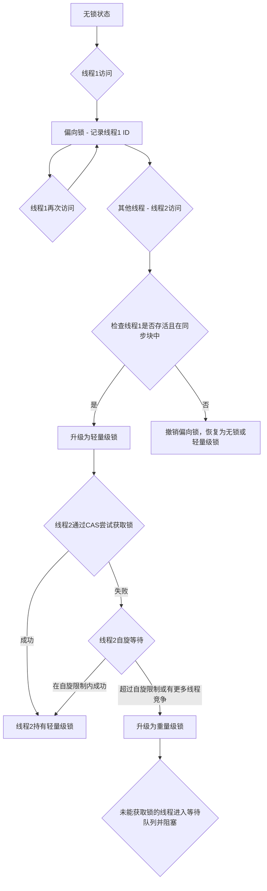

# 深入解析Synchronized：从互斥锁到锁升级与JVM优化

`Synchronized` 是Java中用于解决多线程并发问题最基本也是最重要的关键字之一。它为并发编程提供了原子性、可见性和有序性的保证，是构建线程安全程序的基石。本文将详细阐述 `Synchronized` 的核心概念、锁升级的详细过程以及JVM为了提升其性能而采用的各种优化技术。

## Synchronized的核心作用与用法

`Synchronized` 的核心在于提供了一种内置的锁机制，也称为“监视器锁”（Monitor Lock）。当一个线程访问一个对象的 `synchronized` 方法或代码块时，它必须首先获得该对象的锁。如果锁已被其他线程持有，则该线程将被阻塞，直到锁被释放。

这带来了三个关键的并发特性：

1. **互斥性 (Mutual Exclusion)**：确保在同一时刻，只有一个线程可以执行被 `synchronized` 保护的代码块或方法。这有效防止了多个线程同时修改共享数据而导致的数据竞争和状态不一致问题。
2. **可见性 (Visibility)**：当一个线程释放锁时，JMM（Java内存模型）会强制将该线程工作内存中对共享变量的所有修改都刷新到主内存中。而当另一个线程获取同一个锁时，它会强制从主内存中重新读取共享变量的值。这就保证了线程之间对共享变量状态的可见性。
3. **有序性 (Ordering)**：`Synchronized` 能够禁止指令重排序。在 `synchronized` 块内的代码，其执行顺序在单个线程内看起来是有序的，并且其操作结果对其他获取该锁的线程来说也是有序的。

**主要用法：**

- **修饰实例方法**：锁是当前方法所属的实例对象（`this`）。

  Java

  ```java
  public synchronized void instanceMethod() {
      // 临界区
  }
  ```

- **修饰静态方法**：锁是当前类的 `Class` 对象。由于一个类只有一个 `Class` 对象，因此可以控制对类级别静态资源的并发访问。

  Java

  ```java
  public static synchronized void staticMethod() {
      // 临界区
  }
  ```

- **修饰代码块**：可以显式指定任何对象作为锁对象，提供了比方法级别更细粒度的控制。

  Java

  ```java
  public void blockMethod() {
      synchronized(this) { // 也可以是其他任何对象
          // 临界区
      }
  }
  ```

## 从偏向锁到重量级锁：Synchronized的锁升级之路

在早期版本的JVM中，`Synchronized` 直接依赖于操作系统的互斥量（Mutex）来实现，这种锁被称为“重量级锁”，因为它涉及用户态到内核态的切换，开销较大。为了在不同并发场景下都能提供高效的性能，从JDK 1.6开始，JVM引入了锁升级的概念，将锁的状态分为：**无锁、偏向锁、轻量级锁和重量级锁**。锁的状态会根据竞争情况动态地升级，但通常不会降级。

### 1. 偏向锁 (Biased Locking)

**核心思想**：在大多数情况下，锁不仅不存在多线程竞争，而且总是由同一个线程多次获得。为了让该线程获得锁的代价更低，引入了偏向锁。

- **升级过程**：
  1. 当一个线程首次访问同步代码块时，会在对象头（Object Header）和栈帧的锁记录（Lock Record）中记录下当前线程的ID。
  2. 此后，当该线程再次进入和退出这个同步块时，将不再需要进行任何CAS（比较并交换）操作来加锁和解锁，只需简单地测试对象头中是否保存着指向自己的偏向锁。
- **适用场景**：锁竞争极少，且基本由固定线程获取的场景。
- **撤销**：当有另一个线程尝试获取这个偏向锁时，偏向模式才会结束。虚拟机会根据锁对象目前是否处于被锁定的状态，决定是撤销偏向（偏向锁的持有者已经执行完毕）并恢复到无锁或轻量级锁状态，还是将锁升级为轻量级锁。

### 2. 轻量级锁 (Lightweight Locking)

**核心思想**：如果偏向锁被撤销，说明存在竞争。轻量级锁认为这种竞争在短期内可以通过自旋（Spinning）的方式等待锁释放，从而避免将线程挂起和唤醒的重量级操作。

- **升级过程**：
  1. 线程在进入同步块时，JVM会先在当前线程的栈帧中创建用于存储锁记录的空间，并将对象头中的Mark Word复制到锁记录中（称为Displaced Mark Word）。
  2. 然后，线程尝试使用CAS操作将对象头中的Mark Word替换为指向锁记录的指针。
  3. 如果成功，当前线程获得锁。如果失败，表示其他线程已经持有了该锁。
- **自旋等待**：获取锁失败的线程并不会立即被挂起，而是会进行自旋（执行一段无意义的循环），在循环中不断尝试获取锁。
- **适用场景**：锁的持有时间非常短，且线程交替执行同步块的场景。自旋可以避免线程上下文切换的开销。

### 3. 重量级锁 (Heavyweight Locking)

**核心思想**：如果自旋了一定次数后（自适应自旋，由JVM动态决定），或者已经有其他线程在自旋等待同一个锁，锁就会膨胀为重量级锁。

- **升级过程**：
  1. 当轻量级锁的竞争加剧，自旋无法很快获得锁时，锁会升级为重量级锁。
  2. 此时，对象头中的指针将指向一个真正的监视器对象（Monitor），该监视器对象内部会维护一个等待队列。
  3. 未能获取到锁的线程将被阻塞，并放入等待队列中，不再消耗CPU。当持有锁的线程释放锁后，会唤醒等待队列中的一个或多个线程。
- **适用场景**：锁的竞争激烈，或者锁的持有时间较长，自旋等待不划算的场景。

**锁升级过程图示**：

代码段




## JVM对Synchronized的优化

除了锁升级，JVM还采用了一些其他的优化技术来进一步减少锁操作带来的性能开销。

### 1. 自适应自旋 (Adaptive Spinning)

在轻量级锁状态下，自旋的次数不再是固定的，而是由前一次在同一个锁上的自旋时间以及锁的拥有者的状态来决定。如果对于某个锁，自旋等待刚刚成功获得过，那么JVM就会认为这次自旋也很可能再次成功，进而它将允许自旋等待持续相对更长的时间。反之，如果对于某个锁，自旋很少成功，那么在以后要获取这个锁时将可能省略掉自旋过程，以避免浪费处理器资源。

### 2. 锁消除 (Lock Elision)

这是一种更为激进的优化。在JIT（Just-In-Time）编译期间，通过对代码进行逃逸分析（Escape Analysis），如果JVM能够证明一个对象不会被发布到它被创建的线程之外（即不可能被其他线程访问），那么对这个对象的所有同步操作都可以被安全地消除。

例如，在一个方法内部创建的 `StringBuffer` 对象，如果它只在该方法内被使用，那么JIT编译器就可以判断出它不存在线程安全问题，从而将 `StringBuffer` 内部的 `append` 方法（这是一个`synchronized`方法）的锁操作给消除掉。

### 3. 锁粗化 (Lock Coarsening)

原则上，我们总是推荐将同步块的作用范围限制得尽可能小，以减少不必要的阻塞。但如果一系列的连续操作都对同一个对象反复加锁和解锁，甚至加锁操作是出现在循环体中的，那即使没有线程竞争，频繁地进行互斥同步操作也会导致不必要的性能损耗。

锁粗化就是将多个连续的、针对同一个锁对象的加锁解锁操作，合并成一个更大范围的锁。例如，在循环中反复获取同一个锁，JIT编译器可能会将锁的范围扩大到整个循环之外，使得整个循环只进行一次加锁和一次解锁。

## 总结

`Synchronized` 关键字是Java并发编程的基石，它通过内置的监视器锁机制保证了多线程环境下的数据安全。为了平衡安全性和性能，现代JVM对其进行了深度优化。从最初简单的重量级锁，演进到了包含无锁、偏向锁、轻量级锁和重量级锁的动态升级路径。这一智能的锁升级策略，结合自适应自旋、锁消除和锁粗化等JIT编译优化技术，使得 `Synchronized` 在绝大多数场景下都能提供非常出色的性能，不再是过去人们印象中的“性能瓶颈”。理解其背后的原理，有助于我们编写出更高效、更健壮的并发程序。
