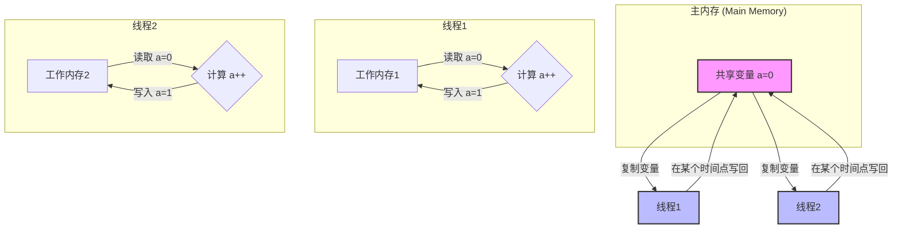

# 什么是JMM

简单来说，JMM不是一个真实存在的物理区域，而是一种**规范或一组规则**。它定义了在多线程环境下，Java程序中的变量（特指共享变量）如何被存储在内存中，以及线程之间如何通过内存进行通信。它的最终目标是屏蔽各种硬件和操作系统的内存访问差异，让Java程序在各种平台上都能达到一致的内存访问效果，从而保证并发编程的正确性。

### 为什么需要JMM？

在现代计算机中，为了提升处理速度，CPU通常不会直接和主内存（RAM）打交道，而是在中间加上了多层高速缓存（CPU Cache）。

当一个线程执行时，它会把需要用到的变量从主内存中复制一份到自己的工作内存（Working Memory，这可以理解为CPU高速缓存的抽象）。线程对变量的所有操作（读取、赋值等）都是在自己的工作内存中进行的。操作完成后，再在某个时间点将修改后的变量值写回主内存。

这就带来了一个问题：**多线程并发时，数据一致性无法保证。**

由于每个线程都有自己的工作内存，并且写回主内存的时机不确定，就可能导致以下三个核心问题：

1. **可见性 (Visibility)**：一个线程修改了共享变量的值，其他线程无法立即看到这个修改。
2. **原子性 (Atomicity)**：一个或多个操作，要么全部执行且执行过程不会被任何因素打断，要么就都不执行。在多线程环境下，像 `i++` 这样的操作就不是原子的（它包含读取、增加、写入三步）。
3. **有序性 (Ordering)**：为了提高性能，编译器和处理器可能会对指令进行重排序。在单线程下，这通常没问题，但在多线程下，重排序可能会导致意想不到的后果。

JMM就是为了解决以上三个问题而生的。

### JMM如何保证并发安全？

JMM通过定义一系列的内存操作规则和同步机制来解决这些问题，其中最核心的就是**Happens-Before原则**和Java提供的同步关键字。

#### Happens-Before 原则

这是JMM中最重要的一个概念。它定义了两个操作之间的偏序关系。如果操作A "happens-before" 操作B，那么A操作的结果对B操作是可见的，并且A操作的执行顺序在B操作之前。

JMM定义了以下几条天然的Happens-Before规则：

- **程序次序规则**：在一个线程内，按照代码书写的顺序，前面的操作 happens-before 后面的操作。
- **监视器锁规则**：对一个锁的解锁（unlock）操作 happens-before 于后续对这个锁的加锁（lock）操作。
- **volatile变量规则**：对一个 `volatile` 变量的写操作 happens-before 于后续对这个变量的读操作。
- **线程启动规则**：线程对象的 `start()` 方法 happens-before 此线程的任何一个动作。
- **线程终止规则**：线程中的所有操作都 happens-before 对此线程的终止检测。
- **线程中断规则**：对线程 `interrupt()` 方法的调用 happens-before 于被中断线程的代码检测到中断事件的发生。
- **传递性**：如果A happens-before B，且B happens-before C，那么A happens-before C。

#### Java提供的关键字

基于Happens-Before原则，Java提供了关键字来让程序员可以显式地控制同步：

- `volatile`: 这是Java提供的最轻量级的同步机制。它可以保证变量的**可见性**（一个线程修改后，其他线程立即可见）和一定程度的**有序性**（禁止指令重排序）。但它**不能**保证原子性。
- `synchronized`: 这是一个更重量级的同步机制。它可以同时保证**可见性**、**原子性**和**有序性**。它通过锁的机制，确保同一时间只有一个线程能访问被 `synchronized` 保护的代码块或方法。

### 总结

可以将JMM理解为Java并发编程的**底层基石**。它通过定义一套抽象的内存模型和一系列规则（尤其是Happens-Before原则），解决了由CPU缓存、编译器优化等导致的可见性、原子性和有序性问题，并在此基础上提供了`volatile`、`synchronized`等工具，让开发者能够编写出正确、可靠的多线程程序。