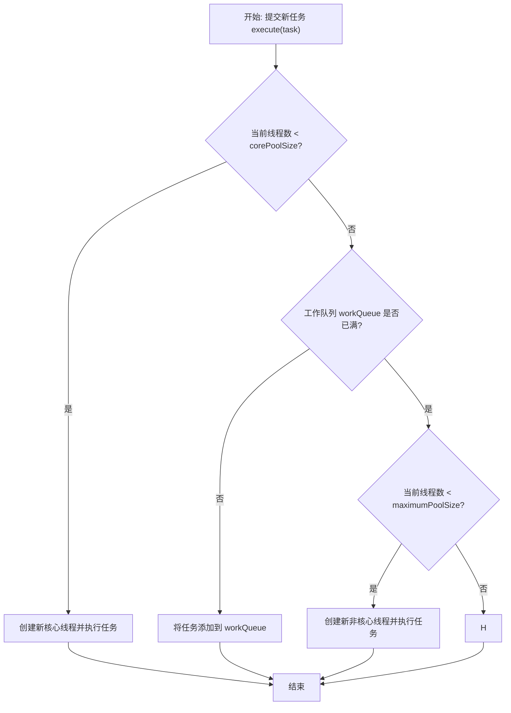

# 深度解析Java线程池：从核心原理到最佳实践

## 第一部分 线程池的核心思想与价值

在探讨`ThreadPoolExecutor`的复杂机制之前，必须首先理解其存在的根本原因——即它解决了什么核心问题。只有深刻领会其设计哲学，才能在实践中做出明智的决策。

### 1.1 问题的根源：线程生命周期的昂贵成本

在并发编程的早期模型中，一种常见的模式是“按需创建”（Thread-Per-Request），即每当有一个新的任务需要处理时，就创建一个新的线程。这种方法虽然直观，但在大规模、高并发的服务器应用中却隐藏着巨大的性能陷阱和稳定性风险。

问题的核心在于，线程并非轻量级资源。在Java虚拟机（JVM）中，每一个Java线程都直接映射到一个本地操作系统（OS）线程 。创建一个线程的生命周期成本是相当高昂的，它主要包含以下几个方面：

- **内存消耗**：每个线程都需要有自己的栈空间（Thread Stack），用于存储局部变量和方法调用信息。在现代JVM中，这个栈的默认大小可能达到1MB。成百上千个线程意味着上百MB甚至GB级别的内存被纯粹用于线程栈，这会显著挤占堆内存空间 。
- **创建与销毁开销**：线程的创建和销毁需要操作系统内核的介入，这涉及到系统调用，是一个相对缓慢的过程。对于大量生命周期短暂的任务，频繁地创建和销毁线程会消耗大量的CPU时间，这些时间本可以用于执行实际的业务逻辑 。
- **调度开销（上下文切换）**：当活跃线程的数量超过CPU核心数时，操作系统必须在这些线程之间进行频繁的上下文切换（Context Switching），以营造并行执行的假象。上下文切换需要保存当前线程的执行状态并加载下一个线程的状态，这个过程本身会消耗CPU周期。过多的线程会导致CPU将大量时间浪费在调度上，而不是执行有价值的工作，从而导致系统整体性能下降，这种现象被称为“资源颠簸”（Resource Thrashing）。

在一个高流量的Web服务器中，如果为每个HTTP请求都创建一个新线程，当请求量激增时，系统会迅速创建大量线程。这不仅会耗尽内存，还会因剧烈的上下文切换导致CPU不堪重负，最终使整个应用停止响应所有请求，而非仅仅是处理速度变慢。这是一种灾难性的、雪崩式的系统失效模式 。

### 1.2 池化：一种通用的资源管理思想

为了解决上述问题，软件工程领域引入了一种经典且通用的资源管理模式——“池化”（Pooling）。池化的核心思想是将一组昂贵的、可复用的资源预先创建好并统一管理，当需要使用资源时，从“池”中获取一个；使用完毕后，不是销毁，而是将其归还到池中，以备后续使用 。

这种思想在计算机科学中无处不在，线程池只是其一。其他常见的例子包括：

- **数据库连接池（Connection Pooling）**：预先创建并维护一定数量的数据库连接。应用在需要访问数据库时，从池中借用一个连接，用完后归还。这避免了为每次数据库查询都建立和关闭TCP连接的高昂开销 。
- **内存池（Memory Pooling）**：预先分配一大块连续的内存，并在应用内部对其进行管理和划分。这可以减少因频繁向操作系统申请小块内存而导致的内存碎片和系统调用开销 。
- **对象池（Object Pooling）**：对于创建成本高昂的对象，通过池化技术循环使用，减少初始化和垃圾回收的压力 。

线程池正是池化思想在并发编程领域的具体应用。它将线程这一宝贵资源集中管理，从而规避了直接操作线程生命周期所带来的种种弊端。

### 1.3 线程池的三大核心优势

通过采用池化技术，线程池为并发应用带来了三个决定性的好处 。

#### 1.3.1 支柱一：降低资源消耗

这是线程池最直观的优势。通过复用一个预先创建好的工作线程（Worker Threads）集合，线程池避免了为每个任务都创建和销毁线程所带来的性能损耗 。线程被创建一次后，可以服务于成千上万个任务，极大地降低了系统资源的浪费 。

#### 1.3.2 支柱二：提高响应速度

当一个任务到达时，如果池中有空闲的线程，该任务可以被立即分配并执行，无需等待新线程的创建过程 。这个看似微小的延迟差异，在需要快速响应用户请求的系统中至关重要。例如，在一个电商网站的商品详情页，聚合商品价格、库存、优惠等信息可能需要执行多个并发子任务。使用线程池可以确保这些子任务被迅速处理，从而缩短页面加载时间，提升用户体验。

#### 1.3.3 支柱三：提高线程的可管理性与系统稳定性

这是线程池在生产环境中最深刻、最重要的价值。线程作为稀缺资源，如果无限制地创建，不仅会消耗系统资源，更会因为资源调度失衡而降低系统的稳定性。线程池提供了一个对并发资源进行统一分配、调优和监控的中央枢纽 。

其核心体现在**边界控制**上。通过设定线程池的大小，我们可以将系统的并发度控制在一个可预见的、合理的范围内 。这带来了一个至关重要的转变：当系统面临的负载超过其处理能力时，它不会因为无休止地创建线程而崩溃。相反，它会将超出的任务放入一个队列中等待。系统的行为从

**灾难性崩溃（Catastrophic Failure）\**转变为\**优雅降级（Graceful Degradation）** 。虽然任务处理的延迟会增加，但系统本身依然存活，并以其最大能力持续提供服务。这种可预测性和韧性是构建高可用、高稳定性系统的基石。因此，线程池的首要价值并非微观的性能优化，而是宏观的系统稳定性和弹性。

## 第二部分 任务处理流程：`ThreadPoolExecutor` 的内部决策剖析

要精通`ThreadPoolExecutor`，就必须深入理解其内部的任务接收和分派逻辑。所有核心参数的交互作用都体现在其核心方法`execute()`的决策流程中。这个流程定义了当一个新任务到来时，线程池会做什么——是创建新线程，还是放入队列，或是拒绝任务。

### 2.1 核心 `execute()` 方法逻辑

当一个`Runnable`任务通过`execute()`方法提交给`ThreadPoolExecutor`时，它会遵循一个严谨的、分步骤的决策过程。这个过程是理解线程池行为的关键 。

- **第一步：检查核心线程数** 线程池首先会检查当前正在运行的线程数（`getPoolSize()`）是否小于`corePoolSize`。如果是，即使池中存在空闲的线程，它也会创建一个新的**核心线程**来执行这个新任务。这是`ThreadPoolExecutor`一个非常关键且经常被误解的行为特性：它倾向于将线程数扩充到`corePoolSize`，而不是优先复用已有的空闲线程去处理任务，只要当前线程总数还没达到核心数 。
- **第二步：尝试将任务入队** 如果当前运行的线程数已经达到或超过了`corePoolSize`，线程池会尝试将任务添加到配置的`workQueue`（工作队列）中。这个操作通常是通过调用队列的`offer()`方法完成的，这是一个非阻塞操作。如果队列未满，任务被成功加入队列，并等待池中的某个工作线程来处理它 。
- **第三步：尝试创建非核心线程** 如果第二步中的`workQueue.offer()`调用失败（通常意味着工作队列已满），线程池会进行最后的尝试。它会检查当前运行的线程数是否小于`maximumPoolSize`。如果是，它会创建一个新的**非核心线程**（也称为“救援线程”或“扩展线程”）来立即执行这个任务 。
- **第四步：执行拒绝策略** 如果当前运行的线程数已经达到了`maximumPoolSize`，并且工作队列也已经满了，这意味着线程池已经饱和，无法再接收任何新任务。此时，线程池会调用其配置的`RejectedExecutionHandler`来处理这个被拒绝的任务 。

### 2.2 流程可视化：决策流程图

为了更直观地理解上述逻辑，下面的流程图清晰地展示了`execute()`方法的内部决策路径。

代码段



*图2.1: `ThreadPoolExecutor`任务执行流程图*

这个流程揭示了一个重要的设计意图：线程池的配置是“**先核心线程，再队列，最后最大线程**”。它并不会在核心线程未满时就使用队列，也不会在队列未满时就创建超出核心数的线程。理解这个优先级顺序是正确配置线程池的前提。

### 2.3 线程复用：`runWorker()` 循环的奥秘

线程池实现线程复用的核心在于其内部的`Worker`类，它本身是一个`Runnable`，并且持有一个`Thread`。当一个`Worker`被创建并启动后，它的`run()`方法会调用`runWorker()`。`runWorker()`方法是一个循环，它会首先执行初始任务（如果有的话），然后不断地从工作队列（`workQueue`）中通过`getTask()`方法获取新任务来执行。只要`getTask()`能取到任务，这个循环就不会停止，从而实现了单个线程执行多个任务的功能，即线程复用 。当

`getTask()`在一定时间内（由`keepAliveTime`控制）无法获取到任务时，这个`Worker`可能会被销毁，从而实现线程池的收缩。

## 第三部分 配置的七大支柱：`ThreadPoolExecutor` 核心参数详解

`ThreadPoolExecutor`的强大与灵活源于其构造函数提供的七个核心参数。每一个参数都扮演着不可或缺的角色，它们的组合共同定义了线程池的规模、行为和弹性。掌握这些参数是定制化、高性能线程池配置的基础 。

```java
public ThreadPoolExecutor(int corePoolSize,
                          int maximumPoolSize,
                          long keepAliveTime,
                          TimeUnit unit,
                          BlockingQueue<Runnable> workQueue,
                          ThreadFactory threadFactory,
                          RejectedExecutionHandler handler)
```

### 3.1 `corePoolSize` (核心线程数)

- **定义**：线程池中需要维持的最小线程数量，即使这些线程处于空闲状态 。

- **角色与行为**：这是线程池的“常备军”规模。当新任务提交时，只要当前线程数少于`corePoolSize`，线程池就会创建新线程来处理任务，直到达到`corePoolSize` 。默认情况下，核心线程会一直存活，不会因为空闲而被回收。但是，如果调用了

  `allowCoreThreadTimeOut(true)`方法，核心线程在空闲时间超过`keepAliveTime`后也会被终止 。

### 3.2 `maximumPoolSize` (最大线程数)

- **定义**：线程池允许创建的线程总数的上限 。
- **角色与行为**：这是线程池的“总兵力”上限。只有当核心线程全部繁忙且`workQueue`已满时，线程池才会创建超出`corePoolSize`的新线程（非核心线程），但总数不会超过`maximumPoolSize` 。这个参数为系统提供了一个应对突发高负载的弹性缓冲区，同时也设定了资源消耗的硬性上限。

### 3.3 `keepAliveTime` (空闲线程存活时间)

- **定义**：当线程池中的线程数量超过`corePoolSize`时，多余的空闲线程在被终止前可以存活的最长时间 。
- **角色与行为**：此参数用于管理非核心线程的生命周期。在负载高峰过后，任务量减少，那些为应对高峰而创建的非核心线程会变为空闲。如果一个非核心线程的空闲时间达到了`keepAliveTime`，它就会被回收，从而使线程池的规模收缩回`corePoolSize`（或更少），释放占用的系统资源 。

### 3.4 `unit` (时间单位)

- **定义**：为`keepAliveTime`参数指定时间单位，是一个`java.util.concurrent.TimeUnit`枚举值 。
- **角色与行为**：提供时间度量的清晰度和灵活性，例如`TimeUnit.SECONDS`、`TimeUnit.MILLISECONDS`等。

### 3.5 `workQueue` (任务阻塞队列)

- **定义**：一个`BlockingQueue`实现，用于存储等待执行的任务 。
- **角色与行为**：这是线程池的“缓冲区域”。当所有核心线程都在忙碌时，新提交的任务会被放入这个队列中排队等待 。队列的选择对线程池的整体行为有着决定性的影响，是配置中最关键的决策之一。

### 3.6 `threadFactory` (线程工厂)

- **定义**：一个`ThreadFactory`接口的实现，用于按需创建新线程 。
- **角色与行为**：它提供了一种自定义线程创建过程的机制。默认的`ThreadFactory`创建的线程都属于同一个线程组，具有相同的优先级，且名称通常是`pool-N-thread-M`的形式。通过提供自定义的`ThreadFactory`，我们可以为线程设置有意义的名称（如`"http-request-processor-1"`）、设置为守护线程（daemon）、调整优先级等。这对于生产环境中的问题诊断（如分析线程转储）和监控至关重要 。

### 3.7 `handler` (拒绝策略)

- **定义**：一个`RejectedExecutionHandler`接口的实现，定义了当线程池无法接受新任务时的处理方式 。
- **角色与行为**：这是线程池的“最后一道防线”。当线程池达到`maximumPoolSize`且`workQueue`也已满时，任何新提交的任务都将被拒绝。此处理器定义了“拒绝”的具体行为，例如是抛出异常、由提交者自己执行，还是直接丢弃 

### 代码示例：标准的构造函数调用

以下是一个创建自定义`ThreadPoolExecutor`的典型示例，它显式配置了所有七个参数，体现了生产环境中的最佳实践。

```java
import java.util.concurrent.*;
import java.util.concurrent.atomic.AtomicInteger;

public class CustomThreadPoolExample {

    public static void main(String args) {
        // 1. 定义线程池核心参数
        int corePoolSize = 2;
        int maximumPoolSize = 5;
        long keepAliveTime = 60;
        TimeUnit unit = TimeUnit.SECONDS;

        // 2. 定义一个有界的工作队列，容量为10
        BlockingQueue<Runnable> workQueue = new ArrayBlockingQueue<>(10);

        // 3. 定义一个自定义的线程工厂，为线程设置有意义的名称
        ThreadFactory threadFactory = new ThreadFactory() {
            private final AtomicInteger threadNumber = new AtomicInteger(1);
            private final String namePrefix = "biz-task-processor-";

            @Override
            public Thread newThread(Runnable r) {
                Thread t = new Thread(r, namePrefix + threadNumber.getAndIncrement());
                if (t.isDaemon()) {
                    t.setDaemon(false); // 确保线程是用户线程
                }
                if (t.getPriority()!= Thread.NORM_PRIORITY) {
                    t.setPriority(Thread.NORM_PRIORITY); // 标准化优先级
                }
                return t;
            }
        };

        // 4. 定义一个拒绝策略，这里使用 CallerRunsPolicy
        RejectedExecutionHandler handler = new ThreadPoolExecutor.CallerRunsPolicy();

        // 5. 创建 ThreadPoolExecutor 实例
        ThreadPoolExecutor executor = new ThreadPoolExecutor(
                corePoolSize,
                maximumPoolSize,
                keepAliveTime,
                unit,
                workQueue,
                threadFactory,
                handler
        );

        // 6. 提交任务
        for (int i = 0; i < 20; i++) {
            final int taskId = i;
            executor.execute(() -> {
                System.out.println("Executing task " + taskId + " by thread: " + Thread.currentThread().getName());
                try {
                    // 模拟任务执行
                    Thread.sleep(1000);
                } catch (InterruptedException e) {
                    Thread.currentThread().interrupt();
                }
            });
        }

        // 7. 关闭线程池
        executor.shutdown();
        try {
            if (!executor.awaitTermination(60, TimeUnit.SECONDS)) {
                executor.shutdownNow();
            }
        } catch (InterruptedException e) {
            executor.shutdownNow();
        }

        System.out.println("All tasks submitted.");
    }
}
```

这个例子  不仅展示了如何调用构造函数，更重要的是体现了生产级配置的三个关键要素：使用有界队列、自定义线程命名和明确的拒绝策略。

## 第四部分 关键决策一：`workQueue` 及其对系统的颠覆性影响

在`ThreadPoolExecutor`的七个参数中，`workQueue`的选择可能是最具决定性的。它不仅仅是一个任务的临时存储区，其类型和容量直接决定了线程池的扩容和任务处理策略，甚至能让`maximumPoolSize`这样的核心参数形同虚设。选择错误的队列类型是导致生产环境中线程池相关问题的最常见原因之一。

### 4.1 `SynchronousQueue`：直接提交（Direct Handoffs）

- **行为特性**：`SynchronousQueue`是一个没有内部容量的特殊阻塞队列。它的`offer()`操作会立即失败，除非恰好有另一个线程正在调用`take()`方法等待接收元素。它本质上是一个线程间直接传递任务的“通道”，而非“容器” 。
- **对线程池的影响**：当使用`SynchronousQueue`时，由于`offer()`总是失败（除非有空闲线程在等待），任务提交逻辑会跳过入队步骤，直接进入第三步：尝试创建新线程。这意味着，只要当前线程数小于`maximumPoolSize`，每个新任务都会导致一个新线程的创建（如果所有已有线程都繁忙）。这正是`Executors.newCachedThreadPool()`的内部实现机制 。
- **关键风险**：如果`maximumPoolSize`被设置为一个非常大的值（如`Integer.MAX_VALUE`），在高并发场景下，任务的持续涌入会导致线程数量无限制地增长。这会迅速耗尽系统内存和CPU资源，最终导致应用崩溃或`OutOfMemoryError`。因此，`SynchronousQueue`通常需要与一个经过仔细计算的、有界的`maximumPoolSize`配合使用，或者只用于处理大量、短暂且不会互相阻塞的任务 。

### 4.2 `LinkedBlockingQueue`：无界队列（Unbounded Queues）

- **行为特性**：`LinkedBlockingQueue`是基于链表实现的阻塞队列。如果其构造函数中未指定容量，其容量默认为`Integer.MAX_VALUE`，使其在实践中成为一个“无界队列” 。
- **对线程池的影响**：当使用无界`LinkedBlockingQueue`时，如果`corePoolSize`个线程都在忙碌，所有后续任务都会被成功地添加到队列中，因为队列永远不会“满”。由于`workQueue.offer()`永远返回`true`，任务提交逻辑永远不会走到第三步（创建非核心线程）。这导致`maximumPoolSize`和`keepAliveTime`这两个参数**完全失效**。线程池的实际大小将永远被固定在`corePoolSize`，无论负载有多高。这正是`Executors.newFixedThreadPool()`和`Executors.newSingleThreadExecutor()`的行为模式 。
- **关键风险**：这是最隐蔽的“杀手”。如果任务的生产速度持续快于消费速度（例如，处理一个任务需要100ms，但每秒有20个任务涌入），无界队列会无限增长，不断消耗堆内存。最终，这将耗尽所有可用内存，导致整个应用因`OutOfMemoryError`而崩溃。由于问题发生前系统可能看起来一切正常（只是响应变慢），这种故障模式极难被提前发现 。

### 4.3 `ArrayBlockingQueue`：有界队列（Bounded Queues）

- **行为特性**：`ArrayBlockingQueue`是基于数组实现的有界阻塞队列，其容量在创建时必须指定，且之后不可更改 。
- **对线程池的影响**：这是唯一能让`ThreadPoolExecutor`所有参数协同工作的队列类型。它提供了最完整的控制流：
  1. 任务优先由核心线程处理。
  2. 核心线程用尽后，任务进入`ArrayBlockingQueue`。
  3. 队列满后，线程池开始创建非核心线程，直到达到`maximumPoolSize`。
  4. 线程池和队列都饱和后，触发拒绝策略。
- **权衡与选择**：这是构建健壮、可预测的生产级线程池的首选。然而，它需要仔细的容量规划。队列大小和池大小之间存在权衡：
  - **大队列，小池**：可以减少CPU使用率、操作系统资源消耗和上下文切换开销，但可能导致吞吐量降低，因为任务在队列中等待时间变长。适用于CPU密集型任务。
  - **小队列，大池**：能让CPU保持繁忙，提高吞吐量，尤其适用于I/O密集型任务（因为线程在等待I/O时可以切换出去执行其他任务）。但可能遭遇不可接受的调度开销 。

### 表4.1 `BlockingQueue` 对比分析

| 队列类型                  | 容量特性                       | `ThreadPoolExecutor` 行为                                    | 主要应用场景                                                 | **关键风险**                                              |
| ------------------------- | ------------------------------ | ------------------------------------------------------------ | ------------------------------------------------------------ | --------------------------------------------------------- |
| **`SynchronousQueue`**    | 无容量，直接传递               | 任务不排队，优先创建新线程直至`maximumPoolSize`。            | 处理大量、短暂的异步任务，如`newCachedThreadPool`。          | `maximumPoolSize`无界时，会无限制创建线程，导致资源耗尽。 |
| **`LinkedBlockingQueue`** | 默认无界 (`Integer.MAX_VALUE`) | 任务会无限入队，`maximumPoolSize`参数失效，线程数永不超过`corePoolSize`。 | 适用于`newFixedThreadPool`，任务处理速率稳定且大于生产速率。 | 任务积压时，队列无限增长，导致`OutOfMemoryError`。        |
| **`ArrayBlockingQueue`**  | 有界（必须指定容量）           | 完整地实现了核心线程、队列、最大线程、拒绝策略的完整流程。   | 需要精确控制资源消耗和并发度的生产环境。                     | 配置不当（队列过大或过小）可能导致性能不佳，需要调优。    |


这张表格清晰地揭示了一个因果链条：队列的容量特性直接决定了线程池的扩容行为，进而决定了系统在极端负载下的风险模式。例如，对于`LinkedBlockingQueue`，“无界容量”导致“`maximumPoolSize`失效”，最终可能引发“`OutOfMemoryError`”。这种直接的关联是开发者在选择队列时必须首先考虑的。

## 第五部分 关键决策二：使用拒绝策略处理饱和任务

当线程池的所有线程都在执行任务，并且工作队列也已满时，系统就达到了其容量上限。此时，任何新提交的任务都无法被立即处理。`RejectedExecutionHandler`（拒绝策略）就是用来定义在这种饱和状态下，线程池应该如何响应的机制 。选择一个合适的拒绝策略，对于系统的健壮性和用户体验至关重要。

### 5.1 `RejectedExecutionHandler` 的角色

拒绝策略是`ThreadPoolExecutor`的最后一道防线，它仅在系统完全饱和时被触发。一个常见的误解是认为只要队列满了就会触发拒绝，但实际上，只有当**`maximumPoolSize`个线程全部被占用**且**`workQueue`也已满**这两个条件同时满足时，`handler`才会被调用 。

### 5.2 四种标准策略

`ThreadPoolExecutor`提供了四种预定义的拒绝策略，每种策略都有其特定的适用场景和影响 。

- **`AbortPolicy`（默认策略）**

  - **行为**：这是默认的拒绝策略。当任务被拒绝时，它会直接抛出一个`RejectedExecutionException`（这是一个运行时异常）。

  - **影响**：这种策略行为清晰、直接。它向任务提交者发出了一个强烈的信号：系统当前无法处理更多请求。调用者可以捕获这个异常并根据业务需求进行处理，例如，向用户返回“服务器繁忙”的错误信息，或者将任务进行持久化以便后续重试。

  - **代码示例**：

    ```java
    // 配置
    RejectedExecutionHandler handler = new ThreadPoolExecutor.AbortPolicy();
    ThreadPoolExecutor executor = new ThreadPoolExecutor(1, 1, 0, TimeUnit.SECONDS, new ArrayBlockingQueue<>(1), handler);
    
    // 提交任务直到饱和
    try {
        executor.execute(() -> sleepSeconds(10)); // 占用唯一线程
        executor.execute(() -> sleepSeconds(10)); // 占满队列
        executor.execute(() -> System.out.println("This will be rejected.")); // 触发拒绝
    } catch (RejectedExecutionException e) {
        System.err.println("Task rejected as expected: " + e.getMessage());
    }
    ```

- **`CallerRunsPolicy`（调用者运行策略）**

  - **行为**：当任务被拒绝时，该任务不会被丢弃，也不会抛出异常。相反，它会在调用`execute`方法的线程中直接执行 。

  - **影响**：这是一种非常巧妙的**反馈控制**或**背压（Back-pressure）**机制。当线程池饱和时，任务提交者（例如，处理HTTP请求的Web服务器线程）会被迫亲自执行任务。由于执行任务需要时间，这个提交者线程在此期间将无法提交更多的新任务，从而自然地降低了任务生产的速率，给了线程池喘息和消化积压任务的机会。这种策略可以有效防止任务丢失，并使系统负载趋于平滑，但会牺牲一部分提交者的响应性 。

  - **代码示例**：

    ```java
    // 配置
    RejectedExecutionHandler handler = new ThreadPoolExecutor.CallerRunsPolicy();
    ThreadPoolExecutor executor = new ThreadPoolExecutor(1, 1, 0, TimeUnit.SECONDS, new ArrayBlockingQueue<>(1), handler);
    
    System.out.println("Main thread is: " + Thread.currentThread().getName());
    executor.execute(() -> { System.out.println("Task 1 executed by: " + Thread.currentThread().getName()); sleepSeconds(2); });
    executor.execute(() -> { System.out.println("Task 2 executed by: " + Thread.currentThread().getName()); sleepSeconds(2); });
    
    // 此任务将被 main 线程执行
    executor.execute(() -> System.out.println("Task 3 (rejected) executed by: " + Thread.currentThread().getName())); 
    ```

    输出将显示`Task 3`由`main`线程执行。

- **`DiscardPolicy`（丢弃策略）**

  - **行为**：当任务被拒绝时，它会被**静默地丢弃**，不做任何处理，也不抛出任何异常 。

  - **影响**：这是一种非常危险的策略，因为它会导致任务的无声丢失。它只适用于那些即使丢失也无所谓的数据处理场景，例如，非关键的日志记录或无关紧要的指标更新。在绝大多数业务场景中，都应避免使用此策略。

  - **代码示例**：

    ```java
    // 配置
    RejectedExecutionHandler handler = new ThreadPoolExecutor.DiscardPolicy();
    //... 创建executor并使其饱和
    executor.execute(() -> System.out.println("This task will be silently discarded."));
    // 程序将不会有任何输出或异常
    ```

- **`DiscardOldestPolicy`（丢弃最老策略）**

  - **行为**：当任务被拒绝时，它会丢弃工作队列`workQueue`中等待时间最长的任务（即队头的任务），然后尝试重新提交当前被拒绝的任务 。
  - **影响**：这种策略试图通过牺牲一个旧任务来为新任务腾出空间。它同样会导致数据丢失，并且可能不适合所有场景。例如，如果任务具有时效性或优先级，丢弃最老的任务可能比丢弃最新的任务更糟糕。使用此策略时必须非常谨慎。

### 5.3 实现自定义拒绝策略

`RejectedExecutionHandler`是一个函数式接口，这使得实现自定义的拒绝逻辑非常简单。这为处理饱和状态提供了极大的灵活性。例如，可以实现一个策略，在拒绝任务时将其记录到日志，并尝试将其发送到消息队列或持久化到数据库，以便后续进行补偿处理 。

```java
import org.slf4j.Logger;
import org.slf4j.LoggerFactory;

class LoggingAndPersistingRejectionHandler implements RejectedExecutionHandler {
    private static final Logger logger = LoggerFactory.getLogger(LoggingAndPersistingRejectionHandler.class);

    @Override
    public void rejectedExecution(Runnable r, ThreadPoolExecutor executor) {
        // 记录被拒绝的任务信息
        logger.warn("Task rejected. Executor state: {}, Task: {}", executor.toString(), r.toString());
        
        // 尝试将任务持久化，例如写入文件或数据库
        // persistTask(r); 
        
        System.err.println("Task " + r.toString() + " has been rejected and logged.");
    }
}

// 使用自定义策略
RejectedExecutionHandler customHandler = new LoggingAndPersistingRejectionHandler();
ThreadPoolExecutor executor = new ThreadPoolExecutor(..., customHandler);
```

这个例子展示了如何通过自定义策略，将被拒绝的任务从一个潜在的系统故障点转变为一个可追踪、可恢复的事件，极大地增强了系统的鲁棒性。

## 第六部分 生产环境最佳实践与反模式

理论知识最终要服务于实践。在真实的、高负载的生产环境中，如何配置和使用线程池直接关系到应用的性能和稳定性。本节将总结一些业界公认的最佳实践，并指出常见的、应极力避免的反模式。

### 6.1 反模式：为什么 `Executors` 的工厂方法是陷阱

Java的`java.util.concurrent.Executors`工具类提供了一系列静态工厂方法，用于方便地创建几种预设的线程池，如`newCachedThreadPool()`和`newFixedThreadPool()`。这些方法因其简洁性而深受初学者喜爱，但在严肃的生产环境中，它们却被视为一种“陷阱”或反模式。《阿里巴巴Java开发手册》等业界规范明确禁止使用它们，原因在于它们隐藏了关键的配置细节，可能导致严重的资源问题 。

- **`newCachedThreadPool()` 的风险**
  - 该方法创建一个`ThreadPoolExecutor`，其`corePoolSize`为0，`maximumPoolSize`为`Integer.MAX_VALUE`，并使用`SynchronousQueue` 。
  - **问题所在**：`maximumPoolSize`无界意味着在负载高峰期，线程池会无限制地创建新线程。如果任务处理稍有延迟，或者遭遇恶意攻击（DoS），短时间内创建成千上万个线程会迅速耗尽服务器的内存和CPU资源，最终导致`OutOfMemoryError`或系统崩溃。它适用于处理大量、生命周期极短的异步任务，但不适合作为服务器应用的主力线程池 。
- **`newFixedThreadPool()` 和 `newSingleThreadExecutor()` 的风险**
  - 这两个方法创建的`ThreadPoolExecutor`都使用了**无界的`LinkedBlockingQueue`** 。
  - **问题所在**：如前文所述，无界队列是一个潜在的内存炸弹。当任务的生产速度持续超过消费速度时，队列会无限增长，直到耗尽所有堆内存，引发`OutOfMemoryError`。这种问题在发生前几乎没有征兆，极具隐蔽性和破坏性 。

**核心结论**：这些工厂方法为了所谓的“便利性”而牺牲了对资源边界的控制，这在追求稳定性和可预测性的生产环境中是不可接受的。它们隐藏了`workQueue`和`maximumPoolSize`等关键参数，使得开发者无法对线程池的行为进行精细控制和风险管理。

### 6.2 最佳实践：显式、有目的地配置

与使用工厂方法相反，最佳实践是**始终通过`ThreadPoolExecutor`的构造函数来显式地创建和配置线程池**。这强迫开发者思考并明确定义线程池的每一个行为维度。一个生产级的线程池配置应至少包含以下要素：

1. **使用有界队列**：选择`ArrayBlockingQueue`或一个有容量限制的`LinkedBlockingQueue`来防止内存溢出。队列的容量应根据系统的处理能力和可接受的延迟进行估算和测试 。
2. **提供自定义的`ThreadFactory`**：为线程设置有意义的、可识别的名称。这是进行问题排查（如分析线程转储、使用Profiler）时最有效的手段之一 。
3. **选择明确的拒绝策略**：根据业务场景，深思熟虑地选择一个拒绝策略。对于不能丢失任务的场景，`CallerRunsPolicy`或自定义的持久化策略是比默认`AbortPolicy`更健壮的选择 。

以下是一个遵循最佳实践的、可作为生产环境模板的代码示例：

```java
import com.google.common.util.concurrent.ThreadFactoryBuilder;
import java.util.concurrent.*;

public class ProductionReadyThreadPool {

    public static ThreadPoolExecutor createThreadPool(String namePrefix) {
        // 核心参数
        int corePoolSize = 10;
        int maximumPoolSize = 20;
        long keepAliveTime = 60L;
        TimeUnit unit = TimeUnit.SECONDS;

        // 使用有界队列
        BlockingQueue<Runnable> workQueue = new ArrayBlockingQueue<>(100);

        // 使用 Guava 的 ThreadFactoryBuilder 创建带命名的线程工厂
        ThreadFactory threadFactory = new ThreadFactoryBuilder()
               .setNameFormat(namePrefix + "-%d")
               .setDaemon(false) // 确保是用户线程
               .build();
        
        // 选择合适的拒绝策略，例如 CallerRunsPolicy 实现反压
        RejectedExecutionHandler handler = new ThreadPoolExecutor.CallerRunsPolicy();

        // 创建并返回 ThreadPoolExecutor
        ThreadPoolExecutor executor = new ThreadPoolExecutor(
                corePoolSize,
                maximumPoolSize,
                keepAliveTime,
                unit,
                workQueue,
                threadFactory,
                handler
        );
        
        // 允许核心线程超时，适用于负载波动大的场景
        executor.allowCoreThreadTimeOut(true);

        return executor;
    }

    public static void main(String args) {
        ThreadPoolExecutor orderExecutor = createThreadPool("order-service");
        ThreadPoolExecutor paymentExecutor = createThreadPool("payment-service");

        //... 使用线程池...

        orderExecutor.shutdown();
        paymentExecutor.shutdown();
    }
}
```

### 6.3 最佳实践：为线程命名的重要性

在复杂的系统中，当出现性能问题或死锁时，分析线程转储（Thread Dump）是主要的诊断手段。如果线程池中的线程都是默认名称，如`pool-1-thread-1`, `pool-2-thread-5`，你将很难分辨出哪个线程属于哪个业务，正在执行什么类型的任务。

相反，如果通过`ThreadFactory`将线程命名为`order-processor-3`或`log-writer-1`，那么在查看线程转储时，可以立即获得宝贵的上下文信息，极大地缩短了故障定位和问题解决的时间。这是一个投入产出比极高的实践。

## 第七部分 线程池大小的设定：科学与艺术的结合

“我应该用多少个线程？”这是关于线程池最常被问到，也是最难回答的问题。线程池的大小并非越大越好，也不是越小越好。一个不合理的设置，要么会浪费系统资源，要么会限制系统性能。确定最优的线程池大小，是一个融合了理论计算、任务特性分析和经验调优的过程。

### 7.1 第一步：任务分类

在进行任何计算之前，首先必须理解你的任务属于哪种类型。任务的性质是决定线程池大小的最根本因素 。

- **CPU密集型任务（CPU-Bound）**
  - **定义**：这类任务需要进行大量的计算，几乎会一直占用CPU资源。例如，复杂的算法、数据加密/解密、图像处理、大规模数据转换等。
  - **特点**：任务执行期间，线程很少会因为等待外部资源而阻塞。
  - ** sizing原则**：对于纯CPU密集型任务，设置过多的线程是没有意义的，因为CPU核心数量是物理瓶颈。多余的线程只会增加上下文切换的开销，从而降低整体性能。理论上，线程池的大小应约等于CPU的核心数 。
- **I/O密集型任务（I/O-Bound）**
  - **定义**：这类任务的大部分时间都花在等待I/O操作的完成上。例如，数据库查询、调用外部HTTP API、读写磁盘文件、与消息队列交互等。
  - **特点**：在等待I/O响应时，线程处于阻塞或等待状态，此时CPU是空闲的，可以被调度去执行其他线程的任务。
  - **sizing原则**：对于I/O密集型任务，可以并且应该配置比CPU核心数多得多的线程。这样，当一个线程因为等待I/O而阻塞时，CPU可以立即切换到另一个准备就绪的线程上，从而最大化CPU的利用率，提高系统的总吞吐量 。

### 7.2 科学指导：《Java并发编程实战》中的经典公式

Brian Goetz在其权威著作《Java并发编程实战》中给出了一个估算线程池大小的著名公式，它为我们的决策提供了科学的起点 。

Number of threads=Number of Cores×Target CPU Utilization×(1+Service timeWait time)

让我们分解这个公式的每个部分：

- **`Number of Cores`**：CPU的核心数。可以通过`Runtime.getRuntime().availableProcessors()`在Java程序中动态获取 。
- **`Target CPU Utilization`**：目标CPU利用率，一个介于0和1之间的值。代表你希望CPU在处理这些任务时保持多大的繁忙程度，例如，0.8表示80%的利用率。
- **`Wait time / Service time` (W/C ratio)**：这是最关键的比率，即任务的平均等待时间与平均计算（服务）时间的比值。这个比值反映了任务的I/O密集程度。

**应用公式进行估算：**

- **对于CPU密集型任务**：
  - 等待时间（`Wait time`）几乎为0，所以W/C比率也接近于0。
  - 公式简化为：Number of threads≈Number of Cores×Target CPU Utilization。
  - 如果目标是100%利用CPU，那么线程数就约等于CPU核心数。一些实践建议设置为`N+1`（N为核心数），这个额外的线程是为了防止当某个线程因意外（如缺页中断）而短暂暂停时，CPU能够保持繁忙 。
- **对于I/O密集型任务**：
  - 假设通过APM（应用性能监控）工具或基准测试测得，一个典型任务平均需要等待外部服务80ms（`Wait time`），而自身的计算处理需要20ms（`Service time`）。
  - 那么W/C比率为 80ms/20ms=4。
  - 假设系统有8个CPU核心，目标利用率为90%（0.9）。
  - 根据公式计算：Number of threads=8×0.9×(1+4)=7.2×5=36。
  - 因此，对于这种类型的I/O密集型任务，一个大小为36左右的线程池会是一个合理的初始配置。

### 7.3 调优的艺术：超越公式

必须强调，上述公式提供的是一个**科学的起点**，而非一个放之四海而皆准的**最终答案** 。在真实的复杂系统中，还需要考虑更多因素，进行精细的调优。

- **依赖资源的限制**：任务的执行可能依赖于其他有限的资源。最常见的例子是数据库连接池。如果你的线程池大小设置为50，但它依赖的数据库连接池大小只有20，那么多出来的30个线程在尝试获取数据库连接时也只会被阻塞。在这种情况下，线程池的有效并发度受限于下游资源的并发度，其大小不应超过依赖资源池的大小 。
- **负载测试与监控**：找到真正最优值的唯一方法是通过**压力测试**。使用真实的或模拟的生产负载，持续监控关键性能指标（如QPS/TPS、任务响应时间、CPU利用率、内存使用情况），并逐步调整线程池大小，观察各项指标的变化，直到找到一个最佳的平衡点 。
- **隔离不同类型的任务**：一个复杂的应用通常会处理多种不同类型的任务。例如，既有需要快速响应的用户前台请求（I/O密集型），也有在后台运行的数据批处理任务（CPU密集型）。将这些性质迥异的任务混在一个线程池中，是一个糟糕的设计。CPU密集型任务可能会长时间霸占线程，导致I/O密集型任务“饥饿”，从而影响前台用户的响应时间 。
  - **最佳实践**：为不同类型的任务创建**独立的、专门的线程池** 。例如，可以创建一个较大的线程池用于处理I/O密集的前台请求，再创建一个较小的、大小约等于CPU核心数的线程池用于处理后台计算任务。这种隔离确保了不同任务之间不会互相干扰，并且每个池都可以根据其特定负载进行独立优化，从而构建出更具弹性和高性能的系统。

## 第八部分 总结与展望

### 8.1 核心要点回顾

精通Java线程池，尤其是`ThreadPoolExecutor`，是构建高性能、高稳定性后端服务的关键技能。本次深度解析的核心要点可以总结为以下几条实践准则：

1. **始终显式配置**：摒弃`Executors`的便利工厂方法。始终通过`ThreadPoolExecutor`的构造函数进行实例化，这迫使你对资源边界、任务排队和拒绝行为做出明确的、有意识的决策。
2. **理解核心流程**：牢记“先核心线程、再队列、最后最大线程”的任务处理顺序。这是正确预测和配置线程池行为的基础。
3. **慎重选择队列**：`workQueue`的选择决定了线程池的扩容模式。优先使用有界队列（如`ArrayBlockingQueue`）来防止内存溢出，这是保障生产系统稳定性的关键。
4. **根据负载定大小**：线程池的大小没有万能公式，必须根据任务是CPU密集型还是I/O密集型来初步设定。使用经典公式作为起点，但最终答案一定来自于结合依赖资源限制的实际压力测试和持续监控。
5. **隔离不同工作负载**：不要用一个线程池处理所有类型的任务。为不同性质（如I/O密集 vs. CPU密集）的任务创建独立的、专门调优的线程池，是提升系统整体性能和弹性的高级实践。
6. **善用工具**：为线程命名，这将在问题排查时节省宝贵的时间。选择合适的拒绝策略，如`CallerRunsPolicy`，可以作为一种简单的反压机制，提升系统在饱和状态下的韧性。

### 8.2 未来展望：Loom项目与虚拟线程

虽然`ThreadPoolExecutor`在过去和现在都是Java并发编程的基石，但我们也要看到未来的发展方向。Java的**Project Loom**项目引入了**虚拟线程（Virtual Threads）**，这是一项革命性的变革 。

虚拟线程是一种极其轻量级的用户态线程，它不由操作系统内核直接管理。创建和切换虚拟线程的成本极低，使得我们可以轻松地为一个应用创建数百万个虚拟线程。这特别适合处理海量的I/O密集型任务。在虚拟线程的世界里，传统的“一个请求一个线程”模型（Thread-Per-Request）将再次变得可行且高效，因为线程本身不再是稀缺资源。

这意味着，对于大量I/O密集型任务，未来我们可能不再需要像现在这样煞费苦心地去估算和调优线程池大小。然而，`ThreadPoolExecutor`并不会就此过时。它仍然是管理和调度宝贵的平台线程（即传统的OS线程）的核心工具，尤其是在处理CPU密集型任务时，我们依然需要通过线程池来将并发度控制在与CPU核心数相匹配的水平。

因此，掌握`ThreadPoolExecutor`的原理和实践，在今天和可预见的未来，都将是Java工程师不可或缺的核心竞争力。而随着虚拟线程的普及，开发者将能够根据任务特性，更灵活地选择使用平台线程池还是虚拟线程，从而构建出前所未有的、兼具高性能和高并发能力的新一代Java应用。
