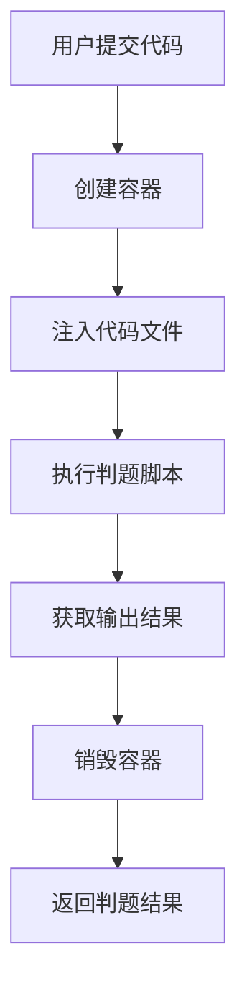
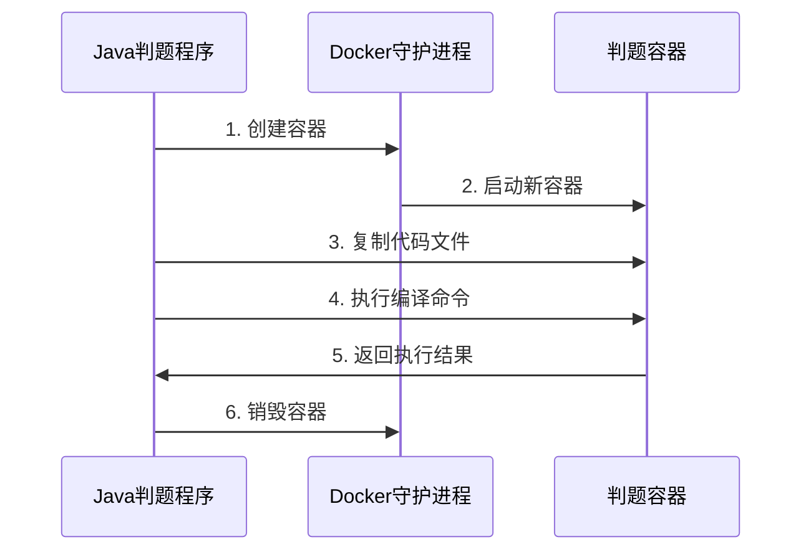

# 判题机相关

项目之初使用的是远程操控Docker进行判题请求的,但在最新代码使用专业判题机来进行判题,下面是项目之初的一个Demo

------

## 环境准备

1. 开启Docker远程API

   （在Docker服务器操作）：

   ```bash 
   # 编辑docker.service文件
   sudo vi /lib/systemd/system/docker.service
   ```
   
   修改ExecStart行为：

   ```bash
   ExecStart=/usr/bin/dockerd -H unix:///var/run/docker.sock -H tcp://0.0.0.0:2375 --containerd=/run/containerd/containerd.sock
   ```
   
2. 重启Docker

   ：

   ```bash
   sudo systemctl daemon-reload
   sudo systemctl restart docker
   ```

## Java判题机实现逻辑



------

## 完整Java代码

### 依赖配置

```xml
<dependency>
    <groupId>com.github.docker-java</groupId>
    <artifactId>docker-java</artifactId>
    <version>3.3.0</version>
</dependency>
```

### Java判题核心代码

```java
import com.github.dockerjava.api.DockerClient;
import com.github.dockerjava.api.command.CreateContainerResponse;
import com.github.dockerjava.api.command.ExecCreateCmdResponse;
import com.github.dockerjava.core.DefaultDockerClientConfig;
import com.github.dockerjava.core.DockerClientBuilder;
import java.io.ByteArrayOutputStream;

public class DockerJudge {

    // Docker服务器地址
    private static final String DOCKER_HOST = "tcp://your-server-ip:2375";
    private static final String IMAGE_NAME = "openjdk:17"; // 根据需求更换镜像

    public static void main(String[] args) throws Exception {
        String code = """
        public class Main {
            public static void main(String[] args) {
                System.out.println("Hello, Docker Judge!");
            }
        }
        """;
        
        JudgeResult result = judgeCode(code);
        System.out.println("判题结果: " + result);
    }

    public static JudgeResult judgeCode(String sourceCode) {
        DockerClient dockerClient = connectDocker();
        String containerId = null;

        try {
            // 1. 创建容器
            CreateContainerResponse container = dockerClient.createContainerCmd(IMAGE_NAME)
                .withName("judge-" + System.currentTimeMillis())
                .withTty(true)
                .exec();
            containerId = container.getId();

            // 2. 启动容器
            dockerClient.startContainerCmd(containerId).exec();

            // 3. 注入代码到容器
            dockerClient.copyArchiveToContainerCmd(containerId)
                .withHostResource(createTmpFile(sourceCode).getAbsolutePath())
                .withRemotePath("/judge")
                .exec();

            // 4. 执行编译和运行命令
            String[] compileCmd = {"sh", "-c", "cd /judge && javac Main.java && java Main"};
            ExecCreateCmdResponse execCmd = dockerClient.execCreateCmd(containerId)
                .withCmd(compileCmd)
                .withAttachStdout(true)
                .withAttachStderr(true)
                .exec();

            // 5. 获取执行输出
            ByteArrayOutputStream output = new ByteArrayOutputStream();
            dockerClient.execStartCmd(execCmd.getId())
                .exec(new OutputCollector(output))
                .awaitCompletion();

            // 6. 返回结果
            return new JudgeResult(
                output.toString(),  // 程序输出
                getExitCode(dockerClient, execCmd.getId())  // 退出码
            );

        } catch (Exception e) {
            return new JudgeResult("ERROR: " + e.getMessage(), -1);
        } finally {
            // 7. 清理容器
            if (containerId != null) {
                dockerClient.removeContainerCmd(containerId).withForce(true).exec();
            }
        }
    }

    private static DockerClient connectDocker() {
        return DockerClientBuilder.getInstance(
            DefaultDockerClientConfig.createDefaultConfigBuilder()
                .withDockerHost(DOCKER_HOST)
                .build()
        ).build();
    }
}

record JudgeResult(String output, int exitCode) {
    public boolean isSuccess() { 
        return exitCode == 0; 
    }
}
```

## 关键组件详解

1. **Docker连接配置**：

   ```java
   DefaultDockerClientConfig.createDefaultConfigBuilder()
     .withDockerHost("tcp://your-ip:2375")
   ```

2. **容器安全控制**（重要！）：

   ```java
   .withHostConfig(HostConfig.newHostConfig()
        .withCpuCount(1)              // 限制1个CPU核心
        .withMemory(100 * 1024 * 1024L) // 限制100MB内存
        .withReadonlyRootfs(true)     // 文件系统只读
   )
   ```

3. **超时控制**：

   ```java
   ExecStartCmd cmd = dockerClient.execStartCmd(execId);
   cmd.exec(new ResultCallback.Adapter<>() {
       @Override
       public void onComplete() {
           completed = true;
       }
   }).awaitCompletion(5, TimeUnit.SECONDS); // 5秒超时
   ```

------

## 安全增强措施

1. **TLS加密连接**：

   ```java
   .withDockerTlsVerify(true)
   .withDockerCertPath("/path/to/certs")
   ```

2. **容器隔离策略**：

   ```java
   .withSecurityOpts(List.of(
        "no-new-privileges",           // 禁止权限提升
        "seccomp=unconfined.json"       // 安全配置文件
   ))
   ```

3. **防火墙规则**：

   ```java
   # 只允许判题服务器IP访问2375端口
   sudo ufw allow from 192.168.1.100 to any port 2375 proto tcp
   ```

------

## 执行流程示意图



------

## 完整项目结构

```
src/
├── main/
│   ├── java/
│   │   ├── DockerJudge.java       # 主逻辑
│   │   ├── OutputCollector.java   # 输出收集器
│   │   └── utils/
│   │       ├── FileUtils.java     # 临时文件处理
│   │       └── SecurityUtils.java # 安全配置
│   └── resources/
│       └── security/
│           ├── ca.pem             # TLS证书
│           └── seccomp.json       # 安全配置文件
```
