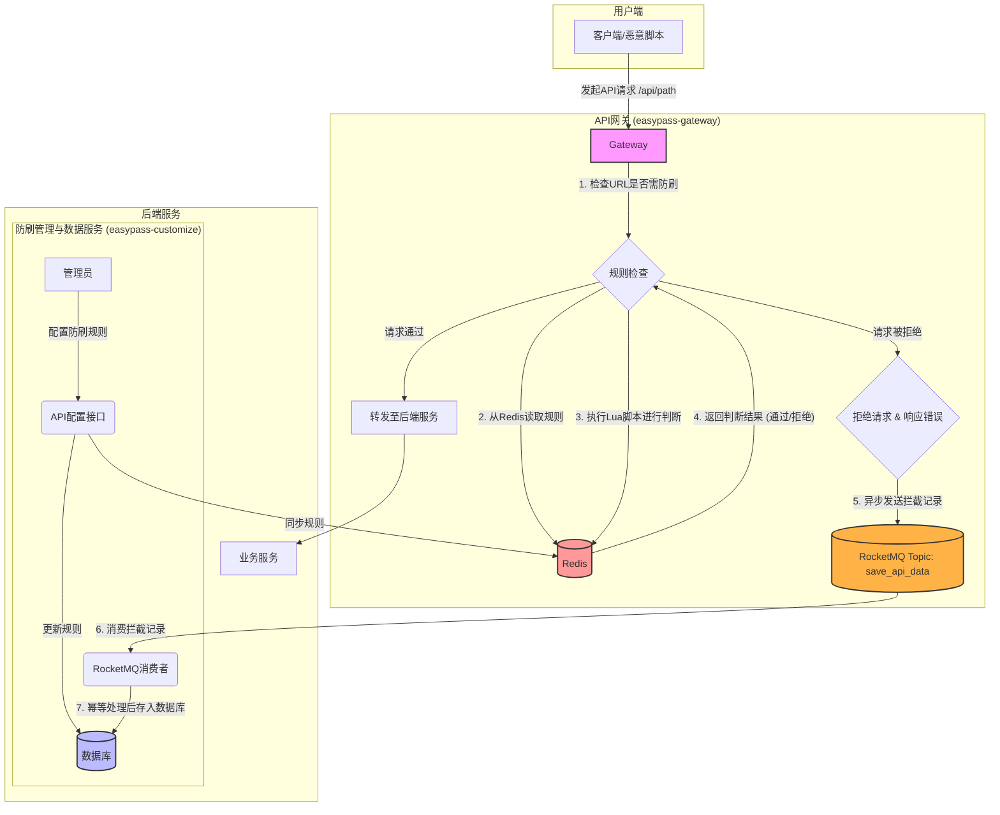
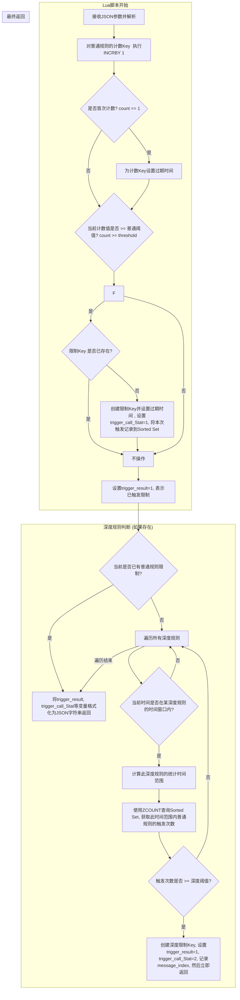

# easypass项目API接口定制化防刷与数据存储策略详解

## 一、业务背景与挑战：为什么需要防刷？

在当今的互联网应用中，特别是像电商秒杀、在线票务、稀缺医疗资源挂号等高并发、高热度的业务场景下，系统面临着一个严峻的挑战——**防刷**。

“防刷”指的是采取一系列技术手段，防止恶意用户或自动化脚本（即“黄牛”或“爬虫”）对应用程序的API接口进行大规模、高频率的恶意请求。这种行为不仅会抢占正常用户的资源，破坏业务公平性，还可能耗尽服务器资源，导致服务瘫痪，甚至引发数据泄露等安全问题。

因此，建立一套高效、灵活且可动态配置的防刷体系至关重要。它的核心目的在于：

1. **保护服务器资源**：防止因恶意请求消耗大量带宽、CPU和内存，保障正常用户的访问速度和体验。
2. **维护业务公平与经济利益**：在票务、电商等领域，防止通过技术手段进行不公平的抢购，保护普通用户的权益和企业的商业利益。
3. **保障数据安全**：防止恶意用户通过刷接口的方式批量抓取、泄露用户数据或其他敏感信息。
4. **确保服务可用性**：避免因API被滥用导致服务达到限流阈值，影响服务的正常提供。
5. **增强系统安全性**：高频请求往往是攻击的前奏，有效的防刷能抵御一部分探测性攻击，为系统安全筑起第一道防线。

### 防刷策略与微服务熔断的区别

在微服务架构中，我们常常会使用 Hystrix 或 Sentinel 这样的熔断组件来保护系统。很多开发者容易将业务防刷与服务熔断混为一谈，但它们的定位和目标截然不同。

- **服务熔断**：这是一种**后端服务的自我保护机制**。它的核心思想是“防止雪崩”，当某个下游服务出现故障或响应过慢时，为了避免整个系统的调用链路被拖垮，会暂时“熔断”对该服务的调用，快速失败并返回错误响应。它保护的是**服务与服务之间的稳定性**，是系统架构的最后一道防线，好比电路中的保险丝。
- **业务防刷**：这是一种**面向业务逻辑的流量甄别与控制机制**。它关注的是请求的“意图”和“行为模式”，旨在识别并拦截非法的、恶意的业务请求。它的策略通常更复杂、更灵活，例如：可以根据用户ID、IP地址、设备指纹等多个维度，在特定的时间窗口内（如“1分钟内请求超过20次”或“在某个特定活动期间，触发A行为的次数超过B次”）进行限制。

简单来说，**业务防刷是在“入口”处拦截坏人，而服务熔断是在“内部”防止一个环节的故障扩散到全局**。我们需要的，正是一个能够在请求入口处就进行精细化、动态化管理的防刷系统。

## 二、架构设计与技术选型

经过深入分析，我们决定将防刷的核心逻辑部署在**API网关（Gateway）**层，并采用 **Redis + Lua** 的技术组合来实现。

### 思考过程与选型理由

1. **为什么选择API网关？** 网关是所有外部请求进入系统的唯一入口。在网关层实施防刷，可以将恶意流量在第一时间拦截在外，避免其穿透到后端的业务服务，从而极大地减轻了后端服务的压力。如果请求在网关层就被拒绝，它将不会消耗任何业务服务的计算资源，这是最理想的防护位置。
2. **为什么选择Redis？** 防刷逻辑的核心是高频的读写和计数。我们需要一个性能极高的存储系统来实时记录和查询每个用户的请求频率。关系型数据库（如MySQL）显然无法承受如此高的QPS，而Redis基于内存的操作，具有纳秒级的响应速度，是实现高性能计数器的完美选择。即使在集群环境下，主从同步可能存在的微小数据延迟或丢失，对于防刷这种允许极小误差率的场景来说，是完全可以接受的。
3. **为什么结合使用Lua脚本？** 防刷的判断逻辑通常不是单一的“读取-比较-写入”，而是一系列复合操作。例如，“读取当前请求次数，加一，判断是否超限，如果超限则设置一个锁定标记”。如果将这些操作通过多个Redis命令从客户端发送，会产生多次网络I/O，并且无法保证操作的原子性。在高并发下，可能会出现数据不一致的问题。 而将这一系列逻辑封装在一个Lua脚本中，发送给Redis执行，可以确保所有操作在Redis服务端**原子性地**完成。这不仅消除了多次网络往返的开销，极大地提升了性能，也保证了在高并发场景下逻辑的正确性。

### 整体实现方案

我们的防刷体系分为策略执行和数据存储两大部分，通过RocketMQ进行解耦，确保了高性能和高可用性。

1. **策略配置与同步**：在`easypass-customize`服务中提供管理界面，用于配置普通防刷规则和深度防刷规则。这些规则被持久化到数据库中，并在任何更新后，实时同步到Redis的Hash结构中，供网关层读取。
2. **网关层策略执行**：
   - 在`easypass-gateway`服务中，配置需要进行防刷的API路径。
   - 当一个请求到达网关时，检查其URL是否在受保护的路径列表中。
   - 如果是，则从Redis中获取该URL对应的防刷规则。
   - 根据规则类型（普通/深度），构建参数并调用Lua脚本在Redis中执行判断。
3. **异步数据记录**：
   - 如果Lua脚本判断请求触发了限制，网关会立即拒绝该请求，并向RocketMQ发送一条消息，记录下这次被拦截的请求详情。
   - 这个过程是异步的，发送消息的成败不影响对用户的快速响应。
4. **后端数据消费与存储**：
   - `easypass-customize`服务作为消费者，订阅RocketMQ中的防刷记录主题。
   - 消费到消息后，将其解析并存入数据库。为了防止消息重复消费导致的数据冗余，我们引入了幂等性控制机制。

下面是此方案的整体架构图：



## 三、核心实现：API接口防刷策略

### 1. 规则检查与参数构建

当一个受保护的API请求进入网关时，`ApiRestrictService#apiRestrict`方法会被触发。它的核心职责是：从Redis中加载规则，构建执行Lua脚本所需的参数，然后调用脚本并处理其返回结果。

#### 规则参数查询与构建流程

```
graph TD
    A[请求进入网关] --> B{检查URL是否在防刷列表?};
    B -- 否 --> C[放行];
    B -- 是 --> D[获取客户端IP和用户ID];
    D --> E[构建通用Key (IP_UserID_URL)];
    E --> F[从Redis HASH中查询普通规则和深度规则];
    F --> G{规则是否存在?};
    G -- 否 --> C;
    G -- 是 --> H[构建普通规则参数(JSONObject)];
    H --> I{是否存在深度规则?};
    I -- 否 --> K[调用Lua脚本(仅普通规则)];
    I -- 是 --> J[追加深度规则参数到JSONObject];
    J --> L[调用Lua脚本(普通+深度规则)];
    K --> M{Lua返回结果: 是否触发限制?};
    L --> M;
    M -- 是 --> N[抛出异常, 拒绝请求, 异步记录日志];
    M -- 否 --> C;
```

#### Java核心代码

（此部分代码与之前版本相同，保持不变）

```
// com.easypass.service.ApiRestrictService#apiRestrict
public void apiRestrict(String id, String url, ServerHttpRequest request) {
    // ...
}
```

### 2. 原子化规则判断：Lua脚本详解

（此部分Lua脚本与之前版本相同，保持不变）

#### Lua脚本执行流程



#### Lua脚本代码

```lua
-- Lua脚本接收一个包含所有参数的JSON字符串
local apiRule = cjson.decode(KEYS[1])
-- ...
-- 最终返回JSON格式的结果
return string.format('{"triggerResult":%d,"triggerCallStat":%d,"apiCount":%d,"threshold":%d,"messageIndex":%d}', trigger_result, trigger_call_Stat, api_count, threshold, message_index)
```

## 四、异步解耦：防刷数据的存储策略 (RocketMQ实现)

当网关成功拦截一个恶意请求后，我们需要将这次事件记录下来用于后续的审计和分析。如果同步写入数据库，会严重影响网关的响应性能。因此，我们采用**RocketMQ消息队列**来实现**异步解耦**。

### 1. 生产者（Gateway）

网关作为生产者，在确认一个请求被拦截后，会构建一个包含详细信息的DTO对象，并将其序列化为JSON字符串，通过`RocketMQTemplate`发送到指定的Topic。

#### 依赖引入 (pom.xml)

首先，需要引入RocketMQ的Spring Boot Starter。

```xml
<dependency>
    <groupId>org.apache.rocketmq</groupId>
    <artifactId>rocketmq-spring-boot-starter</artifactId>
    <version>2.2.2</version>
</dependency>
```

#### RocketMQ生产者配置 (`easypass-gateway-service`)

```yaml
rocketmq:
  name-server: 127.0.0.1:9876 # RocketMQ NameServer地址
  producer:
    group: easypass-gateway-producer-group # 生产者组名
# 自定义Topic配置
easypass:
  rocketmq:
    topic: save_api_data_topic # 定义Topic名称
```

#### 消息发送逻辑

消息发送的逻辑需要适配`RocketMQTemplate`。

```java
// com.easypass.gateway.config.MessageProducerConfig.java
@Configuration
// 当配置文件中存在rocketmq.name-server时，此配置类生效
@ConditionalOnProperty("rocketmq.name-server")
public class MessageProducerConfig {

    @Bean
    public ApiDataMessageSend apiDataMessageSend(RocketMQTemplate rocketMQTemplate, 
                                                 @Value("${easypass.rocketmq.topic}") String topic) {
        return new ApiDataMessageSend(rocketMQTemplate, topic);
    }
}

// com.easypass.gateway.message.ApiDataMessageSend.java
@Slf4j
@AllArgsConstructor
public class ApiDataMessageSend {
    
    private final RocketMQTemplate rocketMQTemplate;
    private final String topic;
    
    public void sendMessage(String message) {
        log.info("sendMessage via RocketMQ, topic: {}, message : {}", topic, message);
        // 使用convertAndSend发送普通消息
        rocketMQTemplate.convertAndSend(topic, message);
    }
}

// com.easypass.gateway.service.impl.ApiRestrictServiceImpl#saveApiData
// 此方法保持不变，它会调用注入的ApiDataMessageSend实例
public void saveApiData(ServerHttpRequest request, String apiUrl, Integer type){
    ApiDataDto apiDataDto = new ApiDataDto();
    apiDataDto.setId(uidGenerator.getUid()); 
    // ... (DTO属性设置与之前相同)
    
    // 通过注入的发送器实例发送消息
    Optional.ofNullable(apiDataMessageSend).ifPresent(send -> 
        send.sendMessage(JSON.toJSONString(apiDataDto))
    );
}
```

### 2. 消费者（Customize Service）与幂等性保证

`easypass-customize-service`作为消费者，通过实现`RocketMQListener`接口来监听`save_api_data_topic`主题。保证幂等性的逻辑与之前相同，依然是在消费方法上使用自定义的`@RepeatExecuteLimit`注解。

#### RocketMQ消费者配置 (`easypass-customize-service`)

```yaml
rocketmq:
  name-server: 127.0.0.1:9876 # RocketMQ NameServer地址
  consumer:
    # 注意：具体的消费者组和Topic在监听器注解中指定
    # 这里可以留空或配置默认值
    group: easypass-customize-consumer-group-default
```

#### 消息消费与幂等处理

```java
// com.easypass.customize.consumer.ApiDataMessageConsumer
@Slf4j
@Component
// 配置RocketMQ监听器
@RocketMQMessageListener(
    topic = "${easypass.rocketmq.topic:save_api_data_topic}", // 监听的Topic
    consumerGroup = "easypass-customize-consumer-group"      // 消费者组
)
public class ApiDataMessageConsumer implements RocketMQListener<String> {
    
    @Autowired
    private ApiDataService apiDataService;
    
    @Override
    public void onMessage(String message) {
        try {
            log.info("onMessage from RocketMQ: {}", message);
            ApiData apiData = JSON.parseObject(message, ApiData.class);
            // 调用带有幂等控制的Service方法
            apiDataService.saveApiData(apiData);
        } catch (Exception e) {
            log.error("consumerApiDataMessage from RocketMQ error", e);
            // 这里可以根据业务需求决定是否抛出异常以触发重试
        }
    }
}

// com.easypass.customize.service.impl.ApiDataServiceImpl
// 此方法保持不变，幂等逻辑与消息中间件无关
@Override
@RepeatExecuteLimit(name = RepeatExecuteLimitConstants.CONSUMER_API_DATA_MESSAGE, keys = {"#apiData.id"})
public void saveApiData(ApiData apiData){
    ApiData dbApiData = apiDataMapper.selectById(apiData.getId());
    if (Objects.isNull(dbApiData)) {
        log.info("saveApiData apiData:{}", JSON.toJSONString(apiData));
        apiDataMapper.insert(apiData);
    }
}
```

### 3. 数据表结构

（数据表结构与之前版本相同，保持不变）

```sql
CREATE TABLE `api_data` (
  `id` bigint(64) NOT NULL COMMENT '主键id (由分布式ID生成器提供)',
  -- ...
) ENGINE=InnoDB DEFAULT CHARSET=utf8mb4 COMMENT='API防刷拦截记录表';
```

## 五、方案亮点总结

本套API接口定制化防刷策略，通过精心设计和技术整合，实现了高性能、高灵活性和高可用性的目标。其核心亮点包括：

- **极致的性能**：防刷核心逻辑前置于API网关，并利用Redis的高速读写能力和Lua脚本的原子化执行，将性能损耗降到最低，确保对正常业务请求的影响微乎其微。
- **灵活的规则配置**：支持普通规则（单一时间窗口计数）和深度规则（基于普通规则触发频率的复合时间窗口计数）的组合，可以应对从简单到复杂的各种防刷场景，并且规则修改后能实时生效。
- **异步化与系统解耦**：通过引入**RocketMQ**消息队列，将防刷日志的记录与核心的拦截逻辑解耦。这不仅提升了网关的响应速度和健壮性，也为后续扩展数据处理（如实时监控、数据分析）提供了可能。
- **高可靠性保证**：在数据消费端，通过自定义幂等组件和数据库查询的双重保障，有效防止了重复消费问题，确保了数据的一致性和准确性。
- **先进的技术栈应用**：综合运用了Redis的多种数据结构（Hash、String、Sorted Set）、Lua脚本编程、RocketMQ消息队列以及自定义AOP等多种技术，是微服务架构下解决同类问题的优秀实践。