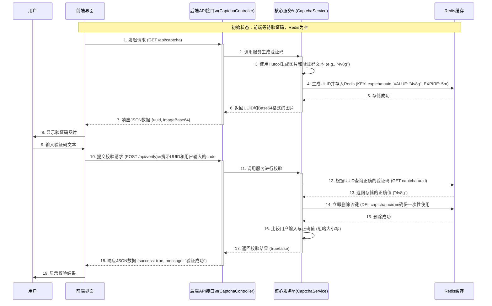

# 图形验证码组件

## 构建企业级图形验证码服务：从设计到实践

在现代Web应用中，验证码是抵御机器人恶意攻击（如自动注册、密码爆破、论坛灌水）的第一道防线。本文将深入探讨如何使用 Java 技术栈，结合业界流行的工具库，构建一个功能完备、安全可靠的图形验证码后端服务。我们将采用 **Spring Boot** 作为基础框架，**Hutool** 工具包快速生成验证码，并利用 **Redis** 作为高性能的临时存储介质。

### 核心设计理念与工作流程

在设计验证码系统时，我们的核心目标是：**验证码的生成和校验逻辑必须完全由后端控制，前端只负责展示和用户输入。** 这样可以最大限度地保证安全性，因为验证码的正确答案从未在客户端暴露。

我们设计的流程遵循了无状态（Stateless）的思想，服务器本身不保存任何与验证码相关的会话信息，而是将其委托给外部的 Redis 服务。这样做的好处是，我们的后端服务可以轻松地进行水平扩展，而不会因为会话同步问题而变得复杂。

下面是整个验证码生命周期的工作流程图，清晰地展示了从生成到校验的每一步交互：



### 1. 项目基础：依赖与配置

一个稳固的地基是万丈高楼的开始。我们首先通过 Maven 来管理项目所需的依赖。

#### 1.1 Maven 依赖 (`pom.xml`)

在 `pom.xml` 文件中，我们引入了几个核心依赖，每一个都有其明确的职责：

- **`spring-boot-starter-web`**: 这是构建Web应用的基础，提供了内嵌的Tomcat服务器和Spring MVC框架，让我们能够轻松创建RESTful API。
- **`spring-boot-starter-data-redis`**: 该依赖集成了Spring对Redis的支持，通过它，我们可以像操作普通Java对象一样方便地与Redis进行交互，屏蔽了底层的复杂性。
- **`hutool-all`**: Hutool是一个功能强大的Java工具包，它极大地简化了我们的开发工作。在这里，我们主要使用它的 `captcha` 模块来生成各种样式的验证码，无需我们手动去实现复杂的图像处理逻辑。
- **`lombok`**: 一个能通过注解自动生成构造函数、Getter/Setter、`toString`等样板代码的库，让我们的代码更加简洁、易读。

```xml
<!-- pom.xml -->
<dependencies>
    <!-- Spring Web 核心, 用于构建API -->
    <dependency>
        <groupId>org.springframework.boot</groupId>
        <artifactId>spring-boot-starter-web</artifactId>
    </dependency>

    <!-- Spring Data Redis 依赖, 用于集成Redis -->
    <dependency>
        <groupId>org.springframework.boot</groupId>
        <artifactId>spring-boot-starter-data-redis</artifactId>
    </dependency>

    <!-- Hutool 工具包, 我们用它来生成验证码 -->
    <dependency>
        <groupId>cn.hutool</groupId>
        <artifactId>hutool-all</artifactId>
        <version>5.8.9</version>
    </dependency>

    <!-- Lombok, 减少样板代码 -->
    <dependency>
        <groupId>org.projectlombok</groupId>
        <artifactId>lombok</artifactId>
        <optional>true</optional>
    </dependency>
</dependencies>
```

#### 1.2 应用配置 (`application.properties`)

此文件用于配置应用的外部化参数，主要是数据库、缓存等中间件的连接信息。将配置与代码分离是一个良好的实践，便于在不同环境（开发、测试、生产）中切换。

```properties
# application.properties

# Redis 服务器地址 (应替换为您的实际地址)
spring.redis.host=localhost
# Redis 服务器端口
spring.redis.port=6379
# Redis 数据库索引（默认为0），可以使用不同库隔离数据
spring.redis.database=0
# 如果您的 Redis 设置了密码，请配置此项
# spring.redis.password=your_password
```

### 2. 后端代码实现：分层与职责

我们遵循经典的三层架构模式（Controller, Service, VO），使代码结构清晰，职责分明，易于维护和扩展。

#### 2.1 数据传输对象 (`CaptchaVo.java`)

VO（Value Object）的作用是作为后端与前端之间的数据契约。定义一个清晰的VO，可以避免直接暴露内部领域模型，同时让前端开发者能准确地知道API会返回什么样的数据结构。

```java
package com.example.captchademo.vo;

import lombok.Data;

/**
 * 验证码视图对象 (Captcha Value Object)
 * 这个类是专门为前端展示而设计的，它封装了前端需要的所有信息，
 * 既不多也不少，实现了前后端的解耦。
 */
@Data
public class CaptchaVo {

    /**
     * 验证码的唯一标识符 (UUID)。
     * 这是一个临时凭证，前端在校验时需要回传此值，
     * 后端用它来从Redis中找到对应的正确答案。
     */
    private String uuid;

    /**
     * Base64编码的验证码图片。
     * 采用Base64编码的好处是，图片数据可以直接嵌入到JSON中返回，
     * 前端无需再次发起HTTP请求去获取图片资源，减少了网络开销，提升了加载速度。
     * 格式为: "data:image/png;base64,..."
     */
    private String imageBase64;
}
```

#### 2.2 核心服务层 (`CaptchaService.java`)

Service层是业务逻辑的核心，它负责处理所有与验证码相关的复杂操作，而不关心这些操作是如何被触发的（例如通过HTTP请求还是定时任务）。

```java
package com.example.captchademo.service;

import cn.hutool.captcha.CaptchaUtil;
import cn.hutool.captcha.ShearCaptcha;
import cn.hutool.core.lang.UUID;
import com.example.captchademo.vo.CaptchaVo;
import org.springframework.beans.factory.annotation.Autowired;
import org.springframework.data.redis.core.StringRedisTemplate;
import org.springframework.stereotype.Service;
import org.springframework.util.StringUtils;
import java.util.concurrent.TimeUnit;

@Service
public class CaptchaService {

    @Autowired
    private StringRedisTemplate redisTemplate;

    // 定义一个统一的Redis键前缀，便于管理和识别，避免键冲突
    private static final String REDIS_CAPTCHA_PREFIX = "captcha:";

    /**
     * 创建并存储验证码的核心方法。
     * @return CaptchaVo 包含UUID和Base64图片的数据对象
     */
    public CaptchaVo createCaptcha() {
        // 1. 使用Hutool的CaptchaUtil快速创建一个扭曲效果的图形验证码。
        // 参数依次为：图片宽度、高度、验证码字符数、干扰线宽度。
        // Hutool还支持线段、圆形等多种干扰类型，可以根据需求选择。
        ShearCaptcha captcha = CaptchaUtil.createShearCaptcha(200, 100, 4, 4);
        String captchaCode = captcha.getCode(); // 获取生成的验证码文本，例如 "4v8g"

        // 2. 生成一个不带连字符的UUID，作为此次验证码会话的唯一标识。
        String uuid = UUID.randomUUID().toString(true);
        String redisKey = REDIS_CAPTCHA_PREFIX + uuid;

        // 3. 将验证码存入Redis。这是关键一步：
        //    - KEY: "captcha:" + uuid
        //    - VALUE: 验证码的正确文本 (captchaCode)
        //    - EXPIRATION: 设置5分钟的过期时间。
        //      设置过期时间至关重要，可以自动清理过期的验证码，防止Redis内存被无效数据占满，
        //      同时也提升了安全性，因为一个验证码在短时间内就会失效。
        redisTemplate.opsForValue().set(redisKey, captchaCode, 5, TimeUnit.MINUTES);

        // 4. 组装VO对象，准备返回给前端
        CaptchaVo captchaVo = new CaptchaVo();
        captchaVo.setUuid(uuid);
        captchaVo.setImageBase64(captcha.getImageBase64()); // Hutool已处理好Base64编码

        return captchaVo;
    }

    /**
     * 校验验证码的正确性。
     * @param uuid 唯一标识
     * @param userCode 用户从前端输入的验证码
     * @return true - 成功, false - 失败
     */
    public boolean verifyCaptcha(String uuid, String userCode) {
        if (!StringUtils.hasText(uuid) || !StringUtils.hasText(userCode)) {
            return false; // 基本的参数校验
        }

        String redisKey = REDIS_CAPTCHA_PREFIX + uuid;
        String correctCode = redisTemplate.opsForValue().get(redisKey);

        // 安全设计核心：无论校验成功与否，立即从Redis中删除该验证码。
        // 这确保了每个验证码只能被尝试校验一次，有效防止了攻击者通过同一个UUID进行多次暴力破解。
        if (correctCode != null) {
            redisTemplate.delete(redisKey);
        }

        // 使用equalsIgnoreCase进行比较，可以提升用户体验，因为用户输入时可能不会注意大小写。
        return userCode.equalsIgnoreCase(correctCode);
    }
}
```

#### 2.3 控制器层 (`CaptchaController.java`)

Controller层是应用的入口，它负责接收外部的HTTP请求，解析参数，调用Service层处理业务逻辑，最后将Service返回的结果封装成统一的格式（通常是JSON）响应给客户端。

```java
package com.example.captchademo.controller;

import com.example.captchademo.service.CaptchaService;
import com.example.captchademo.vo.CaptchaVo;
import org.springframework.beans.factory.annotation.Autowired;
import org.springframework.web.bind.annotation.*;
import java.util.HashMap;
import java.util.Map;

@RestController
@RequestMapping("/api") // 为所有接口定义一个统一的路径前缀
public class CaptchaController {

    @Autowired
    private CaptchaService captchaService;

    /**
     * 获取验证码的API接口。
     * 使用GET方法，符合RESTful风格中获取资源的操作。
     * @return 返回一个包含UUID和Base64图片的JSON对象。
     */
    @GetMapping("/captcha")
    public CaptchaVo getCaptcha() {
        return captchaService.createCaptcha();
    }

    /**
     * 校验验证码的API接口。
     * 使用POST方法，因为此操作会改变服务器状态（删除Redis中的键），且通常伴随表单提交。
     * @param uuid 验证码的唯一标识，由前端在获取验证码时保存并回传。
     * @param code 用户输入的验证码文本。
     * @return 返回一个包含校验结果的JSON对象。
     */
    @PostMapping("/verify")
    public Map<String, Object> verifyCaptcha(
            @RequestParam("uuid") String uuid,
            @RequestParam("code") String code) {
        
        boolean success = captchaService.verifyCaptcha(uuid, code);

        // 封装一个通用的Map作为返回结果，清晰地告知前端操作是否成功以及相关信息。
        Map<String, Object> result = new HashMap<>();
        result.put("success", success);
        result.put("message", success ? "验证成功" : "验证码错误或已失效");

        return result;
    }
}
```

### 总结

通过以上步骤，我们成功构建了一个健壮且高效的Java验证码服务。该方案的优势在于：

1. **高安全性**：验证码答案全程存储在服务端Redis中，且“一次性使用”的设计杜绝了暴力破解的可能。
2. **高性能与可扩展性**：利用Redis作为高速缓存，读写性能远超传统数据库。无状态的服务设计使得后端应用可以轻松部署多个实例，通过负载均衡来应对高并发场景。
3. **高内聚低耦合**：清晰的分层架构使得各部分职责明确，易于维护和单元测试。前后端通过定义好的API和VO进行交互，实现了有效解耦。
4. **开发效率高**：借助Spring Boot和Hutool等成熟框架，我们无需关心底层细节，可以将精力集中在业务逻辑上，快速完成开发。

这套架构不仅适用于验证码功能，其设计思想（如无状态服务、缓存利用、分层设计）也可以广泛应用于Web应用的其他模块中。