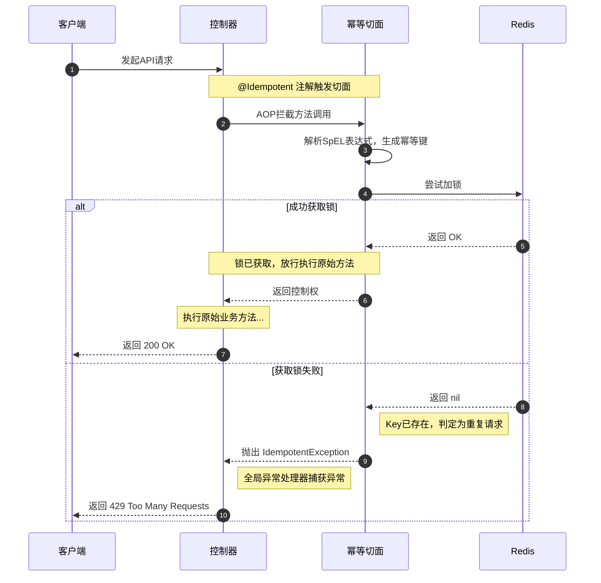

# 基于 Spring AOP + Redis 的通用幂等组件文档

## 1. 概述

在现代的分布式系统和微服务架构中，网络延迟、客户端重试等因素可能导致同一个请求被多次发送。如果接口不具备幂等性，这可能会引发严重问题，例如重复创建订单、重复扣款等。

本组件旨在提供一个**通用、非侵入式**的解决方案，以确保接口的幂等性。它利用 **Spring AOP** 进行切面拦截，并结合 **Redis** 作为外部存储来实现分布式锁，从而高效地防止重复请求。开发者只需在需要幂等保护的 Controller 方法上添加一个简单的注解即可。

### 核心特性

- **注解驱动**: 通过 `@Idempotent` 注解即可启用，对业务代码无侵入。
- **高度灵活**: 使用 **SpEL (Spring Expression Language)** 动态生成幂等键 (Idempotent Key)，可以从请求头、请求体、URL参数等任意位置获取数据。
- **高性能**: 基于 Redis 的 `SETNX` 原子操作，性能高且能保证分布式环境下的正确性。
- **可配置**: 支持自定义幂等键的过期时间、重复请求的提示信息。
- **统一异常处理**: 通过全局异常处理器，将重复请求自动映射为 `HTTP 429 Too Many Requests` 响应，符合 RESTful 风格。

## 2. 架构与原理

本组件的核心思想是：**为每一次唯一的业务操作生成一个全局唯一的标识（幂等键），在业务逻辑执行前，先检查该标识是否存在。如果不存在，则记录该标识并执行业务；如果已存在，则直接拒绝本次请求。**

### 工作流程



1. **客户端** 发送一个请求到被 `@Idempotent` 注解标记的 Controller 方法。
2. **`IdempotentAspect` 切面** 在方法执行前进行拦截。
3. 切面根据 `@Idempotent` 注解中定义的 `key()` 属性（一个SpEL表达式），从当前请求的上下文（如方法参数、请求头）中解析出具体的幂等键字符串。
4. 切面尝试使用 Redis 的 `SET...NX` (SET if Not eXists) 命令将这个幂等键写入 Redis，并设置一个指定的过期时间。这是一个**原子操作**。
5. **如果设置成功**：说明这是第一次请求。切面会继续执行原始的 Controller 方法。业务逻辑处理完毕后，正常返回。
6. **如果设置失败**：说明在过期时间内，该幂等键已存在于 Redis 中，判定为重复请求。切面会立即抛出 `IdempotentException` 异常，阻止业务方法的执行。
7. **`GlobalExceptionHandler`** 会捕获到 `IdempotentException`，并向客户端返回一个 `HTTP 429` 状态码和自定义的错误信息。

## 3. 快速开始

### 步骤 1: 添加 Maven 依赖

在您的 `pom.xml` 文件中，确保包含以下依赖项：

```xml
<dependencies>
    <!-- Web, AOP, Redis 是核心依赖 -->
    <dependency>
        <groupId>org.springframework.boot</groupId>
        <artifactId>spring-boot-starter-web</artifactId>
    </dependency>
    <dependency>
        <groupId>org.springframework.boot</groupId>
        <artifactId>spring-boot-starter-aop</artifactId>
    </dependency>
    <dependency>
        <groupId>org.springframework.boot</groupId>
        <artifactId>spring-boot-starter-data-redis</artifactId>
    </dependency>
    
    <!-- SpEL表达式解析需要 -->
    <dependency>
        <groupId>org.springframework.boot</groupId>
        <artifactId>spring-boot-starter-validation</artifactId>
    </dependency>

    <!-- Lombok 用于简化代码 -->
    <dependency>
        <groupId>org.projectlombok</groupId>
        <artifactId>lombok</artifactId>
        <optional>true</optional>
    </dependency>
</dependencies>
```

### 步骤 2: 配置文件扫描

确保您的 Spring Boot 主启动类能够扫描到本组件的所有类（`com.example.idempotent.*`）。通常，如果它们在主启动类的子包下，会自动扫描。

### 步骤 3: 配置 Redis

在 `application.properties` 或 `application.yml` 中配置 Redis 连接信息。

```properties
# Redis 配置
spring.redis.host=localhost
spring.redis.port=6379
# spring.redis.password=
# spring.redis.database=0
```

## 4. 使用指南

使用本组件非常简单，只需在需要幂等保护的 Controller 方法上添加 `@Idempotent` 注解并配置其属性。

### `@Idempotent` 注解属性详解

| 属性         | 类型       | 描述                                                         | 默认值                 | 是否必填 |
| ------------ | ---------- | ------------------------------------------------------------ | ---------------------- | -------- |
| `key`        | `String`   | **核心属性**。用于生成幂等键的SpEL表达式。                   | 无                     | **是**   |
| `expireTime` | `long`     | 幂等键在Redis中的存活时间。超过这个时间，同样的请求将被视为新请求。 | `1`                    | 否       |
| `timeUnit`   | `TimeUnit` | `expireTime` 的时间单位。                                    | `TimeUnit.SECONDS`     | 否       |
| `message`    | `String`   | 当发生重复请求时，返回给客户端的提示信息。                   | "重复请求，请稍后再试" | 否       |

### SpEL 表达式指南

SpEL 表达式是实现动态幂等键的关键。在切面中，我们为表达式提供了以下可用变量：

- **方法参数名**: 你可以直接通过 `#参数名` 来访问方法的参数。例如，如果方法签名是 `createOrder(@RequestBody OrderRequest request)`，你可以使用 `#request` 来访问整个 `OrderRequest` 对象。
- **`#args`**: 这是一个数组，包含了方法的所有参数，你可以通过索引访问，如 `#args[0]`。

### 使用示例

#### 示例 1: 使用请求体中的字段作为幂等键

假设前端在创建订单时会生成一个唯一的 `orderId`。我们可以用它作为幂等键。

```java
@PostMapping("/create-order")
@Idempotent(key = "#request.orderId", expireTime = 10, timeUnit = TimeUnit.SECONDS, message = "订单正在创建中，请勿重复提交")
public String createOrder(@RequestBody OrderRequest request) {
    // ... 业务逻辑 ...
    return "订单创建成功: " + request.getOrderId();
}
```

- **`key = "#request.orderId"`**: 表达式从名为 `request` 的参数（即 `OrderRequest` 对象）中获取 `orderId` 属性的值。
- **`expireTime = 10`**: 10秒内，所有 `orderId` 相同的请求都将被拦截。

#### 示例 2: 组合多个字段作为幂等键

当单个字段无法保证唯一性时，可以组合多个字段。

```java
@PostMapping("/update-order")
@Idempotent(key = "#request.userId + ':' + #request.orderId", expireTime = 5)
public String updateOrder(@RequestBody OrderRequest request) {
    // ... 业务逻辑 ...
    return "订单更新成功";
}
```

- **`key = "#request.userId + ':' + #request.orderId"`**: 表达式将用户的ID和订单ID用冒号拼接起来，形成一个更唯一的键，例如 `"1001:order123"`。

#### 示例 3: 使用请求头中的字段作为幂等键

对于支付等敏感操作，通常建议客户端生成一个唯一的请求ID（如 `UUID`）并通过请求头传递。

```java
@PostMapping("/pay")
@Idempotent(key = "#requestId", message = "支付请求处理中，请勿重复操作")
public String pay(@RequestHeader("X-Request-ID") String requestId, @RequestBody OrderRequest request) {
    // ... 业务逻辑 ...
    return "支付成功，请求ID: " + requestId;
}
```

- **`@RequestHeader("X-Request-ID") String requestId`**: Spring MVC 将请求头 `X-Request-ID` 的值注入到 `requestId` 参数中。
- **`key = "#requestId"`**: SpEL表达式直接使用了方法参数 `requestId` 的值作为幂等键。

## 5. 组件代码解析

- **`Idempotent.java`**: 定义了 `@Idempotent` 注解及其属性，是整个组件的用户入口。
- **`IdempotentAspect.java`**: 核心逻辑实现。
  - 使用 `@Around` 通知拦截所有标记了 `@Idempotent` 的方法。
  - `parseSpelKey` 方法负责解析 SpEL 表达式，它创建了一个 `StandardEvaluationContext`，并将方法的参数注入其中，使得表达式可以访问这些参数。
  - `stringRedisTemplate.opsForValue().setIfAbsent(...)` 是实现幂等性检查的关键，它是一个原子操作。
- **`IdempotentException.java`**: 一个简单的自定义运行时异常，用于在检测到重复请求时中断程序流程。
- **`GlobalExceptionHandler.java`**: 使用 `@RestControllerAdvice` 定义的全局异常处理器。它专门捕获 `IdempotentException`，并构造一个标准的 `HTTP 429` 响应，实现了错误处理与业务逻辑的解耦。