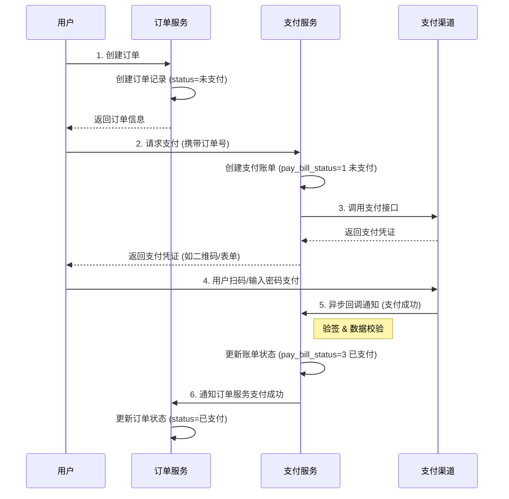

# easypass支付系统综合设计详解

在现代微服务架构中，支付功能通常被抽象成一个独立的、高内聚的支付服务。该服务统一对接并管理如支付宝、微信支付等多种第三方支付渠道。当业务方的其他服务（如订单服务、用户服务）需要发起支付时，它们不再直接与第三方渠道交互，而是调用这个统一的支付服务。这种设计不仅实现了支付能力的复用，也隔离了业务逻辑与复杂的支付渠道细节，使得整个系统更加清晰和易于维护。

然而，构建一个稳定可靠的支付服务并非易事，它需要周全地考虑各种业务细节和异常场景。本文将深入探讨构建这样一个支付服务的三个核心方面：

1. **支付渠道策略的初始化**：如何优雅地管理多个支付渠道，并保证系统具有良好的扩展性。
2. **整体支付流程**：一个完整的支付流程是怎样的，如何处理各种正常和异常情况以确保交易的顺利进行。
3. **对账功能的重要性**：为什么对账是支付服务中不可或缺的一环，它如何保障资金安全和财务准确性。

## 一、 支付渠道策略的初始化与设计

在电商或在线服务平台中，为了满足不同用户的使用习惯，系统往往需要支持多种支付方式，如支付宝、微信支付、银联等。如果每增加一个支付渠道，我们都在代码中增加一连串的 `if-else` 判断，代码将变得臃肿、难以维护，并且严重违反了“开闭原则”。

为了解决这个问题，我们可以引入设计模式中的**策略模式（Strategy Pattern）**。策略模式的核心思想是定义一系列算法，将每一个算法封装起来，并使它们可以相互替换。这样做的好处是，算法的变化不会影响到使用算法的客户端。在支付场景中，每一种支付渠道（支付宝、微信）都可以被看作一个独立的“策略”。

### 1.1 支付策略的顶层抽象

首先，我们需要定义一个所有支付策略都必须遵守的契约，也就是一个顶层的接口。这个接口统一了所有支付渠道需要实现的核心功能。

**`com.easypass.pay.PayStrategyHandler` 接口**

```java
/**
 * 支付策略处理器顶级接口
 * 定义了所有支付渠道必须实现的通用方法
 */
public interface PayStrategyHandler {
    /**
     * 发起支付
     * @param outTradeNo 订单号 (我们系统自己的订单号)
     * @param price 支付价格
     * @param subject 订单标题
     * @param notifyUrl 异步回调通知地址
     * @param returnUrl 支付成功后同步跳转的地址
     * @return PayResult 包含支付所需信息（如form表单、URL等）的结果对象
     */
    PayResult pay(String outTradeNo, BigDecimal price, String subject, String notifyUrl, String returnUrl);

    /**
     * 验证签名
     * 用于验证支付渠道异步回调通知的合法性，防止伪造请求
     * @param params 从支付渠道回调请求中获取的所有参数
     * @return boolean 签名是否有效
     */
    boolean signVerify(Map<String, String> params);

    /**
     * 业务数据验证
     * 在验签通过后，进一步核对回调数据与我们系统内部的账单数据是否一致
     * @param params 回调参数
     * @param payBill 内部支付账单
     * @return boolean 数据是否一致
     */
    boolean dataVerify(Map<String, String> params, PayBill payBill);

    /**
     * 主动查询交易状态
     * 用于在特定场景下（如回调延迟）主动向支付渠道查询某笔订单的支付状态
     * @param outTradeNo 订单号
     * @return TradeResult 包含交易状态等信息的结果对象
     */
    TradeResult queryTrade(String outTradeNo);

    /**
     * 获取当前策略对应的支付渠道标识
     * @return String 渠道标识 (例如: "alipay", "wx")
     */
    String getChannel();
}
```

### 1.2 支付渠道的管理

为了清晰地管理所有支持的支付渠道，我们使用一个枚举类。这样做的好处是类型安全，并且能将渠道相关的信息（如编码、标识符）集中管理。

**`com.easypass.enums.PayChannel` 枚举**

```java
public enum PayChannel {
    /**
     * 支付渠道枚举
     */
    ALIPAY(1, "alipay", "支付宝"),
    WX(2, "wx", "微信"),
    ;

    private Integer code;
    private String value; // 策略上下文中使用的key
    private String msg;

    PayChannel(Integer code, String value, String msg) {
        this.code = code;
        this.value = value;
        this.msg = msg;
    }
    // getters and setters...
}
```

### 1.3 支付宝策略的具体实现

接下来，我们以支付宝为例，展示如何实现 `PayStrategyHandler` 接口。

**`com.easypass.pay.alipay.AlipayStrategyHandler` 类**

```java
@Slf4j
@AllArgsConstructor
public class AlipayStrategyHandler implements PayStrategyHandler {

    // 支付宝官方SDK客户端
    private final AlipayClient alipayClient;
    // 封装了支付宝相关配置，如appId, privateKey等
    private final AlipayProperties aliPayProperties;

    @Override
    public PayResult pay(String outTradeNo, BigDecimal price, String subject, String notifyUrl, String returnUrl) {
        try {
            // 1. 创建支付请求对象
            AlipayTradePagePayRequest request = new AlipayTradePagePayRequest();
            request.setNotifyUrl(notifyUrl); // 设置异步回调地址
            request.setReturnUrl(returnUrl); // 设置同步跳转地址

            // 2. 构造业务请求参数
            JSONObject bizContent = new JSONObject();
            bizContent.put("out_trade_no", outTradeNo);
            bizContent.put("total_amount", price);
            bizContent.put("subject", subject);
            bizContent.put("product_code", "FAST_INSTANT_TRADE_PAY"); // PC场景固定值
            request.setBizContent(bizContent.toString());

            // 3. 调用SDK生成支付表单
            AlipayTradePagePayResponse response = alipayClient.pageExecute(request, "POST");
            return new PayResult(response.isSuccess(), response.getBody());
        } catch (Exception e) {
           log.error("alipay pay error", e);
           throw new easypassFrameException(BaseCode.PAY_ERROR);
        }
    }

    @Override
    public boolean signVerify(final Map<String, String> params) {
        try {
            // 调用支付宝SDK的验签方法
            return AlipaySignature.rsaCheckV1(
                    params,
                    aliPayProperties.getAlipayPublicKey(),
                    AlipayConstants.CHARSET_UTF8,
                    AlipayConstants.SIGN_TYPE_RSA2);
        } catch (Exception e) {
            log.error("alipay sign verify error", e);
            return false;
        }
    }

    @Override
    public boolean dataVerify(final Map<String, String> params, PayBill payBill) {
        // 1. 校验订单金额是否一致
        BigDecimal notifyPayAmount = new BigDecimal(params.get("total_amount"));
        if (notifyPayAmount.compareTo(payBill.getPayAmount()) != 0) {
            log.error("回调金额和账单支付金额不一致 回调金额 : {}, 账单支付金额 : {}", notifyPayAmount, payBill.getPayAmount());
            return false;
        }
        // 2. 校验收款方ID (seller_id) 是否正确
        String notifySellerId = params.get("seller_id");
        if (!notifySellerId.equals(aliPayProperties.getSellerId())) {
            log.error("回调商户pid和已配置商户pid不一致 回调商户pid : {}, 已配置商户pid : {}", notifySellerId, aliPayProperties.getSellerId());
            return false;
        }
        // 3. 校验应用ID (app_id) 是否为商户本身
        String notifyAppId = params.get("app_id");
        if(!notifyAppId.equals(aliPayProperties.getAppId())){
            log.error("回调appId和已配置appId不一致 回调appId : {}, 已配置appId : {}", notifyAppId, aliPayProperties.getAppId());
            return false;
        }
        // 4. 校验交易状态是否为“支付成功”
        String tradeStatus = params.get("trade_status");
        if(!AlipayTradeStatus.TRADE_SUCCESS.getValue().equals(tradeStatus)){
            log.error("支付未成功 tradeStatus : {}", tradeStatus);
            return false;
        }
        return true;
    }

    @Override
    public TradeResult queryTrade(String outTradeNo) {
        // ... 主动查询逻辑，调用alipayClient.execute(request) ...
        // 省略具体实现细节
        return new TradeResult();
    }

    @Override
    public String getChannel() {
        return PayChannel.ALIPAY.getValue();
    }
    
    // ... 其他辅助方法，如状态转换等 ...
}
```

### 1.4 支付策略的自动加载与管理

我们已经定义了策略接口和具体实现，但系统如何在启动时知道有哪些策略可用，并在需要时获取正确的策略呢？这通过一个初始化处理器和一个策略上下文管理器来实现。

**初始化处理器 `PayStrategyInitHandler`**

这个类负责在Spring Boot应用启动后，扫描所有 `PayStrategyHandler` 接口的实现类，并将它们注册到一个统一的管理器中。

```java
@AllArgsConstructor
public class PayStrategyInitHandler extends AbstractApplicationInitializingBeanHandler {

    private final PayStrategyContext payStrategyContext;

    @Override
    public Integer executeOrder() {
        return 1; // 确保在应用启动早期执行
    }

    @Override
    public void executeInit(ConfigurableApplicationContext context) {
        // 1. 从Spring容器中获取所有PayStrategyHandler类型的Bean
        Map<String, PayStrategyHandler> payStrategyHandlerMap = context.getBeansOfType(PayStrategyHandler.class);
        
        // 2. 遍历这些Bean，并将它们放入策略上下文中
        for (Map.Entry<String, PayStrategyHandler> entry : payStrategyHandlerMap.entrySet()) {
            PayStrategyHandler payStrategyHandler = entry.getValue();
            // 使用渠道标识作为key，策略实例作为value
            payStrategyContext.put(payStrategyHandler.getChannel(), payStrategyHandler);
        }
    }
}
```

**策略上下文管理器 `PayStrategyContext`**

这个类像一个工厂，它持有一个Map，存储了所有支付渠道和其对应策略的映射关系。当需要使用某个渠道支付时，只需从这个上下文中根据渠道标识获取即可。

```java
public class PayStrategyContext {
    
    private final Map<String, PayStrategyHandler> payStrategyHandlerMap = new HashMap<>();
    
    public void put(String channel, PayStrategyHandler payStrategyHandler){
        payStrategyHandlerMap.put(channel, payStrategyHandler);
    }
    
    public PayStrategyHandler get(String channel){
        // 根据渠道标识获取对应的策略
        return Optional.ofNullable(payStrategyHandlerMap.get(channel)).orElseThrow(
                () -> new easypassFrameException(BaseCode.PAY_STRATEGY_NOT_EXIST));
    }
}
```

通过以上设计，我们的支付服务变得极具弹性。未来如果需要接入新的支付渠道（例如银联支付），我们只需要：

1. 在 `PayChannel` 枚举中添加新的渠道。
2. 创建一个新的策略类实现 `PayStrategyHandler` 接口，封装新渠道的SDK和逻辑。
3. 无需修改任何现有代码，系统启动时会自动发现并注册这个新策略。

这种方式极大地提高了代码的可维护性和扩展性。

## 二、 整体支付流程详解

一个完整的支付流程不仅仅是调用支付接口那么简单，它涉及到用户、业务系统、支付服务和第三方支付渠道之间的多次交互。为了保证数据的一致性和用户体验，我们需要设计一个健壮的流程来处理各种情况。

### 2.1 核心支付流程图

下面是用户从下单到支付成功的核心流程：


### 2.2 双重确认机制：主动查询与异步回调

从上图可以看出，在用户支付成功后，我们有两种方式来确认支付结果：

1. **同步跳转与主动查询（第7、8步）**：用户在支付宝/微信页面支付成功后，会被重定向（`returnUrl`）到我们预设的成功页面。此时，前端页面可以立即携带订单号向后端发起一个**主动查询**请求，后端再调用支付策略的 `queryTrade` 方法去第三方渠道确认这笔订单的真实状态。
   - **好处**：这种方式响应速度快，能立刻给用户一个明确的支付成功反馈，提升用户体验。同时，它也是异步回调失败或延迟时的一个重要补充和保障。
2. **异步回调通知（第6步）**：在用户支付成功后，第三方支付渠道的服务器会主动向我们预设的通知地址（`notifyUrl`）发送一个HTTP请求，告知我们支付结果。这是**最可靠**的支付成功凭证。我们的服务在收到通知后，必须进行严格的**验签**和**数据校验**，确认无误后，才更新内部的订单和账单状态。
   - **好处**：由支付渠道主动发起，不受用户行为（如提前关闭页面）的影响，是保证数据最终一致性的核心机制。

在实际项目中，这两种方式是**同时存在、互为补充**的。由于网络延迟等原因，主动查询和异步回调的到达顺序是不确定的。因此，我们的更新逻辑必须是**幂等**的：无论哪个先到，都只更新一次订单状态（从未支付到已支付）。通常我们通过判断订单当前状态来实现，如果订单已经是“已支付”，则后续的更新操作直接跳过。

### 2.3 处理极端场景：订单超时与支付成功冲突

我们需要考虑一个虽然不常见但可能发生的极端情况：

> 用户在订单即将因超时而自动关闭的瞬间点击了支付，并跳转到了支付页面。此时，后端的定时任务关闭了该订单。但用户并未察觉，继续在支付页面完成了支付。

这时，支付渠道会通知我们支付成功，但我们系统内的订单已经是“已关闭”状态。如果处理不当，用户付了钱却没有得到商品或服务，会导致严重的客诉。

**解决方案**： 在这种场景下，当我们的支付服务收到支付成功的回调（或主动查询到成功状态）时，首先会去检查内部订单的状态。如果发现订单状态是“已关闭”或“已取消”，系统不应该再尝试将其置为“已支付”，而是应该**立即触发自动退款流程**，将款项原路退还给用户，并给予用户适当的提示（如短信、App推送等），告知其订单已关闭，支付款项将自动退还。

这样做可以形成一个业务逻辑的闭环，优雅地处理了这种冲突，保障了资金安全和用户体验。

## 三、 对账功能：支付服务的“安全网”

即使我们设计了完美的支付流程，但在复杂的网络环境和分布式系统中，数据不一致的风险依然存在（例如，网络抖动导致回调通知丢失、数据库事务在某个环节失败等）。为了发现并修正这些潜在的差错，**对账**功能变得至关重要。

对账的核心是**比对**。我们把自己系统里的账（支付账单表）和从支付渠道下载的账（如支付宝、微信的日度/月度交易账单）进行核对，确保每一笔交易在两边都是一致的。

### 3.1 为什么必须有支付账单表？

支付账单表（`d_pay_bill`）是实现对账功能的数据基石，也是支付服务的核心。它的存在有以下几个关键好处：

1. **交易数据的完整记录**：账单表是系统内部所有支付行为的“总账本”，详细记录了每一笔交易的支付流水号、商户订单号、支付渠道、金额、状态等关键信息。这为后续的查询、统计和对账提供了唯一且可靠的数据源。
2. **支持多渠道统一管理**：无论交易来自支付宝还是微信，都会在账单表中生成一条格式统一的记录。这使得我们可以用一套统一的逻辑来处理和分析来自不同渠道的交易数据。
3. **对账和财务审计的基础**：这是账单表最重要的作用。财务人员可以定期将账单表数据导出，与支付渠道提供的对账文件进行比对，快速发现差异（如我方有记录对方没有、对方有记录我方没有、金额不一致等），并进行相应的处理（如补单、冲正）。
4. **满足法律与合规要求**：根据相关法规，电子商务交易记录需要被妥善保存以备核查。账单表正是这些记录的载体。

### 3.2 支付账单表设计

一个典型的支付账单表结构如下：

```sql
CREATE TABLE `d_pay_bill` (
  `id` bigint(20) NOT NULL COMMENT '主键id',
  `pay_number` varchar(64) DEFAULT NULL COMMENT '支付流水号 (支付服务内部生成的唯一标识)',
  `out_order_no` varchar(64) NOT NULL COMMENT '商户订单号 (业务方订单号)',
  `pay_channel` varchar(64) DEFAULT NULL COMMENT '支付渠道 (如: alipay, wx)',
  `pay_scene` varchar(64) DEFAULT NULL COMMENT '支付场景 (如: PC, APP)',
  `subject` varchar(512) DEFAULT NULL COMMENT '订单标题',
  `trade_number` varchar(256) DEFAULT NULL COMMENT '三方交易凭证号 (支付宝/微信的交易号)',
  `pay_amount` decimal(10,2) NOT NULL COMMENT '支付金额 (单位:元)',
  `pay_bill_type` int(11) NOT NULL COMMENT '支付种类 详细见枚举 PayBillType',
  `pay_bill_status` int(11) NOT NULL DEFAULT '1' COMMENT '账单支付状态 详细见枚举 PayBillStatus',
  `pay_time` datetime DEFAULT NULL COMMENT '支付成功时间',
  `create_time` datetime NOT NULL COMMENT '创建时间',
  `edit_time` datetime NOT NULL COMMENT '修改时间',
  `status` tinyint(1) NOT NULL DEFAULT '1' COMMENT '逻辑删除状态 1：未删除 0：删除',
  PRIMARY KEY (`id`),
  UNIQUE KEY `d_pay_bill_out_order_no_IDX` (`out_order_no`) USING BTREE
) ENGINE=InnoDB DEFAULT CHARSET=utf8mb4 COMMENT='支付账单表';
```

其中，`pay_bill_status` 字段尤为重要，它通过枚举来管理账单的生命周期。

**`PayBillStatus` 枚举**

```java
public enum PayBillStatus {
    /**
     * 支付账单状态
     */
    NO_PAY(1, "未支付"),
    CANCEL(2, "已取消"), // 用户主动取消或订单超时关闭
    PAY(3, "已支付"),
    REFUND(4, "已退单");

    private Integer code;
    private String msg;
    // ...
}
```

### 3.3 支付流程中账单状态的流转

结合整体支付流程，我们可以用一个序列图来更清晰地展示账单状态是如何变化的。



### 3.4 账单详情查询

支付服务必须提供接口，以便于其他服务或后台管理系统根据订单号查询支付详情。

**`com.easypass.controller.PayController#detail`**

```java
@ApiOperation(value = "账单详情查询")
@PostMapping(value = "/detail")
public ApiResponse<PayBillVo> detail(@Valid @RequestBody PayBillDto payBillDto) {
    // 调用Service层获取账单详情
    return ApiResponse.ok(payService.detail(payBillDto));
}
```

**`com.easypass.service.PayService#detail`**

```j
public PayBillVo detail(PayBillDto payBillDto) {
    PayBillVo payBillVo = new PayBillVo();
    // 使用Wrapper根据业务订单号查询
    LambdaQueryWrapper<PayBill> queryWrapper =
            Wrappers.lambdaQuery(PayBill.class)
                    .eq(PayBill::getOutOrderNo, payBillDto.getOrderNumber());
    PayBill payBill = payBillMapper.selectOne(queryWrapper);
    
    if (Objects.nonNull(payBill)) {
        BeanUtil.copyProperties(payBill, payBillVo);
    }
    return payBillVo;
}
```

通过这个接口，无论是客服处理用户问题，还是财务进行对账，都可以方便地获取到任何一笔交易的详细支付信息，为后续操作提供了数据支持。

## 总结

一个设计精良的支付服务是任何商业系统成功的基石。通过本文的梳理，我们可以总结出构建这样一个服务的几个关键点：

- **采用策略模式**：优雅地管理多个支付渠道，使系统易于扩展和维护。
- **设计双重确认机制**：结合主动查询和异步回调，打造一个响应快速且数据可靠的支付流程。
- **考虑并处理极端场景**：对订单超时等异常情况进行兜底处理，如自动退款，以保障用户体验和资金安全。
- **建立核心账单表**：将账单作为支付数据的唯一事实来源，为精确的财务管理和不可或缺的对账功能提供坚实的基础。

遵循这些原则进行设计和开发，可以帮助我们构建一个既灵活又稳定，能够支撑复杂业务场景的现代化支付服务。