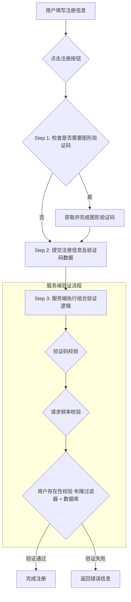
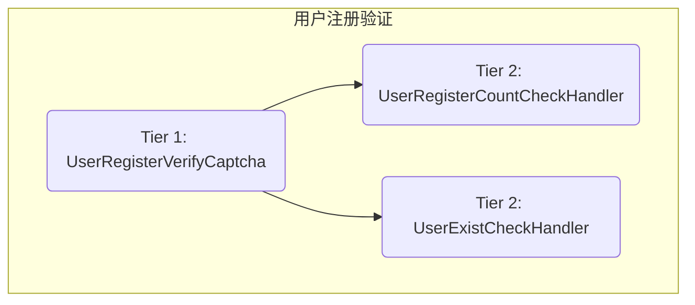
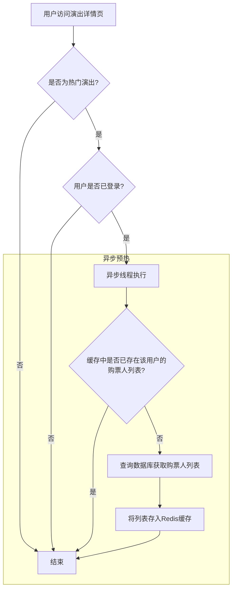

# easypass高并发系统业务与技术深度解析

欢迎阅读 easypass 平台的技术深度解析文档。本文档旨在全面、系统地阐述 easypass 系统在应对高并发场景下的核心业务逻辑、技术架构选型与实现细节。我们将从用户系统的构建、数据安全与隐私保护，到核心购票业务的性能优化，为您揭示一个现代化高并发系统背后的设计哲学与工程实践。

## 第一章：构建稳健的用户中心

用户中心是任何互联网平台的基石。在 easypass 这样需要承载瞬时高并发流量的系统中，用户中心的稳定性和安全性至关重要。本章将深入探讨用户注册、登录、退出等核心流程，以及在高并发下我们如何应对缓存穿透、如何设计复杂的验证逻辑。

### 1.1 用户注册：应对高并发下的严峻挑战

对于普通项目，用户注册可能只是简单的参数校验和数据入库。但在 easypass 的抢票场景下，大量新用户会在短时间内涌入并注册，这对系统构成了巨大挑战，其中最典型的就是 **缓存穿透** 问题。

#### 1.1.1 挑战：缓存穿透的威胁

**缓存穿透** 指的是查询一个缓存和数据库中都不存在的数据。由于新用户注册时，其信息（如手机号）必然不存在于缓存和数据库中，每一次注册请求都会直接访问数据库，导致缓存形同虚设。在抢票高峰期，海量的注册请求会瞬间压垮数据库，引发系统雪崩。

传统的解决方案如“缓存空对象”或“分布式锁”在此场景下并不适用：

- **缓存空对象**：由于每个注册用户都使用自己独一无二的手机号，缓存的空值无法被复用，请求依然会穿透到数据库。
- **分布式锁**：在高并发下，让海量请求排队等待锁释放，会严重影响用户体验和系统吞吐量。

#### 1.1.2 解决方案：多层防御体系

面对这一挑战，我们没有采用单一的技术手段，而是构建了一套“**图形验证码 + 请求数限制 + 布隆过滤器 + 数据库**”的多层纵深防御体系。这套体系旨在层层过滤无效和恶意请求，最大限度地保护后端数据库。



**第一层防御：图形验证码与请求频率控制**

这是抵御机器人攻击和削减流量洪峰的第一道防线。我们并非对所有注册请求都强制使用验证码，而是采用一种更智能的动态策略。

**1. 检查是否需要验证码**

在用户点击注册前，前端会先调用一个接口来判断当前是否需要进行人机验证。这个决策过程是通过 Redis 和 Lua 脚本实现的，以保证其原子性和高性能。

- **为什么用 Lua + Redis？**
  - **原子性**：将多个 Redis 命令（获取计数、比较时间、更新计数）封装在一个 Lua 脚本中，可以保证整个操作的原子性，避免了在分布式环境下的竞态条件。
  - **性能**：减少了客户端与 Redis 服务器之间的网络往返次数，将计算逻辑下推到 Redis 服务端执行，极大地提升了性能。

下面是 `checkNeedCaptcha.lua` 脚本的核心逻辑，它实现了一个基于时间窗口的滑动计数器：

```lua
-- KEYS[1]: 计数器键, KEYS[2]: 时间戳键, KEYS[3]: 本次请求的验证码ID键
-- ARGV[1]: 频率阈值, ARGV[2]: 当前时间戳, ARGV[3]: 验证码ID过期时间, ARGV[4]: 强制开启开关

-- ... (参数定义)

-- 如果强制开启验证码，则直接设置并返回true
if tonumber(ARGV[4]) == 1 then
    redis.call('set', KEYS[3], 'yes')
    redis.call('expire', KEYS[3], tonumber(ARGV[3]))
    return 'true'
end

-- 获取上一次的计数和时间戳
local count = tonumber(redis.call('get', KEYS[1]) or "0")
local lastResetTime = tonumber(redis.call('get', KEYS[2]) or "0")

-- 如果当前时间与上次重置时间超过1秒（时间窗口），则重置计数器
if tonumber(ARGV[2]) - lastResetTime >= 1000 then
    count = 0
    redis.call('set', KEYS[1], count)
    redis.call('set', KEYS[2], tonumber(ARGV[2]))
end

-- 计数器加1
count = count + 1

-- 判断是否超过阈值
if count > tonumber(ARGV[1]) then
    -- 超过阈值，重置计数器，并标记本次请求需要验证
    redis.call('set', KEYS[3], 'yes')
    redis.call('expire', KEYS[3], tonumber(ARGV[3]))
    return 'true'
else
    -- 未超过阈值，更新计数器，并标记本次请求不需要验证
    redis.call('set', KEYS[3], 'no')
    redis.call('expire', KEYS[3], tonumber(ARGV[3]))
    return 'false'
end
```

**2. 获取与校验验证码**

如果上一步返回需要验证，前端则会拉起图形验证码组件，用户完成后，将验证码相关参数（`captchaType`, `pointJson`, `token`）连同业务数据一起提交到后端。

**第二层防御：组合模式构建的复杂验证链**

当注册请求到达服务端后，我们面临的是一系列有顺序、有依赖的复杂校验逻辑。如果使用大量的 `if-else` 语句，代码将变得臃肿、难以维护和扩展。

- **为什么使用组合模式？**
  - **结构清晰**：将每个校验逻辑封装成一个独立的对象，并使用组合模式将这些对象组织成一个树形结构。这使得校验流程、顺序和依赖关系一目了然。
  - **高可扩展性**：当需要新增或修改校验规则时，只需添加或修改相应的校验类，而无需改动主流程代码，符合开闭原则。
  - **逻辑复用**：单个校验逻辑可以被复用在不同的业务场景中。

我们将用户注册的验证逻辑构建了如下的树形结构：



执行顺序为：`UserRegisterVerifyCaptcha` -> `UserRegisterCountCheckHandler` -> `UserExistCheckHandler`。

**1. `UserRegisterVerifyCaptcha`：验证码校验器**

这是验证链的入口。它首先会根据前端传入的 `captchaId` 从 Redis 中获取之前步骤设置的验证标识（`yes` 或 `no`）。

```java
// com.easypass.service.composite.register.UserRegisterVerifyCaptcha
@Component
public class UserRegisterVerifyCaptcha extends AbstractUserRegisterCheckHandler {
    // ... 注入依赖

    @Override
    protected void execute(UserRegisterDto param) {
        // ... 校验两次密码是否一致

        // 根据 captchaId 从 Redis 获取验证标识
        String verifyCaptcha = redisCache.get(RedisKeyBuild.createRedisKey(RedisKeyManage.VERIFY_CAPTCHA_ID, param.getCaptchaId()), String.class);
        if (StringUtil.isEmpty(verifyCaptcha)) {
            throw new easypassFrameException(BaseCode.VERIFY_CAPTCHA_ID_NOT_EXIST);
        }

        // 如果标识为 "yes"，则执行真正的验证码校验逻辑
        if (VerifyCaptcha.YES.getValue().equals(verifyCaptcha)) {
            if (StringUtil.isEmpty(param.getCaptchaType()) || /* ... 其他参数检查 */) {
                // ... 抛出参数缺失异常
            }
            CaptchaVO captchaVO = new CaptchaVO();
            BeanUtils.copyProperties(param, captchaVO);
            // 调用验证码组件进行校验
            ResponseModel responseModel = captchaHandle.checkCaptcha(captchaVO);
            if (!responseModel.isSuccess()) {
                throw new easypassFrameException(responseModel.getRepCode(), responseModel.getRepMsg());
            }
        }
    }
    // ... 定义在组合树中的层级和顺序
}
```

**2. `UserRegisterCountCheckHandler`：本地 JVM 请求数限制器**

即使通过了验证码，我们仍然需要一个最终的保险丝来防止数据库过载。这个校验器使用 JVM 内部的原子类和同步锁实现了一个单机请求频率限制器。

- **为什么不用 Redis 而用本地 JVM 锁？**
  - **极致性能**：这是防止缓存穿透的最后一道防线，性能要求极高。使用本地锁避免了网络I/O开销，执行效率远高于 Redis。
  - **职责分离**：Redis 计数器用于前端流量调度，而本地计数器是后端服务的最后一道闸门，保护数据库。
  - **分布式考量**：虽然是单机限流，但在分布式部署下（如3台实例），它会将总的流量限制（如300 QPS）平分到每台机器（每台100 QPS）。这是一种简单有效的分布式限流策略，可以根据数据库的实际承载能力灵活配置 `request_count_threshold` 参数。

```java
// com.easypass.service.composite.register.UserRegisterCountCheckHandler
@Component
public class UserRegisterCountCheckHandler extends AbstractUserRegisterCheckHandler {
    @Autowired
    private RequestCounter requestCounter;

    @Override
    protected void execute(final UserRegisterDto param) {
        // 调用本地计数器
        boolean result = requestCounter.onRequest();
        if (result) {
            // 如果超过限制，则抛出异常
            throw new easypassFrameException(BaseCode.USER_REGISTER_FREQUENCY);
        }
    }
    // ... 定义在组合树中的层级和顺序
}
```

**3. `UserExistCheckHandler`：用户存在性校验器（布隆过滤器）**

这是处理缓存穿透的核心环节。我们使用布隆过滤器来快速判断一个手机号是否**可能**已经注册。

- **为什么用布隆过滤器？**
  - **空间效率**：相比于将所有已注册手机号存入 Set 或 Redis，布隆过滤器占用的内存空间极小。
  - **查询效率**：查询时间复杂度为 O(k)，k为哈希函数个数，速度极快。
  - **完美契合场景**：布隆过滤器的特点是“判断存在时可能有误判，但判断不存在时绝对准确”。这正是我们需要的：
    - 如果布隆过滤器说**不存在**，我们就可以100%确定该用户未注册，从而避免了查询数据库，有效防止了穿透。
    - 如果布隆过滤器说**存在**，考虑到有误判的可能，我们才需要再去查询一次数据库进行最终确认。

```java
// com.easypass.service.composite.register.UserExistCheckHandler
public void doExist(String mobile){
    // 1. 先通过布隆过滤器检查
    boolean contains = bloomFilterHandler.contains(mobile);
    if (contains) {
        // 2. 如果布隆过滤器认为存在，再查询数据库进行二次确认
        LambdaQueryWrapper<UserMobile> queryWrapper = Wrappers.lambdaQuery(UserMobile.class)
                .eq(UserMobile::getMobile, mobile);
        UserMobile userMobile = userMobileMapper.selectOne(queryWrapper);
        if (Objects.nonNull(userMobile)) {
            // 数据库确认存在，抛出异常
            throw new easypassFrameException(BaseCode.USER_EXIST);
        }
    }
}
```

通过这套多层防御体系，我们将海量的注册请求进行了有效的过滤和分流，最终只有合法的、低频的、且布隆过滤器认为可能存在的请求才会触达数据库，从而根本上解决了高并发注册场景下的缓存穿透问题。

### 1.2 用户登录与退出

用户登录是系统的核心入口。由于用户数据量巨大，我们对用户相关的表进行了分库分表。

- **分库分表的挑战**：登录时，用户输入的是手机号或邮箱，但我们的分片键是 `userId`。如何通过手机号/邮箱定位到具体的分片库？
- **解决方案：附属表**：我们设计了 `user_mobile` 和 `user_email` 两张附属表，它们不分片或使用手机号/邮箱作为分片键。登录时，先查询附属表找到 `userId`，再通过 `userId` 去操作已分片的用户主表。这样既解决了分片路由问题，又保持了主业务表以 `userId` 为核心的一致性。

**登录流程**

```java
// com.easypass.service.UserService#login
public UserLoginVo login(UserLoginDto userLoginDto) {
    // ... 参数准备
    
    // 1. 根据手机号或邮箱，查询附属表获取 userId
    Long userId;
    if (StringUtil.isNotEmpty(mobile)) {
        // ... 检查手机号登录错误次数是否超限
        UserMobile userMobile = userMobileMapper.selectOne(...);
        // ... 如果不存在，增加错误次数并抛出异常
        userId = userMobile.getUserId();
    } else {
        // ... 对邮箱执行类似逻辑
    }

    // 2. 根据 userId 和 password 查询用户主表
    User user = userMapper.selectOne(Wrappers.lambdaQuery(User.class).eq(User::getId, userId).eq(User::getPassword, password));
    if (Objects.isNull(user)) {
        throw new easypassFrameException(BaseCode.NAME_PASSWORD_ERROR);
    }

    // 3. 将用户信息存入 Redis，作为登录态
    redisCache.set(RedisKeyBuild.createRedisKey(RedisKeyManage.USER_LOGIN, code, user.getId()), user, tokenExpireTime, TimeUnit.MINUTES);
    
    // 4. 生成并返回 Token
    userLoginVo.setUserId(userId);
    userLoginVo.setToken(createToken(user.getId(), getChannelDataByCode(code).getTokenSecret()));
    return userLoginVo;
}
```

**Token 生成**

我们使用 JWT (JSON Web Tokens) 来生成 Token，它具有自包含、防篡改的特性。

```java
// com.easypass.jwt.TokenUtil
public static String createToken(String id, String info, long ttlMillis, String tokenSecret) {
    JwtBuilder builder = Jwts.builder()
            .setId(id) // JWT ID
            .setIssuedAt(new Date(System.currentTimeMillis())) // 签发时间
            .setSubject(info) // 主题，通常是用户信息JSON字符串
            .signWith(SignatureAlgorithm.HS256, tokenSecret); // 签名算法和密钥
    if (ttlMillis >= 0) {
        builder.setExpiration(new Date(System.currentTimeMillis() + ttlMillis)); // 过期时间
    }
    return builder.compact();
}
```

**退出登录**

退出登录的逻辑非常简单，只需从 Redis 中删除对应的登录态缓存即可。

```java
// com.easypass.service.UserService#logout
public void logout(UserLogoutDto userLogoutDto) {
    // ... 校验用户是否存在
    redisCache.del(RedisKeyBuild.createRedisKey(RedisKeyManage.USER_LOGIN, userLogoutDto.getCode(), userLogoutDto.getId()));
}
```

## 第二章：用户数据安全与隐私保护

数据安全是平台的生命线。我们从存储和展示两个维度，对用户的敏感信息（如手机号、证件号、密码等）进行了严格的保护。

### 2.1 敏感信息加密存储

我们绝不能以明文形式在数据库中存储任何敏感信息。这可以从根本上防止因数据库泄露、内部人员窃取等原因导致的数据安全事故。

- **技术选型：ShardingSphere 数据加密**
  - **为什么选择 ShardingSphere？** easypass 系统本身就使用了 ShardingSphere 进行分库分表，其内置的数据加密功能可以与分库分表无缝集成。最重要的是，它提供了**透明化**的加密方案。
  - **透明化的好处**：开发人员在编写业务代码时，无需关心加解密过程。无论是插入、更新还是查询，都像操作普通字段一样。ShardingSphere 的驱动程序会在与数据库交互时自动完成加解密操作，这极大地降低了业务代码的复杂度，实现了安全与业务的解耦。

**配置实现**

我们通过 YAML 配置来声明需要加密的表和列，以及所使用的加密算法。

```yaml
# shardingsphere-user.yaml
rules:
  - !ENCRYPT
    tables:
      # d_user 表
      d_user:
        columns:
          mobile:
            cipherColumn: mobile # 密文存储在 mobile 列
            encryptorName: user_encryption_algorithm # 使用名为 user_encryption_algorithm 的加密器
          password:
            cipherColumn: password
            encryptorName: user_encryption_algorithm
          id_number:
            cipherColumn: id_number
            encryptorName: user_encryption_algorithm
      # ... 其他表（d_user_mobile, d_ticket_user）的加密配置
    encryptors:
      # 定义加密器
      user_encryption_algorithm:
        type: SM4 # 选用国密 SM4 算法
        props:
          sm4-key: d3ecdaa11d6ab89e1987870186073eaa # 密钥
          sm4-mode: CBC # 模式
          sm4-iv: 1afc7fdce9ebc393f693cd3d23e35ed2 # 初始化向量
          sm4-padding: PKCS7Padding # 填充方式
```

配置完成后，当执行 `INSERT INTO d_user (mobile, ...) VALUES ('13800138000', ...)` 时，ShardingSphere 会自动将手机号 `'13800138000'` 加密成一串密文再存入数据库。当执行 `SELECT mobile FROM d_user WHERE ...` 时，它又会自动将取出的密文解密成明文返回给应用程序。整个过程对业务代码完全透明。

### 2.2 敏感信息脱敏展示

加密解决了数据在存储层的安全问题，而脱敏则解决了数据在应用层展示时的安全问题。在UI界面上，我们不能将用户的完整身份证号、手机号等信息直接展示出来，必须进行部分遮蔽，即“脱敏”。

- **技术选型：重写 VO 的 get 方法**
  - 我们评估了多种方案，如 AOP、自定义 Jackson 序列化器等。
  - **为什么选择重写 get 方法？**
    - **简单、直观**：这是最简单、最轻量级的实现方式。逻辑直接体现在数据传输对象（VO）中，一目了然。
    - **无侵入性**：不依赖于 Spring AOP 或特定的 JSON 序列化库，没有额外的框架耦合。
    - **精准控制**：可以针对每个需要脱敏的字段进行精细化控制。

**代码实现**

以购票人信息 `TicketUserVo` 为例，我们利用 Lombok 的 `@Data` 注解生成基础的 setter/getter，然后手动重写需要脱敏字段的 `get` 方法。

```java
// com.easypass.vo.TicketUserVo
@Data
@ApiModel(value="TicketUserVo", description ="购票人数据")
public class TicketUserVo implements Serializable {

    // ... 其他字段

    @ApiModelProperty(name ="relName", dataType ="String", value ="用户真实名字")
    private String relName;
    
    @ApiModelProperty(name ="idNumber", dataType ="String", value ="证件号码")
    private String idNumber;
    
    /**
     * 重写真实姓名的get方法，实现脱敏
     * 例如："张三" -> "*三"
     */
    public String getRelName() {
        if (StringUtil.isNotEmpty(relName)) {
            // 使用 hutool 工具类进行脱敏
            return StrUtil.hide(relName, 0, 1); 
        }
        return relName;
    }
    
    /**
     * 重写证件号码的get方法，实现脱敏
     * 例如："110101199001011234" -> "1101**********1234"
     */
    public String getIdNumber() {
        if (StringUtil.isNotEmpty(idNumber)) {
            // 使用 hutool 工具类进行脱敏，保留前4位和后4位
            return DesensitizedUtil.idCardNum(idNumber, 4, 4);
        } else {
            return idNumber;
        }
    }
}
```

当这个 `TicketUserVo` 对象被序列化为 JSON 返回给前端时，框架会自动调用我们重写的 `getRelName()` 和 `getIdNumber()` 方法，从而返回的是脱敏后的数据，有效保护了用户隐私。

## 第三章：核心业务性能优化：购票人列表的缓存之道

在 easypass 系统中，“购票人”管理看似是一个简单的增删改查功能，但在抢票这个核心高并发场景下，它却是一个至关重要的性能瓶颈点。

### 3.1 为什么购票人功能不容小觑？

在生成订单的流程中，系统需要执行以下操作：

1. **展示购票人列表**：用户需要从自己的常用购票人列表中选择本次的观演人。
2. **校验购票人信息**：后端需要验证前端传入的购票人信息是否合法、是否属于当前用户。

这两步操作都需要查询购票人数据。在抢票瞬间，成千上万的用户同时进行这些查询，会对数据库造成毁灭性的压力。即使购票人表 `d_ticket_user` 已经根据 `user_id` 做了分库分表，也无法承受如此巨大的并发读压力。

因此，**必须使用缓存**。

### 3.2 缓存设计的核心问题与策略

使用缓存引出了两个核心问题：

1. **缓存加载时机**：什么时候将购票人信息放入缓存？
2. **缓存范围**：是否需要将所有用户的购票人信息都放入缓存？

- **错误的做法**：在生成订单时才去加载缓存。这种做法无法解决问题，因为抢票业务的并发特点是“一次性”的，用户抢完一次后，短期内不会再复用这些信息。我们需要在抢票**之前**就完成缓存的预热。
- **我们的策略：基于业务场景的智能预热**
  - **洞察业务**：我们发现，并非所有演出都需要抢票，只有少数头部明星（如周杰伦、林俊杰）的演出才会引发超高并发。
  - **确定预热时机**：我们将缓存预热的时机提前到了**用户查看演出详情**的阶段。
  - **精准预热范围**：我们进一步缩小了预热范围，只有当 **“登录用户”** 查看 **“热门演出”** 的详情时，才会触发该用户的购票人列表缓存预热。
    - **为什么是“登录用户”？** 未登录的用户肯定不会抢票，为他们预热缓存是毫无意义的浪费。
    - **为什么是“热门演出”？** 只有热门演出才有高并发压力，为冷门演出预热缓存同样是浪费资源。

**预热流程**



### 3.3 代码实现与技巧

我们将预热逻辑封装在 `ProgramService#preloadTicketUserList` 方法中，并在查询节目详情的主流程中调用它。

```java
// com.easypass.service.ProgramService#preloadTicketUserList
private void preloadTicketUserList(Integer highHeat) {
    // 技巧1：卫语句（Guard Clauses），提前退出，避免if深层嵌套
    // 如果不是热门演出，直接返回
    if (Objects.equals(highHeat, BusinessStatus.NO.getCode())) {
        return;
    }

    String userId = BaseParameterHolder.getParameter(USER_ID);
    String code = BaseParameterHolder.getParameter(CODE);
    // 如果用户未登录（无法获取到userId），直接返回
    if (StringUtil.isEmpty(userId) || StringUtil.isEmpty(code)) {
        return;
    }

    // 技巧2：异步执行，避免阻塞主线程
    // 将缓存加载操作放入线程池中异步执行，不影响用户查看演出详情的响应速度
    BusinessThreadPool.execute(() -> {
        try {
            // ... 再次确认用户登录状态

            // 技巧3：双重检查，防止重复加载
            // 在查询数据库前，再次检查缓存是否存在，避免并发场景下的重复加载
            if (redisCache.hasKey(RedisKeyBuild.createRedisKey(RedisKeyManage.TICKET_USER_LIST, userId))) {
                return;
            }
            
            // 查询数据库并写入缓存
            TicketUserListDto ticketUserListDto = new TicketUserListDto();
            ticketUserListDto.setUserId(Long.parseLong(userId));
            ApiResponse<List<TicketUserVo>> apiResponse = userClient.select(ticketUserListDto);
            if (Objects.equals(apiResponse.getCode(), BaseCode.SUCCESS.getCode())) {
                Optional.ofNullable(apiResponse.getData()).filter(CollectionUtil::isNotEmpty)
                        .ifPresent(ticketUserVoList -> redisCache.set(RedisKeyBuild.createRedisKey(
                                RedisKeyManage.TICKET_USER_LIST, userId), ticketUserVoList));
            } else {
                log.warn("userClient.select 调用失败 apiResponse : {}", JSON.toJSONString(apiResponse));
            }
        } catch (Exception e) {
            log.error("预热加载购票人列表失败", e);
        }
    });
}
```

**缓存使用**

当购票人列表被成功预热到缓存后，在后续的下单流程中，无论是前端展示还是后端校验，都可以直接从缓存中高速获取数据，从而极大地降低了数据库压力。

```java
// com.easypass.service.TicketUserService#select
public List<TicketUserVo> select(TicketUserListDto ticketUserListDto) {
    // 1. 优先从缓存中查询
    List<TicketUserVo> ticketUserVoList = redisCache.getValueIsList(RedisKeyBuild.createRedisKey(
            RedisKeyManage.TICKET_USER_LIST, ticketUserListDto.getUserId()), TicketUserVo.class);
    if (CollectionUtil.isNotEmpty(ticketUserVoList)) {
        return ticketUserVoList; // 缓存命中，直接返回
    }
    
    // 2. 缓存未命中，查询数据库（作为兜底）
    LambdaQueryWrapper<TicketUser> ticketUserLambdaQueryWrapper = Wrappers.lambdaQuery(TicketUser.class)
            .eq(TicketUser::getUserId, ticketUserListDto.getUserId());
    List<TicketUser> ticketUsers = ticketUserMapper.selectList(ticketUserLambdaQueryWrapper);
    return BeanUtil.copyToList(ticketUsers, TicketUserVo.class);
}
```

**缓存一致性**

购票人信息属于“读多写少”的典型数据。用户修改自己购票人信息的频率非常低，且不存在并发修改的场景。因此，缓存一致性问题非常容易解决：在用户执行添加、修改、删除购票人操作时，直接删除该用户在 Redis 中的购票人列表缓存即可。下次该用户查看热门演出时，缓存会自动重新加载。这种策略被称为 **Cache-Aside Pattern（旁路缓存模式）** 中的“写时失效”。

通过这种精巧的、与业务场景深度结合的缓存策略，我们成功地将一个潜在的性能瓶颈转化为了系统的坚固防线，确保了 easypass 在抢票洪峰中的稳定运行。