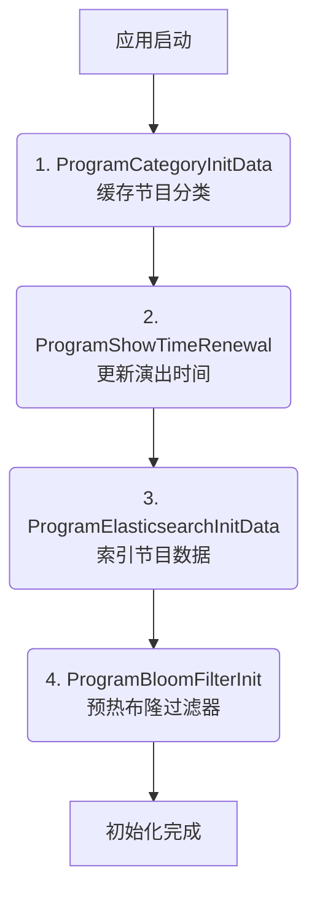
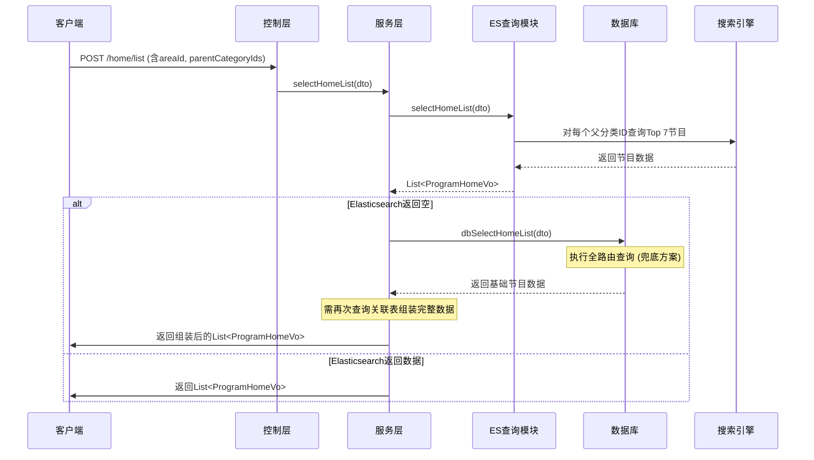
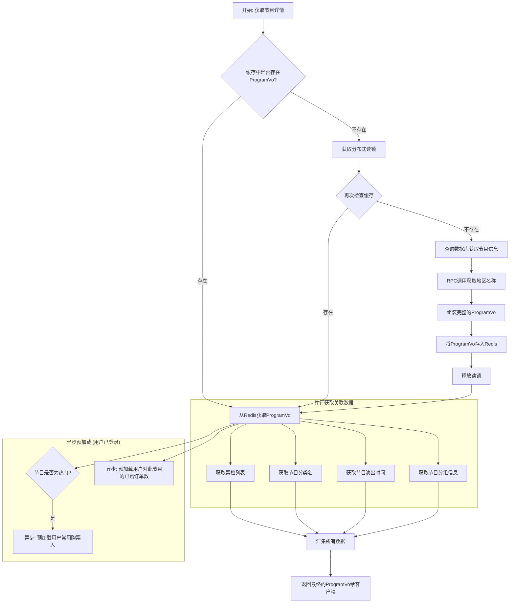
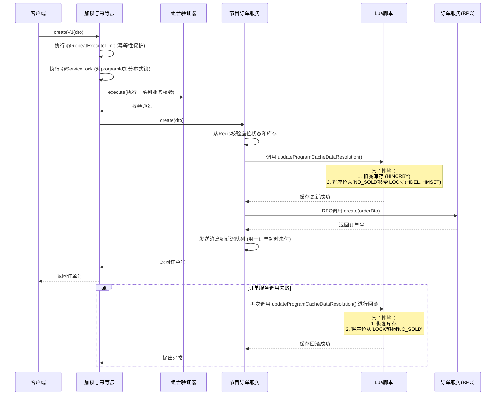
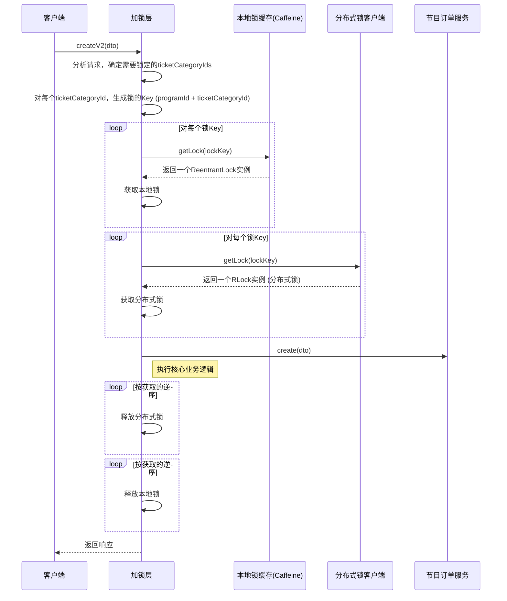
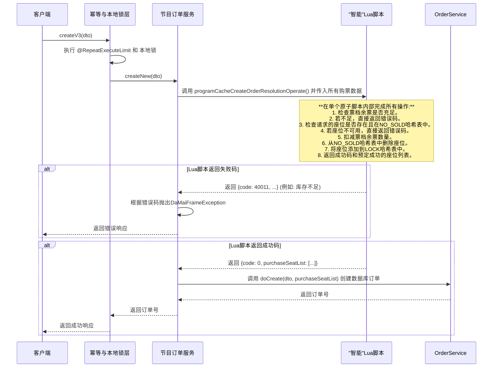
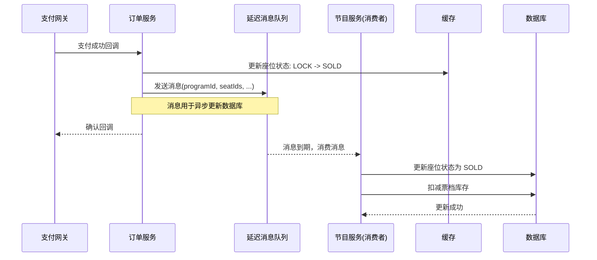

# 节目服务详解

这篇文档将带您深入easypass票务系统的技术心脏，全面剖析其从数据准备到高并发交易处理的全链路设计。我们将通过丰富的代码示例和详尽的逻辑阐述，揭示系统如何在保证数据准确性的同时，应对海量用户请求的挑战。

## 第一部分：万丈高楼平地起 —— 系统初始化与数据准备

一个高性能、高可用的系统，其根基在于启动时高效而稳健的数据准备。easypass系统通过一个专用的初始化组件 `easypass-service-initialize`，以精确控制的顺序，为后续的所有业务流程铺平道路。

#### Mermaid图：系统初始化流程



这个初始化过程宛如一场精心编排的四幕剧：

1. **缓存节目分类 (ProgramCategoryInitData)**: 奠定基础数据。
2. **更新演出时间 (ProgramShowTimeRenewal)**: 保证数据鲜活。
3. **索引节目数据 (ProgramElasticsearchInitData)**: 构建高速查询引擎。
4. **预热布隆过滤器 (ProgramBloomFilterInit)**: 建立高效的防线。

### 1.1 缓存节目分类信息：从源头提升效率

节目分类是系统中频繁使用但极少变动的基础数据，将其在系统启动时直接加载到Redis中，是提升后续所有查询效率的第一步。

- **实现逻辑**: 该任务由 `ProgramCategoryInitData` 类负责，它继承了 `AbstractApplicationPostConstructHandler` 并设定了最高的执行优先级 (`executeOrder()` 返回1)。其核心逻辑在 `programCategoryRedisDataInit` 方法中：

  ```java
  @ServiceLock(lockType= LockType.Write,name = PROGRAM_CATEGORY_LOCK,keys = {"#all"})
  public Map<String, ProgramCategory> programCategoryRedisDataInit(){
      Map<String, ProgramCategory> programCategoryMap = new HashMap<>(64);
      // 从数据库中查询所有分类
      QueryWrapper<ProgramCategory> lambdaQueryWrapper = Wrappers.emptyWrapper();
      List<ProgramCategory> programCategoryList = programCategoryMapper.selectList(lambdaQueryWrapper);
      if (CollectionUtil.isNotEmpty(programCategoryList)) {
          // 将查询结果转换为Map，key为分类ID，value为分类对象
          programCategoryMap = programCategoryList.stream().collect(
                  Collectors.toMap(p -> String.valueOf(p.getId()), p -> p, (v1, v2) -> v2));
          // 使用HSET命令一次性将整个Map存入Redis的Hash结构中
          redisCache.putHash(RedisKeyBuild.createRedisKey(RedisKeyManage.PROGRAM_CATEGORY_HASH),programCategoryMap);
      }
      return programCategoryMap;
  }
  ```

- **设计解读**:

  - **异步与锁**: 整个过程在独立的业务线程池中**异步执行**，完全不阻塞应用主线程的启动。同时，`@ServiceLock` 注解确保了在分布式环境下，只有一个实例会执行此初始化操作，避免了并发写入缓存引发的数据错乱。
  - **数据结构**: 选用Redis的 `HASH` 数据结构是明智之举。它将所有分类信息聚合在一个大键（`easypass-d_easypass_program_category_hash`）下，查询单个分类时，可以使用 `HGET` 命令，时间复杂度为O(1)，效率极高。

### 1.2 更新节目演出时间：确保演示环境的持续可用

为了让学习和演示该项目的开发者不必担心数据过期问题，系统设计了一个自动“续命”的机制。

- **实现逻辑**: `ProgramShowTimeRenewal` 负责此任务。它会查询所有演出时间早于明日的记录，并对其进行更新。

  ```java
  @Transactional(rollbackFor = Exception.class)
  public Set<Long> renewal(){
      Set<Long> programIdSet = new HashSet<>();
      // 查询即将过期的演出时间
      LambdaQueryWrapper<ProgramShowTime> queryWrapper =
              Wrappers.lambdaQuery(ProgramShowTime.class).le(ProgramShowTime::getShowTime, DateUtils.addDay(DateUtils.now(), 1));
      List<ProgramShowTime> expiredShowTimes = programShowTimeMapper.selectList(queryWrapper);
  
      for (ProgramShowTime showTime : expiredShowTimes) {
          programIdSet.add(showTime.getProgramId());
          Date newShowTime = DateUtils.addMonth(showTime.getShowTime(), 1);
          // 确保新的演出时间一定在当前时间之后
          while (newShowTime.before(DateUtils.now())) {
              newShowTime = DateUtils.addMonth(newShowTime, 1);
          }
          // ... 更新数据库 ...
      }
      return programIdSet;
  }
  ```

- **设计解读**:

  - **关键联动**: 此步骤的核心价值在于**数据同步的闭环**。一旦检测到并更新了任何演出时间，它会返回受影响的 `programId` 集合。后续的逻辑会利用这个集合，精确地删除这些节目在Redis和Elasticsearch中的旧数据，从而触发在下一步中对这些节目进行强制性的重新索引和缓存，保证了数据的最终一致性。

### 1.3 索引节目数据至Elasticsearch：构建复杂查询的基石

主页、列表页和搜索页的查询条件复杂多变，无法有效利用数据库的分片键。为了避免“读扩散”导致的性能灾难，系统选择将一份聚合后的“宽表”数据索引到Elasticsearch中。

- **实现逻辑**: `ProgramElasticsearchInitData` 负责构建这个搜索引擎。

  1. **创建索引与映射**: 如果索引不存在，会先根据 `getEsMapping` 方法定义的结构创建索引。

     ```java
     public List<EsDocumentMappingDto> getEsMapping(){
         List<EsDocumentMappingDto> list = new ArrayList<>();
         list.add(new EsDocumentMappingDto(ProgramDocumentParamName.ID,"long"));
         list.add(new EsDocumentMappingDto(ProgramDocumentParamName.TITLE,"text")); // 支持分词搜索
         list.add(new EsDocumentMappingDto(ProgramDocumentParamName.SHOW_DAY_TIME,"date")); // 支持日期范围查询
         list.add(new EsDocumentMappingDto(ProgramDocumentParamName.MIN_PRICE,"integer"));
         // ... 其他字段
         return list;
     }
     ```

  2. **数据聚合与索引**: 遍历所有节目ID，对每一个节目，调用 `programService.getDetailFromDb(programId)` 来获取一个聚合了多方信息（如分类名、地区名、演出时间、价格范围等）的 `ProgramVo` 对象，然后将其转换为一个Map，并添加到ES中。

- **设计解读**:

  - **反范式设计**: 这是典型的数据“反范式”设计。通过在索引时提前进行数据JOIN和聚合，将查询时的复杂计算前置到了数据写入阶段。虽然这会增加写入的复杂度和存储空间，但它极大地简化了查询逻辑，并带来了数量级的性能提升，对于读多写少的场景是最佳实践。

### 1.4 初始化节目布隆过滤器：构建高效的“不存在”证明

为了防止恶意或意外的、对大量不存在节目的查询导致缓存穿透，直接打垮数据库，系统在启动时预热了一个布隆过滤器。

- **实现逻辑**: `ProgramBloomFilterInit` 的逻辑非常直接：

  ```java
  public void executeInit(final ConfigurableApplicationContext context) {
      // 查询所有有效的节目ID
      List<Long> allProgramIdList = programService.getAllProgramIdList();
      if (CollectionUtil.isEmpty(allProgramIdList)) {
          return;
      }
      // 将每个ID添加到布隆过滤器中
      allProgramIdList.forEach(programId -> bloomFilterHandler.add(String.valueOf(programId)));
  }
  ```

- **设计解读**:

  - 布隆过滤器的特点是：它能100%确定一个元素“绝对不存在”，但只能“很可能存在”。这对于拦截无效请求来说已经足够。当一个请求查询的节目ID通过布隆过滤器判断为不存在时，系统可以直接返回“节目不存在”，无需再进行任何后续的缓存或数据库查询，极大地节省了资源。

## 第二部分：节目发现与详情展示

当数据准备就绪，我们来看看系统如何为用户提供流畅的浏览和搜索体验。

### 2.1 主页节目列表展示：优雅地应对“读扩散”

主页查询的复杂性在于其多维度的过滤条件。系统的应对策略是**ES优先，数据库兜底**。

#### Mermaid图：主页列表查询流程



- **数据库兜底方案的实现**: 当ES不可用时，系统会执行 `dbSelectHomeList` 方法。为了在一次交互中获取所有分类的数据，它巧妙地利用了MyBatis的动态SQL功能。

  ```xml
  <select id="selectHomeList" ...>
      <if test = 'programListDto.parentProgramCategoryIds != null and ...'>
          <foreach collection='programListDto.parentProgramCategoryIds' item='parentProgramCategoryId' separator=' union all '>
              select * from (
                  select ... from d_program dp
                  where dp.parent_program_category_id = #{parentProgramCategoryId,jdbcType=BIGINT}
                  limit 7
              ) as tmp
          </foreach>
      </if>
  </select>
  ```

  - **代码解读**: `<foreach>` 标签会遍历传入的父分类ID列表，对每个ID生成一个独立的 `SELECT ... LIMIT 7` 子查询，并用 `union all` 将它们连接起来。这样，一个看似复杂的查询需求就被动态地转换成了一个单一的SQL语句，虽然会触发全路由查询，但作为兜底方案，它保证了功能的可用性。

### 2.3 智能节目搜索：释放Elasticsearch的全部潜能

搜索功能需要分词和多条件组合，这正是ES的用武之地。由于逻辑嵌套复杂，系统直接使用了原生的 `QueryBuilders` 来精细构建查询。

- **查询构建实现**: 在 `ProgramEs` 服务的 `search` 方法中，查询构建过程如下：

  ```java
  // 创建最外层的 BoolQueryBuilder
  BoolQueryBuilder boolQuery = QueryBuilders.boolQuery();
  
  // 添加精确匹配的过滤条件 (filter)
  if (Objects.nonNull(dto.getAreaId())) {
      boolQuery.must(QueryBuilders.termQuery(ProgramDocumentParamName.AREA_ID, dto.getAreaId()));
  }
  if (Objects.nonNull(dto.getStartDateTime())) {
      boolQuery.must(QueryBuilders.rangeQuery(ProgramDocumentParamName.SHOW_DAY_TIME).from(dto.getStartDateTime()).to(dto.getEndDateTime()));
  }
  
  // 构建内层的、用于文本搜索的布尔查询
  if (StringUtil.isNotEmpty(dto.getContent())) {
      BoolQueryBuilder innerBoolQuery = QueryBuilders.boolQuery();
      // 使用 "should" 实现 OR 逻辑
      innerBoolQuery.should(QueryBuilders.matchQuery(ProgramDocumentParamName.TITLE, dto.getContent()));
      innerBoolQuery.should(QueryBuilders.matchQuery(ProgramDocumentParamName.ACTOR, dto.getContent()));
      innerBoolQuery.minimumShouldMatch(1); // 确保至少一个should条件匹配
  
      // 将内层查询作为外层查询的 "must" 条件
      boolQuery.must(innerBoolQuery);
  }
  ```

- **设计解读**:

  - 通过 `boolQuery` 的 `must` (AND) 和 `should` (OR) 组合，可以灵活地构建出任意复杂的逻辑。`matchQuery` 会对查询词和文档内容进行分词，实现智能匹配，而 `termQuery` 和 `rangeQuery` 则用于精确的过滤。这种代码化的查询构建方式，不仅比拼接JSON字符串更安全、更易于维护，也让复杂的搜索逻辑一目了然。

### 2.4 高性能节目详情页：多重优化下的极致体验

详情页的快速加载至关重要。系统在此处应用了“缓存旁路+双重检测锁”的经典模式，并结合了异步预加载。

#### Mermaid图：节目详情页加载流程



- **双重检测锁的实现**: `ProgramService` 中的 `getById` 方法是这一模式的完美体现。

  ```java
  @ServiceLock(lockType= LockType.Read, name = PROGRAM_LOCK, keys = {"#programId"})
  public ProgramVo getById(Long programId) {
      // 第一次尝试从缓存获取
      return redisCache.get(
          RedisKeyBuild.createRedisKey(RedisKeyManage.PROGRAM, programId),
          ProgramVo.class,
          // 若缓存不存在，则执行此Supplier函数式接口中的逻辑
          () -> {
              // 这里已经处于分布式锁的保护之下
              // 第二次检查缓存（双重检测）
              // (注意：在实际的锁组件实现中，锁内的第二次检查是隐式或显式包含的)
              // 如果仍然没有，则创建
              return createProgramVo(programId);
          },
          EXPIRE_TIME,
          TimeUnit.DAYS
      );
  }
  ```

  - **代码解读**: `redisCache.get` 方法的第三个参数是一个 `Supplier`。只有当缓存未命中时，这个 `Supplier` 才会被调用。而 `getById` 方法外的 `@ServiceLock` 注解确保了在调用 `Supplier` 之前，线程已经持有了分布式读锁。这优雅地实现了“加锁 -> 查缓存 -> 查数据库 -> 写缓存 -> 解锁”的完整流程。

- **异步预加载的实现**: 为了让用户点击“购买”后的体验更丝滑，系统会提前加载数据。

  ```java
  private void preloadTicketUserList(Integer highHeat){
      if (Objects.equals(highHeat, BusinessStatus.NO.getCode())) return; // 非热门节目不预热
      String userId = BaseParameterHolder.getParameter(USER_ID);
      if (StringUtil.isEmpty(userId)) return; // 用户未登录不预热
  
      // 异步执行，不阻塞当前详情页的返回
      BusinessThreadPool.execute(() -> {
          try {
              // ... RPC调用用户服务获取购票人列表 ...
              // ... 将结果存入Redis ...
          } catch (Exception e) {
              log.error("预热加载购票人列表失败", e);
          }
      });
  }
  ```

  - **设计解读**: 通过将这些非核心但影响后续体验的IO操作（如RPC调用）放入独立的线程池中**异步执行**，详情页接口可以迅速返回，用户几乎感觉不到延迟，而当他们进入下一步时，所需的数据很可能已经“悄悄地”准备好了。

## 第三部分：高并发购票核心流程

这是系统的“珠穆朗瑪峰”，我们将详细剖析从V1到V3的演进，看系统是如何一步步走向极致性能的。

#### Mermaid图：V1版本基础购票流程



### 3.2 优化迭代一：细化锁粒度 (`createV2`)

V1版本的 `programId` 锁粒度太粗。V2版本通过引入“本地锁+细粒度分布式锁”的二级锁机制，实现了性能的飞跃。

#### Mermaid图：V2版本锁优化流程



- **本地锁缓存的实现**: `LocalLockCache` 类利用Caffeine缓存来管理本地锁实例。

  ```java
  public class LocalLockCache {
      private Cache<String, ReentrantLock> localLockCache;
  
      @PostConstruct
      public void localLockCacheInit(){
          localLockCache = Caffeine.newBuilder()
                  .expireAfterWrite(2, TimeUnit.HOURS) // 锁对象在2小时后自动过期
                  .build();
      }
  
      public ReentrantLock getLock(String lockKey, boolean fair){
          // get方法是线程安全的，如果key不存在，则执行lambda创建新的锁实例
          return localLockCache.get(lockKey, key -> new ReentrantLock(fair));
      }
  }
  ```

  - **设计解读**: `Caffeine` 的 `expireAfterWrite` 特性是此方案的点睛之笔。它能自动清理那些长时间未被访问的锁对象（例如演出已结束），从而有效防止了因锁对象持续累积而导致的JVM内存溢出问题。

### 3.3 优化迭代二：“无锁化”终极方案 (`createV3`)

V3版本是性能优化的极致。它移除了应用层的分布式锁，将包含校验和更新的整个事务逻辑封装到一个大型Lua脚本中，完全依赖Redis的原子性。

#### Mermaid图：V3版本“无锁化”Lua流程



- **设计解读**:
  - **逻辑下沉**: V3方案的本质是将原本分布在Java应用层和Redis中的逻辑（校验->加锁->更新），整体下沉到了Redis内部。
  - **性能优势**: 这种做法的性能优势是压倒性的。在高并发场景下，99%的请求可能都因库存不足而失败。V3方案让这些失败请求在Redis层就被“闪电般”地拒绝，它们的数据包甚至不需要离开Redis服务器，极大地减轻了网络带宽和应用服务器的负担。只有那些通过了所有校验的“天选之子”请求，才会成功返回，并触发后续的数据库订单创建流程。

## 第四部分：保障数据最终一致性

在easypass这样以缓存为核心的系统中，与数据库的同步采用了**最终一致性**模型。

#### Mermaid图：数据最终一致性流程



- **设计解读**:
  - **解耦与削峰**: 通过引入消息队列，支付成功后的缓存更新（需要快速响应给用户）与数据库更新（可以容忍一定延迟）被彻底解耦。这不仅提高了系统的可用性（即使数据库暂时抖动，也不影响支付确认），还能起到“削峰填谷”的作用，将瞬时的高并发支付成功更新请求，平滑地转化为对数据库的稳定写入流。这是一种在大型分布式系统中保障系统稳定性和可扩展性的经典架构模式。