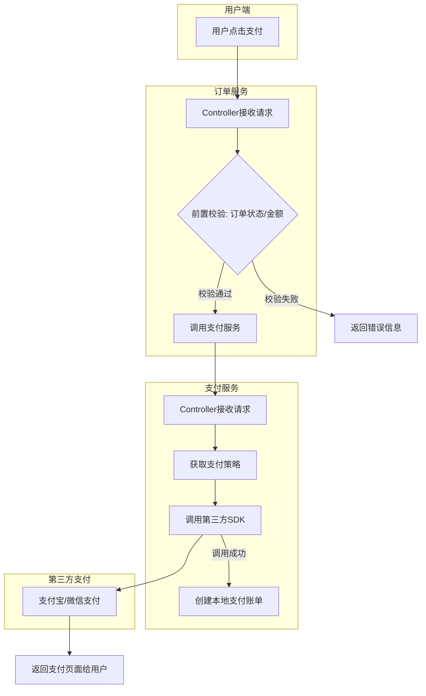
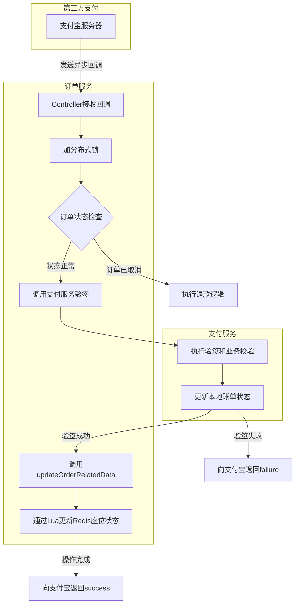
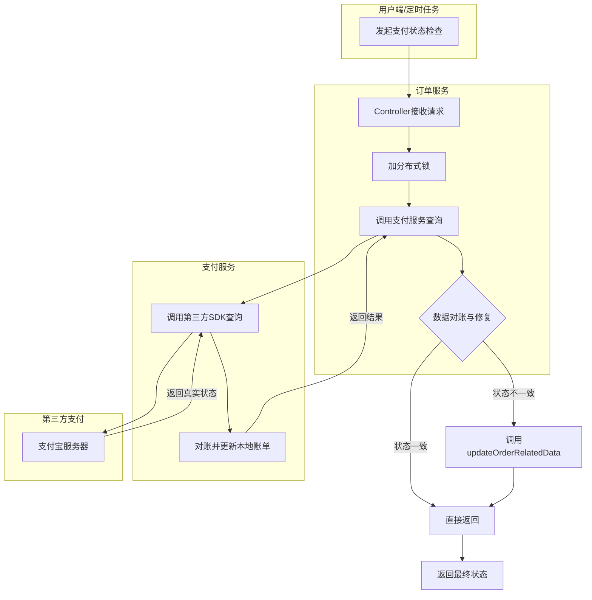
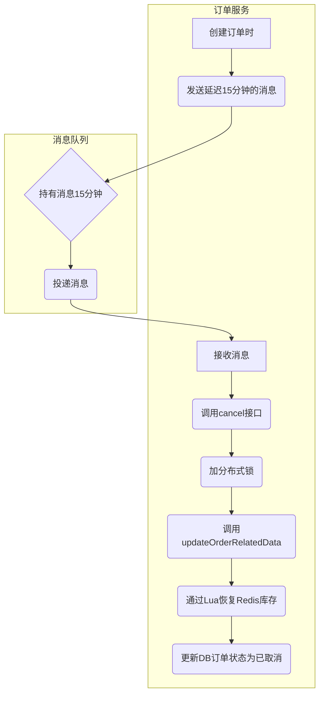

# 订单全流程业务逻辑详解

本文档旨在深入、详细地阐述订单从创建、查询、支付、状态更新直至最终完成或取消的完整业务生命周期。在技术细节之外，本文还将重点解释各项设计决策背后的原因及其带来的优势，以提供一个全面而深刻的理解。

## 1. 订单查询

订单查询是整个交易系统的基础，为用户提供了追踪购买历史的途径，也为客服人员提供了解决问题的依据。一个高效、准确的查询功能是提升用户体验和运营效率的关键。

### 1.1 查询订单详情

查询订单详情的目的是为了给用户或管理员提供一个订单的完整快照，它需要聚合来自多个数据源的信息，如订单基本信息、关联的购票人信息、座位信息等。

#### **代码实现**

**Controller: `com.easypass.controller.OrderController#get`**

```java
@ApiOperation(value = "查看订单详情")
@PostMapping(value = "/get")
public ApiResponse<OrderGetVo> get(@Valid @RequestBody OrderGetDto orderGetDto) {
    return ApiResponse.ok(orderService.get(orderGetDto));
}
```

**Service: `com.easypass.service.OrderService#get`**

```java
public OrderGetVo get(OrderGetDto orderGetDto) {
    // 步骤1：查询核心的订单信息
    LambdaQueryWrapper<Order> orderLambdaQueryWrapper =
            Wrappers.lambdaQuery(Order.class).eq(Order::getOrderNumber, orderGetDto.getOrderNumber());
    Order order = orderMapper.selectOne(orderLambdaQueryWrapper);
    if (Objects.isNull(order)) {
        throw new easypassFrameException(BaseCode.ORDER_NOT_EXIST);
    }
    // 步骤2：查询与订单关联的票务信息
    LambdaQueryWrapper<OrderTicketUser> orderTicketUserLambdaQueryWrapper = 
            Wrappers.lambdaQuery(OrderTicketUser.class).eq(OrderTicketUser::getOrderNumber, order.getOrderNumber());
    List<OrderTicketUser> orderTicketUserList = orderTicketUserMapper.selectList(orderTicketUserLambdaQueryWrapper);
    if (CollectionUtil.isEmpty(orderTicketUserList)) {
        throw new easypassFrameException(BaseCode.TICKET_USER_ORDER_NOT_EXIST);   
    }
    
    OrderGetVo orderGetVo = new OrderGetVo();
    BeanUtil.copyProperties(order,orderGetVo);
    
    // 步骤3：聚合票务信息，例如按价格分组并生成座位描述
    // 这样做的好处是，前端可以直接展示聚合后的信息，无需再做复杂的逻辑处理。
    List<OrderTicketInfoVo> orderTicketInfoVoList = new ArrayList<>();
    Map<BigDecimal, List<OrderTicketUser>> orderTicketUserMap = 
            orderTicketUserList.stream().collect(Collectors.groupingBy(OrderTicketUser::getOrderPrice));
    orderTicketUserMap.forEach((k,v) -> {
        // ... 聚合逻辑 ...
    });
    orderGetVo.setOrderTicketInfoVoList(orderTicketInfoVoList);
    
    // 步骤4：通过RPC调用用户服务，获取用户和购票人的详细信息
    // 采用微服务架构，将用户管理与订单管理解耦，使得系统更易于维护和扩展。
    UserGetAndTicketUserListDto userGetAndTicketUserListDto = new UserGetAndTicketUserListDto();
    // ...
    ApiResponse<UserGetAndTicketUserListVo> userGetAndTicketUserApiResponse = 
            userClient.getUserAndTicketUserList(userGetAndTicketUserListDto);
    
    // ... 校验并组装返回的用户信息 ...
    
    return orderGetVo;
}
```

#### **流程与设计解析**

1. **查询主订单**：这是所有信息的起点。
2. **查询购票人订单**：获取与此订单关联的所有票据。
3. **调用用户服务**：体现了微服务架构的优势，职责分离，订单服务不需维护用户数据。
4. **数据聚合**：在后端完成所有数据的聚合和整理，向前端提供一个结构清晰、即取即用的数据模型，减轻了前端的负担，也提升了页面加载性能。

### 1.2 查询订单列表

为用户提供一个清晰的订单历史列表，是电商系统的基本功能。

#### **代码实现**

**Service: `com.easypass.service.OrderService#selectList`**

```java
public List<OrderListVo> selectList(OrderListDto orderListDto) {
    // ...
    // 查询主订单列表
    List<Order> orderList = orderMapper.selectList(orderLambdaQueryWrapper);
    if (CollectionUtil.isEmpty(orderList)) {
        return orderListVos;
    }
    // ...
    // 关键优化点：使用自定义SQL一次性聚合查询每个订单的票数
    // 相比于循环查询每个订单的子项再在内存中计数，这种方式极大地减少了数据库查询次数，在高并发场景下性能优势明显。
    List<OrderTicketUserAggregate> orderTicketUserAggregateList = 
            orderTicketUserMapper.selectOrderTicketUserAggregate(orderList.stream().map(Order::getOrderNumber).
                    collect(Collectors.toList()));
    Map<Long, Integer> orderTicketUserAggregateMap = orderTicketUserAggregateList.stream()
            .collect(Collectors.toMap(OrderTicketUserAggregate::getOrderNumber, 
                    OrderTicketUserAggregate::getOrderTicketUserCount, (v1, v2) -> v2));
    // 将聚合结果填充回订单列表
    for (OrderListVo orderListVo : orderListVos) {
        orderListVo.setTicketCount(orderTicketUserAggregateMap.get(orderListVo.getOrderNumber()));
    }
    return orderListVos;
}
```

#### **流程与设计解析**

1. **查询主订单列表**：获取用户的所有订单。
2. **一次性聚合统计**：通过`group by`的SQL查询，将N次单独的票数查询优化为1次聚合查询，这是处理列表关联数据时非常重要的性能优化手段。
3. **内存中组装**：在Java代码中将查询结果进行匹配和组装，最终返回给前端。

## 2. 生成订单后的支付流程

支付是交易闭环中最关键的一步。此流程被设计为一个由订单服务发起，由独立的支付服务核心处理的协作过程。这种**服务分离**的设计有几大好处：

- **安全隔离**：将敏感的支付逻辑和配置（如密钥）隔离在专门的支付服务中，减小了主业务系统的风险暴露面。
- **职责单一**：支付服务可以专注于与各种支付渠道（支付宝、微信支付等）的对接，而订单服务则专注于订单本身的状体流转。
- **易于扩展**：当需要接入新的支付方式时，只需在支付服务中增加新的策略，订单服务几乎不受影响。



### 2.1 订单服务处理

订单服务作为支付流程的发起方，其核心职责是**前置校验**。

**Service: `com.easypass.service.OrderService#pay`**

```java
public String pay(OrderPayDto orderPayDto) {
    // ...
    // 核心职责1：进行严格的订单状态校验
    // 这是防止重复支付、对已取消订单支付等异常操作的第一道防线，保证了业务流程的正确性。
    if (Objects.equals(order.getOrderStatus(), OrderStatus.CANCEL.getCode())) {
        throw new easypassFrameException(BaseCode.ORDER_CANCEL);
    }
    // ... 其他状态校验 ...

    // 核心职责2：进行金额校验
    // 确保前端传递的支付金额与后端记录的订单金额一致，防止因前端篡改数据导致资损。
    if (orderPayDto.getPrice().compareTo(order.getOrderPrice()) != 0) {
        throw new easypassFrameException(BaseCode.PAY_PRICE_NOT_EQUAL_ORDER_PRICE);
    }
    // 校验通过后，才调用支付服务
    PayDto payDto = getPayDto(orderPayDto, orderNumber);
    ApiResponse<String> payResponse = payClient.commonPay(payDto);
    // ...
    return payResponse.getData();
}
```

### 2.2 支付服务处理

支付服务是与第三方支付渠道直接交互的核心。

**Controller: `com.easypass.controller.PayController#commonPay`**

```java
@ServiceLock(name = COMMON_PAY,keys = {"payDto.orderNumber"})
@Transactional(rollbackFor = Exception.class)
public String commonPay(PayDto payDto) {
    // ...
    // 采用“策略模式”获取支付处理器
    // 这是软件设计中的经典模式，它将每种支付渠道的实现封装在独立的策略类中。
    // 好处是代码结构清晰，易于维护，并且在未来接入新渠道（如微信支付、银联支付）时，只需添加新的策略实现即可，符合“开闭原则”。
    PayStrategyHandler payStrategyHandler = payStrategyContext.get(payDto.getChannel());
    PayResult pay = payStrategyHandler.pay(...);

    // 如果调用第三方支付成功，则创建本地“支付账单”
    // 这张PayBill表至关重要，它是我们系统内部的财务凭证，用于与第三方支付渠道进行对账，是保证资金安全和数据一致性的核心。
    if (pay.isSuccess()) {
        payBill = new PayBill();
        // ...
        payBillMapper.insert(payBill);
    }

    return pay.getBody();
}
```

## 3. 接收支付宝回调通知后更新数据

由于网络原因，用户支付成功后，我们无法立即知道结果。因此，依赖第三方支付平台（如支付宝）发送的**异步回调**通知是行业标准做法。处理好这个回调是保证数据最终一致性的关键。



### 3.1 订单服务接收回调

**Service: `com.easypass.service.OrderService#alipayNotify`**

```java
public String alipayNotify(HttpServletRequest request){
    // ...
    // 使用分布式锁，锁的key是订单号
    // 这是一个至关重要的并发控制手段。它能有效防止“支付回调”和“订单超时取消”等多个可能同时发生的操作修改同一个订单，从而避免了数据错乱（比如订单刚被取消，支付成功的回调又将其置为已支付）。
    RLock lock = serviceLockTool.getLock(...);
    lock.lock();
    try {
        // ...
        // 处理极端场景：支付成功了，但订单因超时已经先被系统关闭了。
        // 这种情况下，用户的钱不能白付，系统必须自动发起退款流程。这是构建一个健壮、可靠系统的必要考虑。
        if (Objects.equals(order.getOrderStatus(), OrderStatus.CANCEL.getCode())) {
            // ... 执行退款逻辑 ...
            return ALIPAY_NOTIFY_SUCCESS_RESULT;
        }
        
        // 调用支付服务进行签名验证
        // 订单服务本身不处理验签，而是委托给专业的支付服务，这符合单一职责原则。
        ApiResponse<NotifyVo> notifyResponse = payClient.notify(dto);
        // ...
        // 如果支付服务确认支付成功，则更新订单及关联数据
        if (ALIPAY_NOTIFY_SUCCESS_RESULT.equals(notifyResponse.getData().getPayResult())) {
            orderService.updateOrderRelatedData(...);
        }
        return notifyResponse.getData().getPayResult();
    } finally {
        lock.unlock();
    }
}
```

### 3.2 支付服务验签与更新账单

支付服务在收到回调后，执行严格的校验流程。

1. **验签**：最核心的安全步骤。通过支付宝公钥验证签名的合法性，确保这个回调请求确实是支付宝官方发出的，且内容未被篡改。
2. **业务校验**：核对订单号、金额等信息是否与本地账单匹配。
3. **幂等性处理**：检查账单状态。如果账单已经是“已支付”，说明之前可能已经处理过这个回调了（网络原因可能导致支付宝重复发送通知），直接返回成功，避免重复处理。
4. **更新账单**：所有校验通过后，将本地的`PayBill`状态更新为“已支付”。

### 3.3 订单服务更新座位等关联数据

这是支付成功后最核心的业务操作：**确认资源已被售出**。

**`com.easypass.service.OrderService#updateProgramRelatedDataResolution`** 此方法负责通过Lua脚本原子性地更新Redis中的座位状态。

- **为什么使用Redis？** 因为票务库存（座位状态、余票数量）是典型的高频读、高频写场景，对性能要求极高。Redis作为内存数据库，能提供微秒级的读写速度，完美满足需求。
- **为什么使用Lua脚本？** 因为从“锁定”到“已售卖”的转变，涉及多个Redis操作（从一个HASH中删除，再添加到另一个HASH中）。如果用普通的客户端命令分步执行，一旦在中间某个步骤发生故障，就会导致数据不一致（例如，座位从锁定中被删了，但还没来得及加入已售卖列表）。**Lua脚本能保证这一系列操作的原子性**，即所有操作要么全部成功，要么全部失败，从而杜绝了数据不一致的风险。

**Lua脚本 (`OrderProgramDataResolution.lua`)**

```lua
-- ...
-- 1. 从“锁定座位”集合中删除
redis.call('HDEL',program_seat_hash_key,unpack(un_lock_seat_id_list))    

-- 2. 添加到“已售卖座位”集合
redis.call('HMSET',seat_hash_key_add,unpack(seat_data_list))
-- ...
```

## 4. 支付后主动检查状态

仅仅依赖异步回调是不够的，因为回调可能会有延迟，甚至在极端网络问题下会丢失。为了提供更好的用户体验（用户付完钱不希望长时间看到订单还是“未支付”状态），并建立一个**自我修复**的机制，我们必须有**主动向支付宝查询支付状态**的能力。



**Service: `com.easypass.service.OrderService#payCheck`**

```java
@ServiceLock(name = ORDER_PAY_CHECK,keys = {"#orderPayCheckDto.orderNumber"})
public OrderPayCheckVo payCheck(OrderPayCheckDto orderPayCheckDto){
    // ...
    // 调用支付服务，主动去查询支付渠道的真实状态
    ApiResponse<TradeCheckVo> tradeCheckVoApiResponse = payClient.tradeCheck(tradeCheckDto);
    // ...
    
    // 核心逻辑：数据对账与修复
    // 将从支付宝查询到的“真实状态”与我们系统内部的“订单状态”进行比对。
    if (!Objects.equals(orderStatus, payBillStatus)) {
        // 如果状态不一致，说明之前的回调没有成功处理，或者处理延迟了。
        // 此时，我们以从支付宝获取的真实状态为准，主动触发一次数据更新流程，从而完成数据的“修复”。
        orderService.updateOrderRelatedData(...);
    }
    // ...
    return orderPayCheckVo;
}
```

这个主动检查机制是系统健壮性的重要体现，它确保了即使在回调异常的情况下，数据也能最终达到一致状态。

## 5. 订单取消与延迟关闭处理

票务是一种**有限且有时效性**的资源。如果允许用户创建订单后无限期地占有库存而不支付，将会导致资源浪费和销售机会的损失。因此，订单的自动取消和关闭机制是必不可少的。



### 5.1 消费延迟订单关闭消息

我们采用**消息队列的延迟消息**功能来实现这个需求。

- **工作原理**：在订单创建时，向消息队列发送一个具有特定延迟时间（例如15分钟）的消息。
- **好处**：这种方式将定时任务的逻辑与业务逻辑解耦，并且具有高可用性和高可靠性。相比于传统的定时器扫描数据库，它对数据库的压力更小，扩展性也更好。

**Consumer: `com.easypass.service.delayconsumer.DelayOrderCancelConsumer#execute`** 当15分钟后，消费者会准确地收到这个消息，并执行订单取消逻辑。

### 5.2 执行取消订单逻辑

取消订单的逻辑与支付成功逻辑高度复用同一个核心方法 `updateOrderRelatedData`，只是传入的操作类型是 `CANCEL`。这体现了良好的代码设计和复用性。

### 5.3 恢复缓存余票与座位状态

这是订单取消流程的核心，它是支付成功操作的**逆向过程**。

- **Java代码 (`updateProgramRelatedDataResolution`)**：准备数据，调用Lua脚本。
- **Lua脚本 (`OrderProgramDataResolution.lua`)**：再次利用其原子性保证，执行以下操作：
  1. 从`锁定座位`哈希表中删除被占用的座位。
  2. 将这些座位添加回`未售卖座位`哈希表中，使其可以被其他用户购买。
  3. 使用 `HINCRBY` 命令，将对应票档的余票数量加回去，准确地**恢复库存**。

这个流程确保了被临时占用的稀缺资源能够被安全、准确地释放回票池，最大化了销售机会。