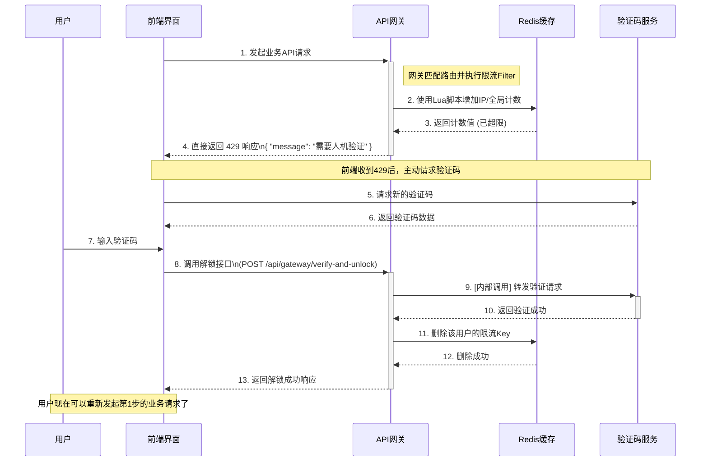

# 在网关层实现智能限流与验证码联动

在微服务架构中，将安全策略和流量控制等横切关注点置于API网关层，是一种先进且高效的设计模式。本指南将详细介绍如何使用 **Spring Cloud Gateway** 作为API网关，结合 **Redis**，构建一个集中式、可配置的限流组件。该组件能在流量超限时直接拒绝请求，并提供独立的接口用于验证码校验，从而解除用户的限流状态。

## 核心设计与工作流程

此架构将限流的决策与解锁的动作完全分离，形成一个清晰的两阶段流程。

- **阶段一：限流与拒绝**
  - **配置驱动**：限流策略通过网关的配置文件（`application.yml`）进行声明。
  - **自定义过滤器拦截**：自定义的`GatewayFilter`会拦截匹配路由的请求，并使用Redis进行频率计数。
  - **直接拒绝**：当请求超限时，过滤器**不再调用验证码服务**，而是直接中断请求，向客户端返回一个特定的HTTP状态码（如`429`）和一个需要人机验证的提示。
- **阶段二：验证与解锁**
  - **前端主导**：前端应用在接收到`429`状态码后，主动向后端的`CaptchaService`请求并展示验证码。
  - **网关提供解锁接口**：网关新增一个独立的API接口（例如 `/api/gateway/verify-and-unlock`）。
  - **验证与清除**：前端将用户输入的验证码和其UUID提交到这个新接口。网关在内部调用`CaptchaService`完成校验。如果校验成功，网关会**主动删除Redis中该用户的限流记录**，从而完成解锁。用户即可重新尝试之前的业务请求。

下面是解耦后的工作流程图：



## 1. 项目搭建与配置

### 1.1 Maven 依赖

网关项目的依赖保持不变。

```xml
<!-- pom.xml for Gateway Service -->
<dependencies>
    <dependency>
        <groupId>org.springframework.cloud</groupId>
        <artifactId>spring-cloud-starter-gateway</artifactId>
    </dependency>
    <dependency>
        <groupId>org.springframework.boot</groupId>
        <artifactId>spring-boot-starter-data-redis</artifactId>
    </dependency>
</dependencies>
```

### 1.2 网关配置

在配置中，我们需要为后端的验证码服务也添加一个路由规则，以便网关可以代理前端对验证码服务的直接访问，并为内部调用提供路径。

```yaml
server:
  port: 8080 # 网关端口

spring:
  application:
    name: api-gateway
  redis:
    host: localhost
    port: 6379
  cloud:
    gateway:
      routes:
        # 路由规则1：代理对验证码服务的访问
        # 前端可以直接通过网关 /captcha-api/** 来访问验证码服务
        - id: captcha_service_route
          uri: lb://captcha-service # 或 http://localhost:8081
          predicates:
            - Path=/captcha-api/**
          filters:
            - StripPrefix=1 # 去掉 /captcha-api 前缀

        # 路由规则2：受IP限流保护的业务服务
        - id: business_service_ip_limit
          uri: lb://business-service
          predicates:
            - Path=/api/user/**
          filters:
            - name: RateLimit
              args:
                count: 10
                time: 60
                limitType: IP

# 自定义配置：验证码服务的内部调用地址
app:
  captcha-service-verify-url: http://captcha-service/api/verify
```

## 2. 代码实现

### 2.1 自定义过滤器

过滤器的逻辑被简化。当超限时，它不再需要调用验证码服务，而是直接构建一个简单的拒绝响应。

```java
package com.example.gateway.filter;

import com.fasterxml.jackson.core.JsonProcessingException;
import com.fasterxml.jackson.databind.ObjectMapper;
import lombok.Data;
import lombok.extern.slf4j.Slf4j;
import org.springframework.beans.factory.annotation.Autowired;
import org.springframework.cloud.gateway.filter.GatewayFilter;
import org.springframework.cloud.gateway.filter.factory.AbstractGatewayFilterFactory;
import org.springframework.core.io.buffer.DataBuffer;
import org.springframework.data.redis.core.StringRedisTemplate;
import org.springframework.data.redis.core.script.RedisScript;
import org.springframework.http.HttpStatus;
import org.springframework.http.server.reactive.ServerHttpResponse;
import org.springframework.stereotype.Component;
import reactor.core.publisher.Mono;

import java.util.Collections;
import java.util.HashMap;
import java.util.List;
import java.util.Map;

@Slf4j
@Component
public class RateLimitGatewayFilterFactory extends AbstractGatewayFilterFactory<RateLimitGatewayFilterFactory.Config> {

    @Autowired
    private StringRedisTemplate stringRedisTemplate;
    @Autowired
    private RedisScript<Long> limitScript;
    @Autowired
    private ObjectMapper objectMapper;

    public RateLimitGatewayFilterFactory() {
        super(Config.class);
    }

    @Override
    public GatewayFilter apply(Config config) {
        return (exchange, chain) -> {
            String key = getKey(config.getLimitType(), exchange.getRequest());
            List<String> keys = Collections.singletonList(key);

            return stringRedisTemplate.execute(limitScript, keys, String.valueOf(config.getCount()), String.valueOf(config.getTime()))
                .flatMap(count -> {
                    log.info("Key: '{}', Count: '{}', Limit: '{}'", key, count, config.getCount());
                    if (count != null && count > config.getCount()) {
                        // 超限，直接返回429和提示信息
                        return handleRateLimitedResponse(exchange);
                    }
                    return chain.filter(exchange);
                })
                .onErrorResume(e -> {
                    log.error("Gateway RateLimit Redis Error", e);
                    return chain.filter(exchange);
                });
        };
    }

    // 直接返回拒绝信息
    private Mono<Void> handleRateLimitedResponse(org.springframework.cloud.gateway.support.ServerWebExchange exchange) {
        ServerHttpResponse response = exchange.getResponse();
        response.setStatusCode(HttpStatus.TOO_MANY_REQUESTS);
        response.getHeaders().add("Content-Type", "application/json;charset=UTF-8");

        Map<String, Object> responseBody = new HashMap<>();
        responseBody.put("success", false);
        responseBody.put("message", "请求过于频繁，需要人机验证才能继续访问");

        try {
            byte[] data = objectMapper.writeValueAsBytes(responseBody);
            DataBuffer buffer = response.bufferFactory().wrap(data);
            return response.writeWith(Mono.just(buffer));
        } catch (JsonProcessingException e) {
            log.error("Error writing response", e);
            return response.setComplete();
        }
    }

    // 暴露为公共方法，以便解锁接口也能使用
    public static String getKey(Config.LimitType type, org.springframework.http.server.reactive.ServerHttpRequest request) {
        String baseKey = "gateway:ratelimit:" + request.getPath().value();
        if (type == Config.LimitType.GLOBAL) {
            return baseKey + ":global";
        }
        return baseKey + ":" + request.getRemoteAddress().getAddress().getHostAddress();
    }

    @Data
    public static class Config {
        private int count;
        private int time;
        private LimitType limitType = LimitType.IP;
        public enum LimitType { IP, GLOBAL }
    }
}
```

### 2.2 解锁接口

在网关项目中创建一个新的Controller，用于处理验证和解锁逻辑。

```java
package com.example.gateway.controller;

import com.example.gateway.filter.RateLimitGatewayFilterFactory;
import lombok.extern.slf4j.Slf4j;
import org.springframework.beans.factory.annotation.Autowired;
import org.springframework.beans.factory.annotation.Value;
import org.springframework.data.redis.core.StringRedisTemplate;
import org.springframework.http.server.reactive.ServerHttpRequest;
import org.springframework.util.LinkedMultiValueMap;
import org.springframework.util.MultiValueMap;
import org.springframework.web.bind.annotation.PostMapping;
import org.springframework.web.bind.annotation.RequestParam;
import org.springframework.web.bind.annotation.RestController;
import org.springframework.web.reactive.function.BodyInserters;
import org.springframework.web.reactive.function.client.WebClient;
import reactor.core.publisher.Mono;

import java.util.Map;

@Slf4j
@RestController
public class GatewayUtilController {

    @Autowired
    private StringRedisTemplate stringRedisTemplate;

    @Value("${app.captcha-service-verify-url}")
    private String captchaVerifyUrl;

    @PostMapping("/api/gateway/verify-and-unlock")
    public Mono<Map<String, Object>> verifyAndUnlock(
            @RequestParam("uuid") String uuid,
            @RequestParam("code") String code,
            ServerHttpRequest request) {

        // 1. 构造向验证码服务发送的表单数据
        MultiValueMap<String, String> formData = new LinkedMultiValueMap<>();
        formData.add("uuid", uuid);
        formData.add("code", code);

        // 2. 调用验证码服务进行校验
        return WebClient.create().post().uri(captchaVerifyUrl)
                .body(BodyInserters.fromFormData(formData))
                .retrieve()
                .bodyToMono(Map.class)
                .flatMap(verificationResult -> {
                    boolean success = (boolean) verificationResult.getOrDefault("success", false);
                    if (success) {
                        // 3. 如果验证成功，清除该IP的限流记录
                        // 注意：这里的解锁逻辑是基于IP的。如果是全局限流，解锁逻辑会更复杂。
                        // 此处仅演示IP解锁。
                        String ip = request.getRemoteAddress().getAddress().getHostAddress();
                        // 假设我们知道被限制的路径，或者可以设计更通用的Key来清除
                        // 为简化，我们假设用户最后访问的路径就是被限流的路径
                        // 更稳健的设计需要前端回传被限流的API路径
                        String rateLimitKey = "gateway:ratelimit:/**:" + ip; // 这是一个简化的示例Key
                        log.info("Verification successful. Deleting rate limit key: {}", rateLimitKey);
                        stringRedisTemplate.delete(rateLimitKey); // 这里需要更精确的Key匹配
                        return Mono.just(Map.of("success", true, "message", "验证成功，您现在可以重新尝试"));
                    } else {
                        return Mono.just(Map.of("success", false, "message", "验证码错误"));
                    }
                });
    }
}
```