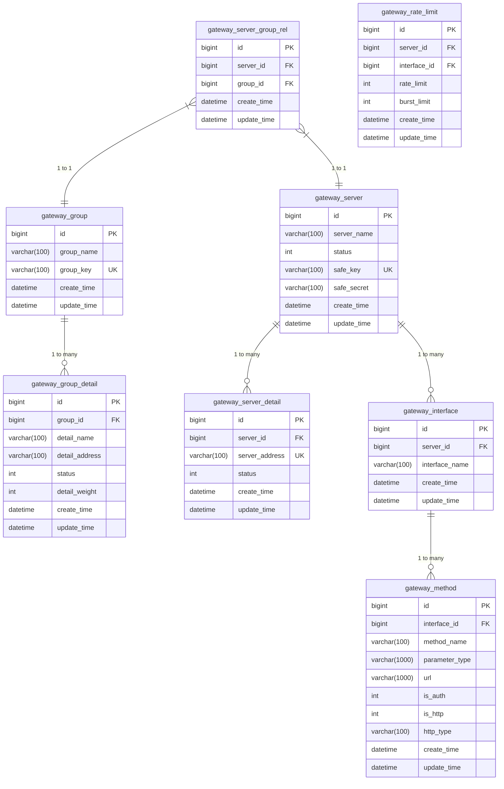

```mermaid
erDiagram
    gateway_group ||--o{ gateway_group_detail : "1 to many"
    gateway_server ||--o{ gateway_server_detail : "1 to many"
    gateway_server ||--o{ gateway_interface : "1 to many"
    gateway_interface ||--o{ gateway_method : "1 to many"
    gateway_server_group_rel }|--|| gateway_server : "1 to 1"
    gateway_server_group_rel }|--|| gateway_group : "1 to 1"

    gateway_group {
        bigint id PK
        varchar(100) group_name
        varchar(100) group_key UK
        datetime create_time
        datetime update_time
    }
    
    gateway_group_detail {
        bigint id PK
        bigint group_id FK
        varchar(100) detail_name
        varchar(100) detail_address
        int status
        int detail_weight
        datetime create_time
        datetime update_time
    }
    
    gateway_server {
        bigint id PK
        varchar(100) server_name
        int status
        varchar(100) safe_key UK
        varchar(100) safe_secret
        datetime create_time
        datetime update_time
    }
    
    gateway_server_detail {
        bigint id PK
        bigint server_id FK
        varchar(100) server_address UK
        int status
        datetime create_time
        datetime update_time
    }
    
    gateway_interface {
        bigint id PK
        bigint server_id FK
        varchar(100) interface_name
        datetime create_time
        datetime update_time
    }
    
    gateway_method {
        bigint id PK
        bigint interface_id FK
        varchar(100) method_name
        varchar(1000) parameter_type
        varchar(1000) url
        int is_auth
        int is_http
        varchar(100) http_type
        datetime create_time
        datetime update_time
    }
    
    gateway_server_group_rel {
        bigint id PK
        bigint server_id FK
        bigint group_id FK
        datetime create_time
        datetime update_time
    }

    gateway_rate_limit {
        bigint id PK
        bigint server_id FK
        bigint interface_id FK
        int rate_limit
        int burst_limit
        datetime create_time
        datetime update_time
    }
```

