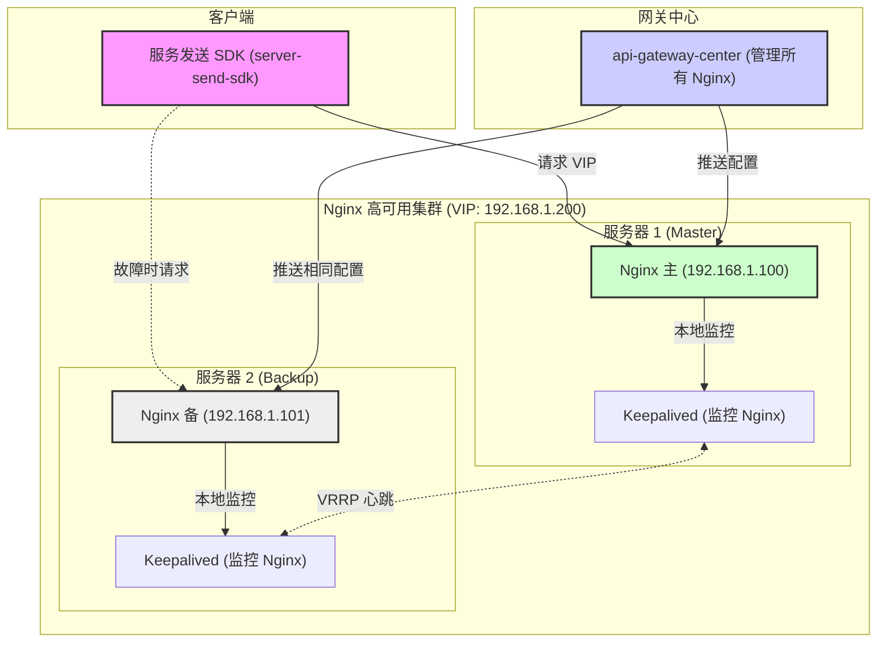
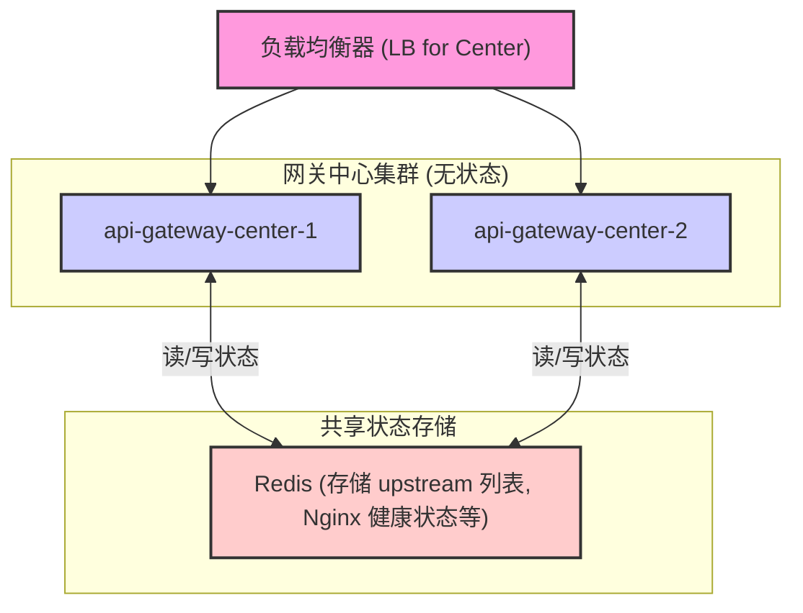

# API 网关高可用 (HA) 与中心无状态化方案设计

## Redis 存储信息概览

本节旨在梳理 Redis 在本方案实施前后的数据存储变化。

### 方案实施前 (当前)

在当前架构中，Redis 主要承载了服务发现、接口缓存、心跳维持和消息通知等功能：

1. **接口信息 (Interface Info)**：
   - 由 `api-gateway-core` 缓存接口和方法定义。
   - **示例 Key**: `api:gateway:interface` (Hash)
2. **网关核心服务心跳信息 (Gateway Core Heartbeat)**：
   - 由 `api-gateway-center` 写入和管理，用于服务发现。
   - **示例 Key**: `api:gateway:core:group:host:port` (String)
3. **下游服务心跳信息 (Downstream Service Heartbeat)**：
   - 由 `server-find-sdk` 写入和管理，用于下游业务服务的存活证明。
   - **示例 Key**: `api:gateway:heartbeat:group:host:port` (String)
4. **分布式限流数据 (Rate Limiting Data)**：
   - 由 `api-gateway-core` 的 `DistributedRateLimiter` 使用，存储限流相关的计数器和时间戳。
5. **Pub/Sub 通道 (Pub/Sub Channels)**：
   - 用于实例间的消息广播，如 `"service-launched"` (缓存刷新) 和 `"heartBeat"` (心跳通知)。

### 方案实施后 (新增)

在实施本高可用与无状态方案后，我们将在 Redis 中新增以下关键信息，以支撑新架构：

1. **Nginx `upstream` 实例列表 (网关中心状态)**：
   - **用途**：替代 `api-gateway-center` 的内存状态，存储所有 `api-gateway-core` 实例的列表。网关中心将从此读取数据来生成 Nginx 配置。
   - **示例 Key**: `nginx:gateway:instances` (Hash)
   - **实现**：实现**第二部分：网关中心无状态方案**。
2. **Nginx 物理节点健康状态 (Nginx 监控)**：
   - **用途**：存储 Nginx 主备物理机的健康状态（`"UP"` / `"DOWN"`），用于监控告警和配置推送降级。
   - **示例 Key**: `nginx:gateway:health_status:192.168.1.100` (String)
   - **实现**：实现**第三部分：客户端感知的健康监控机制**。

## 方案正文

本文档旨在设计一套健壮的 API 网关架构，解决两大核心问题：

1. **Nginx 单点故障 (SPOF)**：作为流量入口的 Nginx 存在单点故障风险。
2. **网关中心有状态**：`api-gateway-center` (网关中心) 在内存中维护状态，导致其难以横向扩展和实现高可用。

本方案将通过引入 **Keepalived**、**Redis** 以及**客户端感知的健康监控机制**，构建一个高可用、无状态且具备快速感知能力的网关系统。

## 第一部分：Nginx 高可用方案 (Keepalived)

本方案采用业界标准的 Keepalived + VIP (虚拟 IP) 模式作为 Nginx 层高可用的核心基础。

### 1.1. 核心设计

1. **部署模型**：部署至少两台 Nginx 服务器（例如 `192.168.1.100` 作为主节点，`192.168.1.101` 作为备节点）。每台服务器上均安装 Nginx 和 Keepalived。
2. **虚拟 IP (VIP)**：Keepalived 集群将共用一个虚拟 IP（例如 `192.168.1.200`）。这个 VIP 是客户端（`server-send-sdk`）访问网关的**唯一入口**。
3. **自动故障转移**：
   - Keepalived 会通过健康检查脚本（如检查 Nginx 进程或探测 `/healthz` 接口）持续监控**本机** Nginx 的健康状况。
   - 正常情况下，VIP 绑定在主节点（Master）上。
   - 当主节点的 Nginx 发生故障，Keepalived 检测到异常，会自动将 VIP 漂移（切换）到健康的备节点（Backup）上。
   - 这个切换过程对客户端完全透明，实现了秒级的自动故障恢复。

### 1.2. 架构图

### 1.3. 关键原则

- **客户端透明**：`server-send-sdk` **只配置 VIP 地址**。它不需要知道，也不应该关心后端 Nginx 的物理 IP 和主备状态。
- **配置一致性**：`api-gateway-center` **必须**向 Nginx 集群中的**所有**节点（无论主备）推送完全一致的 Nginx 配置文件，以确保任何节点在接管 VIP 时都持有最新的路由规则。

## 第二部分：网关中心无状态方案 (Redis)

本方案通过将网关中心的状态数据外部化，实现网关中心自身的无状态和高可用。

### 2.1. 核心问题

当前 `api-gateway-center` 是“有状态”的，因为它在**内存**中维护 Nginx 的 `upstream` 列表（即网关核心服务的实例列表）。这导致：

1. **单点故障**：如果唯一的网关中心实例宕机，服务注册和 Nginx 配置刷新将完全停止。
2. **无法扩展**：如果启动多个网关中心实例，它们的内存状态不互通，会导致 Nginx 配置被不同实例错误地频繁覆盖，造成配置混乱。

### 2.2. 解决方案

将所有需要共享的“状态”数据从内存迁移到 **Redis** 中。

- **状态数据**：核心是指 Nginx `upstream` 块中所需的服务实例列表（例如 `upstream gateway_backend { ... }`）。
- **实现**：`api-gateway-center` 在启动时和运行时，从 Redis（例如一个 Hash 结构，Key 为 `nginx:gateway:instances`）中读取 `upstream` 列表。当服务注册或下线时，网关中心**只操作 Redis** 中的数据。
- **好处**：所有网关中心实例都读写 Redis 中的同一份数据，实现了状态共享。网关中心可以部署多个实例，通过负载均衡器对外提供服务，实现自身的高可用和横向扩展。

### 2.3. 架构图

## 第三部分：客户端感知的健康监控机制

本方案在 Keepalived 的自动故障转移基础上，增加一套由网关中心和 SDK 共同参与的、基于 Redis 的**应用层健康监控机制**。

**注意**：此机制**不负责** Nginx 的主备切换（这是 Keepalived 的工作），它主要用于**状态监控、告警和配置推送降级**。

### 3.1. 监控数据结构

我们在 Redis 中为每个 Nginx 物理节点维护一个健康状态：

- **Key**: `nginx:gateway:health_status:192.168.1.100`
- **Value**: `"UP"` (健康) / `"DOWN"` (失效)

### 3.2. 探活机制：客户端触发 (SDK 上报)

这是你提议的核心机制，用于快速响应真实客户端遇到的问题。

1. **SDK 感知失败**：`server-send-sdk` 在向 VIP 发送请求时，如果连续遇到网络层失败（例如 `Connection refused` 或 `Request timeout`）达到一定阈值（例如 3 次）。
2. **SDK 异步上报**：SDK **异步**地（避免阻塞业务线程）向 `api-gateway-center` 发送一个“疑似故障”的通知。
3. **中心立即探活**：网关中心收到通知后，**立即触发**一次对所有 Nginx 物理节点（`192.168.1.100` 和 `192.168.1.101`）的健康检查（例如通过 HTTP 请求 `/healthz` 接口）。
4. **标记状态**：如果发现某个节点（如 `192.168.1.100`）探活失败，网关中心立即更新 Redis 中的状态： `SET nginx:gateway:health_status:192.168.1.100 "DOWN"`

### 3.3. 探活机制：中心主动轮询（定时任务）

为了确保监控的完整性并实现自动恢复，网关中心还必须有主动探活能力。

1. **主动轮询**：`api-gateway-center` 启动一个定时任务（例如每分钟执行一次），轮询**所有** Nginx 物理节点的 `/healthz` 接口。
2. **更新状态**：根据探活结果实时更新 Redis 中的 `"UP"` / `"DOWN"` 状态。

### 3.4. 自动恢复机制

当一个节点被标记为 `"DOWN"` 后，上述的**主动轮询任务**（3.3 节）将扮演“恢复探活”的角色：

- 定时任务会**持续**尝试探活 `"DOWN"` 状态的节点。
- 一旦该节点（例如 `192.168.1.100`）的 `/healthz` 接口恢复访问，定时任务会立即将其在 Redis 中的状态改回 `"UP"`： `SET nginx:gateway:health_status:192.168.1.100 "UP"`

### 3.5. 监控机制的应用

这个存储在 Redis 中的 `"UP"`/`"DOWN"` 状态有两个关键作用：

1. **监控与告警**：
   - `api-gateway-front` (管理后台) 可以实时从 Redis 读取这些状态，在界面上清晰展示每个 Nginx 节点的真实健康状况。
   - 当状态变为 `"DOWN"` 时，可触发自动告警（短信、钉钉等），通知运维人员介入。
2. **配置推送降级**：
   - 当网关中心需要刷新 Nginx 配置时（例如有新服务注册），它会查询 Redis 中的健康状态。
   - 对于状态为 `"DOWN"` 的 Nginx 节点，网关中心可以**跳过**对该节点的 SSH 配置推送，避免因 SSH 连接超时而阻塞整个配置刷新流程。
