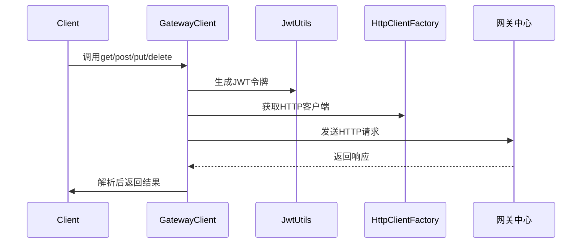
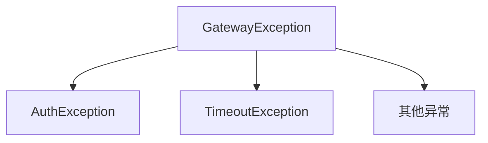

# 详情介绍

## 一、组件概述

服务发送SDK（send-sdk）是一个轻量级的Java客户端库，用于简化应用程序与网关中心（apigateway-center）的交互。它提供了一套简洁的API来调用网关服务，并自动处理认证、连接管理、超时控制等底层细节。

### 核心价值

- **开箱即用**：只需少量配置即可接入网关系统
- **安全认证**：自动生成JWT令牌处理认证
- **连接优化**：内置HTTP连接池管理
- **异常处理**：统一错误处理机制
- **响应解析**：自动解析网关返回结果

## 二、核心功能详解

### 1. 认证机制

**JWT自动生成**：

```java
// 使用HMAC256算法生成令牌
public String generateToken(String key, String secret) {
    return JWT.create()
        .withClaim("safe-key", key)
        .sign(Algorithm.HMAC256(secret));
}
```

- 自动将安全密钥嵌入请求头
- 默认有效期30天
- 每次请求自动刷新

### 2. 连接池管理

**优化连接使用**：

- 支持最大连接数配置（默认100）
- 空闲连接自动清理（60秒）
- 连接复用减少TCP握手开销
- 支持连接超时和读取超时配置

### 3. 请求执行流程



### 4. 异常处理体系



- `AuthException`: 认证失败(401)
- `TimeoutException`: 请求超时(504)
- `GatewayException`: 其他网关错误

## 三、使用方法

### 1. 添加Maven依赖

```xml
<dependency>
    <groupId>top.codelong</groupId>
    <artifactId>send-sdk</artifactId>
    <version>1.0.0</version>
</dependency>
```

### 2. 配置参数(application.yml)

```yaml
api:
  gateway:
    sdk:
      base-url: http://gateway-center:8080
      safe-key: your_safe_key
      safe-secret: your_safe_secret
      connect-timeout: 5000    # 连接超时(ms)
      socket-timeout: 10000     # 读取超时(ms)
      max-connections: 100      # 最大连接数
```

### 3. 代码调用示例

```java
@Service
public class OrderService {
    @Resource
    private GatewayClient gatewayClient;
    
    public String getOrderDetails(String orderId) {
        try {
            // GET请求示例
            Map<String, Object> params = Map.of("orderId", orderId);
            return gatewayClient.get("/orders/detail", params);
            
        } catch (AuthException e) {
            // 处理认证失败
            return "认证失败，请检查安全密钥";
        } catch (TimeoutException e) {
            // 处理超时
            return "请求超时，请重试";
        }
    }
    
    public String createOrder(Order order) {
        // POST请求示例
        return gatewayClient.post("/orders", null, order);
    }
}
```

### 4. 高级配置

```java
@Configuration
public class CustomSDKConfig {
    @Bean
    public GatewaySDKProperties customProperties() {
        GatewaySDKProperties props = new GatewaySDKProperties();
        props.setBaseUrl("https://api.yourdomain.com");
        props.setConnectTimeout(8000);
        props.setMaxConnections(200);
        return props;
    }
}
```
