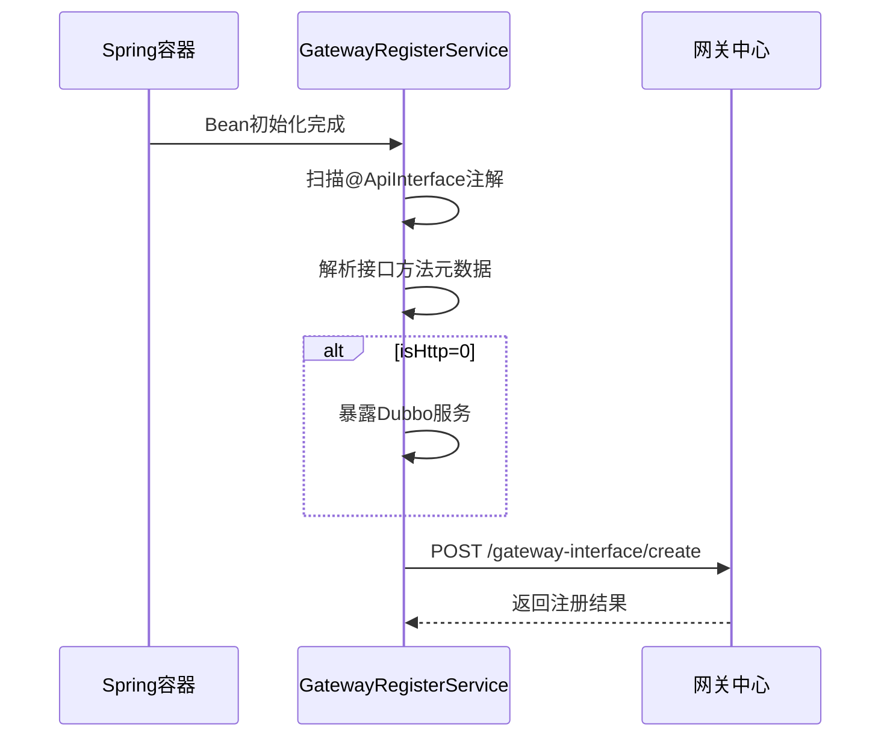
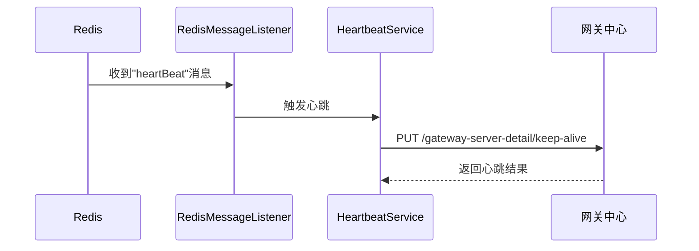

# 详情介绍

## 组件工作逻辑

### 服务注册流程



### 心跳维持流程



## 文件详细说明

### 1. GatewayRegisterService

**路径**: top.codelong.findsdk.service
 ​**​作用​**: 服务注册核心处理器，实现BeanPostProcessor接口
 ​**​关键逻辑​**:

```java
public Object postProcessAfterInitialization(Object bean, String beanName) {
    // 1. 检查ApiInterface注解
    ApiInterface apiInterface = bean.getClass().getAnnotation(ApiInterface.class);
    
    // 2. 获取接口信息
    Class<?> interfaceClass = interfaces[0];
    registerVO.setInterfaceName(interfaceClass.getName());
    
    // 3. 设置服务器地址
    String serverPort = environment.getProperty("server.port", "8080");
    registerVO.setServerUrl(localIp + ":" + serverPort);
    
    // 4. 处理方法元数据
    for (Method method : methods) {
        ApiMethod apiProducerMethod = method.getAnnotation(ApiMethod.class);
        MethodSaveDomain saveDomain = buildMethodMetadata(method, apiProducerMethod);
        
        // 5. 暴露Dubbo服务
        if (apiProducerMethod.isHttp() == 0) {
            exposeMethodService(bean, interfaceClass, saveDomain);
        }
    }
    
    // 6. 注册到网关中心
    register(registerVO);
}
```

### 2. InterfaceRegisterVO

**路径**: top.codelong.findsdk.vo
 ​**​作用​**: 封装接口注册信息
 ​**​数据结构​**:

```java
public class InterfaceRegisterVO {
    private String serverUrl;     // 服务器地址
    private String safeKey;       // 安全密钥
    private String safeSecret;    // 安全凭证
    private String interfaceName; // 接口全限定名
    private List<MethodSaveDomain> methods; // 方法列表
}
```

### 3. ApiMethod

**路径**: top.codelong.findsdk.annotation
 ​**​作用​**: 定义方法元数据注解
 ​**​属性说明​**:

```java
public @interface ApiMethod {
    int isHttp() default 0; // 是否是HTTP接口 (1:是, 0:否)
    HttpTypeEnum httpType() default HttpTypeEnum.GET; // HTTP方法类型
    String url() default ""; // HTTP接口URL
    int isAuth() default 0;  // 是否需要认证 (1:是, 0:否)
}
```

### 4. GatewaySDKAutoConfig

**路径**: top.codelong.findsdk.config
 ​**​作用​**: 组件自动配置入口
 ​**​关键配置​**:

```java
@Configuration
@EnableConfigurationProperties(GatewayServerConfig.class)
@ConditionalOnProperty(
    prefix = "api-gateway-sdk",
    name = "enabled",
    havingValue = "true",
    matchIfMissing = true
)
public class GatewaySDKAutoConfig {
    @Bean
    public GatewayRegisterService gatewayRegisterService() {
        return new GatewayRegisterService();
    }
}
```

### 5. GatewayServerConfig

**路径**: top.codelong.findsdk.config
 ​**​作用​**: 网关服务配置属性
 ​**​配置项​**:

```java
@ConfigurationProperties(prefix = "gateway-server")
public class GatewayServerConfig {
    private String serverName;    // 服务名称
    private String centerAddr;   // 网关中心地址
    private String safeKey;       // 安全密钥
    private String safeSecret;    // 安全凭证
}
```

### 6. HeartbeatService

**路径**: top.codelong.findsdk.service
 ​**​作用​**: 心跳维持服务
 ​**​核心逻辑​**:

```java
public void heartbeat() {
    // 1. 获取服务器地址
    String serverPort = environment.getProperty("server.port", "8080");
    String localAddr = localIp + ":" + serverPort;
    
    // 2. 构造心跳请求
    String fullUrl = centerAddr + "/gateway-server-detail/keep-alive";
    Map<String, Object> param = new HashMap<>();
    param.put("safeKey", safeKey);
    param.put("addr", localAddr);
    
    // 3. 发送心跳
    HttpRequest request = HttpUtil.createRequest(Method.PUT, fullUrl);
    request.body(JSON.toJSONString(param));
    request.execute();
}
```

### 7. RedisConfig

**路径**: top.codelong.findsdk.config
 ​**​作用​**: 配置Redis消息监听
 ​**​关键配置​**:

```java
@Bean
public RedisMessageListenerContainer container(
        RedisConnectionFactory factory,
        RedisMessageListener listener) {
    
    container.addMessageListener(listener, new ChannelTopic("heartBeat"));
    return container;
}
```

## 文件协同工作

1. **启动阶段**:
   - Spring Boot加载`META-INF/spring.factories`中的自动配置
   - `GatewaySDKAutoConfig`创建`GatewayRegisterService` Bean
2. **服务注册阶段**:
   - `GatewayRegisterService`扫描带有`@ApiInterface`的Bean
   - 使用`ApiMethod`解析方法元数据
   - 对于Dubbo接口，使用`DubboConfig`的配置进行服务暴露
   - 构造`InterfaceRegisterVO`和`MethodSaveDomain`
   - 发送注册请求到`GatewayServerConfig.centerAddr`
3. **运行阶段**:
   - `RedisConfig`创建消息监听容器
   - `RedisMessageListener`监听"heartBeat"频道
   - 触发`HeartbeatService`发送心跳到网关中心
4. **配置管理**:
   - 所有配置通过`GatewayServerConfig`统一管理
   - Dubbo基础配置通过`DubboConfig`提供

## 注意事项

1. **接口实现要求**：

   ```java
   // 只能实现一个接口
   public class UserServiceImpl implements UserService {
       // 其他接口会导致异常
   }
   ```

2. **Dubbo服务暴露**：

   ```java
   // 每个方法独立group暴露
   serviceConfig.setGroup("method-group-" + saveDomain.getMethodName());
   ```

3. **心跳触发**：

   ```java
   // 需要网关中心向Redis发送"heartBeat"消息
   // 触发心跳维持机制
   ```

4. **服务配置**：

   ```
   gateway-server:
     serverName: test-provider
     center-addr: 127.0.0.1:18080
     safeKey: safeKey
     safeSecret: safeSecret
   ```

5. **HTTP接口**：

   ```
   @ApiMethod(isHttp=1, url="/custom/path")
   // 需要自行实现HTTP接口
   ```
