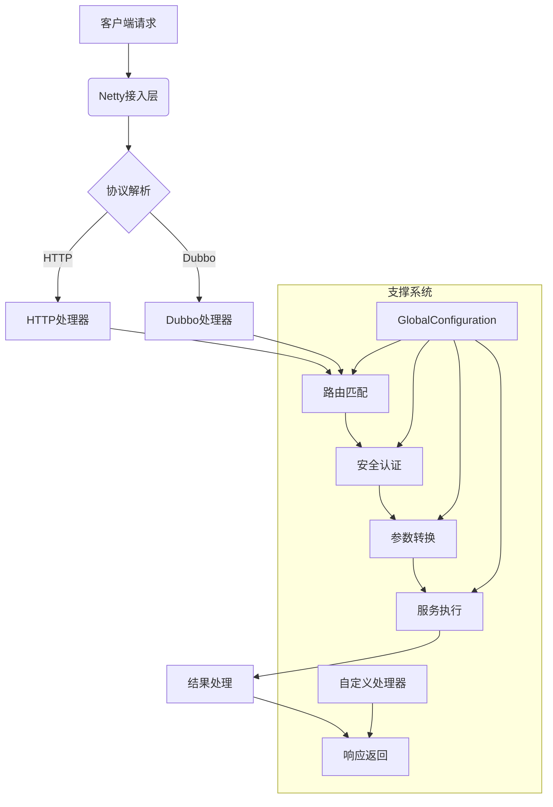
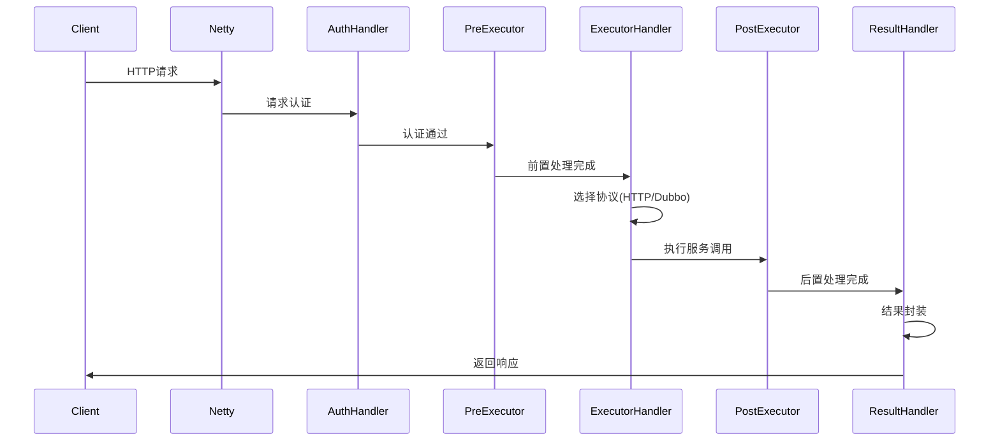
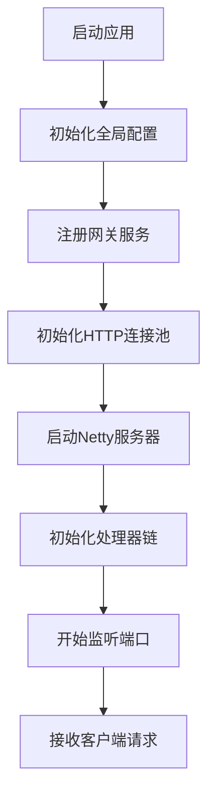

# 项目结构文档

## 总体架构设计



## 核心模块结构

### 1. 核心配置模块

| 类名                | 功能描述                       |
| ------------------- | ------------------------------ |
| GlobalConfiguration | 全局配置中心，管理所有核心配置 |
| RedisConfig         | Redis配置及模板初始化          |
| HTTPTypeEnum        | HTTP请求类型枚举               |

### 2. 网络通信层

| 类名                     | 功能描述        |
| ------------------------ | --------------- |
| SocketServerBootStrap    | Netty服务启动器 |
| ServerHandlerInitializer | Netty管道初始化 |
| BaseHandler              | 处理器基类      |

### 3. 请求处理链

| 处理器               | 功能描述          |
| -------------------- | ----------------- |
| AuthorizationHandler | JWT认证与权限校验 |
| PreExecutorHandler   | 前置处理器执行器  |
| ExecutorHandler      | 服务执行分发器    |
| PostExecutorHandler  | 后置处理器执行器  |
| ResultHandler        | 结果封装处理器    |

### 4. 协议支持层

| 模块                    | 功能描述                    |
| ----------------------- | --------------------------- |
| HTTPConnection          | HTTP协议连接实现            |
| DubboConnection         | Dubbo协议连接实现           |
| DefaultHTTPExecutor     | 异步HTTP请求执行引擎        |
| DefaultDubboExecutor    | 异步Dubbo泛化调用引擎       |
| HTTPExecutorSpiFinder   | HTTP执行器SPI加载器         |

### 5. 服务管理

| 类名                 | 功能描述                    |
| -------------------- | --------------------------- |
| GatewayServer        | 网关服务管理及负载均衡      |
| RedisMessageListener | Redis消息监听处理           |
| InterfaceCacheUtil   | 接口配置缓存管理（L1+L2）   |
| PreExecutorHandler   | 前置处理器缓存支持          |
| ResultHandler        | 结果处理器响应缓存支持      |

### 6. 工具类模块

| 工具类               | 功能描述          |
| -------------------- | ----------------- |
| JwtUtils             | JWT令牌生成与验证 |
| RequestParameterUtil | 请求参数解析工具  |
| RequestResultUtil    | 响应结果封装工具  |

### 7. 数据模型

| 模型类                    | 功能描述         |
| ------------------------- | ---------------- |
| Result                    | 统一响应结果封装 |
| HttpStatement             | HTTP请求声明对象 |
| GroupRegisterReqVO        | 注册请求参数VO   |
| GroupDetailRegisterRespVO | 注册响应参数VO   |

## 包结构详解

```
top.codelong.apigatewaycore
├── common                     // 公共模块
│   ├── result                 // 统一结果封装
│   │   └── Result.java        // 统一响应格式
│   ├── vo                     // 值对象
│   │   ├── GroupDetailRegisterRespVO.java
│   │   └── GroupRegisterReqVO.java
│   ├── GatewayServer.java     // 网关服务管理
│   └── HttpStatement.java     // HTTP请求声明
│
├── config                     // 配置模块
│   ├── listener               // 监听器
│   │   └── RedisMessageListener.java
│   ├── GlobalConfiguration.java // 全局配置
│   └── RedisConfig.java       // Redis配置
│
├── connection                 // 连接管理
│   ├── BaseConnection.java    // 连接接口
│   ├── DubboConnection.java  // Dubbo连接
│   └── HTTPConnection.java   // HTTP连接
│
├── enums                      // 枚举类
│   └── HTTPTypeEnum.java      // HTTP请求类型枚举
│
├── executors                  // 执行引擎
│   ├── BaseExecutor.java      // 执行器接口
│   ├── DubboExecutor.java     // Dubbo执行器
│   └── HTTPExecutor.java      // HTTP执行器
│
├── socket                     // 网络通信
│   ├── handlers              // 处理器
│   │   ├── AuthorizationHandler.java
│   │   ├── ExecutorHandler.java
│   │   ├── PostExecutorHandler.java
│   │   ├── PreExecutorHandler.java
│   │   └── ResultHandler.java
│   ├── custom                // 自定义处理器
│   │   ├── post             // 后置处理器
│   │   │   ├── CustomPostHandler.java
│   │   │   └── TestPostHandler.java
│   │   └── pre              // 前置处理器
│   │       ├── CustomPreHandler.java
│   │       └── TestPreHandler.java
│   ├── BaseHandler.java       // 处理器基类
│   ├── ServerHandlerInitializer.java
│   └── SocketServerBootStrap.java
│
├── utils                      // 工具类
│   ├── InterfaceCacheUtil.java
│   ├── JwtUtils.java
│   ├── RequestParameterUtil.java
│   └── RequestResultUtil.java
│
└── ApiGatewayCoreApplication.java // 启动类
```

## 核心流程处理链



## 关键设计特点

1. **模块化设计**：
   - 清晰划分网络层、协议层、业务层
   - 各模块通过接口解耦

2. **异步化处理**：
   - 异步HTTP客户端（HttpAsyncClient）
   - 异步Dubbo调用（$invokeAsync）
   - CompletableFuture链式处理
   - 非阻塞I/O提升吞吐量

3. **多级缓存策略**：
   - **L1缓存**：内存缓存（接口配置、响应数据）
   - **L2缓存**：Redis缓存（分布式共享）
   - **缓存淘汰**：LFU策略自动管理
   - **缓存同步**：Redis Pub/Sub保证一致性

4. **可扩展性**：
   - 自定义前置/后置处理器接口
   - 支持多种协议扩展（HTTP/Dubbo）
   - SPI机制加载执行器
   - 插件式设计便于功能扩展

5. **高性能架构**：
   - 基于Netty NIO模型
   - 异步连接池复用技术
   - 多级缓存策略
   - 零拷贝优化

6. **安全机制**：
   - JWT令牌认证
   - 接口级权限控制
   - 安全密钥管理

7. **健壮性保障**：
   - 异常统一处理
   - 熔断降级机制
   - 心跳检测与服务发现

## 启动流程



该架构设计充分考虑了高性能网关的核心需求，通过分层设计和模块化解耦，实现了灵活可扩展的网关系统。各模块职责明确，协同工作完成请求处理全流程。