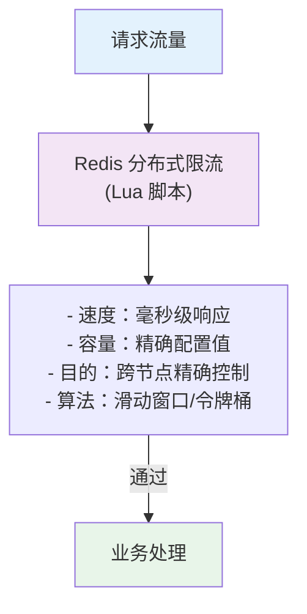
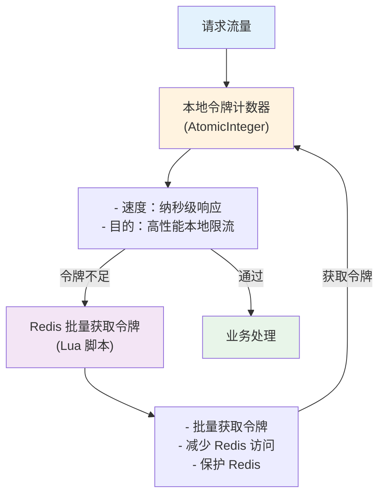
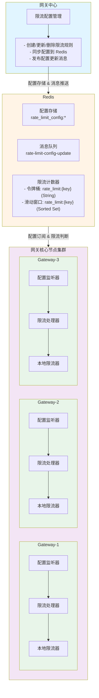

# 分布式限流器 - 设计理念与架构

## 一、设计理念

### 1.1 为什么需要分布式限流？

在微服务架构中，API网关作为流量入口，面临以下挑战：

- **流量突发**：秒杀、促销等场景下，瞬时流量可能超过系统承载能力
- **恶意攻击**：DDoS攻击、爬虫等恶意请求消耗系统资源
- **资源保护**：保护后端服务不被打垮，避免雪崩效应
- **多节点协同**：网关集群需要跨节点的统一限流控制

### 1.2 核心设计思想

#### 两种限流模式

系统支持两种限流模式，可根据业务需求灵活选择：

**模式一：DISTRIBUTED（分布式限流，默认）**



**特点：**
- 直接使用 Redis 侧的滑动窗口或令牌桶算法
- 精确的分布式限流控制
- 适合对限流精度要求高的场景

**模式二：LOCAL_DISTRIBUTED（本地+分布式混合，高性能）**



**特点：**
- 使用本地原子计数器进行高性能限流
- 从 Redis 批量获取令牌，减少网络开销
- 适合对性能要求极高的场景
- 本地限流性能极高（纳秒级），Redis 访问频率大幅降低

#### 设计原理

1. **DISTRIBUTED 模式（默认）**
   - 直接使用 Redis 侧的限流算法
   - 保证全局一致性和精确控制
   - 适合中等并发场景

2. **LOCAL_DISTRIBUTED 模式（高性能）**
   - 本地令牌计数器：使用 AtomicInteger 进行原子操作，性能极高
   - 批量获取令牌：从 Redis 批量获取一定数量的令牌，减少网络往返
   - 本地消费：在本地快速消费令牌，避免频繁访问 Redis
   - 降级策略：Redis 异常时，本地限流仍可继续工作

3. **降级策略**
   - 任何异常情况下自动降级为放行
   - 保证服务可用性，避免限流器成为单点故障

### 1.3 限流粒度设计

限流器支持四个维度的限流粒度，从粗到细，层层防护：

| 粒度级别 | 限流目标 | 应用场景 | 优先级 |
|---------|---------|---------|--------|
| **GLOBAL** | 整个网关集群 | 保护网关整体承载能力 | 最高 |
| **SERVICE** | 特定后端服务 | 保护后端服务不被打垮 | 高 |
| **INTERFACE** | 特定接口路径 | 保护核心接口（如登录、支付） | 中 |
| **IP** | 客户端IP地址 | 防止恶意攻击、爬虫 | 低 |

**粒度选择原则：**

```java
// 限流检查顺序（从粗到细）
1. 全局限流检查 (GLOBAL)
   ↓ 通过
2. 服务级限流检查 (SERVICE)
   ↓ 通过
3. 接口级限流检查 (INTERFACE)
   ↓ 通过
4. IP级限流检查 (IP)
   ↓ 通过
5. 放行请求
```

**粒度组合示例：**

```
场景：保护用户服务的登录接口
- GLOBAL: 10000 QPS  （保护网关整体）
- SERVICE: 2000 QPS  （保护用户服务）
- INTERFACE: 500 QPS （保护登录接口）
- IP: 10 QPS         （防止单个IP暴力破解）
```

## 二、系统架构

### 2.1 整体架构图



### 2.2 核心组件

#### 2.2.1 配置监听器 (RateLimitConfigListener)

**职责：**
- 启动时从 Redis 加载所有限流配置
- 订阅 Redis 的配置更新消息
- 动态更新本地限流器配置

**关键代码：**
```java
@Component
public class RateLimitConfigListener implements MessageListener {

    @PostConstruct
    public void init() {
        // 启动时加载所有配置
        loadAllRateLimitConfigs();

        // 订阅配置更新消息
        redisMessageListenerContainer.addMessageListener(
            this,
            new PatternTopic("rate-limit-config-update")
        );
    }

    @Override
    public void onMessage(Message message, byte[] pattern) {
        String body = new String(message.getBody());

        if ("RELOAD_ALL".equals(body)) {
            // 全量重载
            loadAllRateLimitConfigs();
        } else {
            // 增量更新
            RateLimitConfig config = JSON.parseObject(body, RateLimitConfig.class);
            rateLimiter.updateConfig(buildConfigKey(config), config);
        }
    }
}
```

#### 2.2.2 分布式限流器 (DistributedRateLimiter)

**职责：**
- 管理本地限流器（Guava RateLimiter）
- 执行 Redis 分布式限流判断
- 实现降级策略

**核心方法：**
```java
public boolean tryAcquire(String key, RateLimitConfig config) {
    // 1. 检查配置是否启用
    if (!config.getEnabled()) {
        return true;
    }

    // 2. 本地限流检查
    if (!tryAcquireLocal(key, config)) {
        return false;
    }

    // 3. Redis 分布式限流检查
    try {
        return tryAcquireDistributed(key, config);
    } catch (Exception e) {
        log.error("Redis限流异常，降级为本地限流", e);
        return true; // 降级策略：Redis异常时放行
    }
}
```

#### 2.2.3 限流前置处理器 (RateLimitPreHandler)

**职责：**
- 作为 Handler 集成到请求处理链
- 按粒度顺序执行限流检查
- 限流失败时快速返回

**关键代码：**
```java
@Component
@Order(10)
public class RateLimitPreHandler implements CustomPreHandler {

    @Override
    public Result<Void> handle(HttpStatement httpStatement, FullHttpRequest request) {
        // 1. 全局限流
        if (!checkGlobalLimit()) {
            return Result.fail(ResultCode.RATE_LIMIT_EXCEEDED, "全局限流");
        }

        // 2. 服务级限流
        if (!checkServiceLimit(httpStatement.getServiceName())) {
            return Result.fail(ResultCode.RATE_LIMIT_EXCEEDED, "服务限流");
        }

        // 3. 接口级限流
        if (!checkInterfaceLimit(httpStatement.getServiceName(), httpStatement.getPath())) {
            return Result.fail(ResultCode.RATE_LIMIT_EXCEEDED, "接口限流");
        }

        // 4. IP级限流
        String clientIp = getClientIp(request);
        if (!checkIpLimit(clientIp)) {
            return Result.fail(ResultCode.RATE_LIMIT_EXCEEDED, "IP限流");
        }

        return Result.success();
    }

    @Override
    public int getOrder() {
        return 10; // 在鉴权之后执行
    }

    @Override
    public boolean canRunParallel() {
        return false; // 串行执行，确保准确性
    }

    @Override
    public boolean isFailFast() {
        return true; // 限流失败时快速返回
    }
}
```

### 2.3 LOCAL_DISTRIBUTED 模式的高性能设计

#### 为什么需要 LOCAL_DISTRIBUTED 模式？

1. **极致性能**：本地令牌计数器响应速度极快（纳秒级），避免网络开销
2. **保护 Redis**：批量获取令牌，大幅减少 Redis 访问频率
3. **降级保障**：Redis 异常时，本地限流仍可继续工作
4. **灵活配置**：支持自定义批量大小和容量倍数

#### 工作原理

```
请求到达
    ↓
检查本地令牌计数器
    ↓
令牌充足？
    ├─ 是 → 消费令牌 → 放行请求
    └─ 否 → 从 Redis 批量获取令牌
            ↓
        获取成功？
            ├─ 是 → 设置本地计数器 → 消费令牌 → 放行请求
            └─ 否 → 限流拒绝
```

#### 配置参数说明

| 参数 | 说明 | 默认值 | 示例 |
|------|------|--------|------|
| `mode` | 限流模式 | DISTRIBUTED | LOCAL_DISTRIBUTED |
| `localBatchSize` | 从 Redis 批量获取的令牌数 | 100 | 500 |
| `localCapacityMultiplier` | 本地容量倍数（预留） | 1.0 | 1.0 |

#### 性能对比

```
假设配置：1000 QPS，批量大小：100

仅 Redis 限流：
  - Redis 请求数：1000 次/秒
  - 网络往返：1000 次/秒
  - 延迟：毫秒级

LOCAL_DISTRIBUTED 模式：
  - 本地消费：900 次/秒（纳秒级）
  - Redis 请求数：10 次/秒（批量获取）
  - 网络往返：10 次/秒
  - 平均延迟：纳秒级（99% 请求）
  - Redis 压力：降低 99%
```

#### 配置缓存机制

```java
// 本地令牌计数器（LOCAL_DISTRIBUTED 模式）
private final Map<String, AtomicInteger> localTokenCounters = new ConcurrentHashMap<>();

// 配置缓存
private final Map<String, RateLimitConfig> configCache = new ConcurrentHashMap<>();

// 更新配置时清除缓存
public void updateConfig(String key, RateLimitConfig config) {
    configCache.put(key, config);
    localTokenCounters.remove(key); // 清除旧的令牌计数器
}

