# 分布式限流器 - 流程图与架构图

## 一、流程图

### 5.1 限流判断总流程

#### DISTRIBUTED 模式（默认）

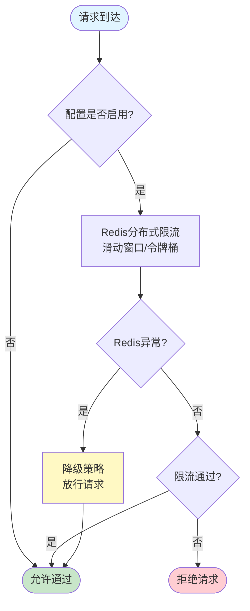

#### LOCAL_DISTRIBUTED 模式（高性能）

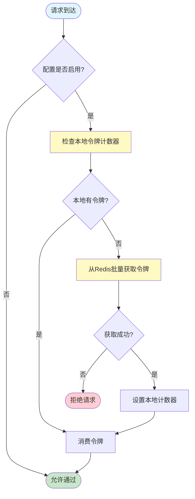

### 5.2 请求处理链中的限流流程

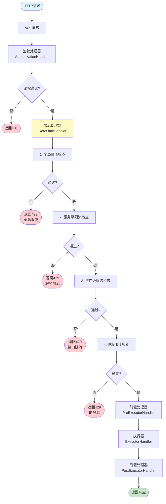

### 5.3 令牌桶算法执行流程（DISTRIBUTED 模式）

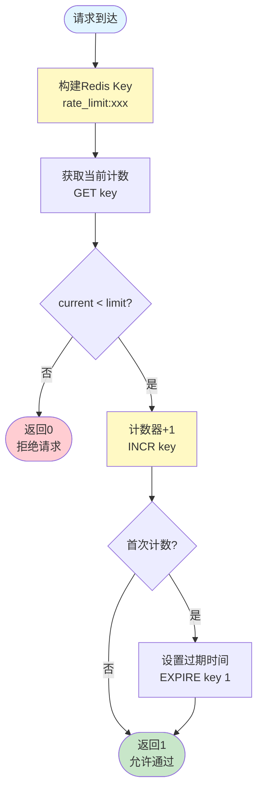

### 5.4 滑动窗口算法执行流程（DISTRIBUTED 模式）

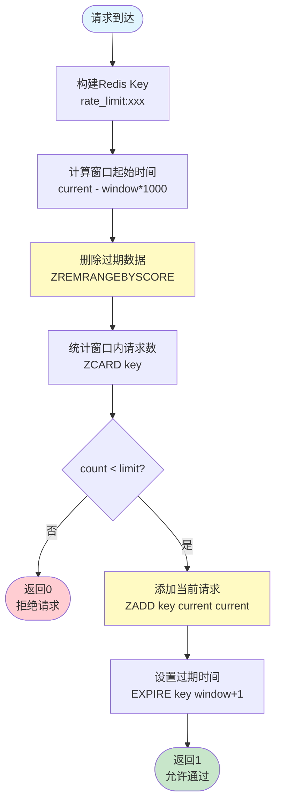

### 5.5 批量获取令牌流程（LOCAL_DISTRIBUTED 模式）

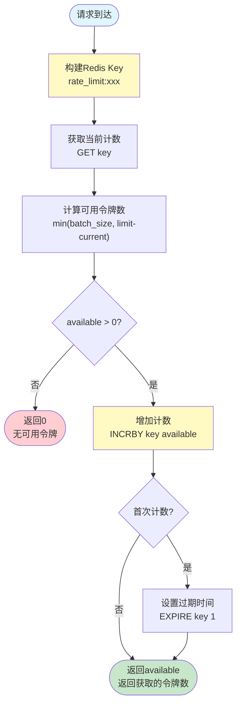

### 5.6 配置更新流程

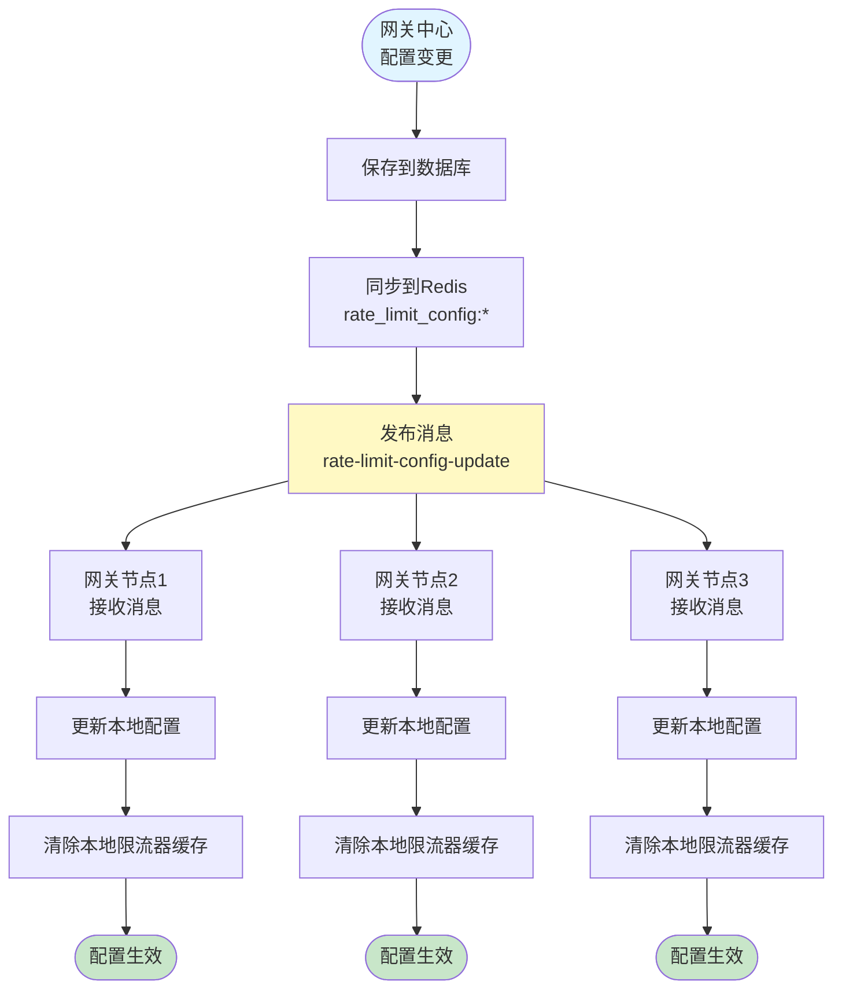

## 二、架构图

### 6.1 系统整体架构

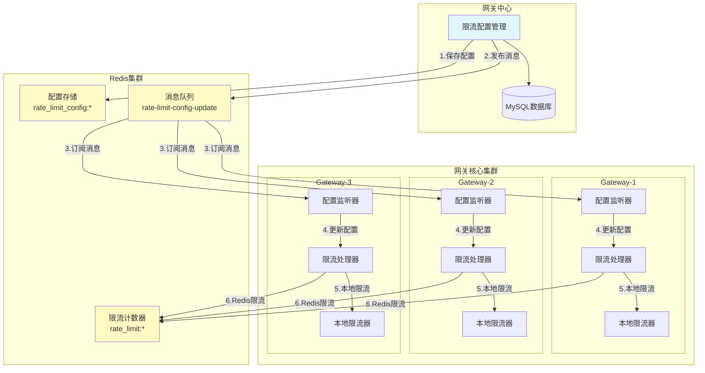

### 6.2 限流器内部架构

#### DISTRIBUTED 模式

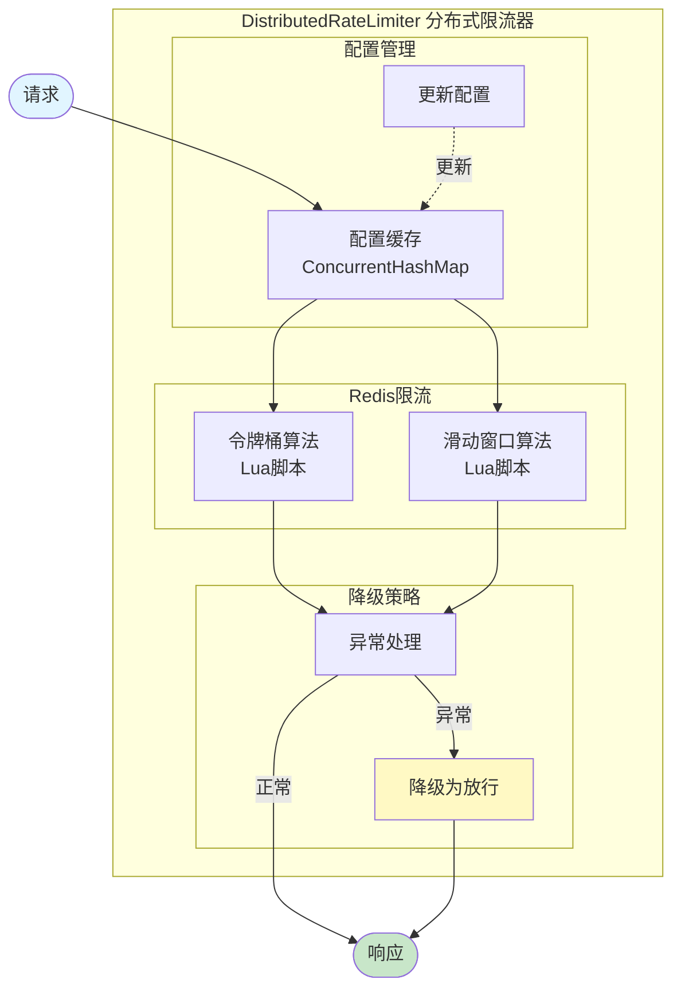

#### LOCAL_DISTRIBUTED 模式

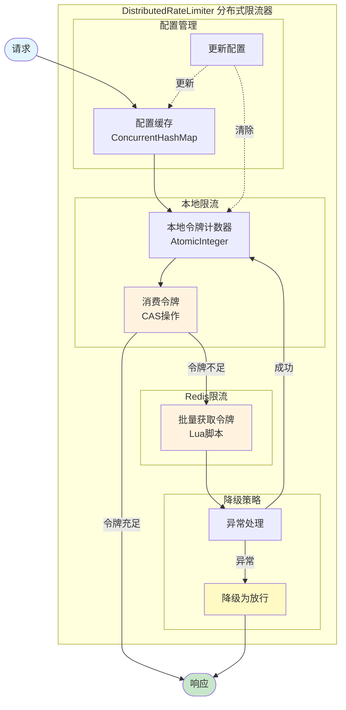

### 6.3 多级限流架构

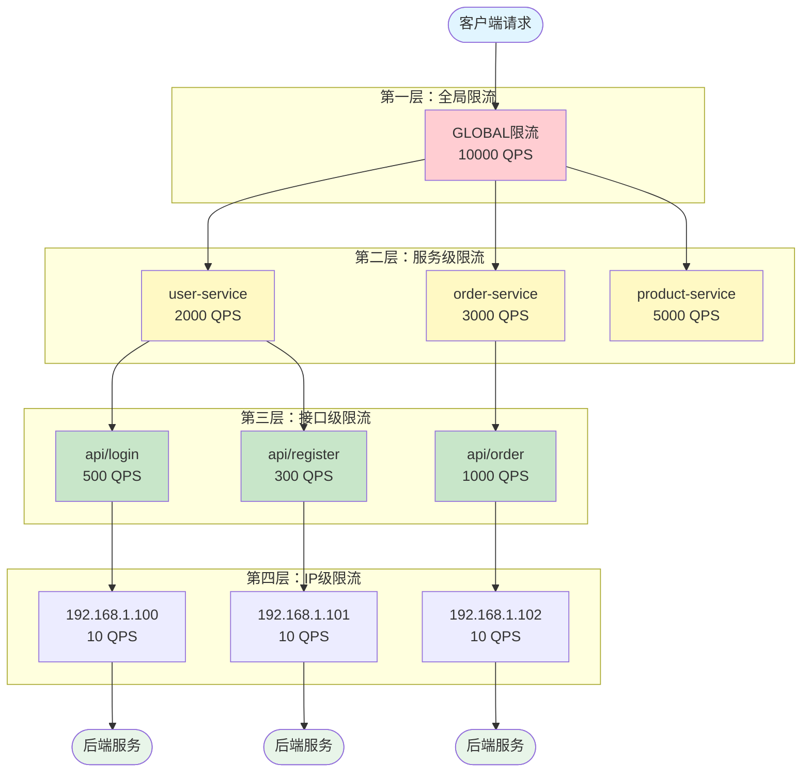

### 6.4 LOCAL_DISTRIBUTED 模式的高性能架构

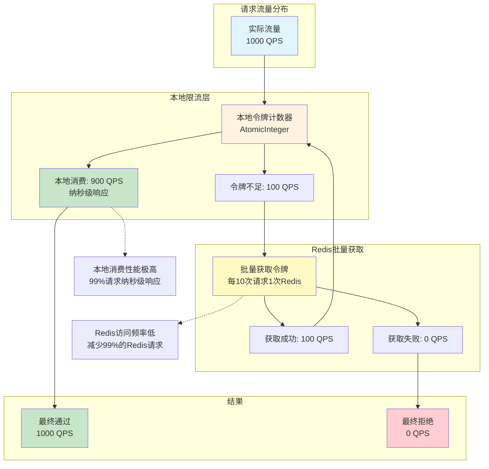

### 6.5 配置同步架构

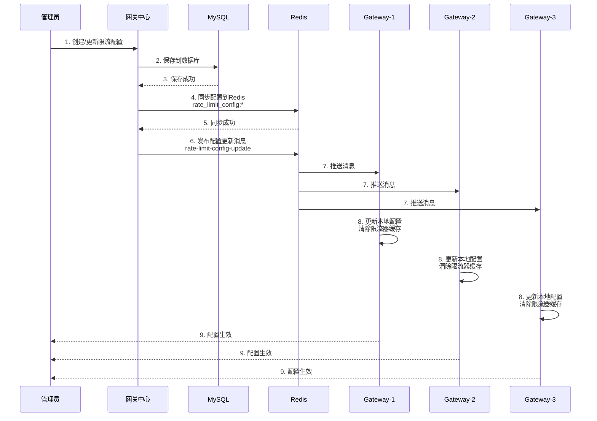

## 三、性能分析

### 7.1 限流模式性能对比

| 限流模式 | 响应时间 | 吞吐量 | Redis 访问 | 准确性 | 适用场景 |
|---------|---------|--------|-----------|--------|---------|
| **DISTRIBUTED** | 毫秒级 | 中等 | 每次请求 | 高（分布式） | 中等并发、精度要求高 |
| **LOCAL_DISTRIBUTED** | 纳秒级 | 极高 | 批量访问 | 高（分布式） | 高并发、性能要求极高 |

### 7.2 LOCAL_DISTRIBUTED 模式的性能优势

```
假设：
- 配置限流：1000 QPS
- 实际流量：1000 QPS
- 批量大小：100

DISTRIBUTED 模式（仅 Redis）：
  Redis 请求数：1000 次/秒
  平均延迟：毫秒级
  Redis 压力：高

LOCAL_DISTRIBUTED 模式：
  本地消费：900 次/秒（纳秒级）
  Redis 请求数：10 次/秒（批量获取）
  平均延迟：纳秒级（99% 请求）
  Redis 压力：降低 99%
  性能提升：100 倍以上
```

### 7.3 降级策略的可用性保障

```
DISTRIBUTED 模式：
  正常情况：Redis 限流 → 业务处理
  Redis 异常：降级放行 → 业务处理
  保障：服务不中断

LOCAL_DISTRIBUTED 模式：
  正常情况：本地消费 → 业务处理
  本地令牌不足：批量获取 → 本地消费 → 业务处理
  Redis 异常：降级放行 → 业务处理
  保障：
    - 99% 请求不受 Redis 影响
    - 本地限流仍生效
    - 避免限流器成为单点故障
```

### 7.4 选择建议

**使用 DISTRIBUTED 模式（默认）：**
- 对限流精度要求高
- 并发量中等（< 10000 QPS）
- 对延迟不敏感

**使用 LOCAL_DISTRIBUTED 模式：**
- 对性能要求极高
- 并发量大（> 10000 QPS）
- 可以接受极小的精度偏差（批量大小范围内）

