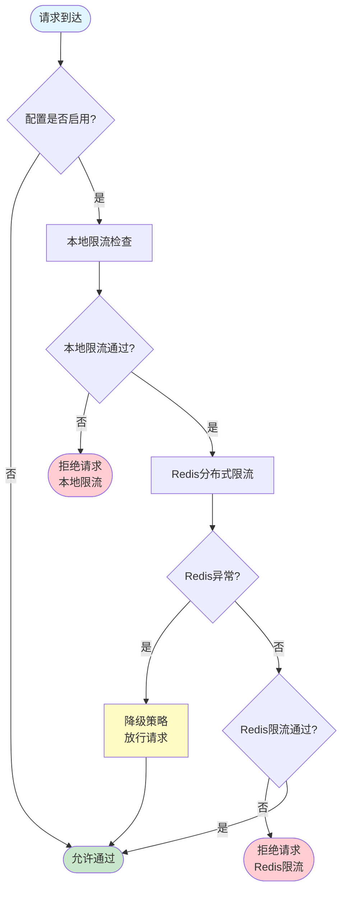
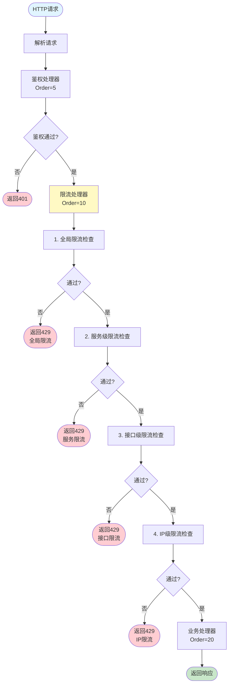
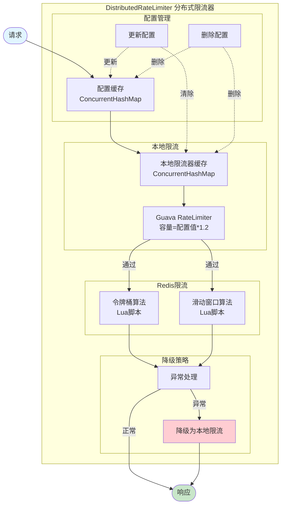
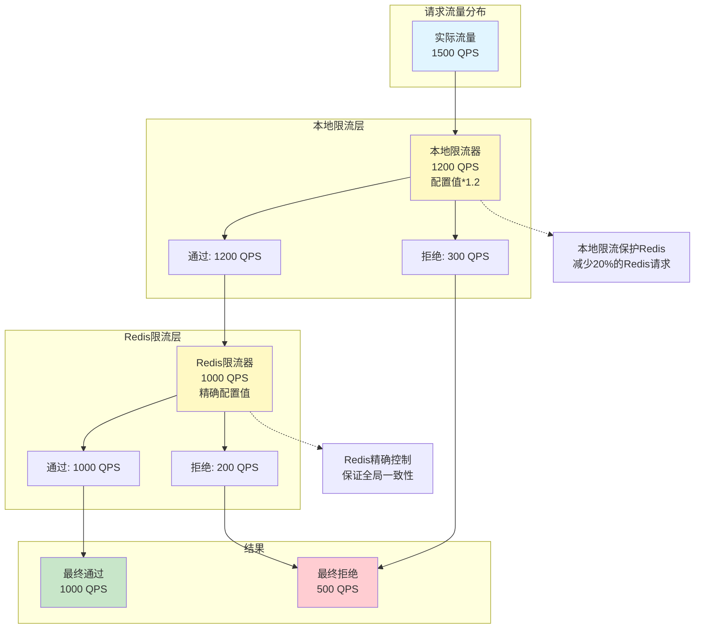

# 分布式限流器 - 流程图与架构图

## 一、流程图

### 5.1 限流判断总流程



### 5.2 请求处理链中的限流流程



### 5.3 令牌桶算法执行流程


### 5.4 滑动窗口算法执行流程


### 5.5 配置更新流程


## 二、架构图

### 6.1 系统整体架构


### 6.2 限流器内部架构



### 6.3 多级限流架构


### 6.4 本地限流与Redis协同架构



### 6.5 配置同步架构


## 三、性能分析

### 7.1 性能对比

| 限流方式 | 响应时间 | 吞吐量 | 准确性 | 适用场景 |
|---------|---------|--------|--------|---------|
| **仅本地限流** | 纳秒级 | 极高 | 低（单机） | 单机应用 |
| **仅Redis限流** | 毫秒级 | 中等 | 高（分布式） | 低并发分布式 |
| **本地+Redis** | 纳秒-毫秒 | 高 | 高（分布式） | 高并发分布式 |

### 7.2 本地限流的性能优势

```
假设：
- 配置限流：1000 QPS
- 实际流量：1500 QPS
- 本地限流：1200 QPS（1.2倍）

仅Redis限流：
  Redis请求数：1500次/秒
  Redis压力：高

本地+Redis限流：
  本地拒绝：300次/秒
  Redis请求数：1200次/秒
  Redis压力：降低20%
```

### 7.3 降级策略的可用性保障

```
正常情况：
  本地限流 → Redis限流 → 业务处理

Redis异常：
  本地限流 → 降级放行 → 业务处理

保障：
  - 服务不中断
  - 本地限流仍生效
  - 避免限流器成为单点故障

