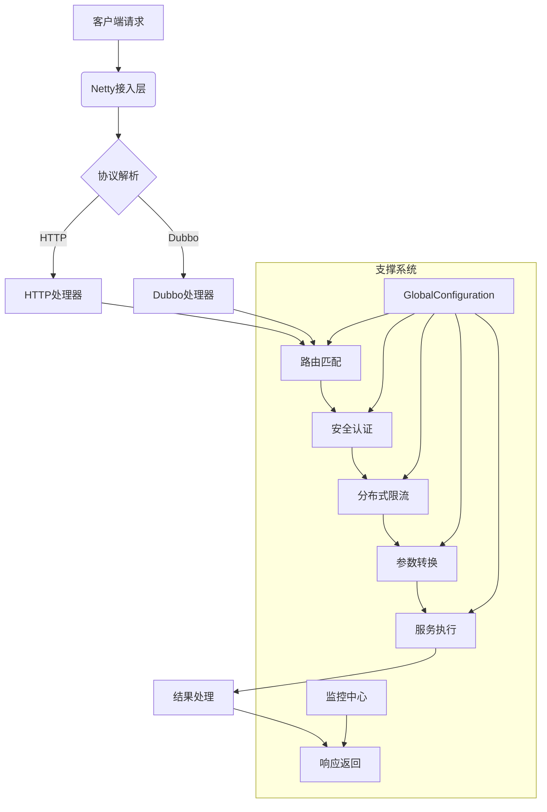
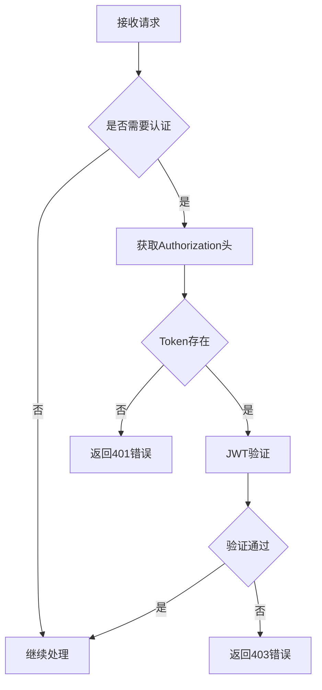
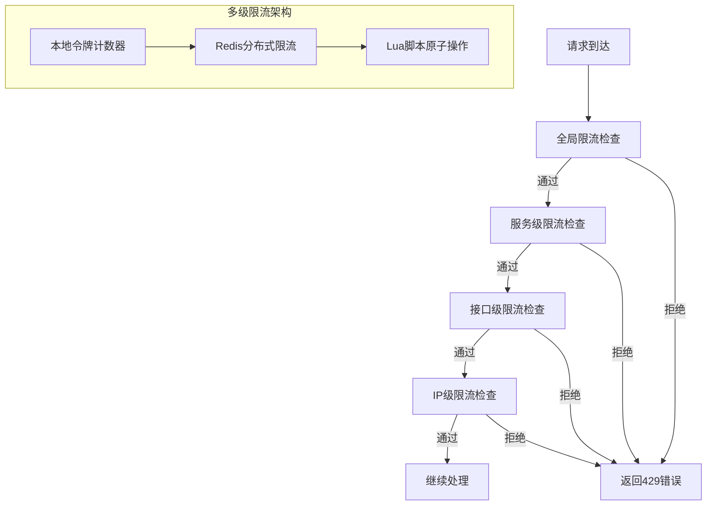
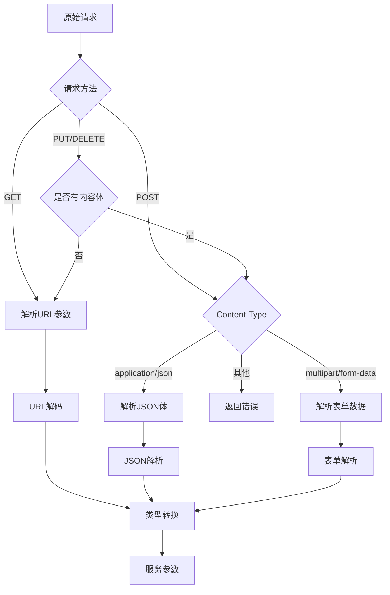
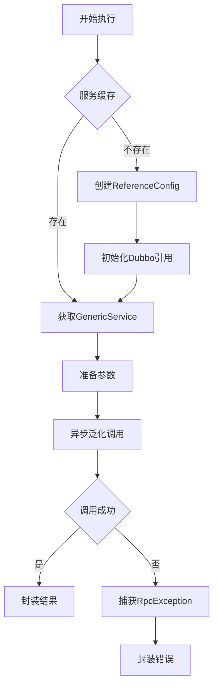
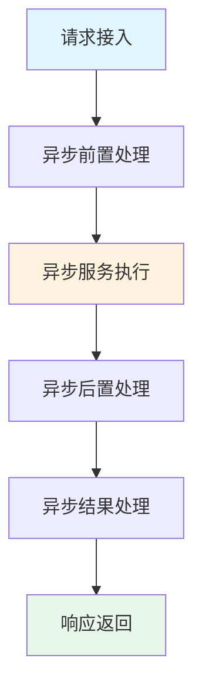
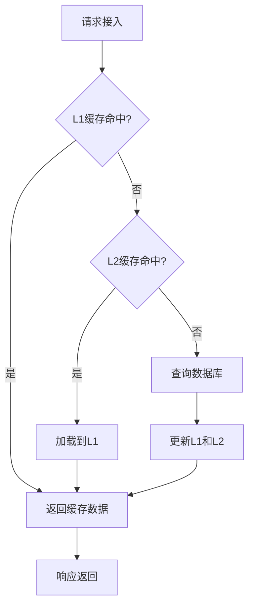
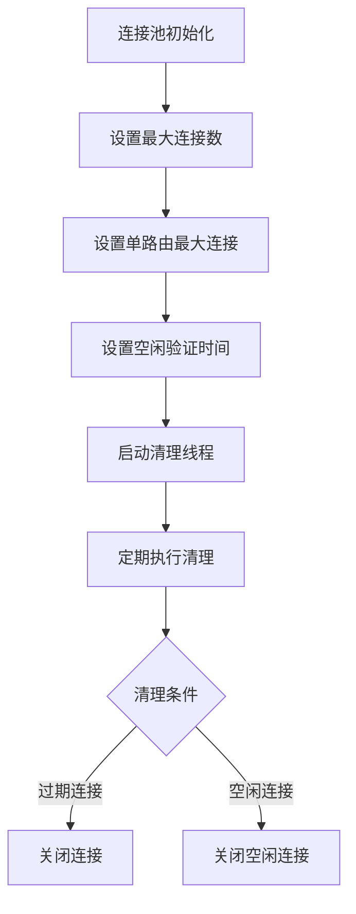

# 请求处理的整个流程

## 全局架构概览



## 核心处理流程详解

### 请求重定向

项目使用NGINX为流量入口,在网关中心远程操控NGINX配置来实现请求重定向,具体可看网关中心相关文档

### 请求接入阶段

**处理引擎**：Netty NIO线程组

```java
/**
 * Netty Socket服务端启动类
 * 负责初始化并启动Netty服务器
 */
@Slf4j
@Component
public class SocketServerBootStrap {
    @Resource
    private ServerHandlerInitializer serverHandlerInitializer;
    @Resource
    private GlobalConfiguration config;

    private EventLoopGroup boss;
    private EventLoopGroup work;

    /**
     * 初始化事件循环组
     * @param bossThreads 主线程数
     * @param workThreads 工作线程数
     */
    private void initEventLoopGroup(Integer bossThreads, Integer workThreads) {
        log.info("初始化Netty事件循环组，boss线程数: {}, work线程数: {}", bossThreads, workThreads);
        this.boss = new NioEventLoopGroup(bossThreads);
        this.work = new NioEventLoopGroup(workThreads);
    }

    /**
     * 初始化方法，在Spring容器启动后自动调用
     */
    @PostConstruct
    public void init() {
        log.info("开始启动Netty服务器...");
        Channel channel = this.start(config.getNettyPort(), config.getBossThreads(), config.getWorkerThreads());
        if (channel == null) {
            log.error("Netty服务器启动失败");
            throw new RuntimeException("服务启动失败");
        }
        log.info("Netty服务器启动成功，监听端口: {}", config.getNettyPort());
    }

    /**
     * 启动Netty服务器
     * @param nettyPort 监听端口
     * @param bossThreads 主线程数
     * @param workThreads 工作线程数
     * @return 绑定的Channel对象
     */
    public Channel start(Integer nettyPort, Integer bossThreads, Integer workThreads) {
        log.debug("准备启动Netty服务器，端口: {}, boss线程: {}, work线程: {}",
                nettyPort, bossThreads, workThreads);

        // 初始化线程组
        initEventLoopGroup(bossThreads, workThreads);

        try {
            log.debug("配置ServerBootstrap参数...");
            ServerBootstrap b = new ServerBootstrap();
            b.group(boss, work)
                    .channel(NioServerSocketChannel.class)
                    .option(ChannelOption.SO_BACKLOG, 128)  // 连接队列大小
                    .childHandler(serverHandlerInitializer);  // 设置处理器初始化器

            log.info("开始绑定端口: {}...", nettyPort);
            Channel channel = b.bind(nettyPort).sync().channel();
            log.info("端口绑定成功: {}", nettyPort);
            return channel;
        } catch (Exception e) {
            log.error("网关服务启动失败，端口: {}", nettyPort, e);
            // 关闭线程组
            if (boss != null) {
                boss.shutdownGracefully();
            }
            if (work != null) {
                work.shutdownGracefully();
            }
        }
        return null;
    }
}
```

- 对象池技术复用请求对象
- 零拷贝技术减少内存复制

### 安全认证阶段

**认证流程**：



```java
/**
 * 授权处理器
 * 负责处理接口权限验证和JWT令牌验证
 */
@Slf4j
@Component
@ChannelHandler.Sharable
public class AuthorizationHandler extends BaseHandler<FullHttpRequest> {
    @Resource
    private InterfaceCacheUtil interfaceCacheUtil;
    @Resource
    private JwtUtils jwtUtils;

    /**
     * 处理HTTP请求的授权验证
     * @param ctx ChannelHandler上下文
     * @param channel 当前Channel
     * @param request HTTP请求
     */
    @Override
    protected void handle(ChannelHandlerContext ctx, Channel channel, FullHttpRequest request) {
        log.debug("开始处理授权验证，URI: {}", request.uri());

        HttpStatement statement;
        try {
            // 从请求中获取URI
            String uri = RequestParameterUtil.getUrl(request);
            log.trace("解析请求URI: {}", uri);

            // 从缓存获取接口声明
            statement = interfaceCacheUtil.getStatement(uri);
            if (statement == null) {
                log.warn("接口不存在，URI: {}", uri);
                DefaultFullHttpResponse response = RequestResultUtil.parse(Result.error("暂无该接口信息"));
                channel.writeAndFlush(response);
                return;
            }

            // 检查接口是否需要认证
            if (statement.getIsAuth()) {
                log.debug("接口需要认证，URI: {}", uri);
                String token = RequestParameterUtil.getToken(request);
                log.trace("获取到的Token: {}", token);

                if (!jwtUtils.verify(token)) {
                    log.warn("Token验证失败，URI: {}", uri);
                    DefaultFullHttpResponse response = RequestResultUtil.parse(Result.error("没有权限访问该接口!"));
                    channel.writeAndFlush(response);
                    return;
                }
                log.debug("Token验证成功，URI: {}", uri);
            }
        } catch (Exception e) {
            log.error("授权验证处理异常", e);
            DefaultFullHttpResponse response = RequestResultUtil.parse(Result.error("接口调用失败: " + e.getMessage()));
            channel.writeAndFlush(response);
            return;
        }

        // 将接口声明存入Channel属性
        channel.attr(AttributeKey.valueOf("HttpStatement")).set(statement);
        log.debug("授权验证通过，继续处理请求，URI: {}", request.uri());

        // 传递给下一个处理器
        ctx.fireChannelRead(request);
    }
}
```

> JWT工具类

```java
/**
 * JWT工具类
 * 提供JWT的生成和验证功能
 */
@Slf4j
@Component
public class JwtUtils {
    // Token过期时间：30天（毫秒）
    public static final long TOKEN_EXPIRE_TIME = 30L * 24 * 60 * 60 * 1000;

    @Resource
    private GlobalConfiguration config;

    /**
     * 生成JWT Token
     * @param key 安全组key，将存储在Token claims中
     * @param value 密钥，用于签名
     * @return 生成的Token字符串，生成失败返回null
     */
    public String sign(String key, String value) {
        log.debug("开始生成JWT Token，安全组key: {}", key);
        try {
            // 设置过期时间
            Date expireDate = new Date(System.currentTimeMillis() + TOKEN_EXPIRE_TIME);
            log.trace("Token过期时间设置为: {}", expireDate);

            // 使用密钥创建算法
            Algorithm algorithm = Algorithm.HMAC256(value);

            // 构建Token
            JWTCreator.Builder builder = JWT.create()
                    .withIssuedAt(new Date()) // 发证时间
                    .withExpiresAt(expireDate) // 过期时间
                    .withClaim("safe-key", key); // 自定义claim

            String token = builder.sign(algorithm);
            log.debug("JWT Token生成成功");
            return token;
        } catch (Exception e) {
            log.error("JWT Token生成失败", e);
            return null;
        }
    }

    /**
     * 验证JWT Token是否有效
     * @param token 待验证的Token字符串
     * @return true-验证通过 false-验证失败
     */
    public boolean verify(String token) {
        log.debug("开始验证JWT Token");
        if (StrUtil.isBlank(token)) {
            log.warn("Token为空，验证失败");
            return false;
        }

        try {
            // 使用配置的密钥创建验证器
            Algorithm algorithm = Algorithm.HMAC256(config.getSafeSecret());
            JWTVerifier verifier = JWT.require(algorithm).build();

            // 验证Token并获取claim
            Claim claim = verifier.verify(token).getClaims().get("safe-key");
            boolean isValid = claim.asString().equals(config.getSafeKey());

            if (isValid) {
                log.debug("JWT Token验证通过");
            } else {
                log.warn("JWT Token验证失败：安全组key不匹配");
            }
            return isValid;
        } catch (Exception e) {
            log.error("JWT Token验证异常", e);
            return false;
        }
    }
}
```

### 分布式限流阶段

**限流流程**：



**限流处理器**：

```java
/**
 * 限流处理器
 * 作为独立的 Handler 集成到 Netty 处理链中
 * 支持多级限流：全局、服务、接口、IP
 * 支持两种限流模式：
 * 1. DISTRIBUTED（默认）：使用 Redis 侧的滑动窗口和令牌桶算法
 * 2. LOCAL_DISTRIBUTED：本地+分布式混合模式，高性能限流
 */
@Slf4j
@Component
@ChannelHandler.Sharable
public class RateLimitHandler extends BaseHandler<FullHttpRequest> {
    private static final AttributeKey<HttpStatement> HTTP_STATEMENT_KEY = AttributeKey.valueOf("HttpStatement");

    @Resource
    private DistributedRateLimiter rateLimiter;

    @Override
    protected void handle(ChannelHandlerContext ctx, Channel channel, FullHttpRequest request) {
        HttpStatement httpStatement = channel.attr(HTTP_STATEMENT_KEY).get();
        if (httpStatement == null) {
            sendError(channel, "系统处理异常");
            return;
        }

        try {
            // 1. 全局限流检查
            if (!checkGlobalRateLimit()) {
                sendError(channel, "系统繁忙，请稍后重试");
                return;
            }

            // 2. 服务级限流检查
            String serviceId = httpStatement.getServiceId();
            if (!checkServiceRateLimit(serviceId)) {
                sendError(channel, "服务访问频繁，请稍后重试");
                return;
            }

            // 3. 接口级限流检查
            String url = RequestParameterUtil.getUrl(request);
            if (!checkInterfaceRateLimit(serviceId, url)) {
                sendError(channel, "接口访问频繁，请稍后重试");
                return;
            }

            // 4. IP级限流检查
            String clientIp = getClientIp(request);
            if (!checkIpRateLimit(clientIp)) {
                sendError(channel, "访问过于频繁，请稍后重试");
                return;
            }

            // 所有限流检查通过，继续处理链
            ctx.fireChannelRead(request);

        } catch (Exception e) {
            log.error("限流处理异常", e);
            // 异常时放行，避免影响正常业务
            ctx.fireChannelRead(request);
        }
    }
}
```

**限流特性**：

- **多级限流架构**：本地令牌计数器（高性能）+ Redis分布式限流（精确控制）
- **四级限流粒度**：全局、服务、接口、IP
- **两种限流算法**：令牌桶（允许突发）、滑动窗口（精确控制）
- **两种限流模式**：DISTRIBUTED（默认）、LOCAL_DISTRIBUTED（高性能混合模式）
- **高性能设计**：本地令牌计数器承担大部分流量，保护Redis
- **异常降级**：Redis异常时自动降级为放行
- **实时配置**：支持网关中心实时推送配置更新

> 详细可见分布式限流器文档

### 熔断降级策略

> 详细可见熔断文档

### 参数处理阶段

**转换流程**：



**类型转换器**：

```java
/**
 * 请求参数工具类
 * 提供HTTP请求参数解析相关功能
 */
@Slf4j
public class RequestParameterUtil {
    /**
     * 获取请求路径（去除查询参数）
     * @param request HTTP请求对象
     * @return 处理后的请求路径，如果是/favicon.ico则返回null
     */
    public static String getUrl(FullHttpRequest request) {
        String uri = request.uri();
        int idx = uri.indexOf("?");
        uri = idx > 0 ? uri.substring(0, idx) : uri;
        if (uri.equals("/favicon.ico")) {
            log.debug("忽略favicon.ico请求");
            return null;
        }
        log.debug("解析请求路径: {}", uri);
        return uri;
    }

    /**
     * 解析HTTP请求参数
     * @param request HTTP请求对象
     * @return 参数键值对Map
     * @throws RuntimeException 当遇到不支持的Content-Type或HttpMethod时抛出
     */
    public static Map<String, Object> getParameters(FullHttpRequest request) {
        HttpMethod method = request.method();
        log.debug("开始解析{}请求参数", method);

        if (HttpMethod.GET == method) {
            // GET请求处理
            Map<String, Object> parameterMap = new HashMap<>();
            QueryStringDecoder decoder = new QueryStringDecoder(request.uri());
            decoder.parameters().forEach((key, value) -> {
                parameterMap.put(key, value.get(0));
                log.trace("GET参数: {}={}", key, value.get(0));
            });
            return parameterMap;

        } else if (HttpMethod.POST == method) {
            // POST请求处理
            String contentType = getContentType(request);
            log.debug("POST请求Content-Type: {}", contentType);

            switch (contentType) {
                case "multipart/form-data":
                    Map<String, Object> parameterMap = new HashMap<>();
                    HttpPostRequestDecoder decoder = new HttpPostRequestDecoder(request);
                    decoder.offer(request);
                    decoder.getBodyHttpDatas().forEach(data -> {
                        Attribute attr = (Attribute) data;
                        try {
                            parameterMap.put(data.getName(), attr.getValue());
                            log.trace("表单参数: {}={}", data.getName(), attr.getValue());
                        } catch (IOException ignore) {
                            log.warn("表单参数解析异常", ignore);
                        }
                    });
                    return parameterMap;
                case "application/json":
                    ByteBuf byteBuf = request.content();
                    if (byteBuf.isReadable()) {
                        String content = byteBuf.toString(StandardCharsets.UTF_8);
                        byteBuf.release();
                        log.trace("JSON参数: {}", content);
                        return JSON.parseObject(content);
                    }
                    break;
                case "none":
                    log.debug("无Content-Type，返回空参数Map");
                    return new HashMap<>();
                default:
                    log.error("不支持的Content-Type: {}", contentType);
                    throw new RuntimeException("未实现的协议类型 Content-Type：" + contentType);
            }
        } else if (HttpMethod.PUT == method || HttpMethod.DELETE == method) {
            // PUT/DELETE请求处理
            String contentType = getContentType(request);
            log.debug("{}请求Content-Type: {}", method, contentType);

            switch (contentType) {
                case "multipart/form-data" -> {
                    Map<String, Object> parameterMap = new HashMap<>();
                    HttpPostRequestDecoder decoder = new HttpPostRequestDecoder(request);
                    decoder.offer(request);
                    decoder.getBodyHttpDatas().forEach(data -> {
                        Attribute attr = (Attribute) data;
                        try {
                            parameterMap.put(data.getName(), attr.getValue());
                            log.trace("表单参数: {}={}", data.getName(), attr.getValue());
                        } catch (IOException ignore) {
                            log.warn("表单参数解析异常", ignore);
                        }
                    });
                    return parameterMap;
                }
                case "application/json" -> {
                    ByteBuf byteBuf = request.content();
                    if (byteBuf.isReadable()) {
                        String content = byteBuf.toString(StandardCharsets.UTF_8);
                        byteBuf.release();
                        log.trace("JSON参数: {}", content);
                        return JSON.parseObject(content);
                    }
                }
                case "none" -> {
                    log.debug("无Content-Type，返回空参数Map");
                    return new HashMap<>();
                }
                default -> {
                    if (request.content().isReadable()) {
                        log.error("不支持的Content-Type: {}", contentType);
                        throw new RuntimeException("未实现的协议类型 Content-Type：" + contentType);
                    } else {
                        Map<String, Object> parameterMap = new HashMap<>();
                        QueryStringDecoder decoder = new QueryStringDecoder(request.uri());
                        decoder.parameters().forEach((key, values) -> {
                            parameterMap.put(key, values.get(0));
                            log.trace("URL参数: {}={}", key, values.get(0));
                        });
                        return parameterMap;
                    }
                }
            }
        }

        log.error("不支持的HttpMethod: {}", method);
        throw new RuntimeException("未实现的请求类型 HttpMethod：" + method);
    }

    /**
     * 从请求头中获取Token
     * @param request HTTP请求对象
     * @return Token字符串，未找到返回null
     */
    public static String getToken(FullHttpRequest request) {
        Optional<Map.Entry<String, String>> header = request.headers().entries().stream()
                .filter(val -> val.getKey().equals("Authorization"))
                .findAny();

        if (header.isEmpty()) {
            log.debug("请求头中未找到Authorization字段");
            return null;
        }

        String token = header.get().getValue();
        log.debug("从请求头中获取到Token");
        return token;
    }

    /**
     * 获取请求的Content-Type
     * @param request HTTP请求对象
     * @return Content-Type字符串，未找到返回"none"
     */
    private static String getContentType(FullHttpRequest request) {
        Optional<Map.Entry<String, String>> header = request.headers().entries().stream()
                .filter(val -> val.getKey().equals("Content-Type"))
                .findAny();

        if (header.isEmpty()) {
            log.debug("请求头中未找到Content-Type字段");
            return "none";
        }

        String contentType = header.get().getValue();
        int idx = contentType.indexOf(";");
        if (idx > 0) {
            contentType = contentType.substring(0, idx);
        }
        log.trace("解析到Content-Type: {}", contentType);
        return contentType;
    }
}
```

### 服务执行阶段

**执行引擎选择**：

```java
BaseConnection connection;
String url = RequestParameterUtil.getUrl(request);

try {
    // 获取服务地址
    String serverAddr = gatewayServer.getOne();
    log.debug("获取到服务地址: {}", serverAddr);

    // 根据请求类型创建连接
    if (httpStatement.getIsHttp()) {
        url = "http://" + serverAddr + url;
        log.debug("创建HTTP连接，完整URL: {}", url);
        connection = new HTTPConnection(config.getAsyncHttpClient(), url);
    } else {
        url = serverAddr.split(":")[0] + ":20880";
        log.debug("创建Dubbo连接，服务地址: {}", url);
        connection = new DubboConnection(url, httpStatement, config.getDubboServiceMap());
    }

    // 异步执行请求，返回CompletableFuture
    CompletableFuture<Result<?>> future = connection.send(parameters, httpStatement);

    // 处理异步结果
    future.thenAccept(data -> {
        log.debug("请求执行成功，结果状态码: {}", data.getCode());
        // 将结果存入Channel属性
        channel.attr(AttributeKey.valueOf("data")).set(data);
        // 继续处理链
        ctx.fireChannelRead(request);
    }).exceptionally(throwable -> {
        log.error("服务调用失败，URI: {}, 错误: {}", request.uri(), throwable.getMessage(), throwable);
        DefaultFullHttpResponse response = RequestResultUtil.parse(Result.error("服务调用失败"));
        channel.writeAndFlush(response);
        return null;
    });
} catch (Exception e) {
    log.error("服务调用失败，URI: {}, 错误: {}", request.uri(), e.getMessage(), e);
    DefaultFullHttpResponse response = RequestResultUtil.parse(Result.error("服务调用失败"));
    channel.writeAndFlush(response);
    return;
}
```

#### 异步化优势：

- **非阻塞执行**：不阻塞Netty工作线程，提高吞吐量
- **资源高效**：减少线程创建，降低内存占用
- **并发能力**：支持更多并发请求处理
- **响应时间**：毫秒级响应延迟

#### HTTP执行流程（异步非阻塞）：

```java
/**
 * HTTP请求执行器 - 异步实现
 * 负责异步执行各种类型的HTTP请求(GET/POST/PUT/DELETE)
 */
@Slf4j
public class DefaultHTTPExecutor implements HTTPExecutor {
    // HTTP异步客户端
    private CloseableHttpAsyncClient asyncHttpClient;

    /**
     * 异步执行HTTP请求
     *
     * @param parameter 请求参数
     * @param url 目标URL
     * @param httpStatement HTTP请求声明
     * @return 异步执行结果
     */
    @Override
    public CompletableFuture<Result<?>> execute(Map<String, Object> parameter, String url, HttpStatement httpStatement) {
        CompletableFuture<Result<?>> future = new CompletableFuture<>();
        HTTPTypeEnum httpType = httpStatement.getHttpType();
        String requestUrl = url;

        try {
            log.debug("准备异步执行{}请求，URL: {}, 参数: {}", httpType, url, parameter);

            // 根据请求类型创建不同的请求对象
            SimpleHttpRequest httpRequest = null;
            switch (httpType) {
                case GET:
                    if (parameter != null && !parameter.isEmpty()) {
                        requestUrl = buildGetRequestUrl(url, parameter);
                        log.debug("构建GET请求URL: {}", requestUrl);
                    }
                    httpRequest = SimpleRequestBuilder.get(requestUrl).build();
                    break;
                case POST:
                    String jsonBody = JSON.toJSONString(parameter);
                    httpRequest = SimpleRequestBuilder.post(requestUrl)
                            .setBody(jsonBody, ContentType.APPLICATION_JSON)
                            .build();
                    log.trace("POST请求体: {}", jsonBody);
                    break;
                case PUT:
                    jsonBody = JSON.toJSONString(parameter);
                    httpRequest = SimpleRequestBuilder.put(requestUrl)
                            .setBody(jsonBody, ContentType.APPLICATION_JSON)
                            .build();
                    log.trace("PUT请求体: {}", jsonBody);
                    break;
                case DELETE:
                    httpRequest = SimpleRequestBuilder.delete(requestUrl).build();
                    break;
                default:
                    log.error("不支持的HTTP请求类型: {}", httpType);
                    future.complete(Result.error("不支持的HTTP请求类型: " + httpType));
                    return future;
            }

            // 异步执行请求
            asyncHttpClient.execute(httpRequest, new FutureCallback<SimpleHttpResponse>() {
                @Override
                public void completed(SimpleHttpResponse response) {
                    try {
                        int statusCode = response.getCode();
                        String responseBody = response.getBodyText();
                        log.debug("异步HTTP请求完成，状态码: {}", statusCode);
                        if (statusCode >= 200 && statusCode < 300) {
                            future.complete(Result.success(responseBody));
                        } else {
                            log.warn("HTTP请求失败，状态码: {}, 响应: {}", statusCode, responseBody);
                            future.complete(Result.error("HTTP请求失败，状态码: " + statusCode));
                        }
                    } catch (Exception e) {
                        failed(e);
                    }
                }

                @Override
                public void failed(Exception ex) {
                    log.error("异步HTTP请求执行失败", ex);
                    future.complete(Result.error("请求失败: " + ex.getMessage()));
                }

                @Override
                public void cancelled() {
                    log.warn("异步HTTP请求被取消");
                    future.cancel(true);
                }
            });
        } catch (URISyntaxException e) {
            log.error("URL语法错误: {}", url, e);
            future.completeExceptionally(new IllegalArgumentException("URL语法错误: " + url, e));
        } catch (Exception e) {
            log.error("构建异步HTTP请求时出错", e);
            future.completeExceptionally(e);
        }
        return future;
    }

    /**
     * 构建带参数的GET请求URL
     *
     * @param baseUrl 基础URL
     * @param params  参数Map
     * @return 构建完成的URL
     */
    private String buildGetRequestUrl(String baseUrl, Map<String, Object> params) {
        StringBuilder urlBuilder = new StringBuilder(baseUrl);
        if (params != null && !params.isEmpty()) {
            urlBuilder.append("?");
            for (Map.Entry<String, Object> entry : params.entrySet()) {
                urlBuilder.append(entry.getKey())
                        .append("=")
                        .append(URLEncoder.encode(entry.getValue().toString(), StandardCharsets.UTF_8))
                        .append("&");
            }
            urlBuilder.deleteCharAt(urlBuilder.length() - 1); // 移除末尾的&
        }
        return urlBuilder.toString();
    }
}
```

**异步HTTP客户端配置**：

```java
/**
 * 创建异步HTTP客户端
 */
private void createAsyncHTTPClient() {
    log.debug("创建异步HTTP连接池");
    final IOReactorConfig ioReactorConfig = IOReactorConfig.custom()
            .setSoTimeout(5000, TimeUnit.MILLISECONDS)
            .build();

    final PoolingAsyncClientConnectionManager connectionManager = PoolingAsyncClientConnectionManagerBuilder.create()
            .setMaxConnTotal(200)           // 最大连接数
            .setMaxConnPerRoute(20)         // 单路由最大连接数
            .build();

    this.asyncHttpClient = HttpAsyncClients.custom()
            .setIOReactorConfig(ioReactorConfig)
            .setConnectionManager(connectionManager)
            .build();

    this.asyncHttpClient.start();
    log.debug("异步HTTP连接池创建并启动成功，最大连接数: 200，单路由最大连接数: 20");
}
```

#### Dubbo执行流程（异步非阻塞）：



```java
/**
 * Dubbo服务执行器 - 异步实现
 * 负责异步执行Dubbo泛化调用
 */
@Slf4j
public class DefaultDubboExecutor implements DubboExecutor {
    private final Map<String, GenericService> dubboServiceMap = new ConcurrentHashMap<>();

    /**
     * 异步执行Dubbo泛化调用
     * @param parameter 请求参数
     * @param url Dubbo服务URL
     * @param httpStatement HTTP请求声明
     * @return 异步执行结果
     */
    @Override
    public CompletableFuture<Result<?>> execute(Map<String, Object> parameter, String url, HttpStatement httpStatement) {
        log.debug("开始异步执行Dubbo调用，URL: {}, 参数: {}", url, parameter);

        // 从缓存获取或创建GenericService
        GenericService genericService = dubboServiceMap.computeIfAbsent(url, k -> {
            log.debug("创建新的Dubbo引用配置，URL: {}", url);
            ReferenceConfig<GenericService> reference = new ReferenceConfig<>();
            reference.setUrl("dubbo://" + url);
            reference.setInterface(httpStatement.getInterfaceName());
            reference.setGroup("method-group-test");
            reference.setGeneric("true");
            reference.setTimeout(3000);
            reference.setRetries(0);
            reference.setAsync(true);  // 启用异步调用
            return reference.get();
        });

        String methodName = httpStatement.getMethodName();
        String[] parameterType = httpStatement.getParameterType();
        Object[] args = parameter.values().toArray();

        try {
            log.debug("准备异步调用Dubbo方法，方法名: {}, 参数类型: {}", methodName, parameterType);
            log.trace("方法调用参数: {}", args);

            // 异步泛化调用，返回CompletableFuture
            CompletableFuture<Object> future = genericService.$invokeAsync(methodName, parameterType, args);

            return future.<Result<?>>thenApply(Result::success)
                    .exceptionally(throwable -> {
                        log.error("Dubbo异步调用失败", throwable);
                        return Result.error("系统异常: " + throwable.getMessage());
                    });
        } catch (Exception e) {
            log.error("发起Dubbo异步调用时发生异常", e);
            return CompletableFuture.completedFuture(Result.error("系统异常: " + e.getMessage()));
        }
    }

    @Override
    public void setDubboServiceMap(Map<String, GenericService> serviceMap) {
        if (serviceMap != null) {
            this.dubboServiceMap.putAll(serviceMap);
        }
    }
}
```

**Dubbo异步调用配置**：

```java
// 在ReferenceConfig中启用异步调用
reference.setAsync(true);

// 异步调用返回CompletableFuture
CompletableFuture<Object> future = genericService.$invokeAsync(methodName, parameterType, args);

// 处理异步结果
future.thenApply(result -> {
    log.debug("Dubbo异步调用成功，方法名: {}", methodName);
    return Result.success(result);
}).exceptionally(throwable -> {
    log.error("Dubbo异步调用失败，方法名: {}", methodName, throwable);
    return Result.error("系统异常: " + throwable.getMessage());
});
```

### 结果处理阶段

**处理流程**：

```java
/**
 * 结果包装处理器 - 支持响应缓存
 */
@Slf4j
@Component
@ChannelHandler.Sharable
public class ResultHandler extends BaseHandler<FullHttpRequest> {
    private static final AttributeKey<HttpStatement> HTTP_STATEMENT_KEY = AttributeKey.valueOf("HttpStatement");

    // 使用ConcurrentHashMap实现响应缓存
    private static final ConcurrentHashMap<String, byte[]> responseCache = new ConcurrentHashMap<>();

    @Override
    protected void handle(ChannelHandlerContext ctx, Channel channel, FullHttpRequest request) {
        try {
            HttpStatement httpStatement = channel.attr(HTTP_STATEMENT_KEY).get();
            if (httpStatement == null) {
                request.release();
                sendError(channel, "系统处理异常");
                return;
            }

            // 生成缓存Key
            String cacheKey = generateCacheKey(request, httpStatement);

            // 检查响应缓存
            byte[] cachedResponse = responseCache.get(cacheKey);
            if (cachedResponse != null) {
                log.debug("命中响应缓存，缓存Key: {}", cacheKey);
                sendCachedResponse(channel, cachedResponse, request);
                request.release();
                return;
            }

            // 构建响应
            Result<?> result = Result.success(channel.attr(AttributeKey.valueOf("data")).get());
            byte[] responseContent = result.toString().getBytes();

            // 缓存响应
            responseCache.put(cacheKey, responseContent);
            log.debug("响应已缓存，缓存Key: {}", cacheKey);

            sendResponse(channel, responseContent, request);
            request.release();

        } catch (Exception e) {
            request.release();
            log.error("响应处理异常", e);
            sendError(channel, "系统处理异常");
        }
    }

    private String generateCacheKey(FullHttpRequest request, HttpStatement httpStatement) {
        // 基于请求URI和HTTP方法生成缓存Key
        return request.method() + ":" + request.uri();
    }
}
```

**缓存策略**：

- **响应缓存**：使用ConcurrentHashMap缓存相同请求的响应
- **缓存Key生成**：基于HTTP方法和请求URI
- **缓存命中**：直接返回缓存的字节数组，避免重复序列化
- **异常统一封装**：所有异常统一转换为Result对象

## 性能优化体系

### 异步化处理

#### 1. 异步HTTP执行

- **异步客户端**：使用Apache HttpAsyncClient替代同步HttpClient
- **非阻塞I/O**：基于NIO的异步网络通信
- **连接池管理**：PoolingAsyncClientConnectionManager管理异步连接
- **性能提升**：支持更高的并发请求处理能力

#### 2. 异步Dubbo调用

- **异步引用**：ReferenceConfig.setAsync(true)启用异步模式
- **CompletableFuture**：使用$invokeAsync()返回异步结果
- **链式处理**：thenApply()和exceptionally()处理异步结果
- **吞吐量提升**：减少线程阻塞，提高系统吞吐量

#### 3. 异步处理链



### 多级缓存策略

#### 1. 内存缓存（L1）

- **接口配置缓存**：HttpStatement对象缓存
- **响应缓存**：相同请求的响应字节数组缓存
- **访问速度**：纳秒级
- **容量管理**：LFU策略自动淘汰低频数据

#### 2. Redis缓存（L2）

- **分布式缓存**：跨服务器共享配置
- **持久化存储**：服务重启后数据不丢失
- **访问速度**：毫秒级
- **一致性保证**：通过Redis Pub/Sub同步更新

#### 3. 缓存流程



### 本地缓存 + Redis存储

> 详情看缓存文档

### 连接池优化

**HTTP连接池配置**：



```java
/**
 * 创建HTTP客户端连接池
*/
private void createHTTPClient() {
    log.debug("创建HTTP连接池");
    PoolingHttpClientConnectionManager cm = new PoolingHttpClientConnectionManager();
    cm.setMaxTotal(500);
    cm.setDefaultMaxPerRoute(50);
    cm.setValidateAfterInactivity(30_000);

    httpClient = HttpClients.custom()
            .setConnectionManager(cm)
            .build();
    log.debug("HTTP连接池创建成功，最大连接数: 500，单路由最大连接数: 50");

    startConnectionEvictor(cm);
}

/**
 * 启动连接回收线程
 * @param cm 连接管理器
*/
private void startConnectionEvictor(PoolingHttpClientConnectionManager cm) {
    log.debug("启动HTTP连接回收线程");
    Executors.newSingleThreadScheduledExecutor().scheduleAtFixedRate(() -> {
        cm.closeExpiredConnections();
        cm.closeIdleConnections(30, TimeUnit.SECONDS);
        log.trace("HTTP连接池清理完成");
    }, 30, 30, TimeUnit.SECONDS);
}
```

**Dubbo连接池配置**：

```java
/**
 * Dubbo服务缓存
*/
private ConcurrentHashMap<String, GenericService> dubboServiceMap = new ConcurrentHashMap<>();
```
