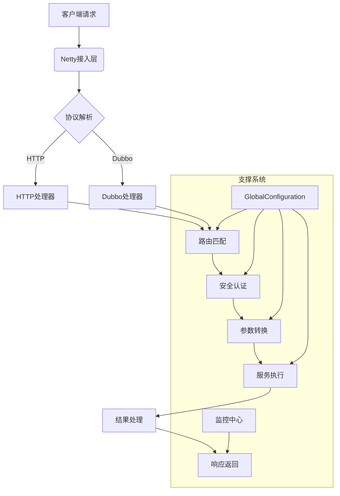
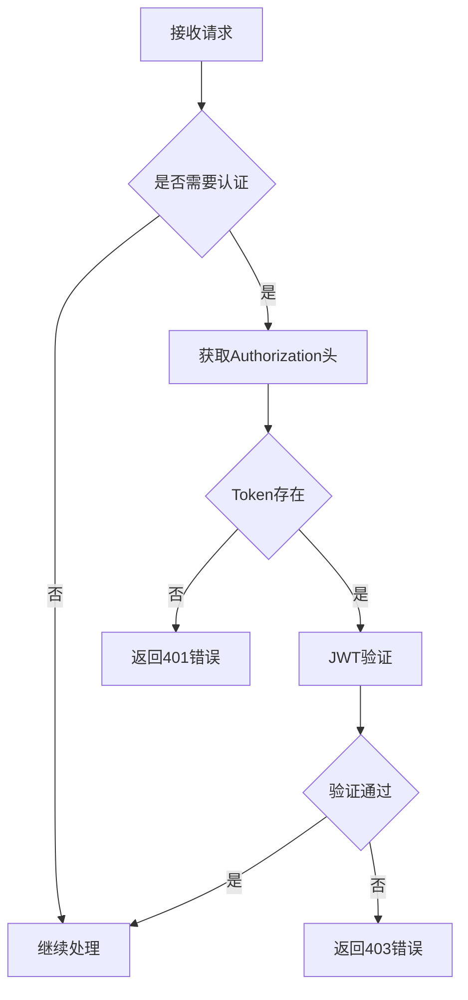
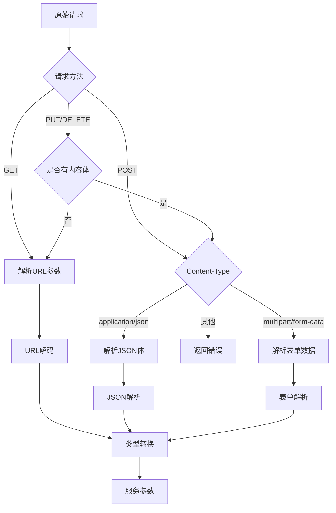
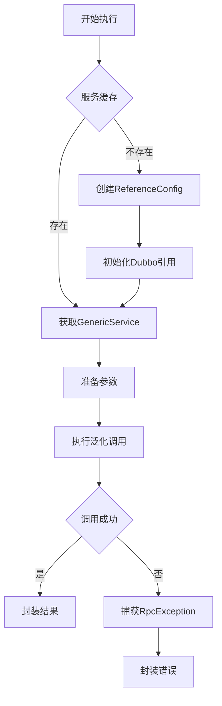
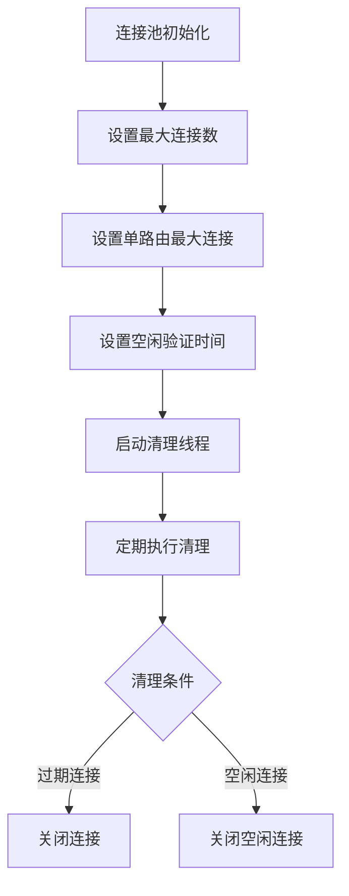

# 请求处理的整个流程

## 全局架构概览



## 核心处理流程详解

### 请求重定向

项目使用NGINX为流量入口,在网关中心远程操控NGINX配置来实现请求重定向,具体可看网关中心相关文档

### 请求接入阶段

**处理引擎**：Netty NIO线程组

```java
/**
 * Netty Socket服务端启动类
 * 负责初始化并启动Netty服务器
 */
@Slf4j
@Component
public class SocketServerBootStrap {
    @Resource
    private ServerHandlerInitializer serverHandlerInitializer;
    @Resource
    private GlobalConfiguration config;

    private EventLoopGroup boss;
    private EventLoopGroup work;

    /**
     * 初始化事件循环组
     * @param bossThreads 主线程数
     * @param workThreads 工作线程数
     */
    private void initEventLoopGroup(Integer bossThreads, Integer workThreads) {
        log.info("初始化Netty事件循环组，boss线程数: {}, work线程数: {}", bossThreads, workThreads);
        this.boss = new NioEventLoopGroup(bossThreads);
        this.work = new NioEventLoopGroup(workThreads);
    }

    /**
     * 初始化方法，在Spring容器启动后自动调用
     */
    @PostConstruct
    public void init() {
        log.info("开始启动Netty服务器...");
        Channel channel = this.start(config.getNettyPort(), config.getBossThreads(), config.getWorkerThreads());
        if (channel == null) {
            log.error("Netty服务器启动失败");
            throw new RuntimeException("服务启动失败");
        }
        log.info("Netty服务器启动成功，监听端口: {}", config.getNettyPort());
    }

    /**
     * 启动Netty服务器
     * @param nettyPort 监听端口
     * @param bossThreads 主线程数
     * @param workThreads 工作线程数
     * @return 绑定的Channel对象
     */
    public Channel start(Integer nettyPort, Integer bossThreads, Integer workThreads) {
        log.debug("准备启动Netty服务器，端口: {}, boss线程: {}, work线程: {}",
                nettyPort, bossThreads, workThreads);

        // 初始化线程组
        initEventLoopGroup(bossThreads, workThreads);

        try {
            log.debug("配置ServerBootstrap参数...");
            ServerBootstrap b = new ServerBootstrap();
            b.group(boss, work)
                    .channel(NioServerSocketChannel.class)
                    .option(ChannelOption.SO_BACKLOG, 128)  // 连接队列大小
                    .childHandler(serverHandlerInitializer);  // 设置处理器初始化器

            log.info("开始绑定端口: {}...", nettyPort);
            Channel channel = b.bind(nettyPort).sync().channel();
            log.info("端口绑定成功: {}", nettyPort);
            return channel;
        } catch (Exception e) {
            log.error("网关服务启动失败，端口: {}", nettyPort, e);
            // 关闭线程组
            if (boss != null) {
                boss.shutdownGracefully();
            }
            if (work != null) {
                work.shutdownGracefully();
            }
        }
        return null;
    }
}
```

- 对象池技术复用请求对象
- 零拷贝技术减少内存复制

### 安全认证阶段

**认证流程**：



```java
/**
 * 授权处理器
 * 负责处理接口权限验证和JWT令牌验证
 */
@Slf4j
@Component
@ChannelHandler.Sharable
public class AuthorizationHandler extends BaseHandler<FullHttpRequest> {
    @Resource
    private InterfaceCacheUtil interfaceCacheUtil;
    @Resource
    private JwtUtils jwtUtils;

    /**
     * 处理HTTP请求的授权验证
     * @param ctx ChannelHandler上下文
     * @param channel 当前Channel
     * @param request HTTP请求
     */
    @Override
    protected void handle(ChannelHandlerContext ctx, Channel channel, FullHttpRequest request) {
        log.debug("开始处理授权验证，URI: {}", request.uri());

        HttpStatement statement;
        try {
            // 从请求中获取URI
            String uri = RequestParameterUtil.getUrl(request);
            log.trace("解析请求URI: {}", uri);

            // 从缓存获取接口声明
            statement = interfaceCacheUtil.getStatement(uri);
            if (statement == null) {
                log.warn("接口不存在，URI: {}", uri);
                DefaultFullHttpResponse response = RequestResultUtil.parse(Result.error("暂无该接口信息"));
                channel.writeAndFlush(response);
                return;
            }

            // 检查接口是否需要认证
            if (statement.getIsAuth()) {
                log.debug("接口需要认证，URI: {}", uri);
                String token = RequestParameterUtil.getToken(request);
                log.trace("获取到的Token: {}", token);

                if (!jwtUtils.verify(token)) {
                    log.warn("Token验证失败，URI: {}", uri);
                    DefaultFullHttpResponse response = RequestResultUtil.parse(Result.error("没有权限访问该接口!"));
                    channel.writeAndFlush(response);
                    return;
                }
                log.debug("Token验证成功，URI: {}", uri);
            }
        } catch (Exception e) {
            log.error("授权验证处理异常", e);
            DefaultFullHttpResponse response = RequestResultUtil.parse(Result.error("接口调用失败: " + e.getMessage()));
            channel.writeAndFlush(response);
            return;
        }

        // 将接口声明存入Channel属性
        channel.attr(AttributeKey.valueOf("HttpStatement")).set(statement);
        log.debug("授权验证通过，继续处理请求，URI: {}", request.uri());

        // 传递给下一个处理器
        ctx.fireChannelRead(request);
    }
}
```

> JWT工具类

```java
/**
 * JWT工具类
 * 提供JWT的生成和验证功能
 */
@Slf4j
@Component
public class JwtUtils {
    // Token过期时间：30天（毫秒）
    public static final long TOKEN_EXPIRE_TIME = 30L * 24 * 60 * 60 * 1000;

    @Resource
    private GlobalConfiguration config;

    /**
     * 生成JWT Token
     * @param key 安全组key，将存储在Token claims中
     * @param value 密钥，用于签名
     * @return 生成的Token字符串，生成失败返回null
     */
    public String sign(String key, String value) {
        log.debug("开始生成JWT Token，安全组key: {}", key);
        try {
            // 设置过期时间
            Date expireDate = new Date(System.currentTimeMillis() + TOKEN_EXPIRE_TIME);
            log.trace("Token过期时间设置为: {}", expireDate);

            // 使用密钥创建算法
            Algorithm algorithm = Algorithm.HMAC256(value);

            // 构建Token
            JWTCreator.Builder builder = JWT.create()
                    .withIssuedAt(new Date()) // 发证时间
                    .withExpiresAt(expireDate) // 过期时间
                    .withClaim("safe-key", key); // 自定义claim

            String token = builder.sign(algorithm);
            log.debug("JWT Token生成成功");
            return token;
        } catch (Exception e) {
            log.error("JWT Token生成失败", e);
            return null;
        }
    }

    /**
     * 验证JWT Token是否有效
     * @param token 待验证的Token字符串
     * @return true-验证通过 false-验证失败
     */
    public boolean verify(String token) {
        log.debug("开始验证JWT Token");
        if (StrUtil.isBlank(token)) {
            log.warn("Token为空，验证失败");
            return false;
        }

        try {
            // 使用配置的密钥创建验证器
            Algorithm algorithm = Algorithm.HMAC256(config.getSafeSecret());
            JWTVerifier verifier = JWT.require(algorithm).build();

            // 验证Token并获取claim
            Claim claim = verifier.verify(token).getClaims().get("safe-key");
            boolean isValid = claim.asString().equals(config.getSafeKey());

            if (isValid) {
                log.debug("JWT Token验证通过");
            } else {
                log.warn("JWT Token验证失败：安全组key不匹配");
            }
            return isValid;
        } catch (Exception e) {
            log.error("JWT Token验证异常", e);
            return false;
        }
    }
}
```

### 熔断降级策略

> 详细可见熔断文档

### 参数处理阶段

**转换流程**：



**类型转换器**：

```java
/**
 * 请求参数工具类
 * 提供HTTP请求参数解析相关功能
 */
@Slf4j
public class RequestParameterUtil {
    /**
     * 获取请求路径（去除查询参数）
     * @param request HTTP请求对象
     * @return 处理后的请求路径，如果是/favicon.ico则返回null
     */
    public static String getUrl(FullHttpRequest request) {
        String uri = request.uri();
        int idx = uri.indexOf("?");
        uri = idx > 0 ? uri.substring(0, idx) : uri;
        if (uri.equals("/favicon.ico")) {
            log.debug("忽略favicon.ico请求");
            return null;
        }
        log.debug("解析请求路径: {}", uri);
        return uri;
    }

    /**
     * 解析HTTP请求参数
     * @param request HTTP请求对象
     * @return 参数键值对Map
     * @throws RuntimeException 当遇到不支持的Content-Type或HttpMethod时抛出
     */
    public static Map<String, Object> getParameters(FullHttpRequest request) {
        HttpMethod method = request.method();
        log.debug("开始解析{}请求参数", method);

        if (HttpMethod.GET == method) {
            // GET请求处理
            Map<String, Object> parameterMap = new HashMap<>();
            QueryStringDecoder decoder = new QueryStringDecoder(request.uri());
            decoder.parameters().forEach((key, value) -> {
                parameterMap.put(key, value.get(0));
                log.trace("GET参数: {}={}", key, value.get(0));
            });
            return parameterMap;

        } else if (HttpMethod.POST == method) {
            // POST请求处理
            String contentType = getContentType(request);
            log.debug("POST请求Content-Type: {}", contentType);

            switch (contentType) {
                case "multipart/form-data":
                    Map<String, Object> parameterMap = new HashMap<>();
                    HttpPostRequestDecoder decoder = new HttpPostRequestDecoder(request);
                    decoder.offer(request);
                    decoder.getBodyHttpDatas().forEach(data -> {
                        Attribute attr = (Attribute) data;
                        try {
                            parameterMap.put(data.getName(), attr.getValue());
                            log.trace("表单参数: {}={}", data.getName(), attr.getValue());
                        } catch (IOException ignore) {
                            log.warn("表单参数解析异常", ignore);
                        }
                    });
                    return parameterMap;
                case "application/json":
                    ByteBuf byteBuf = request.content();
                    if (byteBuf.isReadable()) {
                        String content = byteBuf.toString(StandardCharsets.UTF_8);
                        byteBuf.release();
                        log.trace("JSON参数: {}", content);
                        return JSON.parseObject(content);
                    }
                    break;
                case "none":
                    log.debug("无Content-Type，返回空参数Map");
                    return new HashMap<>();
                default:
                    log.error("不支持的Content-Type: {}", contentType);
                    throw new RuntimeException("未实现的协议类型 Content-Type：" + contentType);
            }
        } else if (HttpMethod.PUT == method || HttpMethod.DELETE == method) {
            // PUT/DELETE请求处理
            String contentType = getContentType(request);
            log.debug("{}请求Content-Type: {}", method, contentType);

            switch (contentType) {
                case "multipart/form-data" -> {
                    Map<String, Object> parameterMap = new HashMap<>();
                    HttpPostRequestDecoder decoder = new HttpPostRequestDecoder(request);
                    decoder.offer(request);
                    decoder.getBodyHttpDatas().forEach(data -> {
                        Attribute attr = (Attribute) data;
                        try {
                            parameterMap.put(data.getName(), attr.getValue());
                            log.trace("表单参数: {}={}", data.getName(), attr.getValue());
                        } catch (IOException ignore) {
                            log.warn("表单参数解析异常", ignore);
                        }
                    });
                    return parameterMap;
                }
                case "application/json" -> {
                    ByteBuf byteBuf = request.content();
                    if (byteBuf.isReadable()) {
                        String content = byteBuf.toString(StandardCharsets.UTF_8);
                        byteBuf.release();
                        log.trace("JSON参数: {}", content);
                        return JSON.parseObject(content);
                    }
                }
                case "none" -> {
                    log.debug("无Content-Type，返回空参数Map");
                    return new HashMap<>();
                }
                default -> {
                    if (request.content().isReadable()) {
                        log.error("不支持的Content-Type: {}", contentType);
                        throw new RuntimeException("未实现的协议类型 Content-Type：" + contentType);
                    } else {
                        Map<String, Object> parameterMap = new HashMap<>();
                        QueryStringDecoder decoder = new QueryStringDecoder(request.uri());
                        decoder.parameters().forEach((key, values) -> {
                            parameterMap.put(key, values.get(0));
                            log.trace("URL参数: {}={}", key, values.get(0));
                        });
                        return parameterMap;
                    }
                }
            }
        }

        log.error("不支持的HttpMethod: {}", method);
        throw new RuntimeException("未实现的请求类型 HttpMethod：" + method);
    }

    /**
     * 从请求头中获取Token
     * @param request HTTP请求对象
     * @return Token字符串，未找到返回null
     */
    public static String getToken(FullHttpRequest request) {
        Optional<Map.Entry<String, String>> header = request.headers().entries().stream()
                .filter(val -> val.getKey().equals("Authorization"))
                .findAny();

        if (header.isEmpty()) {
            log.debug("请求头中未找到Authorization字段");
            return null;
        }

        String token = header.get().getValue();
        log.debug("从请求头中获取到Token");
        return token;
    }

    /**
     * 获取请求的Content-Type
     * @param request HTTP请求对象
     * @return Content-Type字符串，未找到返回"none"
     */
    private static String getContentType(FullHttpRequest request) {
        Optional<Map.Entry<String, String>> header = request.headers().entries().stream()
                .filter(val -> val.getKey().equals("Content-Type"))
                .findAny();

        if (header.isEmpty()) {
            log.debug("请求头中未找到Content-Type字段");
            return "none";
        }

        String contentType = header.get().getValue();
        int idx = contentType.indexOf(";");
        if (idx > 0) {
            contentType = contentType.substring(0, idx);
        }
        log.trace("解析到Content-Type: {}", contentType);
        return contentType;
    }
}
```

### 服务执行阶段

**执行引擎选择**：

```java
BaseConnection connection;
String url = RequestParameterUtil.getUrl(request);

try {
    // 获取服务地址
    String serverAddr = gatewayServer.getOne();
    log.debug("获取到服务地址: {}", serverAddr);

    // 根据请求类型创建连接
    if (httpStatement.getIsHttp()) {
        url = "http://" + serverAddr + url;
        log.debug("创建HTTP连接，完整URL: {}", url);
        connection = new HTTPConnection(url, httpStatement, config.getHttpClient());
    } else {
        url = serverAddr.split(":")[0] + ":20880";
        log.debug("创建Dubbo连接，服务地址: {}", url);
        connection = new DubboConnection(url, httpStatement, config.getDubboServiceMap());
    }

    // 执行请求
    Result data = connection.send(parameters);
    log.debug("请求执行成功，结果状态码: {}", data.getCode());

    // 将结果存入Channel属性
    channel.attr(AttributeKey.valueOf("data")).set(data);
} catch (Exception e) {
    log.error("服务调用失败，URI: {}, 错误: {}", request.uri(), e.getMessage(), e);
    DefaultFullHttpResponse response = RequestResultUtil.parse(Result.error("服务调用失败"));
    channel.writeAndFlush(response);
    return;
}
```

#### HTTP执行流程：

```java
/**
 * HTTP请求执行器
 * 负责执行各种类型的HTTP请求(GET/POST/PUT/DELETE)
 */
@Slf4j
public class HTTPExecutor implements BaseExecutor {
    // 目标URL
    private final String url;
    // HTTP请求声明
    private final HttpStatement httpStatement;
    // HTTP客户端
    private final CloseableHttpClient closeableHttpClient;

    /**
     * 构造函数
     *
     * @param url                 目标URL
     * @param httpStatement       HTTP请求声明
     * @param closeableHttpClient HTTP客户端实例
     */
    public HTTPExecutor(String url, HttpStatement httpStatement, CloseableHttpClient closeableHttpClient) {
        this.url = url;
        this.httpStatement = httpStatement;
        this.closeableHttpClient = closeableHttpClient;
        log.debug("初始化HTTP执行器，URL: {}, 方法类型: {}", url, httpStatement.getHttpType());
    }

    /**
     * 执行HTTP请求
     *
     * @param parameter 请求参数
     * @return 执行结果
     */
    @Override
    public Result execute(Map<String, Object> parameter) {
        HTTPTypeEnum httpType = httpStatement.getHttpType();
        HttpUriRequest httpRequest = null;
        String requestUrl = url;

        try {
            log.debug("准备执行{}请求，URL: {}, 参数: {}", httpType, url, parameter);

            // 根据请求类型创建不同的请求对象
            switch (httpType) {
                case GET:
                    if (parameter != null && !parameter.isEmpty()) {
                        requestUrl = buildGetRequestUrl(url, parameter);
                        log.debug("构建GET请求URL: {}", requestUrl);
                    }
                    httpRequest = new HttpGet(requestUrl);
                    break;
                case POST:
                    HttpPost postRequest = new HttpPost(requestUrl);
                    if (parameter != null) {
                        String jsonBody = JSON.toJSONString(parameter);
                        postRequest.setEntity(new StringEntity(jsonBody, ContentType.APPLICATION_JSON));
                        log.trace("POST请求体: {}", jsonBody);
                    }
                    httpRequest = postRequest;
                    break;
                case PUT:
                    HttpPut putRequest = new HttpPut(requestUrl);
                    if (parameter != null) {
                        String jsonBody = JSON.toJSONString(parameter);
                        putRequest.setEntity(new StringEntity(jsonBody, ContentType.APPLICATION_JSON));
                        log.trace("PUT请求体: {}", jsonBody);
                    }
                    httpRequest = putRequest;
                    break;
                case DELETE:
                    httpRequest = new HttpDelete(requestUrl);
                    break;
                default:
                    log.error("不支持的HTTP请求类型: {}", httpType);
                    return Result.error("不支持的HTTP请求类型: " + httpType);
            }

            // 执行请求并处理响应
            try (CloseableHttpResponse response = closeableHttpClient.execute(httpRequest)) {
                int statusCode = response.getStatusLine().getStatusCode();
                String responseBody = EntityUtils.toString(response.getEntity(), "UTF-8");

                log.debug("HTTP请求完成，状态码: {}, 响应体长度: {}", statusCode, responseBody.length());
                log.trace("完整响应体: {}", responseBody);

                return new Result<>(statusCode, "", responseBody);
            }
        } catch (Exception e) {
            log.error("HTTP请求执行失败，URL: {}, 错误: {}", requestUrl, e.getMessage(), e);
            return Result.error("请求失败: " + e.getMessage());
        }
    }

    /**
     * 构建带参数的GET请求URL
     *
     * @param baseUrl 基础URL
     * @param params  参数Map
     * @return 构建完成的URL
     */
    private String buildGetRequestUrl(String baseUrl, Map<String, Object> params) {
        StringBuilder urlBuilder = new StringBuilder(baseUrl);
        if (params != null && !params.isEmpty()) {
            urlBuilder.append("?");
            for (Map.Entry<String, Object> entry : params.entrySet()) {
                urlBuilder.append(entry.getKey())
                        .append("=")
                        .append(URLEncoder.encode(entry.getValue().toString(), StandardCharsets.UTF_8))
                        .append("&");
            }
            urlBuilder.deleteCharAt(urlBuilder.length() - 1); // 移除末尾的&
        }
        return urlBuilder.toString();
    }
}
```

#### Dubbo执行流程：




```java
/**
 * Dubbo服务执行器
 * 负责执行Dubbo泛化调用
 */
@Slf4j
public class DubboExecutor implements BaseExecutor {
    // Dubbo服务URL
    private final String url;
    // HTTP请求声明
    private final HttpStatement httpStatement;
    // Dubbo服务缓存
    private final Map<String, GenericService> dubboServiceMap;

    /**
     * 构造函数
     * @param url Dubbo服务URL
     * @param httpStatement HTTP请求声明
     * @param dubboServiceMap Dubbo服务缓存
     */
    public DubboExecutor(String url, HttpStatement httpStatement, Map<String, GenericService> dubboServiceMap) {
        this.url = url;
        this.httpStatement = httpStatement;
        this.dubboServiceMap = dubboServiceMap;
        log.debug("初始化Dubbo执行器，URL: {}, 接口: {}", url, httpStatement.getInterfaceName());
    }

    /**
     * 执行Dubbo泛化调用
     * @param parameter 请求参数
     * @return 调用结果
     */
    @Override
    public Result execute(Map<String, Object> parameter) {
        log.debug("开始执行Dubbo调用，URL: {}, 参数: {}", url, parameter);

        // 从缓存获取或创建GenericService
        GenericService genericService = dubboServiceMap.computeIfAbsent(url, k -> {
            log.debug("创建新的Dubbo引用配置，URL: {}", url);
            ReferenceConfig<GenericService> reference = new ReferenceConfig<>();
            reference.setUrl("dubbo://" + url);
            reference.setInterface(httpStatement.getInterfaceName());
            reference.setGroup("method-group-test");
            reference.setGeneric("true");
            reference.setTimeout(3000);
            reference.setRetries(0);
            return reference.get();
        });

        String methodName = httpStatement.getMethodName();
        String[] parameterType = httpStatement.getParameterType();

        try {
            log.debug("准备调用Dubbo方法，方法名: {}, 参数类型: {}", methodName, parameterType);

            // 转换参数
            Object[] args = parameter.values().toArray();
            log.trace("方法调用参数: {}", args);

            // 执行泛化调用
            Object result = genericService.$invoke(methodName, parameterType, args);
            log.debug("Dubbo调用成功，方法名: {}", methodName);

            return Result.success(result);
        } catch (RpcException e) {
            log.error("Dubbo调用失败，方法名: {}, 错误: {}", methodName, e.getMessage(), e);
            return Result.error("Dubbo调用失败: " + e.getMessage());
        } catch (Exception e) {
            log.error("系统异常，方法名: {}, 错误: {}", methodName, e.getMessage(), e);
            return Result.error("系统异常: " + e.getMessage());
        }
    }
}
```

### 结果处理阶段

**处理流程**：

```java
/**
 * 结果包装处理器
 */
@Component
@ChannelHandler.Sharable
public class ResultHandler extends BaseHandler<FullHttpRequest> {
    @Override
    protected void handle(ChannelHandlerContext ctx, Channel channel, FullHttpRequest request) {
        Result result = Result.success(channel.attr(AttributeKey.valueOf("data")).get());
        channel.writeAndFlush(RequestResultUtil.parse(result));
    }
}
```

- 异常统一封装

## 性能优化体系

### 本地缓存 + Redis存储

> 详情看缓存文档

### 连接池优化

**HTTP连接池配置**：



```java
/**
 * 创建HTTP客户端连接池
*/
private void createHTTPClient() {
    log.debug("创建HTTP连接池");
    PoolingHttpClientConnectionManager cm = new PoolingHttpClientConnectionManager();
    cm.setMaxTotal(500);
    cm.setDefaultMaxPerRoute(50);
    cm.setValidateAfterInactivity(30_000);

    httpClient = HttpClients.custom()
            .setConnectionManager(cm)
            .build();
    log.debug("HTTP连接池创建成功，最大连接数: 500，单路由最大连接数: 50");

    startConnectionEvictor(cm);
}

/**
 * 启动连接回收线程
 * @param cm 连接管理器
*/
private void startConnectionEvictor(PoolingHttpClientConnectionManager cm) {
    log.debug("启动HTTP连接回收线程");
    Executors.newSingleThreadScheduledExecutor().scheduleAtFixedRate(() -> {
        cm.closeExpiredConnections();
        cm.closeIdleConnections(30, TimeUnit.SECONDS);
        log.trace("HTTP连接池清理完成");
    }, 30, 30, TimeUnit.SECONDS);
}
```

**Dubbo连接池配置**：

```java
/**
 * Dubbo服务缓存
*/
private ConcurrentHashMap<String, GenericService> dubboServiceMap = new ConcurrentHashMap<>();
```
