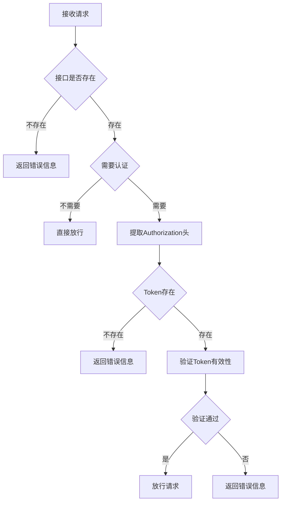
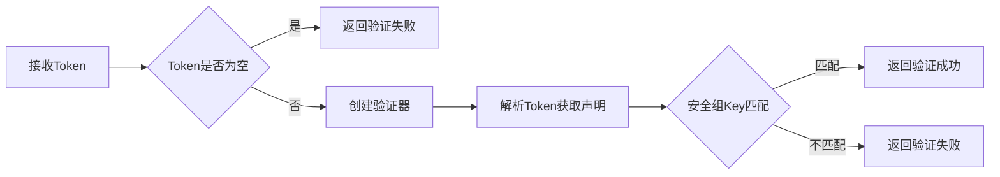

# 如何进行请求鉴权

## 概述

本系统使用基于JWT（JSON Web Token）的鉴权机制对受保护接口进行安全访问控制。该机制在网关层实现，确保只有携带有效令牌的请求才能访问需要认证的资源。

## 鉴权流程图



## 鉴权处理流程

### 1. 请求接收与URI解析

- 从HTTP请求中提取请求URI
- 过滤掉`/favicon.ico`等特殊请求
- 记录调试日志以便跟踪

```java
// 从请求中获取URI
String uri = RequestParameterUtil.getUrl(request);
log.trace("解析请求URI: {}", uri);
```

### 2. 接口声明检查

- 从接口缓存中获取接口配置信息
- 检查接口是否存在
- 不存在时立即返回404错误响应

```java
// 获取接口声明
statement = interfaceCacheUtil.getStatement(uri);
if (statement == null) {
    log.warn("接口不存在，URI: {}", uri);
    DefaultFullHttpResponse response = RequestResultUtil.parse(Result.error("暂无该接口信息"));
    channel.writeAndFlush(response);
    return;
}
```

### 3. 认证需求检查

- 检查接口声明中的`isAuth`标志
- 如果不需要认证，直接放行请求
- 如果需要认证，进入令牌验证流程

```java
// 检查接口是否需要认证
if (statement.getIsAuth()) {
    // 令牌验证流程
}
```

### 4. JWT令牌提取与验证

- 从`Authorization`请求头中提取JWT令牌
- 使用JwtUtils工具类验证令牌有效性
- 记录详细的验证过程日志

```java
log.debug("接口需要认证，URI: {}", uri);
String token = RequestParameterUtil.getToken(request);
log.trace("获取到的Token: {}", token);

if (!jwtUtils.verify(token)) {
    log.warn("Token验证失败，URI: {}", uri);
    DefaultFullHttpResponse response = RequestResultUtil.parse(Result.error("没有权限访问该接口!"));
    channel.writeAndFlush(response);
    return;
}
log.debug("Token验证成功，URI: {}", uri);
```

### 5. 成功处理

- 将接口声明存入Channel属性供后续处理器使用
- 记录验证通过日志
- 将请求传递给下一个处理器

```java
// 将接口声明存入Channel属性
channel.attr(AttributeKey.valueOf("HttpStatement")).set(statement);
log.debug("授权验证通过，继续处理请求，URI: {}", request.uri());

// 传递给下一个处理器
ctx.fireChannelRead(request);
```

### 6. 异常处理

- 捕获处理过程中可能发生的任何异常
- 返回包含错误信息的标准化响应
- 记录详细的异常日志用于问题排查

```java
} catch (Exception e) {
    log.error("授权验证处理异常", e);
    DefaultFullHttpResponse response = RequestResultUtil.parse(Result.error("接口调用失败: " + e.getMessage()));
    channel.writeAndFlush(response);
    return;
}
```

## JWT令牌验证细节

### 令牌验证流程



### JwtUtils核心方法

```java
/**
 * 验证JWT Token是否有效
 * @param token 待验证的Token字符串
 * @return true-验证通过 false-验证失败
 */
public boolean verify(String token) {
    log.debug("开始验证JWT Token");
    if (StrUtil.isBlank(token)) {
        log.warn("Token为空，验证失败");
        return false;
    }

    try {
        // 使用配置的密钥创建验证器
        Algorithm algorithm = Algorithm.HMAC256(config.getSafeSecret());
        JWTVerifier verifier = JWT.require(algorithm).build();

        // 验证Token并获取claim
        Claim claim = verifier.verify(token).getClaims().get("safe-key");
        boolean isValid = claim.asString().equals(config.getSafeKey());

        if (isValid) {
            log.debug("JWT Token验证通过");
        } else {
            log.warn("JWT Token验证失败：安全组key不匹配");
        }
        return isValid;
    } catch (Exception e) {
        log.error("JWT Token验证异常", e);
        return false;
    }
}
```
