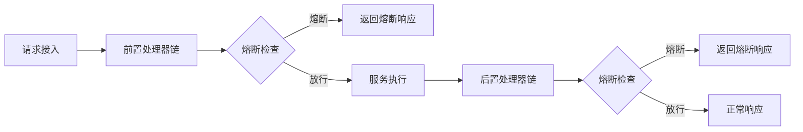
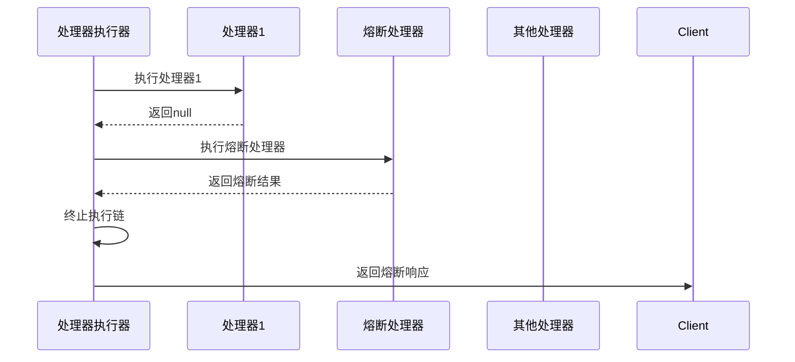
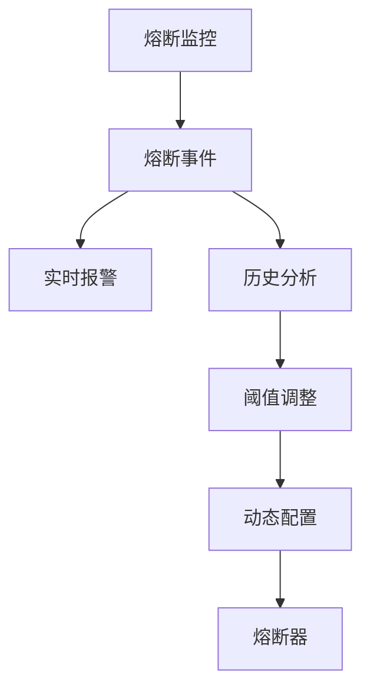

# 自定义熔断是怎么实现的

## 概述

本系统采用**责任链模式**实现自定义熔断机制，通过前后置处理器链提供灵活的熔断控制能力。熔断点可设置在请求处理流程的任意阶段，根据业务需求实现细粒度的服务保护。

## 熔断架构设计



## 核心组件

### 1. 处理器基类

```java
/**
 * 自定义后置处理器接口
 */
public interface CustomPostHandler extends Ordered {
    Result handle(HttpStatement httpStatement, FullHttpRequest request);
}


/**
 * 自定义前置处理器接口
 */
public interface CustomPreHandler extends Ordered {
    Result handle(HttpStatement httpStatement, FullHttpRequest request);
}
```

### 2. 处理器执行器

#### 前置处理器执行器

```java
/**
 * 前置处理器执行器，负责按顺序执行所有自定义前置处理器
 * 如果任一前置处理器返回结果，则直接响应并终止处理链
 */
@Slf4j
@Component
@ChannelHandler.Sharable
public class PreExecutorHandler extends BaseHandler<FullHttpRequest> {
    private final List<CustomPreHandler> handlers;

    /**
     * 构造函数，初始化并排序所有前置处理器
     * @param customPreHandlers 自定义前置处理器列表
     */
    @Autowired
    public PreExecutorHandler(List<CustomPreHandler> customPreHandlers) {
        // 按照order顺序对处理器进行排序
        this.handlers = customPreHandlers.stream()
                .sorted(Comparator.comparingInt(Ordered::getOrder))
                .collect(Collectors.toList());
        log.debug("初始化PreExecutorHandler，共加载{}个前置处理器", handlers.size());
    }

    /**
     * 处理HTTP请求，按顺序执行所有前置处理器
     * @param ctx Netty上下文
     * @param channel 通信通道
     * @param request HTTP请求
     */
    @Override
    protected void handle(ChannelHandlerContext ctx, Channel channel, FullHttpRequest request) {
        log.debug("开始执行前置处理链");

        // 从Channel属性获取HttpStatement
        HttpStatement httpStatement = (HttpStatement) channel.attr(AttributeKey.valueOf("HttpStatement")).get();
        log.trace("获取到HttpStatement: {}", httpStatement);

        // 按顺序执行所有前置处理器
        for (CustomPreHandler handler : handlers) {
            String handlerName = handler.getClass().getSimpleName();
            log.debug("执行前置处理器: {}", handlerName);

            Result result = null;
            try {
                result = handler.handle(httpStatement, request);
                log.trace("处理器[{}]返回结果: {}", handlerName, result);
            } catch (Exception e) {
                log.error("前置处理器[{}]执行异常", handlerName, e);
                // 忽略异常，继续执行下一个处理器
            }

            // 如果处理器返回了结果，则直接响应
            if (result != null) {
                log.debug("处理器[{}]返回有效结果，终止处理链", handlerName);
                DefaultFullHttpResponse response = RequestResultUtil.parse(result);
                channel.writeAndFlush(response);
                return;
            }
        }

        log.debug("所有前置处理器执行完毕，继续处理流程");
        ctx.fireChannelRead(request);
    }
}
```

#### 后置处理器执行器

```java
/**
 * 后置执行处理器
 * 负责执行所有自定义的后置处理器链
 */
@Slf4j
@Component
@ChannelHandler.Sharable
public class PostExecutorHandler extends BaseHandler<FullHttpRequest> {
    // 自定义后置处理器列表（按order排序）
    private final List<CustomPostHandler> handlers;

    /**
     * 构造函数
     * @param customPostHandlers 自定义后置处理器列表（Spring自动注入）
     */
    @Autowired
    public PostExecutorHandler(List<CustomPostHandler> customPostHandlers) {
        // 根据order排序处理器
        this.handlers = customPostHandlers.stream()
                .sorted(Comparator.comparingInt(Ordered::getOrder))
                .collect(Collectors.toList());
        log.info("初始化PostExecutorHandler，加载{}个后置处理器", handlers.size());
    }

    /**
     * 处理HTTP请求的后置处理
     * @param ctx ChannelHandler上下文
     * @param channel 当前Channel
     * @param request HTTP请求
     */
    @Override
    protected void handle(ChannelHandlerContext ctx, Channel channel, FullHttpRequest request) {
        log.debug("开始执行后置处理链");

        // 从Channel属性获取HttpStatement
        HttpStatement httpStatement = (HttpStatement) channel.attr(AttributeKey.valueOf("HttpStatement")).get();
        log.trace("获取到HttpStatement: {}", httpStatement);

        // 按顺序执行所有后置处理器
        for (CustomPostHandler handler : handlers) {
            String handlerName = handler.getClass().getSimpleName();
            log.debug("执行后置处理器: {}", handlerName);

            Result result = null;
            try {
                result = handler.handle(httpStatement, request);
                log.trace("处理器[{}]返回结果: {}", handlerName, result);
            } catch (Exception e) {
                log.error("后置处理器[{}]执行异常", handlerName, e);
                // 忽略异常，继续执行下一个处理器
            }

            // 如果处理器返回了结果，则直接响应
            if (result != null) {
                log.debug("处理器[{}]返回有效结果，终止处理链", handlerName);
                DefaultFullHttpResponse response = RequestResultUtil.parse(result);
                channel.writeAndFlush(response);
                return;
            }
        }

        log.debug("所有后置处理器执行完毕，继续处理流程");
        ctx.fireChannelRead(request);
    }
}
```

## 熔断实现机制

### 1. 处理器链执行流程



### 2. 熔断检查逻辑

处理器通过返回`Result`对象触发熔断：

- 返回`null`: 继续执行后续处理器
- 返回非`null`: 立即终止处理器链并返回响应

### 3. 熔断处理器示例

#### 基于QPS的前置熔断

```java
@Component
public class QpsPreHandler implements CustomPreHandler {
    private final Map<String, AtomicInteger> counter = new ConcurrentHashMap<>();
    private final Map<String, Long> lastResetTime = new ConcurrentHashMap<>();
    
    @Override
    public int getOrder() {
        return 10; // 执行顺序
    }

    @Override
    public Result handle(HttpStatement httpStatement, FullHttpRequest request) {
        String uri = httpStatement.getUri();
        // 每分钟重置计数器
        resetCounterIfNeeded(uri);
        
        int currentQps = counter.computeIfAbsent(uri, k -> new AtomicInteger(0))
                               .incrementAndGet();
        
        if (currentQps > 1000) { // 阈值1000 QPS
            return Result.error(503, "服务过载，请稍后重试");
        }
        return null;
    }
    
    private void resetCounterIfNeeded(String uri) {
        long now = System.currentTimeMillis();
        lastResetTime.putIfAbsent(uri, now);
        if (now - lastResetTime.get(uri) > 60_000) {
            counter.put(uri, new AtomicInteger(0));
            lastResetTime.put(uri, now);
        }
    }
}
```

#### 基于错误率的后置熔断

```java
@Component
public class ErrorRatePostHandler implements CustomPostHandler {
    private final Map<String, CircuitBreaker> breakers = new ConcurrentHashMap<>();
    
    @Override
    public int getOrder() {
        return 20; // 执行顺序
    }

    @Override
    public Result handle(HttpStatement httpStatement, FullHttpRequest request) {
        String uri = httpStatement.getUri();
        CircuitBreaker breaker = breakers.computeIfAbsent(uri, k -> 
            new CircuitBreaker(10, 0.5, 30_000));
        
        // 从请求上下文中获取执行结果
        Result result = (Result) channel.attr(AttributeKey.valueOf("result")).get();
        
        // 更新熔断器状态
        breaker.record(result.isSuccess());
        
        if (breaker.isOpen()) {
            return Result.error(503, "服务暂时不可用");
        }
        return null;
    }
    
    static class CircuitBreaker {
        private final int minRequests;
        private final double failureThreshold;
        private final long timeoutMs;
        
        private int totalRequests = 0;
        private int failures = 0;
        private long openedAt = 0;
        
        public CircuitBreaker(int minRequests, double failureThreshold, long timeoutMs) {
            this.minRequests = minRequests;
            this.failureThreshold = failureThreshold;
            this.timeoutMs = timeoutMs;
        }
        
        public void record(boolean success) {
            totalRequests++;
            if (!success) failures++;
            
            double failureRate = (double) failures / totalRequests;
            if (totalRequests >= minRequests && failureRate >= failureThreshold) {
                open();
            }
        }
        
        public boolean isOpen() {
            if (openedAt > 0) {
                if (System.currentTimeMillis() - openedAt > timeoutMs) {
                    // 尝试半开状态
                    openedAt = 0;
                    totalRequests = 0;
                    failures = 0;
                    return false;
                }
                return true;
            }
            return false;
        }
        
        private void open() {
            openedAt = System.currentTimeMillis();
        }
    }
}
```

## 最佳实践



## 注意事项

1. **处理器顺序**：通过`getOrder()`方法控制熔断检查的执行顺序
2. **资源隔离**：每个接口/服务使用独立的熔断器实例
3. **性能影响**：熔断检查应轻量，避免成为性能瓶颈
4. **状态持久化**：重要熔断状态应考虑持久化存储
5. **测试验证**：定期通过压力测试验证熔断效果

## 扩展能力

可通过实现`CustomPreHandler`和`CustomPostHandler`接口扩展熔断策略：

1. 基于响应时间的熔断
2. 基于系统负载的熔断
3. 基于业务错误码的熔断
4. 基于第三方健康检查的熔断
5. 分布式熔断协调

该设计提供了高度灵活的熔断机制，可根据实际业务需求快速实现各种熔断策略，保障系统稳定性。
