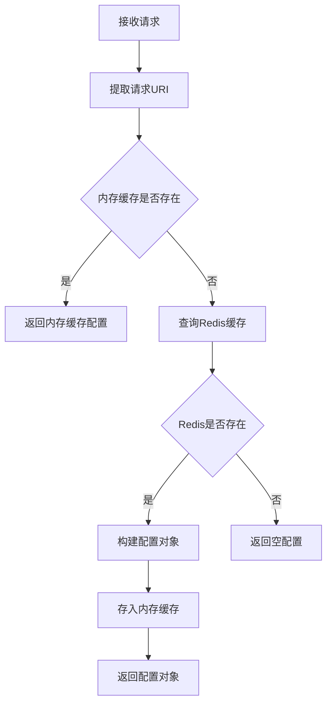
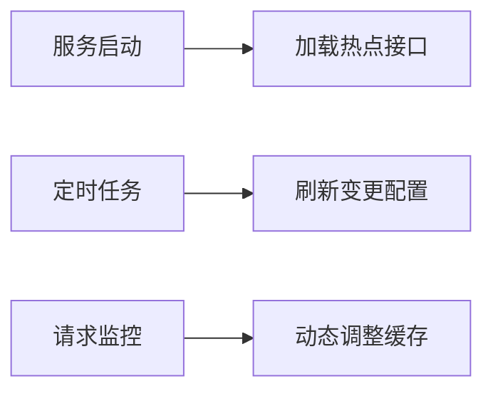
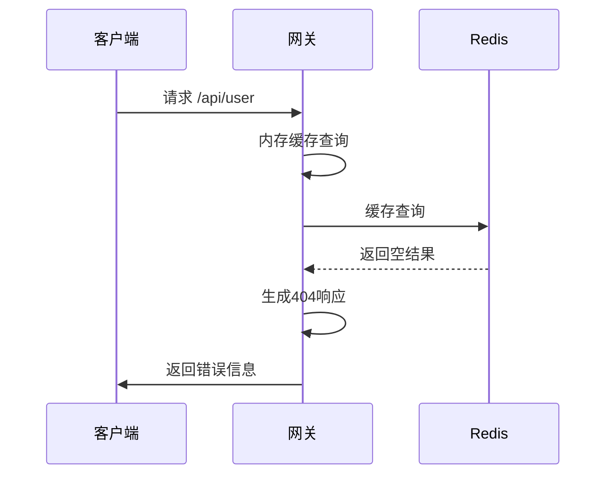

# 请求是怎么解析的

## 概述

本系统采用**多级缓存策略**实现高效的请求解析，结合内存缓存和Redis缓存快速获取接口配置信息。该机制确保在毫秒级别内完成接口路由和参数解析，为后续处理流程提供基础支撑。

## 请求解析流程图



## 核心解析流程

### 1. 请求URI提取

- 从HTTP请求中提取请求路径
- 过滤特殊请求（如`/favicon.ico`）
- 规范化URI格式（去除查询参数）

```java
// 从请求中获取URI
String uri = RequestParameterUtil.getUrl(request);
log.trace("解析请求URI: {}", uri);
```

### 2. 内存缓存查询

- 首先查询内存中的配置缓存
- 使用ConcurrentHashMap实现线程安全访问
- 缓存命中率直接影响系统性能

```java
// 1. 先从内存缓存中查找
HttpStatement httpStatement = config.getHttpStatementMap().get(url);
if (httpStatement != null) {
    log.debug("从内存缓存中获取到接口配置");
    return httpStatement;
}
```

### 3. Redis缓存查询

- 构建Redis Key：`URL:服务名:请求路径`
- 使用Hash数据结构存储配置信息
- 避免直接访问数据库减轻后端压力

```java
// 2. 从Redis中获取
String key = String.format("URL:%s:%s", config.getServerName(), url);
Map<Object, Object> entries = redisTemplate.opsForHash().entries(key);
```

### 4. 配置对象构建

- 将Redis中的Hash数据转换为Java对象
- 处理类型转换和数据验证
- 支持多种配置属性

```java
// 3. 构建HttpStatement对象
HttpStatement statement = HttpStatement.builder()
        .interfaceName((String) entries.get("interfaceName"))
        .methodName((String) entries.get("methodName"))
        .parameterType(((String) entries.get("parameterType")).split(","))
        .isAuth(entries.get("isAuth").equals(1))
        .isHttp(entries.get("isHttp").equals(1))
        .httpType(HTTPTypeEnum.valueOf((String) entries.get("httpType")))
        .build();
```

### 5. 内存缓存更新

- 将Redis获取的配置存入内存缓存
- 使用LRU策略管理内存缓存
- 减少后续相同请求的Redis访问

```java
// 4. 放入内存缓存
config.getHttpStatementMap().put(url, statement);
log.debug("接口配置已缓存到内存");
```

## 核心数据结构

### HttpStatement对象属性

| 字段名        | 类型         | 描述                     |
| ------------- | ------------ | ------------------------ |
| interfaceName | String       | Dubbo接口全限定名        |
| methodName    | String       | 目标方法名               |
| parameterType | String[]     | 方法参数类型数组         |
| isAuth        | boolean      | 是否需要认证             |
| isHttp        | boolean      | 是否为HTTP服务           |
| httpType      | HTTPTypeEnum | HTTP请求类型(GET/POST等) |

### Redis存储结构

- **Key格式**：`URL:<服务名>:<请求路径>`
- **Value类型**：Hash
- **字段映射**：

| Hash字段      | 数据类型 | 对应Java属性    |
| ------------- | -------- | --------------- |
| interfaceName | String   | interfaceName   |
| methodName    | String   | methodName      |
| parameterType | String   | parameterType   |
| isAuth        | Integer  | isAuth (1=true) |
| isHttp        | Integer  | isHttp (1=true) |
| httpType      | String   | httpType        |

## 性能优化策略

### 1. 双缓存设计

- **内存缓存**：纳秒级访问速度
- **Redis缓存**：毫秒级访问速度
- **组合优势**：90%以上请求命中内存缓存

### 2. 缓存预热机制

> TODO

- 服务启动时加载热点接口配置
- 定时任务刷新变更配置
- 基于请求频率动态调整缓存策略



### 3. 分布式缓存同步

- 通过Redis Pub/Sub同步配置变更
- 集群环境下保证缓存一致性
- 减少无效缓存占用内存空间

```java
// 缓存变更通知示例
redisTemplate.convertAndSend("cache-update", "URL:/api/user");
```

## 异常处理机制

### 1. 接口不存在处理

```java
if (entries.isEmpty()) {
    log.warn("未找到URL对应的接口配置: {}", url);
    return null;
}
```

### 2. 错误处理流程



该请求解析机制通过精心设计的缓存策略和数据结构，实现了高并发场景下的高效请求路由，为系统提供了稳定可靠的基础支撑能力。
