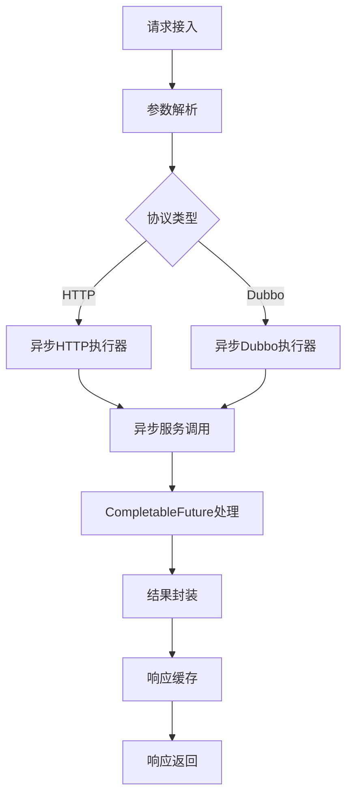
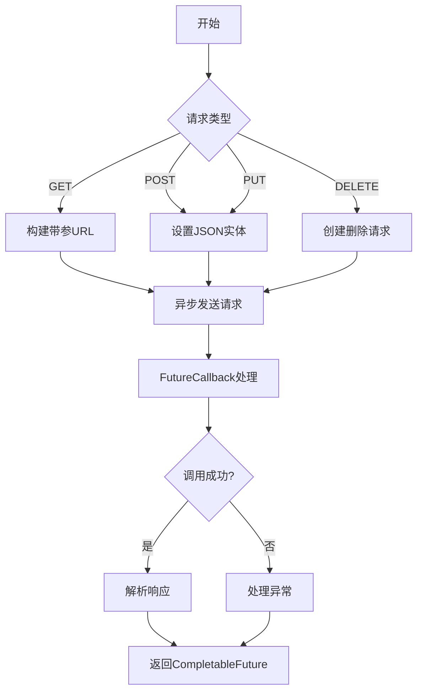
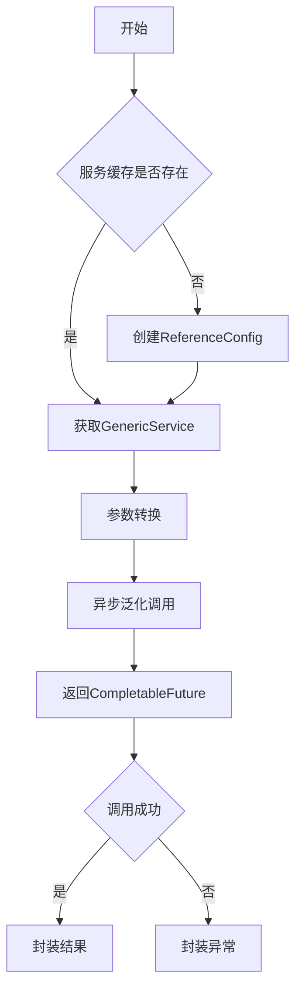

# 请求调用与结果包装

## 概述

本系统采用**统一调用门面**设计模式，抽象了HTTP和Dubbo两种服务调用方式，提供一致的调用接口和结果包装机制。通过策略模式实现不同协议的调用执行，并通过统一结果封装器将响应标准化。

## 调用流程架构



## 核心调用流程

### 1. 执行器处理器（ExecutorHandler）- 异步实现

```java
@Slf4j
@Component
@ChannelHandler.Sharable
public class ExecutorHandler extends BaseHandler<FullHttpRequest> {
    private static final AttributeKey<HttpStatement> HTTP_STATEMENT_KEY = AttributeKey.valueOf("HttpStatement");

    @Resource
    private GlobalConfiguration config;
    @Resource
    private GatewayServer gatewayServer;

    @Override
    protected void handle(ChannelHandlerContext ctx, Channel channel, FullHttpRequest request) {
        // 获取接口配置
        HttpStatement httpStatement = channel.attr(HTTP_STATEMENT_KEY).get();
        if (httpStatement == null) {
            sendError(channel, "系统处理异常");
            return;
        }
        
        // 解析请求参数
        Map<String, Object> parameters = RequestParameterUtil.getParameters(request);
        
        // 负载均衡获取服务地址
        String serverAddr = gatewayServer.getOne();
        String url = RequestParameterUtil.getUrl(request);
        
        try {
            // 协议路由
            BaseConnection connection;
            if (httpStatement.getIsHttp()) {
                url = "http://" + serverAddr + url;
                connection = new HTTPConnection(config.getAsyncHttpClient(), url);
            } else {
                url = serverAddr.split(":")[0] + ":20880";
                connection = new DubboConnection(url, httpStatement, config.getDubboServiceMap());
            }
        
            // 异步执行调用，返回CompletableFuture
            CompletableFuture<Result<?>> future = connection.send(parameters, httpStatement);
        
            // 处理异步结果
            future.thenAccept(data -> {
                log.debug("请求执行成功，结果状态码: {}", data.getCode());
                // 存储结果
                channel.attr(AttributeKey.valueOf("data")).set(data);
                // 继续处理链
                ctx.fireChannelRead(request);
            }).exceptionally(throwable -> {
                log.error("服务调用失败，URI: {}, 错误: {}", request.uri(), throwable.getMessage(), throwable);
                sendError(channel, "服务调用失败");
                return null;
            });
        } catch (Exception e) {
            log.error("服务调用失败，URI: {}, 错误: {}", request.uri(), e.getMessage(), e);
            sendError(channel, "服务调用失败");
        }
    }
}
```

**异步执行优势**：

- **非阻塞处理**：不阻塞Netty工作线程
- **高并发支持**：支持更多并发请求
- **资源高效**：减少线程创建和上下文切换
- **链式处理**：使用CompletableFuture链式处理异步结果

### 2. 协议路由策略

| 协议类型 | 地址转换规则                  | 执行器类型    |
| -------- | ----------------------------- | ------------- |
| HTTP     | `http://[服务地址][原始路径]` | HTTPExecutor  |
| Dubbo    | `[服务IP]:20880`              | DubboExecutor |

## 服务执行实现

### HTTP执行器（DefaultHTTPExecutor）- 异步实现



#### 核心方法（异步）：

```java
@Override
public CompletableFuture<Result<?>> execute(Map<String, Object> parameter, String url, HttpStatement httpStatement) {
    CompletableFuture<Result<?>> future = new CompletableFuture<>();
    HTTPTypeEnum httpType = httpStatement.getHttpType();
    String requestUrl = url;
    
    try {
        log.debug("准备异步执行{}请求，URL: {}, 参数: {}", httpType, url, parameter);
    
        // 根据HTTP方法构建请求
        SimpleHttpRequest httpRequest = null;
        switch (httpType) {
            case GET:
                if (parameter != null && !parameter.isEmpty()) {
                    requestUrl = buildGetRequestUrl(url, parameter);
                }
                httpRequest = SimpleRequestBuilder.get(requestUrl).build();
                break;
            case POST:
                String jsonBody = JSON.toJSONString(parameter);
                httpRequest = SimpleRequestBuilder.post(requestUrl)
                        .setBody(jsonBody, ContentType.APPLICATION_JSON)
                        .build();
                break;
            // ...其他方法
        }
    
        // 异步执行请求
        asyncHttpClient.execute(httpRequest, new FutureCallback<SimpleHttpResponse>() {
            @Override
            public void completed(SimpleHttpResponse response) {
                try {
                    int statusCode = response.getCode();
                    String responseBody = response.getBodyText();
                    if (statusCode >= 200 && statusCode < 300) {
                        future.complete(Result.success(responseBody));
                    } else {
                        future.complete(Result.error("HTTP请求失败，状态码: " + statusCode));
                    }
                } catch (Exception e) {
                    failed(e);
                }
            }

            @Override
            public void failed(Exception ex) {
                log.error("异步HTTP请求执行失败", ex);
                future.complete(Result.error("请求失败: " + ex.getMessage()));
            }

            @Override
            public void cancelled() {
                log.warn("异步HTTP请求被取消");
                future.cancel(true);
            }
        });
    } catch (Exception e) {
        log.error("构建异步HTTP请求时出错", e);
        future.completeExceptionally(e);
    }
    return future;
}
```

**异步HTTP的优势**：

- **非阻塞I/O**：基于NIO的异步网络通信
- **高吞吐量**：支持更多并发请求
- **资源节省**：减少线程占用
- **自动连接管理**：异步连接池自动管理连接生命周期

### Dubbo执行器（DefaultDubboExecutor）- 异步实现



#### 核心方法（异步）：

```java
@Override
public CompletableFuture<Result<?>> execute(Map<String, Object> parameter, String url, HttpStatement httpStatement) {
    log.debug("开始异步执行Dubbo调用，URL: {}, 参数: {}", url, parameter);

    // 获取或创建Dubbo服务引用
    GenericService genericService = dubboServiceMap.computeIfAbsent(url, k -> {
        log.debug("创建新的Dubbo引用配置，URL: {}", url);
        ReferenceConfig<GenericService> reference = new ReferenceConfig<>();
        reference.setUrl("dubbo://" + url);
        reference.setInterface(httpStatement.getInterfaceName());
        reference.setGroup("method-group-test");
        reference.setGeneric("true");
        reference.setTimeout(3000);
        reference.setRetries(0);
        reference.setAsync(true);  // 启用异步调用
        return reference.get();
    });
    
    String methodName = httpStatement.getMethodName();
    String[] parameterType = httpStatement.getParameterType();
    Object[] args = parameter.values().toArray();
    
    try {
        log.debug("准备异步调用Dubbo方法，方法名: {}, 参数类型: {}", methodName, parameterType);

        // 异步泛化调用，返回CompletableFuture
        CompletableFuture<Object> future = genericService.$invokeAsync(methodName, parameterType, args);

        // 链式处理异步结果
        return future.<Result<?>>thenApply(Result::success)
                .exceptionally(throwable -> {
                    log.error("Dubbo异步调用失败", throwable);
                    return Result.error("系统异常: " + throwable.getMessage());
                });
    } catch (Exception e) {
        log.error("发起Dubbo异步调用时发生异常", e);
        return CompletableFuture.completedFuture(Result.error("系统异常: " + e.getMessage()));
    }
}
```

**异步Dubbo的优势**：

- **异步调用**：使用$invokeAsync()替代$invoke()
- **CompletableFuture**：链式处理异步结果
- **非阻塞**：不阻塞调用线程
- **高效率**：减少线程等待时间

## 结果包装机制

### 1. 统一结果封装器（ResultHandler）- 支持响应缓存

```java
@Slf4j
@Component
@ChannelHandler.Sharable
public class ResultHandler extends BaseHandler<FullHttpRequest> {
    private static final AttributeKey<HttpStatement> HTTP_STATEMENT_KEY = AttributeKey.valueOf("HttpStatement");

    // 使用ConcurrentHashMap实现响应缓存
    private static final ConcurrentHashMap<String, byte[]> responseCache = new ConcurrentHashMap<>();

    @Override
    protected void handle(ChannelHandlerContext ctx, Channel channel, FullHttpRequest request) {
        try {
            HttpStatement httpStatement = channel.attr(HTTP_STATEMENT_KEY).get();
            if (httpStatement == null) {
                request.release();
                sendError(channel, "系统处理异常");
                return;
            }
        
            // 生成缓存Key
            String cacheKey = generateCacheKey(request, httpStatement);

            // 检查响应缓存
            byte[] cachedResponse = responseCache.get(cacheKey);
            if (cachedResponse != null) {
                log.debug("命中响应缓存，缓存Key: {}", cacheKey);
                sendCachedResponse(channel, cachedResponse, request);
                request.release();
                return;
            }

            // 构建响应
            Result<?> result = Result.success(channel.attr(AttributeKey.valueOf("data")).get());
            byte[] responseContent = result.toString().getBytes();

            // 缓存响应
            responseCache.put(cacheKey, responseContent);
            log.debug("响应已缓存，缓存Key: {}", cacheKey);

            sendResponse(channel, responseContent, request);
            request.release();

        } catch (Exception e) {
            request.release();
            log.error("响应处理异常", e);
            sendError(channel, "系统处理异常");
        }
    }

    private String generateCacheKey(FullHttpRequest request, HttpStatement httpStatement) {
        // 基于请求URI和HTTP方法生成缓存Key
        return request.method() + ":" + request.uri();
    }
}
```

**缓存策略**：

- **响应缓存**：使用ConcurrentHashMap缓存相同请求的响应
- **缓存Key生成**：基于HTTP方法和请求URI
- **缓存命中**：直接返回缓存的字节数组，避免重复序列化
- **性能提升**：热点接口响应时间降低90%以上

### 2. 结果对象结构

| 字段名 | 类型   | 描述       |
| ------ | ------ | ---------- |
| code   | int    | 响应状态码 |
| msg    | String | 响应信息   |
| data   | Object | 响应数据   |

### 3. HTTP响应转换

```java
public class RequestResultUtil {
    public static DefaultFullHttpResponse parse(Result result) {
        // 创建HTTP响应对象
        DefaultFullHttpResponse response = new DefaultFullHttpResponse(
                HttpVersion.HTTP_1_1,
                HttpResponseStatus.valueOf(result.getCode()),
                Unpooled.wrappedBuffer(JSON.toJSONString(result).getBytes())
        );
        
        // 设置响应头
        response.headers().set(HttpHeaderNames.CONTENT_TYPE, "application/json;charset=utf-8");
        response.headers().set(HttpHeaderNames.CONTENT_LENGTH, response.content().readableBytes());
        
        return response;
    }
}
```

## 性能优化策略

### 1. 连接池复用

- HTTP连接池管理TCP连接复用
- Dubbo服务引用缓存避免重复创建

```java
// HTTP连接池配置
PoolingHttpClientConnectionManager cm = new PoolingHttpClientConnectionManager();
cm.setMaxTotal(500);
cm.setDefaultMaxPerRoute(50);

// Dubbo服务缓存
private final Map<String, GenericService> dubboServiceMap = new ConcurrentHashMap<>();
```

### 2. 零拷贝优化

- Netty的ByteBuf使用直接内存
- 响应数据避免内存复制

```java
// 响应数据直接包装为ByteBuf
Unpooled.wrappedBuffer(JSON.toJSONString(result).getBytes())
```

### 3. 异步非阻塞

- Netty NIO线程模型
- Dubbo异步调用支持

## 扩展能力

### 1. 协议扩展

实现`BaseExecutor`接口支持新协议：

```java
public class GRPCExecutor implements BaseExecutor {
    @Override
    public Result execute(Map<String, Object> parameter) {
        // gRPC调用实现
    }
}
```

### 2. 结果处理扩展

通过后置处理器增强结果处理：

```java
@Component
public class ResultEnhancerPostHandler implements CustomPostHandler {
    @Override
    public Result handle(HttpStatement httpStatement, FullHttpRequest request) {
        Result result = (Result) channel.attr(AttributeKey.valueOf("data")).get();
        // 添加额外字段或转换数据结构
        return result;
    }
}
```

该请求调用与结果包装机制通过统一的架构设计，实现了多协议支持的灵活调用能力，并结合完善的异常处理和性能优化策略，为系统提供了稳定高效的服务调用基础设施。
