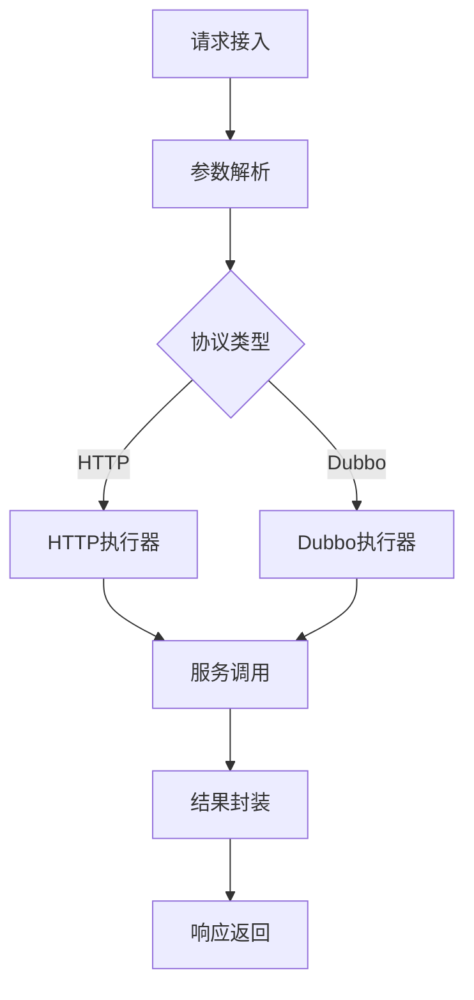
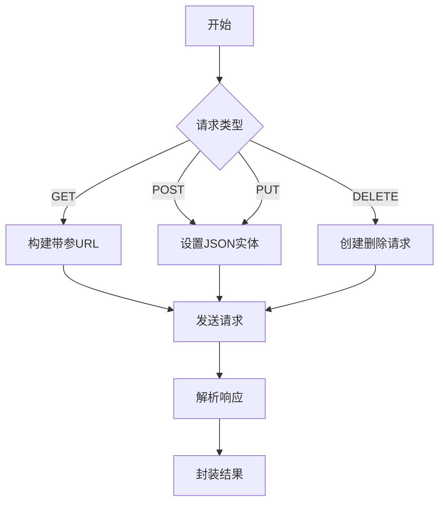
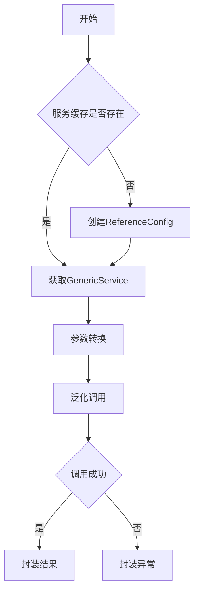

# 请求调用与结果包装

## 概述

本系统采用**统一调用门面**设计模式，抽象了HTTP和Dubbo两种服务调用方式，提供一致的调用接口和结果包装机制。通过策略模式实现不同协议的调用执行，并通过统一结果封装器将响应标准化。

## 调用流程架构



## 核心调用流程

### 1. 执行器处理器（ExecutorHandler）

```java
@Component
@ChannelHandler.Sharable
public class ExecutorHandler extends BaseHandler<FullHttpRequest> {
    @Override
    protected void handle(ChannelHandlerContext ctx, Channel channel, FullHttpRequest request) {
        // 获取接口配置
        HttpStatement httpStatement = (HttpStatement) channel.attr(AttributeKey.valueOf("HttpStatement")).get();
        
        // 解析请求参数
        Map<String, Object> parameters = RequestParameterUtil.getParameters(request);
        
        // 负载均衡获取服务地址
        String serverAddr = gatewayServer.getOne();
        
        // 协议路由
        BaseConnection connection;
        if (httpStatement.getIsHttp()) {
            connection = new HTTPConnection(/* 参数 */);
        } else {
            connection = new DubboConnection(/* 参数 */);
        }
        
        // 执行调用
        Result data = connection.send(parameters);
        
        // 存储结果
        channel.attr(AttributeKey.valueOf("data")).set(data);
        
        // 继续处理链
        ctx.fireChannelRead(request);
    }
}
```

### 2. 协议路由策略

| 协议类型 | 地址转换规则                  | 执行器类型    |
| -------- | ----------------------------- | ------------- |
| HTTP     | `http://[服务地址][原始路径]` | HTTPExecutor  |
| Dubbo    | `[服务IP]:20880`              | DubboExecutor |

## 服务执行实现

### HTTP执行器（HTTPExecutor）



#### 核心方法：

```java
public Result execute(Map<String, Object> parameter) {
    // 根据HTTP方法构建请求
    switch (httpType) {
        case GET:
            requestUrl = buildGetRequestUrl(url, parameter);
            httpRequest = new HttpGet(requestUrl);
            break;
        case POST:
            // 设置JSON请求体
            break;
        // ...其他方法
    }
    
    // 执行请求
    CloseableHttpResponse response = closeableHttpClient.execute(httpRequest);
    
    // 解析响应
    int statusCode = response.getStatusLine().getStatusCode();
    String responseBody = EntityUtils.toString(response.getEntity(), "UTF-8");
    
    return new Result<>(statusCode, "", responseBody);
}
```

### Dubbo执行器（DubboExecutor）



#### 核心方法：

```java
public Result execute(Map<String, Object> parameter) {
    // 获取或创建Dubbo服务引用
    GenericService genericService = dubboServiceMap.computeIfAbsent(url, k -> {
        ReferenceConfig<GenericService> reference = new ReferenceConfig<>();
        // 配置服务引用
        return reference.get();
    });
    
    // 执行泛化调用
    Object result = genericService.$invoke(
        httpStatement.getMethodName(), 
        httpStatement.getParameterType(), 
        parameter.values().toArray()
    );
    
    return Result.success(result);
}
```

## 结果包装机制

### 1. 统一结果封装器（ResultHandler）

```java
@Component
@ChannelHandler.Sharable
public class ResultHandler extends BaseHandler<FullHttpRequest> {
    @Override
    protected void handle(ChannelHandlerContext ctx, Channel channel, FullHttpRequest request) {
        // 获取执行结果
        Result result = Result.success(channel.attr(AttributeKey.valueOf("data")).get());
        
        // 转换为HTTP响应
        channel.writeAndFlush(RequestResultUtil.parse(result));
    }
}
```

### 2. 结果对象结构

| 字段名 | 类型   | 描述       |
| ------ | ------ | ---------- |
| code   | int    | 响应状态码 |
| msg    | String | 响应信息   |
| data   | Object | 响应数据   |

### 3. HTTP响应转换

```java
public class RequestResultUtil {
    public static DefaultFullHttpResponse parse(Result result) {
        // 创建HTTP响应对象
        DefaultFullHttpResponse response = new DefaultFullHttpResponse(
                HttpVersion.HTTP_1_1,
                HttpResponseStatus.valueOf(result.getCode()),
                Unpooled.wrappedBuffer(JSON.toJSONString(result).getBytes())
        );
        
        // 设置响应头
        response.headers().set(HttpHeaderNames.CONTENT_TYPE, "application/json;charset=utf-8");
        response.headers().set(HttpHeaderNames.CONTENT_LENGTH, response.content().readableBytes());
        
        return response;
    }
}
```

## 性能优化策略

### 1. 连接池复用

- HTTP连接池管理TCP连接复用
- Dubbo服务引用缓存避免重复创建

```java
// HTTP连接池配置
PoolingHttpClientConnectionManager cm = new PoolingHttpClientConnectionManager();
cm.setMaxTotal(500);
cm.setDefaultMaxPerRoute(50);

// Dubbo服务缓存
private final Map<String, GenericService> dubboServiceMap = new ConcurrentHashMap<>();
```

### 2. 零拷贝优化

- Netty的ByteBuf使用直接内存
- 响应数据避免内存复制

```java
// 响应数据直接包装为ByteBuf
Unpooled.wrappedBuffer(JSON.toJSONString(result).getBytes())
```

### 3. 异步非阻塞

- Netty NIO线程模型
- Dubbo异步调用支持

## 扩展能力

### 1. 协议扩展

实现`BaseExecutor`接口支持新协议：

```java
public class GRPCExecutor implements BaseExecutor {
    @Override
    public Result execute(Map<String, Object> parameter) {
        // gRPC调用实现
    }
}
```

### 2. 结果处理扩展

通过后置处理器增强结果处理：

```java
@Component
public class ResultEnhancerPostHandler implements CustomPostHandler {
    @Override
    public Result handle(HttpStatement httpStatement, FullHttpRequest request) {
        Result result = (Result) channel.attr(AttributeKey.valueOf("data")).get();
        // 添加额外字段或转换数据结构
        return result;
    }
}
```

该请求调用与结果包装机制通过统一的架构设计，实现了多协议支持的灵活调用能力，并结合完善的异常处理和性能优化策略，为系统提供了稳定高效的服务调用基础设施。
