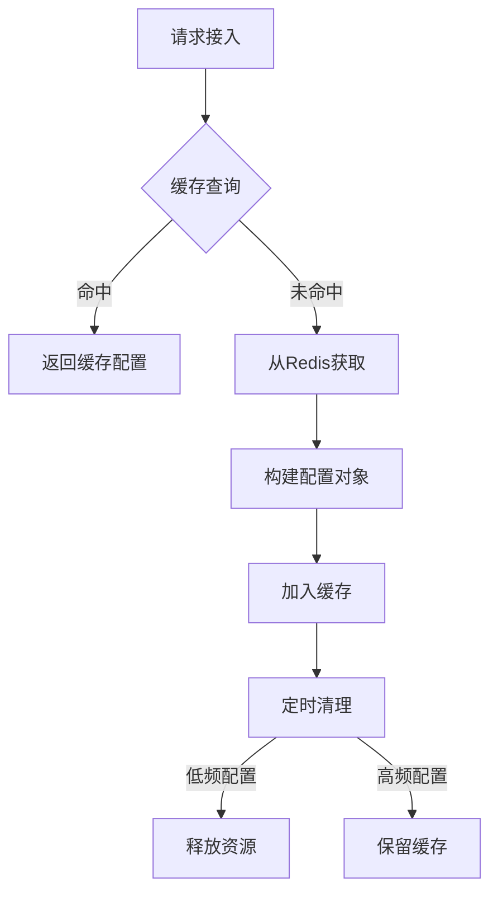

# 自定义接口缓存池

## 引言

在网关系统中，高效管理接口配置至关重要。本系统采用**LFU（Least Frequently Used）缓存策略**实现接口缓存池，结合定时清空机制，在资源利用率和数据一致性之间取得最佳平衡。

## 为什么使用LFU缓存

### 1. 资源优化需求

- **高并发压力**：网关需处理大量并发请求
- **资源有限性**：服务器内存资源有限
- **性能敏感**：毫秒级响应要求

### 2. LFU策略优势

| 策略    | 优点                       | 缺点                       | 适用场景               |
| ------- | -------------------------- | -------------------------- | ---------------------- |
| **LFU** | 保护高频资源  长期性能稳定 | 历史负担重  实现较复杂     | **网关缓存**  配置文件 |
| LRU     | 实现简单  最近数据高效     | 易受突发流量影响  保护不足 | 页面缓存               |
| FIFO    | 实现简单  内存占用低       | 效率最低  命中率差         | 低要求场景             |

### 3. 定时清空必要性

- **配置变更适应**：服务上下线时刷新连接
- **资源泄露防范**：防止无效连接积累
- **动态负载均衡**：适应流量模式变化

## LFU缓存实现

### 系统架构



### 核心实现

#### 1. LFU节点设计

```java
class LFUNode<K, V> {
    final K key;
    V value;
    int frequency = 1;
    long lastAccessTime;
    long createTime;

    // 节点数据结构
    LFUNode<K, V> prev;
    LFUNode<K, V> next;
}
```

#### 2. LFU缓存核心实现

```java
public class LFUCache<K, V> {
    // 缓存结构
    private final Map<K, LFUNode<K, V>> cacheMap;
    private final Map<Integer, LinkedHashSet<LFUNode<K, V>>> frequencyMap;

    private final int capacity;
    private int minFrequency = 1;

    // 清理配置
    private final long ttl; // 生存时间(ms)
    private final long maxIdleTime; // 最大空闲时间(ms)
    private final ScheduledExecutorService cleaner;

    public LFUCache(int capacity, long ttl, long maxIdleTime) {
        this.capacity = capacity;
        this.ttl = ttl;
        this.maxIdleTime = maxIdleTime;

        cacheMap = new ConcurrentHashMap<>(capacity);
        frequencyMap = new ConcurrentHashMap<>();
        frequencyMap.put(1, new LinkedHashSet<>());

        // 初始化清理线程
        cleaner = Executors.newSingleThreadScheduledExecutor();
        cleaner.scheduleAtFixedRate(this::cleanExpired,
            ttl/2, ttl/2, TimeUnit.MILLISECONDS);
    }

    public V get(K key) {
        LFUNode<K, V> node = cacheMap.get(key);
        if (node == null) return null;

        updateFrequency(node);
        node.lastAccessTime = System.currentTimeMillis();
        return node.value;
    }

    public void put(K key, V value) {
        if (capacity == 0) return;

        LFUNode<K, V> node = cacheMap.get(key);
        if (node != null) {
            node.value = value;
            updateFrequency(node);
            node.lastAccessTime = System.currentTimeMillis();
            return;
        }

        if (cacheMap.size() >= capacity) {
            evict();
        }

        LFUNode<K, V> newNode = new LFUNode<>(key, value);
        newNode.createTime = System.currentTimeMillis();
        newNode.lastAccessTime = newNode.createTime;

        cacheMap.put(key, newNode);
        addToFrequencyMap(newNode);
        minFrequency = 1;
    }

    private void updateFrequency(LFUNode<K, V> node) {
        int freq = node.frequency;
        LinkedHashSet<LFUNode<K, V>> set = frequencyMap.get(freq);
        set.remove(node);

        if (freq == minFrequency && set.isEmpty()) {
            minFrequency = freq + 1;
        }

        node.frequency++;
        addToFrequencyMap(node);
    }

    private void addToFrequencyMap(LFUNode<K, V> node) {
        int freq = node.frequency;
        frequencyMap
            .computeIfAbsent(freq, k -> new LinkedHashSet<>())
            .add(node);
    }

    private void evict() {
        LinkedHashSet<LFUNode<K, V>> minFreqSet = frequencyMap.get(minFrequency);
        Iterator<LFUNode<K, V>> iterator = minFreqSet.iterator();

        if (iterator.hasNext()) {
            LFUNode<K, V> node = iterator.next();
            iterator.remove();
            cacheMap.remove(node.key);
        }
    }

    private void cleanExpired() {
        long now = System.currentTimeMillis();
        for (Iterator<Map.Entry<K, LFUNode<K, V>>> it = cacheMap.entrySet().iterator(); it.hasNext();) {
            Map.Entry<K, LFUNode<K, V>> entry = it.next();
            LFUNode<K, V> node = entry.getValue();

            // TTL过期检查
            if (now - node.createTime > ttl) {
                it.remove();
                removeFromFrequencyMap(node);
                continue;
            }

            // 空闲超时检查
            if (now - node.lastAccessTime > maxIdleTime) {
                it.remove();
                removeFromFrequencyMap(node);
            }
        }

        // 更新最小频率
        while (minFrequency <= frequencyMap.size() &&
              (frequencyMap.get(minFrequency) == null ||
               frequencyMap.get(minFrequency).isEmpty())) {
            minFrequency++;
        }
    }

    private void removeFromFrequencyMap(LFUNode<K, V> node) {
        LinkedHashSet<LFUNode<K, V>> set = frequencyMap.get(node.frequency);
        if (set != null) {
            set.remove(node);
        }
    }
}
```

### 3. HTTP声明缓存实现

```java
private Cache<String, HttpStatement> httpStatementMap = new LFUCache<>(
    1000,           // 最大容量
    10 * 60 * 1000, // TTL=10分钟
    5 * 60 * 1000   // 最大空闲时间=5分钟
);
```

## 在网关系统中的使用

### HTTP声明缓存配置

```java
/**
 * HTTP请求声明缓存
 * 使用LFU策略+定时清理机制
 */
private Cache<String, HttpStatement> httpStatementMap = new LFUCache<>(
    config.getCacheCapacity(),
    config.getCacheTtl(),
    config.getCacheIdleTime()
);
```

### 缓存查询流程

```java
public HttpStatement getStatement(String url) {
    // 1. 从LFU缓存中查找
    HttpStatement statement = httpStatementMap.get(url);

    if (statement != null) {
        return statement;
    }

    // 2. 缓存未命中时从Redis获取
    Map<Object, Object> entries = redisTemplate.opsForHash().entries(key);

    // 3. 构建声明对象
    HttpStatement newStatement = HttpStatement.builder()
        .interfaceName((String) entries.get("interfaceName"))
        // ...其他属性
        .build();

    // 4. 放入缓存
    httpStatementMap.put(url, newStatement);

    return newStatement;
}
```

该LFU缓存实现结合了频率敏感性和时效性控制，通过智能缓存管理和定期刷新机制，在保障性能的同时维护了配置的实时性，为网关系统提供了稳定高效的接口配置管理能力。

