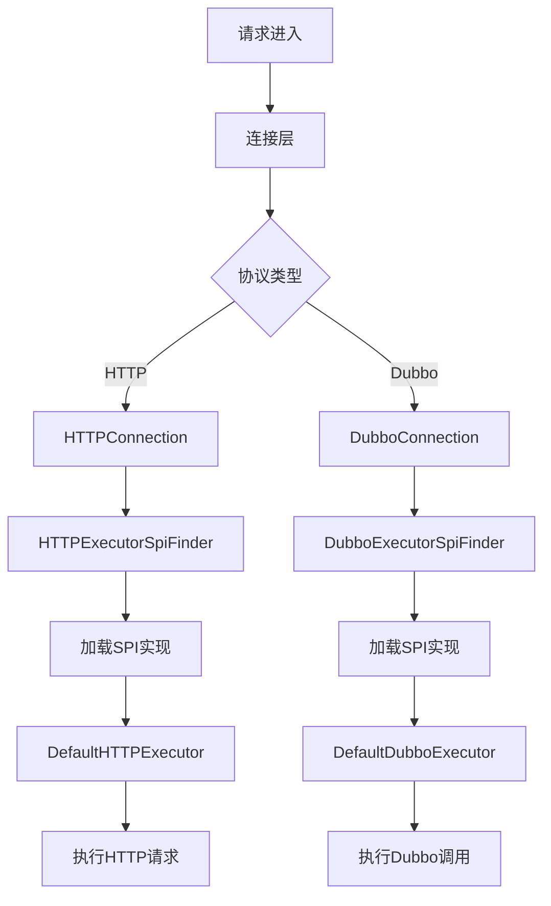

# 基于SPI机制实现多执行器扩展

> 以下介绍内容来自 `https://www.pdai.tech/`

#### 什么是 SPI 机制？

SPI（Service Provider Interface），是 JDK 内置的一种 服务提供发现机制，可以用来启用框架扩展和替换组件，主要是被框架的开发人员使用，比如 java.sql.Driver 接口，其他不同厂商可以针对同一接口做出不同的实现，MySQL 和 PostgreSQL 都有不同的实现提供给用户，而 Java 的 SPI 机制可以为某个接口寻找服务实现。Java 中 SPI 机制主要思想是将装配的控制权移到程序之外，在模块化设计中这个机制尤其重要，其核心思想就是 **解耦**。

SPI 整体机制图如下：


当服务的提供者提供了一种接口的实现之后，需要在 classpath 下的 `META-INF/services/` 目录里创建一个以服务接口命名的文件，这个文件里的内容就是这个接口的具体的实现类。当其他的程序需要这个服务的时候，就可以通过查找这个 jar 包（一般都是以 jar 包做依赖）的 `META-INF/services/` 中的配置文件，配置文件中有接口的具体实现类名，可以根据这个类名进行加载实例化，就可以使用该服务了。JDK 中查找服务的实现的工具类是：`java.util.ServiceLoader`。

#### SPI 机制的应用？

- SPI 机制 - JDBC DriverManager

在 JDBC4.0 之前，我们开发有连接数据库的时候，通常会用 Class.forName("com.mysql.jdbc.Driver")这句先加载数据库相关的驱动，然后再进行获取连接等的操作。**而 JDBC4.0 之后不需要用 Class.forName("com.mysql.jdbc.Driver")来加载驱动，直接获取连接就可以了，现在这种方式就是使用了 Java 的 SPI 扩展机制来实现**。

- JDBC 接口定义

首先在 java 中定义了接口 `java.sql.Driver`，并没有具体的实现，具体的实现都是由不同厂商来提供的。

- mysql 实现

在 mysql 的 jar 包 `mysql-connector-java-6.0.6.jar` 中，可以找到 `META-INF/services` 目录，该目录下会有一个名字为 `java.sql.Driver` 的文件，文件内容是 `com.mysql.cj.jdbc.Driver`，这里面的内容就是针对 Java 中定义的接口的实现。

- postgresql 实现

同样在 postgresql 的 jar 包 `postgresql-42.0.0.jar` 中，也可以找到同样的配置文件，文件内容是 `org.postgresql.Driver`，这是 postgresql 对 Java 的 `java.sql.Driver` 的实现。

- 使用方法

上面说了，现在使用 SPI 扩展来加载具体的驱动，我们在 Java 中写连接数据库的代码的时候，不需要再使用 `Class.forName("com.mysql.jdbc.Driver")` 来加载驱动了，而是直接使用如下代码：

```java
String url = "jdbc:xxxx://xxxx:xxxx/xxxx";
Connection conn = DriverManager.getConnection(url,username,password);
.....
```

#### SPI 机制的简单示例？

我们现在需要使用一个内容搜索接口，搜索的实现可能是基于文件系统的搜索，也可能是基于数据库的搜索。

- 先定义好接口

```java
public interface Search {
    public List<String> searchDoc(String keyword);
}
```

- 文件搜索实现

```java
public class FileSearch implements Search{
    @Override
    public List<String> searchDoc(String keyword) {
        System.out.println("文件搜索 "+keyword);
        return null;
    }
}
```

- 数据库搜索实现

```java
public class DatabaseSearch implements Search{
    @Override
    public List<String> searchDoc(String keyword) {
        System.out.println("数据搜索 "+keyword);
        return null;
    }
}
```

- resources 接下来可以在 resources 下新建 META-INF/services/目录，然后新建接口全限定名的文件：`com.cainiao.ys.spi.learn.Search`，里面加上我们需要用到的实现类

```xml
com.cainiao.ys.spi.learn.FileSearch
```

- 测试方法

```java
public class TestCase {
    public static void main(String[] args) {
        ServiceLoader<Search> s = ServiceLoader.load(Search.class);
        Iterator<Search> iterator = s.iterator();
        while (iterator.hasNext()) {
           Search search =  iterator.next();
           search.searchDoc("hello world");
        }
    }
}
```

可以看到输出结果：文件搜索 hello world

如果在 `com.cainiao.ys.spi.learn.Search` 文件里写上两个实现类，那最后的输出结果就是两行了。

这就是因为 `ServiceLoader.load(Search.class)` 在加载某接口时，会去 `META-INF/services` 下找接口的全限定名文件，再根据里面的内容加载相应的实现类。

这就是 spi 的思想，接口的实现由 provider 实现，provider 只用在提交的 jar 包里的 `META-INF/services` 下根据平台定义的接口新建文件，并添加进相应的实现类内容就好。

## 项目中的使用

### 一、SPI机制的核心设计

本网关通过SPI机制实现HTTP和Dubbo执行器的动态扩展，核心设计如下：

1. **接口分层设计**：

```java
// 基础执行器接口
public interface BaseExecutor {
    Result execute(Map<String, Object> parameter, String url, HttpStatement httpStatement);
}

// HTTP专用执行器接口
public interface HTTPExecutor extends BaseExecutor {
    void setClient(CloseableHttpClient client);
}

// Dubbo专用执行器接口
public interface DubboExecutor extends BaseExecutor {
    void setDubboServiceMap(Map<String, GenericService> dubboServiceMap);
}
```

1. **SPI查找器实现**：

```java
// HTTP执行器SPI查找器
public abstract class HTTPExecutorSpiFinder implements BaseExecutor {
    private static volatile HTTPExecutor executor;

    public static HTTPExecutor getInstance(CloseableHttpClient client) {
        if (executor == null) {
            synchronized (HTTPExecutorSpiFinder.class) {
                if (executor == null) {
                    ServiceLoader<HTTPExecutor> load = ServiceLoader.load(HTTPExecutor.class);
                    HTTPExecutor httpExecutor = load.findFirst()
                        .orElseThrow(() -> new IllegalStateException("未找到HTTP执行器"));
                    
                    // 反射实例化并注入依赖
                    Constructor<?> constructor = httpExecutor.getClass().getDeclaredConstructor();
                    constructor.setAccessible(true);
                    executor = (HTTPExecutor) constructor.newInstance();
                    executor.setClient(client);
                }
            }
        }
        return executor;
    }
}

// Dubbo执行器类似实现
```

### 二、SPI配置文件

在`resources/META-INF/services`目录下创建SPI配置文件：

1. **HTTP执行器配置**：
    `top.codelong.apigatewaycore.executors.http.HTTPExecutor`

```
top.codelong.apigatewaycore.executors.http.DefaultHTTPExecutor
```

1. **Dubbo执行器配置**：
    `top.codelong.apigatewaycore.executors.dubbo.DubboExecutor`

```
top.codelong.apigatewaycore.executors.dubbo.DefaultDubboExecutor
```

### 三、执行器实现示例

1. **HTTP执行器实现**：

```java
@Slf4j
public class DefaultHTTPExecutor implements HTTPExecutor {
    private volatile CloseableHttpClient closeableHttpClient;

    @Override
    public void setClient(CloseableHttpClient client) {
        // 双重检查锁定确保线程安全
        if (this.closeableHttpClient == null) {
            synchronized (DefaultHTTPExecutor.class) {
                if (this.closeableHttpClient == null) {
                    this.closeableHttpClient = client;
                }
            }
        }
    }

    @Override
    public Result execute(Map<String, Object> parameter, String url, HttpStatement httpStatement) {
        // 具体HTTP请求执行逻辑
        switch (httpStatement.getHttpType()) {
            case GET: 
                // 构建GET请求
                break;
            case POST:
                // 构建POST请求
                break;
            // 其他方法处理
        }
        // 执行请求并返回结果
    }
}
```

1. **Dubbo执行器实现**：

```java
@Slf4j
public class DefaultDubboExecutor implements DubboExecutor {
    private volatile Map<String, GenericService> dubboServiceMap;

    @Override
    public void setDubboServiceMap(Map<String, GenericService> dubboServiceMap) {
        // 双重检查锁定注入服务映射
        if (this.dubboServiceMap == null) {
            synchronized (DefaultDubboExecutor.class) {
                if (this.dubboServiceMap == null) {
                    this.dubboServiceMap = dubboServiceMap;
                }
            }
        }
    }

    @Override
    public Result execute(Map<String, Object> parameter, String url, HttpStatement httpStatement) {
        // 获取或创建GenericService实例
        GenericService service = dubboServiceMap.computeIfAbsent(url, k -> {
            ReferenceConfig<GenericService> reference = new ReferenceConfig<>();
            reference.setUrl("dubbo://" + url);
            reference.setInterface(httpStatement.getInterfaceName());
            reference.setGeneric("true");
            return reference.get();
        });
        
        // 执行Dubbo泛化调用
        return service.$invoke(/* 方法名和参数 */);
    }
}
```

### 四、执行器调用流程

在连接层通过SPI查找器获取执行器实例：

```java
// HTTP连接
public class HTTPConnection implements BaseConnection {
    private final BaseExecutor executor;

    public HTTPConnection(CloseableHttpClient client) {
        // 通过SPI获取HTTP执行器
        this.executor = HTTPExecutorSpiFinder.getInstance(client);
    }

    @Override
    public Result send(Map<String, Object> parameter, String url, HttpStatement httpStatement) {
        return executor.execute(parameter, url, httpStatement);
    }
}

// Dubbo连接类似实现
```

### 五、扩展机制优势

1. **热插拔特性**：

   - 新增执行器只需实现接口+SPI配置，无需修改核心代码

   - 示例：添加gRPC执行器

     ```java
     public class GrpcExecutor implements BaseExecutor { ... }
     ```

     创建SPI文件：

     ```java
     top.codelong.apigatewaycore.executors.grpc.GrpcExecutor
     ```

2. **依赖注入**：

   - SPI查找器自动注入必要依赖（如HTTP客户端/Dubbo服务映射）
   - 新执行器可通过接口方法声明依赖项

3. **执行器替换**：

   - 修改SPI配置文件即可切换实现

   - 示例：用

     ```java
     CustomHTTPExecutor
     ```

     替换默认HTTP执行器：

     ```java
     top.codelong.apigatewaycore.executors.http.CustomHTTPExecutor
     ```

### 六、执行流程示意图



### 七、扩展可能

1. **新协议支持**：

```java
// 1. 创建新执行器
public class GRPCExecutor implements BaseExecutor {
    @Override
    public Result execute(...) {
        // gRPC调用逻辑
    }
}

// 2. 创建SPI配置文件
// resources/META-INF/services/top.codelong.apigatewaycore.executors.grpc.GRPCExecutor

// 3. 创建连接器
public class GRPCConnection implements BaseConnection {
    private final BaseExecutor executor = GRPCExecutorSpiFinder.getInstance();
}
```

1. **定制化执行器**：

```java
// 带熔断的HTTP执行器
public class CircuitBreakerHTTPExecutor implements HTTPExecutor {
    private final CircuitBreaker circuitBreaker;

    @Override
    public Result execute(...) {
        return circuitBreaker.executeSupplier(() -> {
            // 实际请求执行
        });
    }
}
```

通过SPI机制，网关实现了执行器模块的高度可扩展性，支持在不修改核心代码的情况下灵活扩展和替换各种协议的请求处理能力。
