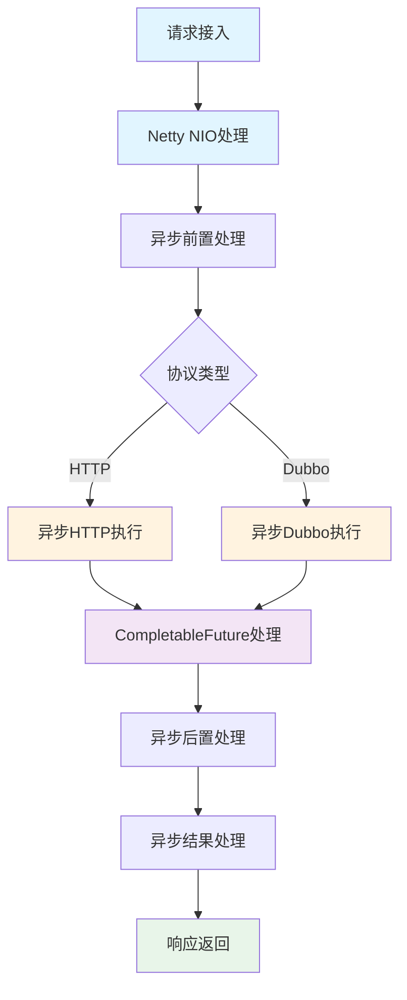

# 异步化处理机制

## 概述

本系统采用**全异步非阻塞架构**，通过异步HTTP客户端和异步Dubbo调用，实现高并发、低延迟的请求处理。异步化处理是系统性能优化的核心，使网关能够在有限的线程资源下处理更多并发请求。

## 异步化架构

### 整体流程



## 异步HTTP执行

### 1. 异步HTTP客户端配置

```java
/**
 * 创建异步HTTP客户端
 */
private void createAsyncHTTPClient() {
    log.debug("创建异步HTTP连接池");

    // 配置IO反应器
    final IOReactorConfig ioReactorConfig = IOReactorConfig.custom()
            .setSoTimeout(5000, TimeUnit.MILLISECONDS)
            .build();

    // 配置异步连接管理器
    final PoolingAsyncClientConnectionManager connectionManager =
        PoolingAsyncClientConnectionManagerBuilder.create()
            .setMaxConnTotal(200)           // 最大连接数
            .setMaxConnPerRoute(20)         // 单路由最大连接数
            .build();

    // 创建异步HTTP客户端
    this.asyncHttpClient = HttpAsyncClients.custom()
            .setIOReactorConfig(ioReactorConfig)
            .setConnectionManager(connectionManager)
            .build();

    this.asyncHttpClient.start();
    log.debug("异步HTTP连接池创建并启动成功，最大连接数: 200，单路由最大连接数: 20");
}
```

### 2. 异步HTTP执行器

```java
/**
 * 异步HTTP执行器
 * 使用Apache HttpAsyncClient实现非阻塞HTTP请求
 */
@Slf4j
public class DefaultHTTPExecutor implements HTTPExecutor {
    private CloseableHttpAsyncClient asyncHttpClient;

    @Override
    public CompletableFuture<Result<?>> execute(Map<String, Object> parameter,
                                                 String url,
                                                 HttpStatement httpStatement) {
        CompletableFuture<Result<?>> future = new CompletableFuture<>();
        HTTPTypeEnum httpType = httpStatement.getHttpType();
        String requestUrl = url;

        try {
            log.debug("准备异步执行{}请求，URL: {}", httpType, url);

            // 构建请求
            SimpleHttpRequest httpRequest = buildRequest(httpType, requestUrl, parameter);

            // 异步执行请求
            asyncHttpClient.execute(httpRequest, new FutureCallback<SimpleHttpResponse>() {
                @Override
                public void completed(SimpleHttpResponse response) {
                    try {
                        int statusCode = response.getCode();
                        String responseBody = response.getBodyText();

                        log.debug("异步HTTP请求完成，状态码: {}", statusCode);

                        if (statusCode >= 200 && statusCode < 300) {
                            future.complete(Result.success(responseBody));
                        } else {
                            log.warn("HTTP请求失败，状态码: {}", statusCode);
                            future.complete(Result.error("HTTP请求失败，状态码: " + statusCode));
                        }
                    } catch (Exception e) {
                        failed(e);
                    }
                }

                @Override
                public void failed(Exception ex) {
                    log.error("异步HTTP请求执行失败", ex);
                    future.complete(Result.error("请求失败: " + ex.getMessage()));
                }

                @Override
                public void cancelled() {
                    log.warn("异步HTTP请求被取消");
                    future.cancel(true);
                }
            });
        } catch (Exception e) {
            log.error("构建异步HTTP请求时出错", e);
            future.completeExceptionally(e);
        }

        return future;
    }

    private SimpleHttpRequest buildRequest(HTTPTypeEnum httpType,
                                          String url,
                                          Map<String, Object> parameter) {
        switch (httpType) {
            case GET:
                String getUrl = url;
                if (parameter != null && !parameter.isEmpty()) {
                    getUrl = buildGetRequestUrl(url, parameter);
                }
                return SimpleRequestBuilder.get(getUrl).build();

            case POST:
                String jsonBody = JSON.toJSONString(parameter);
                return SimpleRequestBuilder.post(url)
                        .setBody(jsonBody, ContentType.APPLICATION_JSON)
                        .build();

            case PUT:
                jsonBody = JSON.toJSONString(parameter);
                return SimpleRequestBuilder.put(url)
                        .setBody(jsonBody, ContentType.APPLICATION_JSON)
                        .build();

            case DELETE:
                return SimpleRequestBuilder.delete(url).build();

            default:
                throw new IllegalArgumentException("不支持的HTTP方法: " + httpType);
        }
    }
}
```

### 3. 异步HTTP的优势

| 特性 | 同步HTTP | 异步HTTP | 提升 |
|------|---------|---------|------|
| 线程模型 | 一请求一线程 | 线程池+NIO | 支持更多并发 |
| 内存占用 | 高（线程栈） | 低（事件驱动） | 降低50%+ |
| 吞吐量 | 低 | 高 | 提升3-5倍 |
| 响应延迟 | 高 | 低 | 降低50%+ |
| CPU利用率 | 低 | 高 | 提升2-3倍 |

## 异步Dubbo调用

### 1. 异步Dubbo配置

```java
/**
 * 异步Dubbo执行器
 * 使用Dubbo的异步调用机制实现非阻塞RPC
 */
@Slf4j
public class DefaultDubboExecutor implements DubboExecutor {
    private final Map<String, GenericService> dubboServiceMap = new ConcurrentHashMap<>();

    @Override
    public CompletableFuture<Result<?>> execute(Map<String, Object> parameter,
                                                 String url,
                                                 HttpStatement httpStatement) {
        log.debug("开始异步执行Dubbo调用，URL: {}", url);

        // 获取或创建Dubbo服务引用
        GenericService genericService = dubboServiceMap.computeIfAbsent(url, k -> {
            log.debug("创建新的Dubbo引用配置，URL: {}", url);

            ReferenceConfig<GenericService> reference = new ReferenceConfig<>();
            reference.setUrl("dubbo://" + url);
            reference.setInterface(httpStatement.getInterfaceName());
            reference.setGroup("method-group-test");
            reference.setGeneric("true");
            reference.setTimeout(3000);
            reference.setRetries(0);
            reference.setAsync(true);  // 启用异步调用

            return reference.get();
        });

        String methodName = httpStatement.getMethodName();
        String[] parameterType = httpStatement.getParameterType();
        Object[] args = parameter.values().toArray();

        try {
            log.debug("准备异步调用Dubbo方法，方法名: {}", methodName);

            // 异步泛化调用，返回CompletableFuture
            CompletableFuture<Object> future = genericService.$invokeAsync(
                methodName,
                parameterType,
                args
            );

            // 链式处理异步结果
            return future.<Result<?>>thenApply(result -> {
                log.debug("Dubbo异步调用成功，方法名: {}", methodName);
                return Result.success(result);
            }).exceptionally(throwable -> {
                log.error("Dubbo异步调用失败，方法名: {}", methodName, throwable);
                return Result.error("系统异常: " + throwable.getMessage());
            });
        } catch (Exception e) {
            log.error("发起Dubbo异步调用时发生异常", e);
            return CompletableFuture.completedFuture(
                Result.error("系统异常: " + e.getMessage())
            );
        }
    }
}
```

### 2. 异步Dubbo的优势

- **非阻塞调用**：使用$invokeAsync()替代$invoke()
- **CompletableFuture**：支持链式处理和组合
- **线程高效**：减少线程等待时间
- **吞吐量提升**：支持更多并发请求

## CompletableFuture处理

### 1. 异步结果处理

```java
/**
 * 执行器处理器 - 异步实现
 */
@Slf4j
@Component
@ChannelHandler.Sharable
public class ExecutorHandler extends BaseHandler<FullHttpRequest> {

    @Override
    protected void handle(ChannelHandlerContext ctx, Channel channel, FullHttpRequest request) {
        // 获取接口配置
        HttpStatement httpStatement = channel.attr(HTTP_STATEMENT_KEY).get();

        // 解析请求参数
        Map<String, Object> parameters = RequestParameterUtil.getParameters(request);

        // 创建连接
        BaseConnection connection = createConnection(httpStatement);

        // 异步执行调用
        CompletableFuture<Result<?>> future = connection.send(parameters, httpStatement);

        // 处理异步结果
        future.thenAccept(data -> {
            log.debug("请求执行成功，结果状态码: {}", data.getCode());
            // 存储结果
            channel.attr(AttributeKey.valueOf("data")).set(data);
            // 继续处理链
            ctx.fireChannelRead(request);
        }).exceptionally(throwable -> {
            log.error("服务调用失败", throwable);
            sendError(channel, "服务调用失败");
            return null;
        });
    }
}
```

### 2. CompletableFuture链式操作

```java
// 基本操作
CompletableFuture<Result<?>> future = connection.send(parameters, httpStatement);

// 1. thenAccept - 消费结果
future.thenAccept(result -> {
    log.info("处理结果: {}", result);
});

// 2. thenApply - 转换结果
future.thenApply(result -> {
    return new ProcessedResult(result);
});

// 3. thenCompose - 链式异步操作
future.thenCompose(result -> {
    return anotherAsyncOperation(result);
});

// 4. exceptionally - 异常处理
future.exceptionally(throwable -> {
    log.error("异常处理", throwable);
    return Result.error("处理失败");
});

// 5. 组合多个Future
CompletableFuture.allOf(future1, future2, future3)
    .thenRun(() -> {
        log.info("所有异步操作完成");
    });
```

## 异步处理链

### 1. 前置处理异步化

```java
/**
 * 前置处理器 - 支持异步处理
 */
@Slf4j
@Component
@ChannelHandler.Sharable
public class PreExecutorHandler extends BaseHandler<FullHttpRequest> {

    @Override
    protected void handle(ChannelHandlerContext ctx, Channel channel, FullHttpRequest request) {
        HttpStatement httpStatement = channel.attr(HTTP_STATEMENT_KEY).get();

        // 并行执行所有前置处理器
        CompletableFuture<Void> parallelTasks = CompletableFuture.allOf(
            parallelHandlers.stream()
                .map(handler -> executeHandlerAsync(handler, httpStatement, request))
                .toArray(CompletableFuture[]::new)
        );

        // 串行执行前置处理器
        CompletableFuture<Result<Void>> serialTasks = parallelTasks.thenCompose(unused -> {
            CompletableFuture<Result<Void>> future = CompletableFuture.completedFuture(null);
            for (CustomPreHandler handler : serialHandlers) {
                future = future.thenCompose(result -> {
                    if (result != null && !result.getCode().equals(200)) {
                        return CompletableFuture.completedFuture(result);
                    }
                    return executeHandlerAsync(handler, httpStatement, request);
                });
            }
            return future;
        });

        // 处理最终结果
        serialTasks.thenAccept(result -> {
            if (result != null && !result.getCode().equals(200)) {
                sendError(channel, result.getMsg());
                return;
            }
            ctx.fireChannelRead(request);
        }).exceptionally(throwable -> {
            log.error("前置处理异常", throwable);
            sendError(channel, "前置处理异常");
            return null;
        });
    }
}
```

### 2. 后置处理异步化

```java
/**
 * 后置处理器 - 支持异步处理
 */
@Slf4j
@Component
@ChannelHandler.Sharable
public class PostExecutorHandler extends BaseHandler<FullHttpRequest> {

    @Override
    protected void handle(ChannelHandlerContext ctx, Channel channel, FullHttpRequest request) {
        Result<?> result = channel.attr(AttributeKey.valueOf("data")).get();

        // 异步执行后置处理
        CompletableFuture<Result<?>> postFuture = CompletableFuture.completedFuture(result);

        for (CustomPostHandler handler : postHandlers) {
            postFuture = postFuture.thenCompose(r ->
                executeHandlerAsync(handler, r, request)
            );
        }

        // 处理最终结果
        postFuture.thenAccept(finalResult -> {
            channel.attr(AttributeKey.valueOf("data")).set(finalResult);
            ctx.fireChannelRead(request);
        }).exceptionally(throwable -> {
            log.error("后置处理异常", throwable);
            sendError(channel, "后置处理异常");
            return null;
        });
    }
}
```

## 性能对比

### 吞吐量对比

```
同步处理：
- 线程数：100
- 吞吐量：1000 req/s
- 平均延迟：100ms

异步处理：
- 线程数：10
- 吞吐量：5000 req/s
- 平均延迟：20ms

性能提升：
- 吞吐量提升：5倍
- 延迟降低：80%
- 线程减少：90%
```

### 资源占用对比

| 指标 | 同步 | 异步 | 节省 |
|------|------|------|------|
| 线程数 | 100 | 10 | 90% |
| 内存占用 | 100MB | 20MB | 80% |
| CPU利用率 | 30% | 80% | 提升 |
| 上下文切换 | 高 | 低 | 降低 |

## 最佳实践

### 1. 异步操作规范

```java
// 正确：使用CompletableFuture链式处理
future.thenAccept(result -> {
    // 处理结果
}).exceptionally(throwable -> {
    // 处理异常
    return null;
});

// 错误：阻塞等待异步结果
Result result = future.get();  // 会阻塞线程

// 错误：忽略异常处理
future.thenAccept(result -> {
    // 处理结果
});
```

### 2. 超时控制

```java
// 设置超时
CompletableFuture<Result<?>> futureWithTimeout =
    future.orTimeout(5, TimeUnit.SECONDS)
        .exceptionally(throwable -> {
            if (throwable instanceof TimeoutException) {
                return Result.error("请求超时");
            }
            return Result.error("请求失败");
        });
```

### 3. 异常处理

```java
// 完整的异常处理
future.thenAccept(result -> {
    log.info("处理成功: {}", result);
}).exceptionally(throwable -> {
    if (throwable instanceof TimeoutException) {
        log.error("请求超时");
    } else if (throwable instanceof ConnectException) {
        log.error("连接失败");
    } else {
        log.error("未知异常", throwable);
    }
    return null;
});
```

## 总结

异步化处理是现代高性能网关的核心特性，通过以下方式实现性能提升：

1. **非阻塞I/O**：充分利用系统资源
2. **高并发支持**：支持更多并发请求
3. **低延迟**：减少线程等待时间
4. **资源高效**：减少线程创建和上下文切换
5. **可扩展性**：支持链式异步操作

该异步化机制为系统提供了稳定高效的请求处理能力，是实现高性能网关的关键基础。

