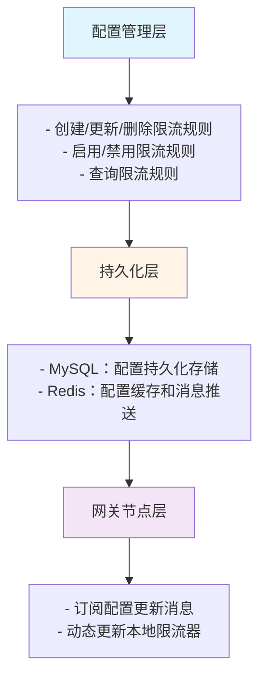

# 分布式限流配置管理 - 设计与实现

## 一、设计理念

### 1.1 配置管理的核心目标

分布式限流配置管理是网关中心的关键功能，负责限流规则的全生命周期管理：

- **集中管理**：统一管理所有网关节点的限流配置
- **实时生效**：配置变更实时推送到所有网关节点，无需重启
- **持久化存储**：配置持久化到MySQL，保证数据不丢失
- **高可用性**：通过Redis实现配置同步和消息推送

### 1.2 配置管理架构



## 二、数据模型设计

### 2.1 数据库表结构

```sql
CREATE TABLE `gateway_rate_limit` (
    `id` BIGINT NOT NULL COMMENT '唯一ID',
    `rule_name` VARCHAR(100) NOT NULL COMMENT '限流规则名称',
    `limit_type` VARCHAR(20) NOT NULL COMMENT '限流类型：GLOBAL/SERVICE/INTERFACE/IP',
    `limit_target` VARCHAR(200) NOT NULL COMMENT '限流目标',
    `limit_count` INT NOT NULL COMMENT '限流阈值（每秒请求数）',
    `time_window` INT NOT NULL DEFAULT 1 COMMENT '时间窗口（秒）',
    `status` TINYINT NOT NULL DEFAULT 1 COMMENT '状态：0-禁用，1-启用',
    `strategy` VARCHAR(20) NOT NULL DEFAULT 'TOKEN_BUCKET' COMMENT '限流策略：TOKEN_BUCKET/SLIDING_WINDOW',
    `create_time` DATETIME NOT NULL DEFAULT CURRENT_TIMESTAMP COMMENT '创建时间',
    `update_time` DATETIME NOT NULL DEFAULT CURRENT_TIMESTAMP ON UPDATE CURRENT_TIMESTAMP COMMENT '更新时间',
    PRIMARY KEY (`id`),
    KEY `idx_limit_type` (`limit_type`),
    KEY `idx_limit_target` (`limit_target`),
    KEY `idx_status` (`status`)
) ENGINE=InnoDB DEFAULT CHARSET=utf8mb4 COMMENT='网关限流配置表';
```

**字段说明：**

| 字段 | 类型 | 说明 | 示例 |
|-----|------|------|------|
| `id` | BIGINT | 唯一ID | 1234567890 |
| `rule_name` | VARCHAR(100) | 规则名称 | "全局限流" |
| `limit_type` | VARCHAR(20) | 限流类型 | GLOBAL/SERVICE/INTERFACE/IP |
| `limit_target` | VARCHAR(200) | 限流目标 | GLOBAL / user-service / user-service:/api/login / 192.168.1.100 |
| `limit_count` | INT | 限流阈值 | 1000（表示1000 QPS） |
| `time_window` | INT | 时间窗口 | 1（表示1秒） |
| `status` | TINYINT | 状态 | 0-禁用，1-启用 |
| `strategy` | VARCHAR(20) | 限流策略 | TOKEN_BUCKET / SLIDING_WINDOW |

**索引设计：**

- `PRIMARY KEY (id)`：主键索引，快速查询单条记录
- `idx_limit_type`：限流类型索引，支持按类型查询
- `idx_limit_target`：限流目标索引，支持按目标查询
- `idx_status`：状态索引，支持查询启用的规则

### 2.2 实体类设计

```java
@TableName(value = "gateway_rate_limit")
@Data
public class GatewayRateLimitDO {
    /**
     * 唯一ID
     */
    @TableId
    private Long id;

    /**
     * 规则名称
     */
    private String ruleName;

    /**
     * 限流类型：GLOBAL/SERVICE/INTERFACE/IP
     */
    private String limitType;

    /**
     * 限流目标
     * - GLOBAL: "GLOBAL"
     * - SERVICE: "user-service"
     * - INTERFACE: "user-service:/api/login"
     * - IP: "192.168.1.100"
     */
    private String limitTarget;

    /**
     * 限流阈值（每秒请求数）
     */
    private Integer limitCount;

    /**
     * 时间窗口（秒）
     */
    private Integer timeWindow;

    /**
     * 状态：0-禁用，1-启用
     */
    private Integer status;

    /**
     * 限流策略：TOKEN_BUCKET/SLIDING_WINDOW
     */
    private String strategy;

    /**
     * 创建时间
     */
    private LocalDateTime createTime;

    /**
     * 更新时间
     */
    private LocalDateTime updateTime;
}
```

### 2.3 请求VO设计

```java
@Data
public class RateLimitConfigReqVO {
    /**
     * 配置ID（更新时需要）
     */
    private Long id;

    /**
     * 规则名称
     */
    @NotBlank(message = "规则名称不能为空")
    private String ruleName;

    /**
     * 限流类型
     */
    @NotBlank(message = "限流类型不能为空")
    private String limitType;

    /**
     * 限流目标
     */
    @NotBlank(message = "限流目标不能为空")
    private String limitTarget;

    /**
     * 限流阈值
     */
    @NotNull(message = "限流阈值不能为空")
    @Min(value = 1, message = "限流阈值必须大于0")
    private Integer limitCount;

    /**
     * 时间窗口
     */
    @NotNull(message = "时间窗口不能为空")
    @Min(value = 1, message = "时间窗口必须大于0")
    private Integer timeWindow;

    /**
     * 状态
     */
    private Integer status;

    /**
     * 限流策略
     */
    @NotBlank(message = "限流策略不能为空")
    private String strategy;
}
```

### 2.4 Redis数据结构设计

#### 配置存储

```
Key格式：rate_limit_config:{limitType}:{limitTarget}
Type：Hash
TTL：永久

示例：
rate_limit_config:GLOBAL:GLOBAL
rate_limit_config:SERVICE:user-service
rate_limit_config:INTERFACE:user-service:/api/login
rate_limit_config:IP:192.168.1.100

Hash字段：
{
  "id": "1234567890",
  "ruleName": "全局限流",
  "limitType": "GLOBAL",
  "limitTarget": "GLOBAL",
  "limitCount": "10000",
  "timeWindow": "1",
  "enabled": "true",
  "strategy": "TOKEN_BUCKET"
}
```

**设计理由：**

1. **Key设计**：使用`limitType`和`limitTarget`组合，便于网关节点快速查询
2. **Hash结构**：存储完整配置信息，支持字段级别的更新
3. **永久存储**：配置不设置过期时间，保证持久性

#### 消息推送

```
Channel：rate-limit-config-update
Type：Pub/Sub

消息格式：
{
  "id": 1234567890,
  "ruleName": "全局限流",
  "limitType": "GLOBAL",
  "limitTarget": "GLOBAL",
  "limitCount": 10000,
  "timeWindow": 1,
  "enabled": true,
  "strategy": "TOKEN_BUCKET"
}

特殊消息：
"RELOAD_ALL"  // 触发全量重载
```

## 三、核心组件实现

### 3.1 Mapper层

```java
@Mapper
public interface GatewayRateLimitMapper extends BaseMapper<GatewayRateLimitDO> {
    // 继承MyBatis-Plus的BaseMapper，自动提供CRUD操作
}
```

**MyBatis-Plus提供的方法：**

- `insert(T entity)`：插入记录
- `updateById(T entity)`：根据ID更新
- `deleteById(Serializable id)`：根据ID删除
- `selectById(Serializable id)`：根据ID查询
- `selectList(Wrapper<T> queryWrapper)`：条件查询
- `selectPage(Page<T> page, Wrapper<T> queryWrapper)`：分页查询

### 3.2 Service层接口

```java
public interface GatewayRateLimitService {
    /**
     * 创建限流配置
     */
    Long createRateLimitConfig(RateLimitConfigReqVO reqVO);

    /**
     * 更新限流配置
     */
    Boolean updateRateLimitConfig(RateLimitConfigReqVO reqVO);

    /**
     * 删除限流配置
     */
    Boolean deleteRateLimitConfig(Long id);

    /**
     * 更新配置状态
     */
    Boolean updateStatus(Long id, Integer status);

    /**
     * 查询限流配置详情
     */
    GatewayRateLimitDO getRateLimitConfig(Long id);

    /**
     * 分页查询限流配置列表
     */
    PageResult<GatewayRateLimitDO> listRateLimitConfigs(
        Integer pageNum,
        Integer pageSize,
        String limitType
    );

    /**
     * 刷新所有网关节点配置
     */
    void refreshAllGatewayConfigs();
}
```

### 3.3 Service层实现

#### 创建限流配置

```java
@Transactional(rollbackFor = Exception.class)
public Long createRateLimitConfig(RateLimitConfigReqVO reqVO) {
    // 1. 参数校验
    validateConfig(reqVO);

    // 2. 检查是否已存在相同配置
    checkDuplicate(reqVO.getLimitType(), reqVO.getLimitTarget());

    // 3. 构建实体对象
    GatewayRateLimitDO rateLimitDO = GatewayRateLimitDO.builder()
        .id(IdUtil.getSnowflakeNextId())
        .ruleName(reqVO.getRuleName())
        .limitType(reqVO.getLimitType())
        .limitTarget(reqVO.getLimitTarget())
        .limitCount(reqVO.getLimitCount())
        .timeWindow(reqVO.getTimeWindow())
        .status(reqVO.getStatus() != null ? reqVO.getStatus() : 1)
        .strategy(reqVO.getStrategy())
        .build();

    // 4. 保存到数据库
    rateLimitMapper.insert(rateLimitDO);

    // 5. 同步到Redis
    syncConfigToRedis(rateLimitDO);

    // 6. 发布配置更新消息
    publishConfigUpdate(rateLimitDO);

    log.info("创建限流配置成功: id={}, type={}, target={}",
        rateLimitDO.getId(), rateLimitDO.getLimitType(), rateLimitDO.getLimitTarget());

    return rateLimitDO.getId();
}

/**
 * 参数校验
 */
private void validateConfig(RateLimitConfigReqVO reqVO) {
    // 校验限流类型
    if (!Arrays.asList("GLOBAL", "SERVICE", "INTERFACE", "IP").contains(reqVO.getLimitType())) {
        throw new BusinessException("不支持的限流类型: " + reqVO.getLimitType());
    }

    // 校验限流策略
    if (!Arrays.asList("TOKEN_BUCKET", "SLIDING_WINDOW").contains(reqVO.getStrategy())) {
        throw new BusinessException("不支持的限流策略: " + reqVO.getStrategy());
    }

    // 校验限流目标格式
    validateLimitTarget(reqVO.getLimitType(), reqVO.getLimitTarget());
}

/**
 * 校验限流目标格式
 */
private void validateLimitTarget(String limitType, String limitTarget) {
    switch (limitType) {
        case "GLOBAL":
            if (!"GLOBAL".equals(limitTarget)) {
                throw new BusinessException("全局限流的目标必须为GLOBAL");
            }
            break;
        case "SERVICE":
            if (limitTarget.contains(":")) {
                throw new BusinessException("服务级限流的目标不能包含冒号");
            }
            break;
        case "INTERFACE":
            if (!limitTarget.contains(":")) {
                throw new BusinessException("接口级限流的目标格式必须为: serviceName:path");
            }
            break;
        case "IP":
            if (!isValidIp(limitTarget)) {
                throw new BusinessException("IP格式不正确");
            }
            break;
    }
}

/**
 * 检查重复配置
 */
private void checkDuplicate(String limitType, String limitTarget) {
    LambdaQueryWrapper<GatewayRateLimitDO> wrapper = new LambdaQueryWrapper<>();
    wrapper.eq(GatewayRateLimitDO::getLimitType, limitType)
           .eq(GatewayRateLimitDO::getLimitTarget, limitTarget);

    Long count = rateLimitMapper.selectCount(wrapper);
    if (count > 0) {
        throw new BusinessException("限流配置已存在: " + limitType + ":" + limitTarget);
    }
}
```

#### 同步配置到Redis

```java
/**
 * 同步配置到Redis
 */
private void syncConfigToRedis(GatewayRateLimitDO config) {
    String redisKey = buildRedisKey(config);

    Map<String, Object> configMap = new HashMap<>();
    configMap.put("id", config.getId());
    configMap.put("ruleName", config.getRuleName());
    configMap.put("limitType", config.getLimitType());
    configMap.put("limitTarget", config.getLimitTarget());
    configMap.put("limitCount", config.getLimitCount());
    configMap.put("timeWindow", config.getTimeWindow());
    configMap.put("enabled", config.getStatus() == 1);
    configMap.put("strategy", config.getStrategy());

    redisTemplate.opsForHash().putAll(redisKey, configMap);

    log.info("同步配置到Redis成功: key={}", redisKey);
}

/**
 * 构建Redis Key
 */
private String buildRedisKey(GatewayRateLimitDO config) {
    return String.format("rate_limit_config:%s:%s",
        config.getLimitType(), config.getLimitTarget());
}
```

#### 发布配置更新消息

```java
/**
 * 发布配置更新消息
 */
private void publishConfigUpdate(GatewayRateLimitDO config) {
    Map<String, Object> message = new HashMap<>();
    message.put("id", config.getId());
    message.put("ruleName", config.getRuleName());
    message.put("limitType", config.getLimitType());
    message.put("limitTarget", config.getLimitTarget());
    message.put("limitCount", config.getLimitCount());
    message.put("timeWindow", config.getTimeWindow());
    message.put("enabled", config.getStatus() == 1);
    message.put("strategy", config.getStrategy());

    String messageJson = JSON.toJSONString(message);
    redisTemplate.convertAndSend("rate-limit-config-update", messageJson);

    log.info("发布配置更新消息: {}", messageJson);
}
```

#### 更新限流配置

```java
@Transactional(rollbackFor = Exception.class)
public Boolean updateRateLimitConfig(RateLimitConfigReqVO reqVO) {
    // 1. 参数校验
    if (reqVO.getId() == null) {
        throw new BusinessException("配置ID不能为空");
    }
    validateConfig(reqVO);

    // 2. 查询原配置
    GatewayRateLimitDO rateLimitDO = rateLimitMapper.selectById(reqVO.getId());
    if (rateLimitDO == null) {
        throw new BusinessException("限流配置不存在: " + reqVO.getId());
    }

    // 3. 更新字段
    rateLimitDO.setRuleName(reqVO.getRuleName());
    rateLimitDO.setLimitCount(reqVO.getLimitCount());
    rateLimitDO.setTimeWindow(reqVO.getTimeWindow());
    rateLimitDO.setStatus(reqVO.getStatus());
    rateLimitDO.setStrategy(reqVO.getStrategy());

    // 4. 更新数据库
    rateLimitMapper.updateById(rateLimitDO);

    // 5. 同步到Redis
    syncConfigToRedis(rateLimitDO);

    // 6. 发布配置更新消息
    publishConfigUpdate(rateLimitDO);

    log.info("更新限流配置成功: id={}", rateLimitDO.getId());

    return true;
}
```

#### 删除限流配置

```java
@Transactional(rollbackFor = Exception.class)
public Boolean deleteRateLimitConfig(Long id) {
    // 1. 查询配置
    GatewayRateLimitDO rateLimitDO = rateLimitMapper.selectById(id);
    if (rateLimitDO == null) {
        throw new BusinessException("限流配置不存在: " + id);
    }

    // 2. 从数据库删除
    rateLimitMapper.deleteById(id);

    // 3. 从Redis删除
    String redisKey = buildRedisKey(rateLimitDO);
    redisTemplate.delete(redisKey);

    // 4. 发布删除消息（将enabled设置为false）
    rateLimitDO.setStatus(0);
    publishConfigUpdate(rateLimitDO);

    log.info("删除限流配置成功: id={}", id);

    return true;
}
```

#### 刷新所有网关节点配置

```java
public void refreshAllGatewayConfigs() {
    // 发布全量重载消息
    redisTemplate.convertAndSend("rate-limit-config-update", "RELOAD_ALL");

    log.info("发布全量重载消息");
}

