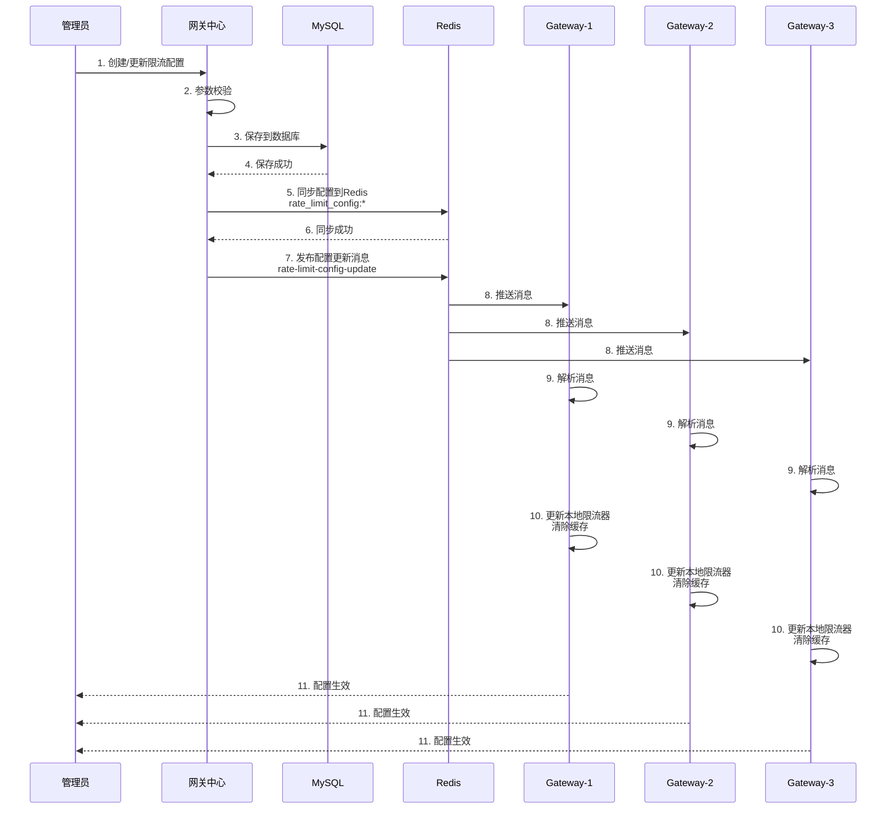

# 分布式限流配置管理 - API与推送机制

## 一、Controller层实现

### 4.1 GatewayRateLimitController

```java
@RestController
@RequestMapping("/gateway-rate-limit")
@Slf4j
public class GatewayRateLimitController {

    @Resource
    private GatewayRateLimitService rateLimitService;

    /**
     * 创建限流配置
     */
    @PostMapping("/create")
    public Result<Long> createRateLimitConfig(@RequestBody @Valid RateLimitConfigReqVO reqVO) {
        log.info("创建限流配置: {}", reqVO);
        Long id = rateLimitService.createRateLimitConfig(reqVO);
        return Result.success(id);
    }

    /**
     * 更新限流配置
     */
    @PutMapping("/update")
    public Result<Boolean> updateRateLimitConfig(@RequestBody @Valid RateLimitConfigReqVO reqVO) {
        log.info("更新限流配置: {}", reqVO);
        Boolean result = rateLimitService.updateRateLimitConfig(reqVO);
        return Result.success(result);
    }

    /**
     * 删除限流配置
     */
    @DeleteMapping("/delete/{id}")
    public Result<Boolean> deleteRateLimitConfig(@PathVariable Long id) {
        log.info("删除限流配置: id={}", id);
        Boolean result = rateLimitService.deleteRateLimitConfig(id);
        return Result.success(result);
    }

    /**
     * 启用/禁用限流配置
     */
    @PutMapping("/status/{id}/{status}")
    public Result<Boolean> updateStatus(@PathVariable Long id, @PathVariable Integer status) {
        log.info("更新限流配置状态: id={}, status={}", id, status);
        Boolean result = rateLimitService.updateStatus(id, status);
        return Result.success(result);
    }

    /**
     * 查询限流配置详情
     */
    @GetMapping("/detail/{id}")
    public Result<GatewayRateLimitDO> getRateLimitConfig(@PathVariable Long id) {
        log.info("查询限流配置详情: id={}", id);
        GatewayRateLimitDO config = rateLimitService.getRateLimitConfig(id);
        return Result.success(config);
    }

    /**
     * 分页查询限流配置列表
     */
    @GetMapping("/list")
    public Result<PageResult<GatewayRateLimitDO>> listRateLimitConfigs(
            @RequestParam(defaultValue = "1") Integer pageNum,
            @RequestParam(defaultValue = "10") Integer pageSize,
            @RequestParam(required = false) String limitType) {
        log.info("分页查询限流配置: pageNum={}, pageSize={}, limitType={}",
            pageNum, pageSize, limitType);
        PageResult<GatewayRateLimitDO> result = rateLimitService.listRateLimitConfigs(
            pageNum, pageSize, limitType);
        return Result.success(result);
    }

    /**
     * 刷新所有网关节点配置
     */
    @PostMapping("/refresh")
    public Result<Void> refreshAllGatewayConfigs() {
        log.info("刷新所有网关节点配置");
        rateLimitService.refreshAllGatewayConfigs();
        return Result.success();
    }
}
```

### 4.2 API接口文档

#### 1. 创建限流配置

**接口地址：** `POST /gateway-rate-limit/create`

**请求头：**
```
Content-Type: application/json
```

**请求参数：**
```json
{
  "ruleName": "全局限流",
  "limitType": "GLOBAL",
  "limitTarget": "GLOBAL",
  "limitCount": 10000,
  "timeWindow": 1,
  "status": 1,
  "strategy": "TOKEN_BUCKET"
}
```

**参数说明：**

| 参数 | 类型 | 必填 | 说明 |
|-----|------|------|------|
| ruleName | String | 是 | 规则名称 |
| limitType | String | 是 | 限流类型：GLOBAL/SERVICE/INTERFACE/IP |
| limitTarget | String | 是 | 限流目标 |
| limitCount | Integer | 是 | 限流阈值（每秒请求数） |
| timeWindow | Integer | 是 | 时间窗口（秒） |
| status | Integer | 否 | 状态：0-禁用，1-启用（默认1） |
| strategy | String | 是 | 限流策略：TOKEN_BUCKET/SLIDING_WINDOW |

**响应示例：**
```json
{
  "code": 200,
  "msg": "success",
  "data": 1234567890
}
```

#### 2. 更新限流配置

**接口地址：** `PUT /gateway-rate-limit/update`

**请求参数：**
```json
{
  "id": 1234567890,
  "ruleName": "全局限流（已更新）",
  "limitType": "GLOBAL",
  "limitTarget": "GLOBAL",
  "limitCount": 15000,
  "timeWindow": 1,
  "status": 1,
  "strategy": "TOKEN_BUCKET"
}
```

**响应示例：**
```json
{
  "code": 200,
  "msg": "success",
  "data": true
}
```

#### 3. 删除限流配置

**接口地址：** `DELETE /gateway-rate-limit/delete/{id}`

**路径参数：**
- `id`: 配置ID

**响应示例：**
```json
{
  "code": 200,
  "msg": "success",
  "data": true
}
```

#### 4. 启用/禁用限流配置

**接口地址：** `PUT /gateway-rate-limit/status/{id}/{status}`

**路径参数：**
- `id`: 配置ID
- `status`: 状态（0-禁用，1-启用）

**响应示例：**
```json
{
  "code": 200,
  "msg": "success",
  "data": true
}
```

#### 5. 查询限流配置详情

**接口地址：** `GET /gateway-rate-limit/detail/{id}`

**路径参数：**
- `id`: 配置ID

**响应示例：**
```json
{
  "code": 200,
  "msg": "success",
  "data": {
    "id": 1234567890,
    "ruleName": "全局限流",
    "limitType": "GLOBAL",
    "limitTarget": "GLOBAL",
    "limitCount": 10000,
    "timeWindow": 1,
    "status": 1,
    "strategy": "TOKEN_BUCKET",
    "createTime": "2025-11-12 10:00:00",
    "updateTime": "2025-11-12 10:00:00"
  }
}
```

#### 6. 分页查询限流配置列表

**接口地址：** `GET /gateway-rate-limit/list`

**请求参数：**

| 参数 | 类型 | 必填 | 说明 |
|-----|------|------|------|
| pageNum | Integer | 否 | 页码（默认1） |
| pageSize | Integer | 否 | 每页大小（默认10） |
| limitType | String | 否 | 限流类型（可选） |

**响应示例：**
```json
{
  "code": 200,
  "msg": "success",
  "data": {
    "list": [
      {
        "id": 1,
        "ruleName": "全局限流",
        "limitType": "GLOBAL",
        "limitTarget": "GLOBAL",
        "limitCount": 10000,
        "timeWindow": 1,
        "status": 1,
        "strategy": "TOKEN_BUCKET",
        "createTime": "2025-11-12 10:00:00",
        "updateTime": "2025-11-12 10:00:00"
      }
    ],
    "total": 10,
    "pageNum": 1,
    "pageSize": 10
  }
}
```

#### 7. 刷新所有网关节点配置

**接口地址：** `POST /gateway-rate-limit/refresh`

**响应示例：**
```json
{
  "code": 200,
  "msg": "success",
  "data": null
}
```

## 二、配置推送机制

### 5.1 推送架构

```
┌─────────────────────────────────────────────────────────┐
│                    网关中心                              │
│                                                          │
│  配置变更 → 保存数据库 → 同步Redis → 发布消息           │
└─────────────────────────────────────────────────────────┘
                            ↓
                    Redis Pub/Sub
                            ↓
┌─────────────────────────────────────────────────────────┐
│                  网关核心节点集群                         │
│                                                          │
│  Gateway-1 ← 订阅消息 ← Redis                           │
│  Gateway-2 ← 订阅消息 ← Redis                           │
│  Gateway-3 ← 订阅消息 ← Redis                           │
│                                                          │
│  接收消息 → 解析配置 → 更新本地限流器 → 配置生效         │
└─────────────────────────────────────────────────────────┘
```

### 5.2 消息格式

#### 单个配置更新消息

```json
{
  "id": 1234567890,
  "ruleName": "全局限流",
  "limitType": "GLOBAL",
  "limitTarget": "GLOBAL",
  "limitCount": 10000,
  "timeWindow": 1,
  "enabled": true,
  "strategy": "TOKEN_BUCKET"
}
```

**字段说明：**

| 字段 | 类型 | 说明 |
|-----|------|------|
| id | Long | 配置ID |
| ruleName | String | 规则名称 |
| limitType | String | 限流类型 |
| limitTarget | String | 限流目标 |
| limitCount | Integer | 限流阈值 |
| timeWindow | Integer | 时间窗口 |
| enabled | Boolean | 是否启用 |
| strategy | String | 限流策略 |

#### 全量重载消息

```
RELOAD_ALL
```

**触发场景：**
- 管理员手动触发刷新
- 系统启动时初始化
- 配置异常时恢复

### 5.3 网关节点处理流程

#### 配置监听器

```java
@Component
@Slf4j
public class RateLimitConfigListener implements MessageListener {

    @Resource
    private RedisTemplate<String, Object> redisTemplate;

    @Resource
    private DistributedRateLimiter rateLimiter;

    @PostConstruct
    public void init() {
        log.info("初始化限流配置监听器");

        // 启动时加载所有配置
        loadAllRateLimitConfigs();
    }

    @Override
    public void onMessage(Message message, byte[] pattern) {
        String body = new String(message.getBody());
        log.info("收到限流配置更新消息: {}", body);

        try {
            if ("RELOAD_ALL".equals(body)) {
                // 全量重载
                handleReloadAll();
            } else {
                // 增量更新
                handleConfigUpdate(body);
            }
        } catch (Exception e) {
            log.error("处理限流配置更新消息失败", e);
        }
    }

    /**
     * 处理全量重载
     */
    private void handleReloadAll() {
        log.info("执行全量重载限流配置");
        loadAllRateLimitConfigs();
    }

    /**
     * 处理配置更新
     */
    private void handleConfigUpdate(String body) {
        RateLimitConfig config = JSON.parseObject(body, RateLimitConfig.class);

        if (!config.getEnabled()) {
            // 配置被禁用，删除本地限流器
            String key = buildConfigKey(config);
            rateLimiter.removeConfig(key);
            log.info("删除限流配置: key={}", key);
        } else {
            // 配置启用，更新本地限流器
            String key = buildConfigKey(config);
            rateLimiter.updateConfig(key, config);
            log.info("更新限流配置: key={}", key);
        }
    }

    /**
     * 加载所有限流配置
     */
    private void loadAllRateLimitConfigs() {
        try {
            // 从 Redis 加载所有配置
            Set<String> keys = redisTemplate.keys("rate_limit_config:*");
            if (keys == null || keys.isEmpty()) {
                log.info("未找到限流配置");
                return;
            }

            int successCount = 0;
            for (String key : keys) {
                try {
                    Map<Object, Object> configMap = redisTemplate.opsForHash().entries(key);
                    RateLimitConfig config = convertToConfig(configMap);

                    String configKey = buildConfigKey(config);
                    rateLimiter.updateConfig(configKey, config);
                    successCount++;
                } catch (Exception e) {
                    log.error("加载限流配置失败: key={}", key, e);
                }
            }

            log.info("加载限流配置完成，成功{}条，总共{}条", successCount, keys.size());
        } catch (Exception e) {
            log.error("加载限流配置失败", e);
        }
    }

    private String buildConfigKey(RateLimitConfig config) {
        return config.getLimitType() + ":" + config.getLimitTarget();
    }

    private RateLimitConfig convertToConfig(Map<Object, Object> map) {
        return RateLimitConfig.builder()
            .id(Long.valueOf(map.get("id").toString()))
            .ruleName(map.get("ruleName").toString())
            .limitType(map.get("limitType").toString())
            .limitTarget(map.get("limitTarget").toString())
            .limitCount(Integer.valueOf(map.get("limitCount").toString()))
            .timeWindow(Integer.valueOf(map.get("timeWindow").toString()))
            .enabled(Boolean.valueOf(map.get("enabled").toString()))
            .strategy(map.get("strategy").toString())
            .build();
    }
}
```

#### Redis配置

```java
@Configuration
public class RedisConfig {

    @Bean
    public RedisMessageListenerContainer redisMessageListenerContainer(
            RedisConnectionFactory connectionFactory,
            RateLimitConfigListener rateLimitConfigListener) {

        RedisMessageListenerContainer container = new RedisMessageListenerContainer();
        container.setConnectionFactory(connectionFactory);

        // 订阅限流配置更新消息
        container.addMessageListener(
            rateLimitConfigListener,
            new PatternTopic("rate-limit-config-update")
        );

        return container;
    }
}
```

### 5.4 推送时序图



### 5.5 推送可靠性保障

#### 1. 配置持久化

```
MySQL（主存储） + Redis（缓存）
- MySQL：配置持久化，保证数据不丢失
- Redis：配置缓存，提高查询性能
```

#### 2. 启动时加载

```java
@PostConstruct
public void init() {
    // 网关节点启动时从Redis加载所有配置
    loadAllRateLimitConfigs();
}
```

**保障：**
- 即使错过消息推送，启动时也能加载最新配置
- 避免配置丢失

#### 3. 全量重载机制

```java
public void refreshAllGatewayConfigs() {
    // 发布全量重载消息
    redisTemplate.convertAndSend("rate-limit-config-update", "RELOAD_ALL");
}
```

**触发场景：**
- 管理员手动触发
- 配置异常时恢复
- 定期同步（可选）

#### 4. 异常处理

```java
@Override
public void onMessage(Message message, byte[] pattern) {
    try {
        // 处理消息
    } catch (Exception e) {
        log.error("处理限流配置更新消息失败", e);
        // 不抛出异常，避免影响其他消息处理
    }
}
```

**保障：**
- 单个配置更新失败不影响其他配置
- 记录错误日志，便于排查问题

### 5.6 推送性能优化

#### 1. 增量更新

```
只推送变更的配置，而非全量配置
- 减少消息大小
- 降低网络开销
- 提高更新速度
```

#### 2. 本地缓存

```java
// 配置缓存
private final Map<String, RateLimitConfig> configCache = new ConcurrentHashMap<>();

// 本地限流器缓存
private final Map<String, RateLimiter> localLimiters = new ConcurrentHashMap<>();
```

**优势：**
- 避免频繁查询Redis
- 提高限流判断性能

#### 3. 异步处理

```java
@Async
public void handleConfigUpdate(String body) {
    // 异步处理配置更新
}
```

**优势：**
- 不阻塞消息接收
- 提高系统吞吐量

## 三、监控与告警

### 6.1 关键指标

| 指标 | 说明 | 告警阈值 |
|-----|------|---------|
| 配置更新延迟 | 从发布到生效的时间 | > 1秒 |
| 配置加载失败率 | 加载失败的配置数量 | > 0 |
| 限流拒绝率 | 被限流拒绝的请求比例 | > 10% |
| Redis异常率 | Redis限流异常的比例 | > 1% |

### 6.2 日志记录

```java
// 配置创建日志
log.info("创建限流配置成功: id={}, type={}, target={}, count={}",
    id, limitType, limitTarget, limitCount);

// 配置更新日志
log.info("更新限流配置成功: id={}, oldCount={}, newCount={}",
    id, oldCount, newCount);

// 配置推送日志
log.info("发布配置更新消息: type={}, target={}", limitType, limitTarget);

// 配置接收日志
log.info("收到限流配置更新消息: type={}, target={}", limitType, limitTarget);

// 配置生效日志
log.info("限流配置生效: key={}, count={}", key, limitCount);

// 异常日志
log.error("处理限流配置更新消息失败: message={}", message, e);
```

### 6.3 健康检查

```java
@GetMapping("/health")
public Result<Map<String, Object>> health() {
    Map<String, Object> health = new HashMap<>();

    // 检查数据库连接
    health.put("database", checkDatabase());

    // 检查Redis连接
    health.put("redis", checkRedis());

    // 检查配置数量
    health.put("configCount", getConfigCount());

    return Result.success(health);
}

